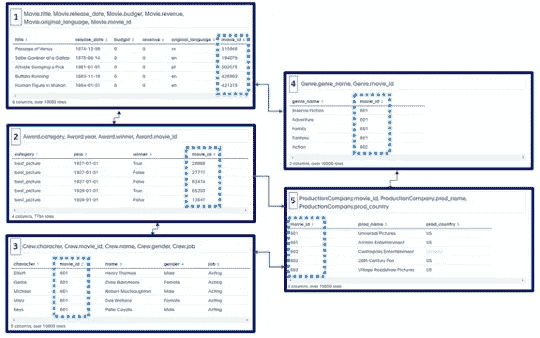
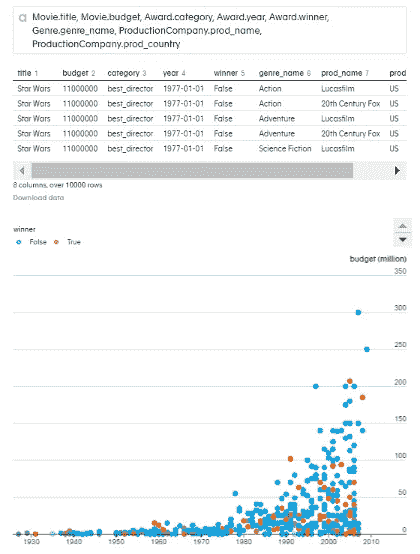
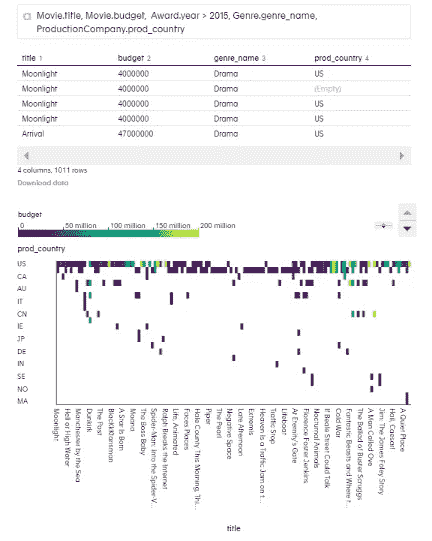
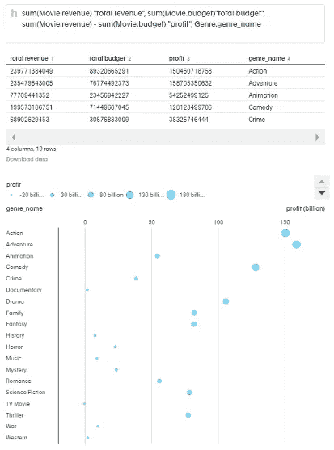

# 编码还是不编码

> 原文：<https://medium.datadriveninvestor.com/to-code-or-not-to-code-144e0ffd5d04?source=collection_archive---------16----------------------->

**count.co = c(SQL，Markdown，R，Python){使用 count.co 进行探索性数据分析、可视化和报告}的情况**

我们越来越多地生活在一个复杂的数据驱动的世界中。从物联网到基因组学和医疗保健，大数据无处不在。与石油、黄金和自然资源不同，数据不是有限的，可以重复使用、循环利用和可持续发展，使用和共享得越多，就越好。然而，值得注意的是，数据并不等同于信息和洞察力。幸运的是，仍然有一个人的元素来启动和搜索数据以找到见解。这些见解可以为战略、营销、运营和其他许多领域提供信息。许多企业在利用数据方面找到了竞争优势，并使用大型数据库/数据集来获得那些增加市场价值和竞争力的关键见解。所有这些内容都是为了强调，数据素养、统计知识以及对编程和计算机语言的理解不仅对数据科学家，而且对几乎所有人来说都是一项非常有用的技能。

然而，编码或编程并不是那么容易学会的，在精通之前需要在许多子领域投入时间和精力。有十几年经验的程序员和计算机程序员在表达他们能做什么和什么是可能的时候仍然保持谦逊。这部分是由于每天在开源和非开源平台上发布的额外的库和包的激增，使得很难跟上所有的进步。有些公司已经意识到这种痛苦，并为任何有兴趣与数据交互的人提供 GUI 界面。我最近偶然发现 count.co·T2 正在将 SQL 编码、Jupyter notebook、R/Python 可视化的零碎内容放在一起，以使用户更容易与数据交互并产生见解。在这种情况下，理解关系数据库和 SQL 代码、R 或 Python 是不必要的，因为 count.co 将这些步骤转换为用户友好的界面，在“幕后”运行代码脚本时，只需点击鼠标就可以了。

为了有效地存储数据，信息通常分布在多个表中，因此关系数据库被构造成具有大量变量(列)和属性(行)的表。分析关系数据库最好使用 SQL(结构化查询语言)代码，因为它能够定义数据子集、检索数据(例如，连接多个表)、汇总数据以及测试问题和假设。用于汇总和聚集数据的一些 SQL 语法包括` count()`、` sum()`、` max()`、` min()`、` avg()`、` round()`。这个图表改编自在线资源，很好地分类和总结了 SQL 命令。

像(，=)或(mean，max，min)这样的语法仍然会被使用，但是繁重的 SQL 提升工作会在后端完成，也就是说，仍然需要有人编写经典的 SQL 查询命令，但是这个人不一定是您。由于不同程序员/编码员对语法的期望，先验知识可能会阻碍实验。

 [## 数据科学和软件工程哪个更有前途？数据驱动的投资者

### 大约一个月前，当我坐在咖啡馆里为一个客户开发网站时，我发现了这个女人…

www.datadriveninvestor.com](https://www.datadriveninvestor.com/2019/01/23/which-is-more-promising-data-science-or-software-engineering/) 

此外，Count.co 实施了笔记和代码共享的良好实践，使探索性的可重复数据分析、可视化和报告成为可能。仍然存在一个学习曲线，因为分析师仍然需要投入时间来学习使用哪些字段以及如何使用它们，但希望有足够的动力和好奇心来使学习变得有趣。此外，我还发现[高级教程](https://count.co/n/CpoSXIUFXyy)不仅对入门非常有帮助，而且有助于快速入门。

这里有一个使用 count.co 平台的案例研究，特别是电影数据库来演示它的一些功能。乍一看，有五个数据表来自电影数据库，从这些网站的网页上搜集而来:[信箱网站](https://letterboxd.com/)、[电影网站](https://www.themoviedb.org/?language=en-US)和[维基百科](https://en.wikipedia.org/wiki/Academy_Awards)。

要查看每个表的内容(列和行),只需首先键入表名，后跟一个句点，然后是列名，这可以在数据库的扩展视图下找到。纵观所有文件表,“movie_id”列是允许表被合并的公分母。

*The five tables in the movies database and their partial content. The movie_id column is column among all tables, enabling merge.*

这也意味着可以从每个表中提取一些信息来回答不同的问题。

一个例子是通过简单的混合和搭配不同的电影栏目来看电影预算在电影制作的历史中是如何变化的。生成的图可以是不言自明的，用户可以选择使用各种选项。有趣的是，电影是在电影时代的黎明以低预算制作的，并稳步增长，直到我们进入 21 世纪，见证投资的跃升。圆点的颜色代表获奖电影，红色代表获奖者，蓝色代表非获奖者。

Output from Count.co

该平台的一个优势是能够将数据分块并只查看其中的一部分。为此，我们可以应用过滤器，如过去 4 年的奖励和预算。此外，可以使用绘图的颜色和标签元素添加更多变量，以在同一绘图中显示更多信息。这看起来很简单，事实上生产起来也很简单。然而，有许多设计元素(设计的语法)已经在后端使用，并且已经为普通用户考虑好了。

Output from Count.co

为了变得更复杂，另一个例子是问哪种电影类型产生最高的利润，我们可以得到每种类型的总收入，然后从预算中减去它。这意味着需要在代码段中进行简单的运算，如下所示。看一下情节，我们可以得出结论，动作、冒险和喜剧电影产生最大的利润，而电视电影和纪录片没有。

Output from Count.co

我们还可以看到，花在一部电影上的总预算并不一定能让它获奖，如下图所示。给我留下积极印象的是，视觉效果达到了标准，不仅仅是为了在内部与利益相关者交流，而是为了在其他地方发布。然而，在这里，数据科学家会热衷于将模型拟合到数据中，以查看获奖和投资电影之间是否有任何关联。需要强调的是，count.co 是一个探索性的数据分析平台，而不是一个统计学习或建模计算平台。

Output from Count.co

在许多方面，Count.co 正在帮助那些对探索感兴趣的数据库感兴趣并且不完全熟悉 R、Python 或 SQL 等编程工具的个人实现探索性数据分析的民主化。网站的互动性质和点击功能使其用户友好，允许分析师决定查询并实时探索，以获得见解并做出决策。在这个平台之外，学习编码和表达思想仍然是必要的，但这是一个很好的开始，比什么工具都没有好得多。这里有一个关于 count 在 stackoverflow 上的功能的很棒的博客封面，比较了如果你写一个 SQL 代码和 count.co 代码，查询会是什么样子。你自己试试吧@【count.co】T2，我喜欢阅读你关于它的评论和博客帖子。