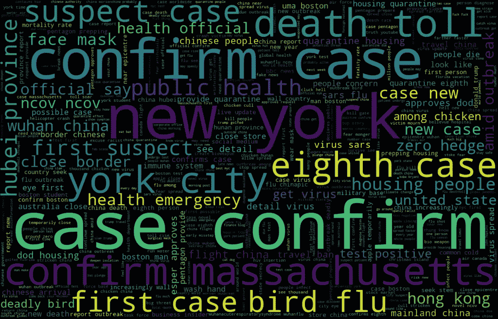

# 一分钟内知道人们在推特上谈论什么#冠状病毒

> 原文：<https://medium.datadriveninvestor.com/to-know-what-people-twitter-about-coronavirus-in-one-minute-7d3527239910?source=collection_archive---------4----------------------->

2020 年并不是一个好的开始。起源于中国武汉的冠状病毒持续爆发，已导致全球数千人感染，数百人死亡。数字每天都在上升。随着所有的检疫控制和疫苗的开发，希望这种全球性的流行病将很快得到控制。

当我们面临这样一个全球性的挑战时，我们会将自己的情绪和担忧带到社交媒体上，与他人分享冠状病毒的消息。自爆发以来，每天都有成千上万条关于冠状病毒的推文。我决定在 Twitter feeds 上运行分析，看看我是否能生成一些亮点。

To Know What People Twitter About #Coronavirus In One Minute (Stocktrek Images/Getty Images)

类似于[上一篇文章](https://towardsdatascience.com/topic-modeling-of-2019-hr-tech-conference-twitter-d16cf75895b6)，我使用 Python 3.6 和以下软件包:

*   [TwitterScraper](https://github.com/taspinar/twitterscraper) ，一个收集推文的 Python 脚本
*   [NLTK](http://www.nltk.org/) (自然语言工具包)，一个用于文本处理的 NLP 包，例如停用词、标点符号、标记化、词条化等。
*   Gensim ，“生成相似”，一个流行的主题建模 NLP 包
*   [潜在狄利克雷分配](https://en.wikipedia.org/wiki/Latent_Dirichlet_allocation) (LDA)，一种用于主题聚类/建模的生成式概率模型
*   [pyLDAvis](https://github.com/bmabey/pyLDAvis) ，一个交互式 LDA 可视化包，用于帮助解释在文本数据语料库上训练的主题模型中的主题

# 数据采集

提取 2020 年 2 月 1 日带有关键词“冠状病毒”的 Twitter feeds。尽管每天都有成千上万的“冠状病毒”推文被收费，但在收集了 14400 条推文后，我停止了收集，这应该是提供见解的良好样本量。

 [## 医疗保健的未来正在被一场大型技术入侵所塑造|数据驱动型投资者

### 过去十年，全球经济的所有部门都经历了大规模的数字颠覆，而卫生部门现在…

www.datadriveninvestor.com](https://www.datadriveninvestor.com/2018/11/02/the-future-of-healthcare-is-being-shaped-by-a-big-tech-invasion/) 

# 词云

在与上一篇文章中的[相同的预处理步骤之后，首先我使用单字生成了一个单词云。](https://towardsdatascience.com/topic-modeling-of-2019-hr-tech-conference-twitter-d16cf75895b6)

它显示了类似`*China, Wuhan, virus,*` *case* 等关键字，但没有提供太多的洞察力。然后，我尝试了双字母组合，即两个单词。

一些更有趣的词脱颖而出:`*New York, eighth case, confirm Massachusetts*`等。以下是实际字数:

云这个词想告诉我们什么？人们在推特上谈论的是什么故事？让我们看看主题聚类是否能告诉我们答案。

# 主题聚类

同样，按照上一篇文章中[的相同步骤，我应用 LDA 算法来学习提取的推文中的主题。](https://towardsdatascience.com/topic-modeling-of-2019-hr-tech-conference-twitter-d16cf75895b6)[生成一个交互式图形](https://ai-journey.com/wp-content/uploads/2020/02/coronavirus_lda.html)来显示不同的主题及其相关的关键词。

如果你浏览其中的一些主题，你会在一个主题下看到`*New York, suspect case, first suspect*` (没错，纽约当天报告了首例疑似冠状病毒病例)。另一个话题中的关键词，`*United States, Boston man, case Massachusetts, eighth case*`(没错——一名波士顿男子被证实是马萨诸塞州第八例冠状病毒病例)。

如果你像我一样，没有时间阅读社交媒体，这将是一种快速了解最新#冠状病毒更新的方法。我真诚地希望这种流行病将很快结束。

如果您有任何问题或反馈，请随时发表评论。

*原载于 2020 年 2 月 6 日 https://ai-journey.com***。**