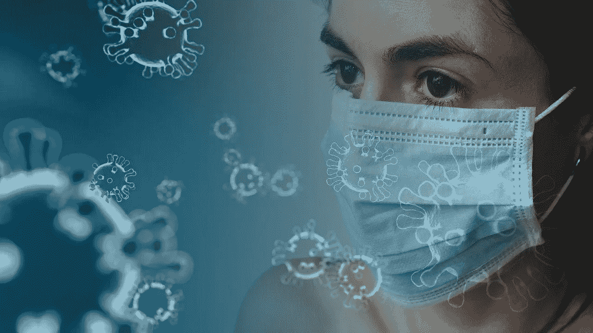

# 戴口罩还是不戴口罩，以避免感染新冠肺炎

> 原文：<https://medium.datadriveninvestor.com/to-mask-or-not-to-mask-to-avoid-getting-covid-19-a3aa439c1aaa?source=collection_archive---------4----------------------->

Masks to prevent coronavirus infection. [Credit; [Tumisu](https://pixabay.com/users/Tumisu-148124/?utm_source=link-attribution&utm_medium=referral&utm_campaign=image&utm_content=4914026) from [Pixabay](https://pixabay.com/?utm_source=link-attribution&utm_medium=referral&utm_campaign=image&utm_content=4914026)]

## 口罩可以减少，但不能消除呼吸道病毒的传播。

[更新日期:2020 年 4 月 4 日，美国疾病控制与预防中心的新建议]

当我访问中国时，我注意到许多人在公共场合戴口罩。事实上，在一些最有效减少新冠肺炎病毒传播的国家，口罩似乎相当普遍。在美国，很少有人戴口罩。随着新冠肺炎病毒在全球迅速传播，美国的病例呈指数增长，我想知道美国现在是否应该使用口罩。

截至 2020 年 4 月 2 日， [CDC](https://www.cdc.gov/coronavirus/2019-ncov/prevent-getting-sick/prevention.html) 仅建议有症状的人或照顾有症状的人使用口罩。可惜的是，外科口罩和 N95 口罩都很短缺。医护人员——医生、护士和其他工作人员——拥有能提供最佳保护的合适口罩至关重要。

截至 2020 年 4 月 3 日，疾病预防控制中心已经开始建议人们戴口罩。具体来说，[的建议](https://www.cdc.gov/coronavirus/2019-ncov/prevent-getting-sick/cloth-face-cover.html)是

> 疾病预防控制中心建议在其他社交距离措施难以维持的公共场合(如杂货店和药店)佩戴布面罩**，尤其是在重大的社区传播区域**。

新的指导方针是基于科学报告，表明人们可以在没有症状的情况下被感染，从而传播病毒。戴口罩可以减少感染者传播病毒的机会。

一些研究表明，使用口罩，甚至自制口罩，可以减少呼吸道病毒的社会传播。新型冠状病毒(导致新冠肺炎的病毒)是一种呼吸道病毒。研究表明，即使简单的自制口罩也能减少咳嗽释放到空气中的微生物数量。用家里找到的材料制作面具是可能的。事实上，一个简单的面具需要剪刀、t 恤、纸巾和别针来制作。不需要缝纫。另一个不用缝纫的选择是用发带和大手帕或手帕。在防止感染传播方面，这些口罩不如外科口罩或 N95 口罩有效。此外，一旦材料由于呼吸中的水分而变湿，过滤能力就会降低。

 [## 冠状病毒；惊慌失措；字里行间的 z |数据驱动的投资者

### 围绕冠状病毒的话题；更准确地说，新冠肺炎几乎占据了整个新闻预报的头条…

www.datadriveninvestor.com](https://www.datadriveninvestor.com/2020/03/23/coronavirus-a-to-panic-z-between-the-lines/) 

然而，外科手术或自制口罩不会完全传播或防止感染，社会距离和隔离是控制冠状病毒传播的关键。因此，继续保持社交距离、留在家中、检测和隔离感染者或疑似感染者至关重要。

自制口罩可能会让你“感觉”更安全，甚至可能会在某种程度上降低你的风险，但你的行为应该像你没有戴它一样。只在必要的时候出门，保持距离，限制说话，回家洗手。如果你戴了自制的口罩，记得小心地取下它(假设它被污染了)，用温肥皂水彻底清洗，并洗手。

事实上，我不戴面具，那会给人一种不可战胜的错觉，而是在户外公共场所避免说话。你不能停止呼吸，但你可以停止说话，将风险降到最低。如果你感染了病毒但没有症状，不说话是避免无意释放粒子的简单方法。不说话也减少了别人释放的微粒进入你身体的机会。你张开的嘴是一个比你的鼻孔更大的目标。飞沫传播或手接触受污染的表面是商店里人们的主要接触途径。保持距离，尽量限制说话，不要摸脸。

**赞成使用口罩**

T.Jefferson，C. B. Del Mar，L. Dooley，e .费乐理，l . a . Al-an sary，G. A. Bawazeer，M. L. van Driel，N. S. Nair，M. A. Jones，S. Thorning，J. M. Conly，阻断或减少呼吸道病毒传播的物理干预。 *Cochrane 系统评价数据库* *7、*CD 006207(2011 年 7 月 6 日)。10.1002/14651858。CD006207.pub4 。

A.戴维斯、k .汤普森、k .吉里、g .卡法托斯、j .沃克、a .贝内特。测试自制口罩的功效:它们能预防疫情流感吗？*灾难医学与公共卫生准备* **7** ，413–418(2013)。DOI:[10.1017/DMP . 2013.43](https://doi.org/10.1017/dmp.2013.43)

E.新冠肺炎的“隐形传输”要求广泛使用面罩。*医景*(2020 年 3 月 29 日)。[https://www.medscape.com/viewarticle/927723](https://www.medscape.com/viewarticle/927723)

**不赞成使用口罩**

长度 M. Brosseau，M. Sietsema,《新冠肺炎全民面具》,不是基于声音数据。传染病研究和政策中心。(2020 年 4 月 1 日)[http://www . cid rap . umn . edu/news-perspective/2020/04/commentation-masks-all-新冠肺炎-not-based-sound-data](http://www.cidrap.umn.edu/news-perspective/2020/04/commentary-masks-all-covid-19-not-based-sound-data)

**面具制作视频**