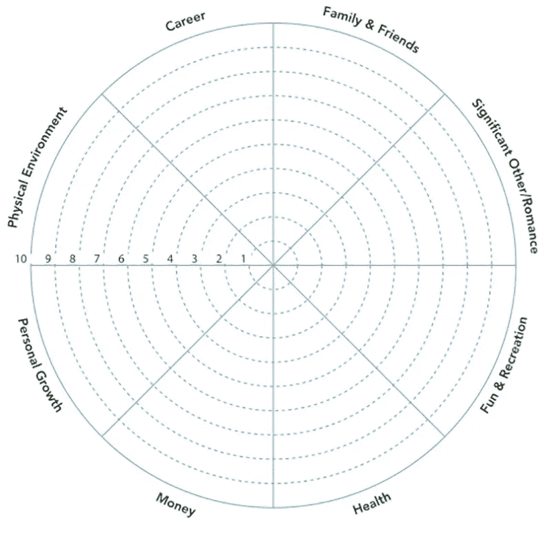
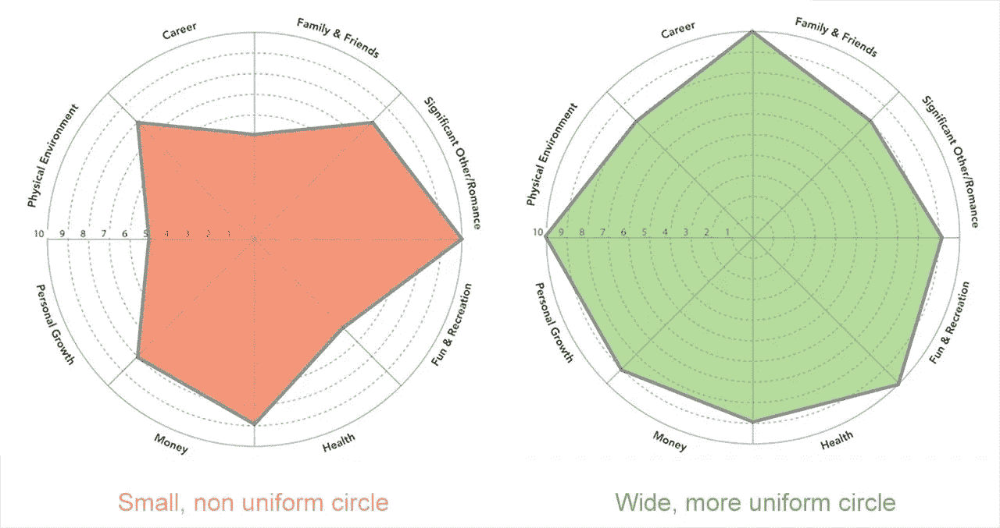

# 为了规划未来的一年，回顾过去的一年

> 原文：<https://medium.datadriveninvestor.com/to-plan-the-year-ahead-look-back-on-the-past-one-4d708f7f430b?source=collection_archive---------34----------------------->

## 面对如此多的不确定性，我们如何规划 2021 年？答案可能比你想象的要简单。

Photo by [Startup Stock Photos](https://www.pexels.com/@startup-stock-photos?utm_content=attributionCopyText&utm_medium=referral&utm_source=pexels) from [Pexels](https://www.pexels.com/photo/man-wearing-black-and-white-stripe-shirt-looking-at-white-printer-papers-on-the-wall-212286/?utm_content=attributionCopyText&utm_medium=referral&utm_source=pexels)

> “我从错误中吸取教训。这是一种非常痛苦的学习方式，但没有痛苦，老话是，没有收获。”—约翰尼·卡什

对每个人来说都是艰难的一年。虽然 2020 年终于要结束了，但疫情的第二波袭击现在比以往任何时候都更严重，许多国家正在实施新的限制措施，这些措施可能会持续到 2021 年的前两个月。这是否意味着明年将只有 10 个月长？这完全取决于你看的是半空还是半满的杯子。

不管这一年对你来说是好是坏，在某种程度上，像其他任何一年一样考虑它是非常重要的。约翰尼·卡什关于错误的说法是正确的，但强调过去一年的美好时刻也很重要。至少总有一些。一旦你对过去的一年有了一个很好的概述，包括你没有实现的，你成功的，你将拥有正确的知识以成功的方式为下一年做计划。

这篇文章的前半部分从可下载的小册子 [YearCompass](http://yearcompass.com/) 中得到广泛的启发，我强烈推荐你使用它。我还建议你用纸和笔来回答这篇文章中的问题。文章的后半部分主要是关于学习如何面对不确定性。因为如果说 2020 教会了我们什么，那就是生活在不确定性中。

# 生命之轮

年度概览的核心概念是把你的生活分成几类。对于这一点，生命之轮的方法是伟大的。

围绕这一点的经典练习是从 1 到 10 对每个类别进行评级，然后查看您需要改进的地方。目标是得到一个既宽又均匀的圆。圆圈越宽，分数越高，圆圈越均匀，分数差异越小。

我有我自己版本的生命之轮，我通过改变类别名称做了一点调整。首先列出这些类别中今年发生的事情。同样，对于整个作业，我建议你写在纸上，而不是在笔记本电脑上，但这取决于你:

*   健康和保健
*   个人发展、学习和创造力
*   家人和朋友，社交
*   情感，精神和爱
*   物理环境和财产
*   工作和事业
*   资产
*   疯狂遗愿清单*

**如果你有一份人生遗愿清单，这就是你在过去一年里从清单上取得的成就。*

# 12 个问题

检查你的笔记，确保你把它们记下来了。这些笔记只是回答关于你过去一年的一系列问题的热身。

1.  你今年做的最明智的决定是什么？
2.  你学到的最大教训是什么？
3.  你冒的最大风险是什么？
4.  最大的惊喜是什么？
5.  你为别人做过的最重要的事情是什么？
6.  你完成的最大的一件事是什么？
7.  你最自豪的是什么？
8.  你影响最大的三个人是谁？
9.  对你影响最大的三个人是谁？
10.  你没能完成什么？(不是为什么，我们不是在找借口)
11.  你发现的关于自己最好的事情是什么？
12.  你最感激的是什么？

 [## 在家工作如何提高我的工作效率|数据驱动型投资者

### 在家工作确实激发了我最大的潜能，让我更有效率。因为在家工作给了我…

www.datadriveninvestor.com](https://www.datadriveninvestor.com/2020/07/29/how-working-from-home-increased-my-productivity/) 

# 挑战和成就

在生活中，任何问题、辩论或难题的答案很少是非黑即白。它几乎总是在中间的某个地方，在灰色的妥协中。这就是为什么用两极分化、平衡的方式看待事物总是很重要。这真的很难，因为社交媒体和技术往往只给我们呈现我们同意和订阅的东西。在我们的社会中，确认偏见从来没有像今天这样普遍。这个练习旨在迫使你放弃过去一年的方法。不要用消极的眼光看，或者积极的眼光看。平衡地看待过去的一年。

## 3 个挑战

试着想想你今年面临的三大挑战。它们是什么？

美国商人乔治·希恩曾经说过:

> “没有白手起家的男人(或女人)。只有在别人的帮助下，你才能达到你的目标。”

*   谁帮助你克服或至少处理了你的挑战？
*   谁是你可以依靠的人？没有团结就没有力量。
*   在应对这些挑战的过程中，你从这些人身上学到了什么？

## 3 项成就

对你的成就做同样的分析。

*   想想你今年最大的三项成就
*   你做了什么来实现这些？
*   谁帮你实现了这些？

## 三个词

用三个词描述你过去的一年。要有创意，但要准确。

# 你不受控制

今年是一个艰难的提醒，无论你计划得多好，你有多投入，有多积极，你周围的团队有多好，总有一些因素和情况超出了你的控制。总会有超出你能力范围的变数等待你去调整。承认这一点非常重要。

没有人(至少 99%的人)预见到世界疫情的到来，所以没有人相应地为它做计划，现在我们都陷入了这个组织混乱中。这不仅仅是组织上的。这是 100 多年来世界上已知的最大的疫情。所以善待自己。

冥想练习的两个核心概念如下:

*   **你不是你的思想。你的思想不是你。**
*   **你应该放下你无法控制的东西。**

你不能控制人，政治，天气，人们的想法，或者有时你的想法…这完全没问题。你的工作是专注于你能控制的，接受外部因素，找到应对突发事件的最佳方式。这个过程从接受开始。这不是永远试图让事情按照你的方式进行，而很明显现在它们不会按照任何人的方式进行。这是关于充分利用你盘子里的任何生活。老话说，当生活给了你柠檬，你得想办法把它做成柠檬水。

同样，这整个过程是关于平衡的。你想放下，但又不想把所有的自制力和动力都交给禅定的神和神，以期达到完美的开悟。你可能只是想让自己放松一下，找到平衡。专注于你能控制的，其他的都放下。

# 这是关于超越平衡:这是关于平衡

最后一点。在过去的一年里，你可能会学到一些别的东西。答案不仅仅在于平衡，还在于平衡的行为。如果你读过加里·凯勒的《一件事》，你就会知道这一点。但是如果你没有，这里有一个快速的概念回顾:

> “通过把时间花在重要的事情上来充实生活是一种平衡的行为。非凡的结果需要集中注意力和时间。一件事上的时间意味着另一件事上的时间。这使得平衡变得不可能。”—加里·凯勒

人们认为他们想要生活更加平衡，但他们真正想要的是更加平衡。平衡是一种行为，而不是突然发生的事情。这不是事实，不是状态。这是一个永无止境的行为。

当你看一个走钢丝的人时，她看起来毫无瑕疵地走在绳索上，毫不费力。但事实是，她的整个身体(以及她的大脑)都在不断地做着微小的调整，以保持在绳子上的平衡。

平衡这个概念的问题在于，它被视为一个抽象的概念，而它应该被视为一个具体的行为。由目的、意义、动力推动的行为。当我们专注于正确的事情时，平衡就会进入我们的生活。

# 明年

我们完成了年度回顾。*“但是下一年呢？2021 年呢？”*你可能会问。也会很糟糕吗？也许更糟？还能更糟吗？嗯，我们不应该担心这些，因为我们无法控制这些，记得吗？

话虽如此，你会竭尽全力让今年变得精彩吗？你能定义下一年你最大的三个挑战吗？你会对无关紧要的事情说不吗？你敢走出你的舒适区吗？这些才是重要的问题，因为每一个答案都在你的掌控之中。你有能力改变这个结果，这将决定未来的一年。

那么如何规划 2021 年呢？通过经历你刚刚经历过的同样的问题，只考虑未来，以过去作为灵感。

2020 年是一个多世纪以来最荒谬的一年。未来的一年将会更好，只要我们都掌握控制权，承担责任，并致力于改变。

**非常感谢你的阅读！我采访了 50 位生产力专家，为这个项目做了一份 150 多页的指南。这是经过实践检验的建议，来自真正做事的人。** [**在这里免费获得**](https://josephmavericks.com/50people) **。**

**访问专家视图—** [**订阅 DDI 英特尔**](https://datadriveninvestor.com/ddi-intel)