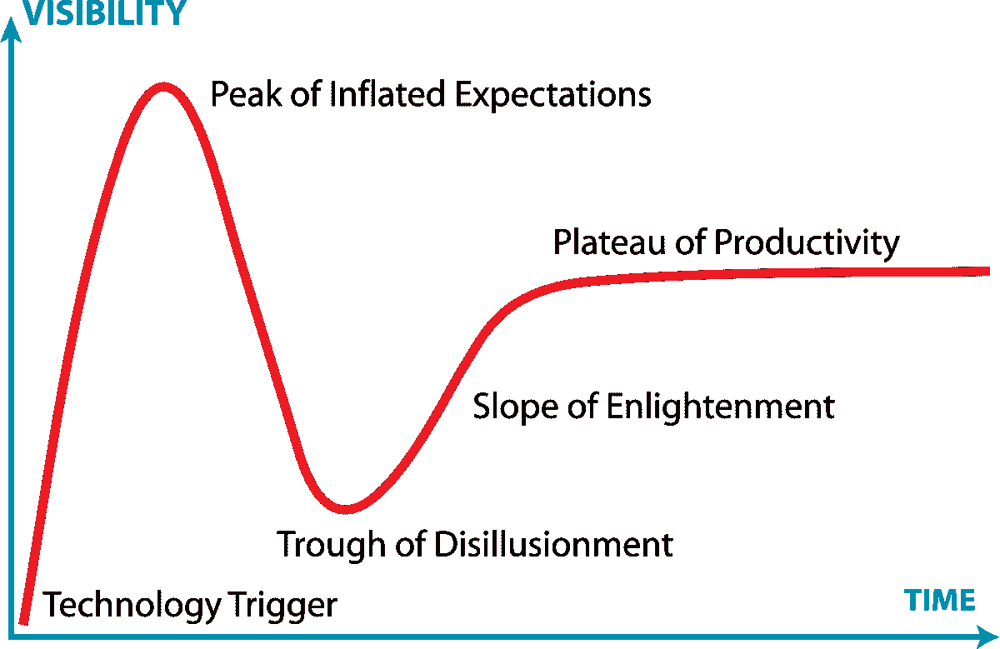

# 去公关还是不去公关？创业的 5 个关键问题

> 原文：<https://medium.datadriveninvestor.com/to-pr-or-not-to-pr-5-key-questions-for-startups-566e96413ade?source=collection_archive---------35----------------------->

*Wired* 在 2015 年发表了一篇发人深省的观点文章，将围绕创业公司的[新闻周期比作 12 小时的时钟](https://www.wired.com/2015/07/how-the-tech-press-forces-a-narrative-on-companies-it-covers/)。事实上，总的来说，科技行业，尤其是硅谷，多年来受到了大量批评，因为它们宣扬炒作而非现实，导致了欺诈(Theranos)、内爆(WeWork)和 IPO 失败(不胜枚举)。风险投资也因“从众心理”和“FOMO”而受到(公平的)指责事实上，下面提到的所谓炒作周期是单个公司所发生的事情的集合。

尽管如此，媒体曝光就像核能或资本主义，做得好的话，是非常积极的。为公关而公关是一种灾难，但为目标而公关绝对是一个企业家的资产。以下是需要牢记的五个关键原则。

1.  **消费者角度** —送餐？房屋租赁？坐上出租车？DoorDash、AirBnB 和优步是消费公司的原型，在这里，被正面关注是存在的。有些人甚至认为所有的消息都是好消息，但大多数营销人员会同意，在这个时代，你的净推广分数就是你的品牌。因此，如果你是一家消费品公司，几乎无视其他四项原则，而拥抱公关，这是你商业模式的一部分。

 [## 旋转你的创业？4 种正确的方法|数据驱动的投资者

### 1)储备现金——在早期阶段，尤其是种子期，你有可能会一直转到找到…

www.datadriveninvestor.com](https://www.datadriveninvestor.com/2020/12/13/pivoting-your-startup-4-ways-to-do-it-right/) 

**2)风险投资角度**——你是否正在融资或考虑在未来三个月内融资？然后，有一个强有力的论据表明，应该在投资者关注的地方进行投资。对于一般的关注，去 TechCrunch，但是如果你想要一个更好的信噪比，专注于你所在行业的出版物。如果你正在寻找一个可以效仿的模式，YC 公司是这一战略的王者，他们的导师肯定功不可没。YC 公司几乎把宣传自己归结为一门艺术，以期待演示日的到来，并在本质上低调处理他们的第一轮机构融资。

**3)搭档角度** —这个做 PR 的正当理由，大概是标准差最高的一个。当市场分散时，宣传你正在与合作伙伴合作以获得他人的关注通常是有效的。如果是寡头垄断，你的公关可能会向其他人发出信号，表明你已经选择了一方，不让自己与任何人合作。如果您是集成商，这一点尤其重要，即您的合作伙伴越多，您的价值就越高。在大多数情况下，如果这是你公关的主要动机，那么最好让你的伴侣宣传你，而不是自己花费时间和金钱。如果无法获得公开支持，至少要确保获得私人支持，这在风险投资深度调查期间尤其有用。

**4)买家角度**——除非你处于非常绝望的境地或者处于独特的强势地位，否则你可能永远都不想公开你想要被收购。最好是利用公关来制造故事，以引起潜在买家的兴趣。把它当成你获得会议的名片，而不是会议的议程。

**5)竞争对手角度**——是的，如果你实现了一个外部里程碑，比如筹集了大量资金，甚至更好，超过了一定数量的客户或收入，公关绝对可以成为一种恐吓武器。不过要小心使用武器，因为这种公关会被炒作弄得模糊不清，给你画上一个红色的靶心。你的公司文化也可能受到负面影响，因为它可能会导致对真正的竞争线索的忽视，甚至是傲慢。但如果你想做好这件事，只需看看脸书就知道了，它在 IPO 之前走过了十年，基本上摧毁了所有挡路的人。

*感谢* [*道格帕克*](https://www.linkedin.com/in/doug-parker-949ab81/) *对他的反馈。原载于“* [*”数据驱动投资人*](https://www.datadriveninvestor.com/2020/12/21/to-pr-or-not-to-pr-5-key-questions-for-startups/) *，“我很乐意在其他平台上辛迪加。我是*[*Tau Ventures*](https://www.linkedin.com/pulse/announcing-tau-ventures-amit-garg/)*的管理合伙人和联合创始人，在硅谷工作了 20 年，涉足企业、创业公司和风险投资基金。这些都是专注于实践见解的有目的的短文(我称之为 GL；dr —良好的长度；确实读过)。我的许多文章都在*[*https://www . LinkedIn . com/in/am garg/detail/recent-activity/posts*](https://www.linkedin.com/in/amgarg/detail/recent-activity/posts/)*上，如果它们能让人们对某个话题产生足够的兴趣，从而进行更深入的探讨，我会感到非常兴奋。如果这篇文章有对你有用的见解，请在 Tau Ventures 的 LinkedIn 页面* *上对这篇文章和* [*给予评论和/或赞，感谢你对我们工作的支持。这里表达的所有观点都是我自己的。*](https://www.linkedin.com/company/tauventures)

## 访问专家视图— [订阅 DDI 英特尔](https://datadriveninvestor.com/ddi-intel)