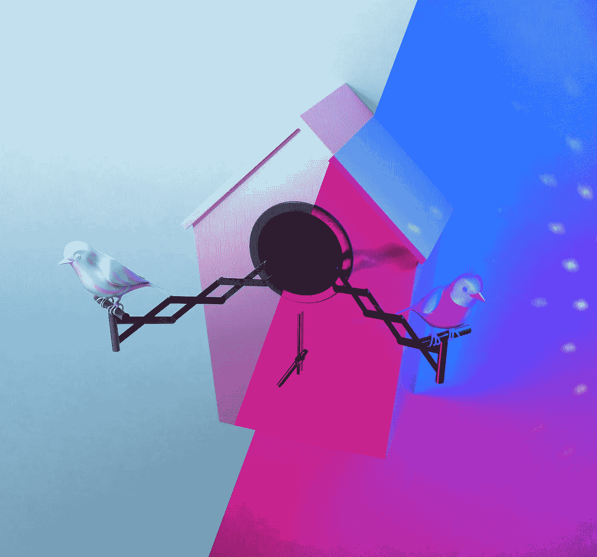
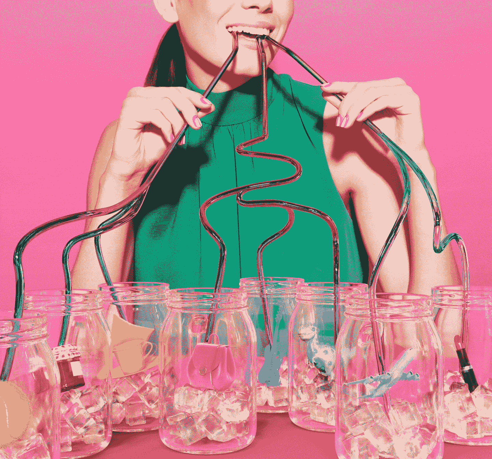

# 推还是拉

> 原文：<https://medium.datadriveninvestor.com/to-push-or-to-pull-a66000cc40ff?source=collection_archive---------20----------------------->

## 哪种营销方式胜出？

这两种营销方式各有利弊，领导者需要问自己:

> 我们应该推，还是应该拉？

**出站:**

啊，竞选。

一种经典的营销、推送或“外向”营销方法包括通过通常的大众媒体渠道将您的信息发送给尽可能多的人:

*   电视和广播(在线上)
*   离线海报和广告牌(不在家)
*   在线付费广告
*   通用电子邮件和简讯添加到您的列表中

这种类型的营销是典型的 B2C(企业对消费者)活动，倾向于大量利用产品特性和优势来解决问题。

这种类型的广告往往是昂贵的，并且依赖于尽可能多的吸引眼球，从统计上来说，知道一些人可能会通过你的营销漏斗进行购买。

也就是说，由于数据的改善；例如，脸书的基于人口统计或长相相似的受众广告定位，有可能开始个性化这种体验，并提高你的转化率。

 [## 影响者在聚光灯下表演|数据驱动的投资者

### 影响者营销是一个脱颖而出的游戏。结果是一个令人难忘的-和可信的-连接到一个产品或…

www.datadriveninvestor.com](https://www.datadriveninvestor.com/2020/01/15/influencers-perform-in-the-spotlight/) 

例如，LinkedIn 允许你锁定具有特定职位的人，这更适合 B2B(企业对企业)组织，B2B 组织通常会从拉动式或集客式营销中受益。

我们通常会看到广告支出受到非常短期的影响。脸书，谷歌和其他第三方生态系统能够提供高质量的流量，有一个好的报价将使他们不断转换。然而，一旦你放弃投资，流入也就停止了。

这意味着付费在线广告基本上是一个数学公式。我们是否能够以可持续的成本“扩大”我们的客户群。如果在内部完成(以避免广告支出之外的费用)，并且每周对平台评估非常诚实，这是可以做到的。知道你为一个买家支付 50 欧元意味着你需要用第一次购买的产品利润来部分抵消，但主要是通过稳固的客户终身价值演变。一旦我们开始查看这些原始业务指标，我们的渠道组合就发生了很大变化。

**入境:**

事实证明，拉动式营销主要是 B2B 组织的首选方法(当然，最聪明的公司都使用这两种方法)，这些组织可能希望减少广告支出，转而依赖于搜索或内容营销策略。常见的渠道有:

*   内容营销(如博客和播客)
*   社交媒体上的有机帖子
*   搜索引擎优化
*   个性化电子邮件

对于服务型组织来说，内容营销是一个合理的策略，因为它允许他们将自己定位为思想领袖，并通过白皮书下载、研讨会材料、网上研讨会注册等方式吸引他们的兴趣。就我个人而言，我倾向于认为这是一种有效的方法，即使对于纯粹的零售商来说，只要他们能够解释他们的附加值。

由于与受众的联系更小、更密切，因此可以提供更个性化的方法，并有望获得更高的转化率。

> 这种类型的营销会看到你的电话响，而不是习惯于冷打电话。

所有这些风格都可以被称为业务发展或线索生成，最终目的是为您的企业争取新客户:不同的是方法。

就我个人而言，我喜欢建立“销售线索磁铁”来吸引人们的兴趣，因为它可以通过电子邮件或消息传递实现更简单的自动化，并有一个以销售为导向的后续流程。

在我们目前的设置中，我们看到大约 50%的购买直接通过电子邮件进行，这意味着客户点击一个链接，并在同一会话中进行购买。我们承认邮件压力很大，这导致了与年轻一代的脱节，我们在个性化服务和目标设置方面投入了大量资金，以优化客户体验，并确保我们的邮件不会从入站方式转变为出站方式。

这意味着我们在 A/B 测试我们的目标算法和验证产品选择个性化方面投入大量资金，同时探索聊天机器人和社交媒体上的购物整合等新渠道，以开辟与年轻人口产生共鸣的渠道。

我们永远不应该完全取代人际互动，相反，我们应该在营销渠道中找出各种接触点，这些接触点代表着连接线上和线下的绝佳机会。我们需要专注于创造个性化的客户体验，在他们喜欢的渠道上进行。

**判决结果:**

Photo by [Ben Sweet](https://unsplash.com/@benjaminsweet?utm_source=medium&utm_medium=referral) on [Unsplash](https://unsplash.com/?utm_source=medium&utm_medium=referral)

一种“人对人”的营销方式效果最佳，这意味着真正理解你的受众角色，并展示出对他们的了解。在 push 中，我们优化我们的目标，并根据客户及其相关集群角色的行为和历史信息对信息进行个性化处理。我们希望确保每条信息都尽可能相关，并向客户证明我们关心他们。

一个经常被遗忘的人际营销方法是“邀请你的朋友”项目。他们让你的粉丝和大使有机会从你们的关系中获得一点好处，同时向他们的朋友展示你的价值。在南欧，我们看到超过 20%的新买家来自这种模式，而所有市场的转化率都超过 25%。如果你确信你的价值和你的产品，让你的粉丝从分享中受益。

在任何营销传播中——无论是推还是拉——这是你超越推动流量的机会，并展示你创造的真正价值。