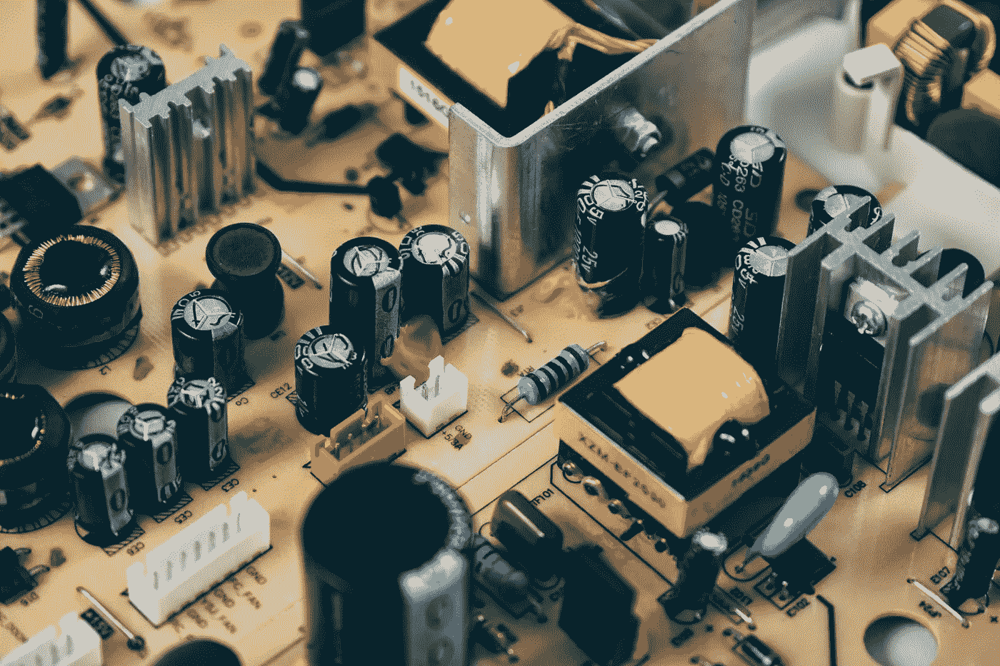
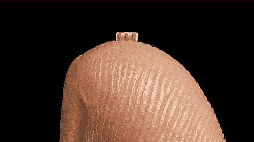
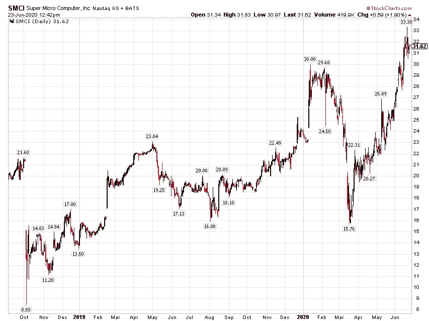

# 致彭博理工大学的记者们:超微仍在等待你们的道歉

> 原文：<https://medium.datadriveninvestor.com/to-the-bloomberg-tech-journalists-super-micro-is-still-waiting-for-your-apology-cb1a7ffdccd6?source=collection_archive---------7----------------------->

## 杀害无辜、无视科学的鲁莽新闻报道

Source: [Pixabay](http://pixabay.com) on [Pexels](https://www.pexels.com/photo/black-transistor-beside-capacitor-163100/).

普通大众对媒体极不信任。在过去几年中，不管特朗普本人可能有多么错误，这都是一个真实的主题。

在一些领域，比如科技，有充分的证据表明这种不信任的起源。有证据表明，媒体的推广完全是为了增加广告流量。

两年前，埃隆·马斯克在推特上谈到了这个问题。

在埃隆的案例中，主题包含了关于特斯拉和特斯拉发展的新闻。

科技新闻没有真正的结果。对于出来的负面报道，如果技术足够新或者不是很了解，新闻可以采取速度很快的宣传形式。

这些消息大多被投资者消化，然后他们利用这些信息押注于公司。2020 年初，[特斯拉是史上最被做空的公司。](https://markets.businessinsider.com/news/stocks/tesla-stock-most-shorted-us-beats-apple-highest-short-interest-2020-1-1028823046#:~:text=Tesla's%20stock%20became%20the%20most,billion%2C%20according%20to%20S3's%20data.)空头利息约为 145 亿美元，令苹果黯然失色，苹果的估值约为特斯拉的 5-10 倍。

2019 年对特斯拉来说是奇怪的一年。除了一些生产细节和电池技术方面的一些创新，人们对该公司的内部网络知之甚少。然而，特斯拉的股价低至 100 多美元，高至 1000 美元。

特斯拉不是唯一一家发现关于它的新闻剪报[“越来越不重要”](https://www.cnbc.com/2018/05/23/buy-tesla-because-media-negativity-is-increasingly-immaterial-baird.html)的公司。

2018 年 10 月 4 日，彭博发布了一篇名为[《大黑客:中国如何利用微小芯片渗透美国顶级公司》](https://www.bloomberg.com/news/features/2018-10-04/the-big-hack-how-china-used-a-tiny-chip-to-infiltrate-america-s-top-companies)的文章。

这篇文章攻击了一家名为[超微](https://www.supermicro.com/en/)的公司。该公司专营存储和服务器。这篇文章指责超微的供应链遭到中国篡改，声称对篡改有广泛了解的匿名消息来源可以证明数据是从亚马逊和苹果等大型公司窃取的。

亚马逊和苹果都立即发表声明，声称这是不真实的。

但对超微的损害是实质性的、真实的、持久的。即使故事本身无关紧要。

Cover of the [Bloomberg](https://www.bloomberg.com/news/features/2018-10-04/the-big-hack-how-china-used-a-tiny-chip-to-infiltrate-america-s-top-companies) article.

上图是否耸人听闻并不重要。记者们能否描述窃取他们声称的所有信息的技术并不重要。

上面的图片可以很容易地替换成这个:

这并不重要。对公司的损害是直接的。

SuperMicro stock price right before Bloomberg hit piece. Chart courtesy of [stockcharts.com.](http://stockcharts.com)

超微的股价在第二个交易日从 21 美元跌至 8.5 美元。公司 60%的估值，没了。

超微从纳斯达克股票交易所退市，并进入了大多数其他无名公司都去的场外交易市场。

后来发生了一件奇怪的事。更多的高级官员开始公开反对彭博的文章。

> “企业参与者随后是[,接着是](https://www.zdnet.com/article/dhs-and-gchq-join-amazon-and-apple-in-denying-bloomberg-chip-hack-story/)美国国土安全部(DHS)和英国国家网络安全中心(NCSC)从政府通信总部(GCHQ)否认调查结果。”

Joe FitzPatrick 是彭博文章中提到的 20 个匿名消息来源之一。他被问及超微供应链中开发的后门的潜力，这种后门有能力轻松窃取信息。

在读完彭博的文章后接受采访时，他说:

> “我只是乔。我独自做这些事情，我建造硬件植入物是为了好玩，在会议上炫耀，我不是建造硬件植入物的专业人士。

并且:

> “真正让我震惊的是，就像所有的细节一样，即使是很遥远的技术细节，它们似乎都是从我关于硬件植入物如何从理论上工作以及两年前我在黑帽公司展示的设备如何工作的对话中提取的。”

FitzPatrick 是这篇文章的主要资料来源之一，他说他对他们的许多陈述都是“理论上的”。此外，他声称“[他]无法在[他的]头脑中合理化这是任何人都可以采取的方法。”他说的是文章中详述的黑客攻击方法。

甚至联邦调查局局长克里斯多佛·a·雷[也警告参议院委员会](https://www.cnbc.com/2018/10/10/fbi-director-wray-on-super-micro-servers-be-careful-what-you-read.html)他们应该“小心阅读……尤其是在这种背景下。”

技术已经改变了记者资格的竞争环境。这一点非常明显，因为理解半导体内部运作所需的知识需要更合格的人才。

在过去的十年里，新闻和宣传之间的界限已经动摇。大多数投资者可能并不完全理解某项技术的工作原理，即使他们理解这项技术的可扩展性和它在市场中的适用性。

在超微的案例中，它们最终获得了在纳斯达克重新上市的资格。他们花了一年半的时间。

SuperMicro stock price since the hit piece. Chart courtesy of [stockcharts.com](http://stockcharts.com).

那时超微是一家伟大的公司。如今，它继续制造出令人惊叹的产品，并以积极的方式回馈社会。就像特斯拉一样，它正在改变世界。与特斯拉不同，他们在我们没有注意到的背景中做了很多改变。但特斯拉和超微以及其他一些科技公司对这些故事一直心存恐惧。

因为在他们的内心深处，这已经不再是新闻了。陈述一家公司为什么可能很糟糕是一种观点，但如果你编造事实来帮助证明这种说法，这就相当于用枪指着某人的脑袋。

对于那些报道他们没有资格报道的科技话题的记者，应该有一个最低限度的责任。否则，我们正在摧毁创造未来的公司。

超微、几家最大的技术公司、彭博自己的消息来源以及政府都否认这一离奇概述的黑客攻击是真实的。那不是阴谋，那是事实。

彭博差点杀了超微，但超微恢复了。其股票现在的交易价格几乎是 2018 年 10 月水平的 400%。

所有公司都面临着潜在的危险。

至少，没有工程师之间的同行验证，不应该发布尖刻的图片和可爱的标题。应该有一群中立的工程师或软件开发人员在故事给公司造成不可挽回的损失之前对其进行审查。这是任何人都会从专业出版物中期待的一种尽职调查。

在科学中，同行评议是科学方法的一个原则。我们与科技互动的一切，以及让我们的生活变得更快、更轻松、更易接近的一切，都归功于这种同行评议过程。

当一个出版物可以选择发表一个故事来换取廉价的广告费时，它就破坏了那些基本的科学原则。

这是对科学方法的侮辱。为了真相。