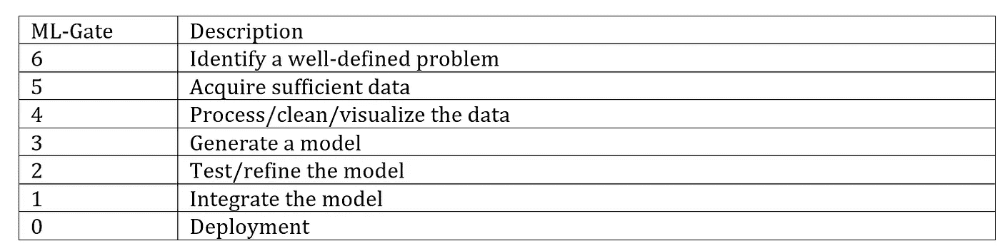

# 要想换一种方式思考，你需要一种新的数据驱动的方法！

> 原文：<https://medium.datadriveninvestor.com/to-think-differently-you-need-a-new-data-driven-methodology-d3f1af9da04d?source=collection_archive---------3----------------------->

To think differently, you need a new data-driven methodology !

深度学习是一种仙境。这是我们今天在这个领域大肆宣传的原因。然而，它有一个很好的理由来达到炒作的目的。你会经常听到有人说 DL 是规模化经营的。这到底是什么意思？

是性能论证，性能显然很重要。

对于较小的数据集大小，CML(经典机器学习)略优于 DL。问题是，多小才算小？当我们设计 ML(机器学习)应用程序时，我们需要考虑数据集大小位于拐点的哪一边。没有简单的答案。如果有，我们会将实际数字放在 x 轴刻度上。这取决于您的具体情况，您需要在设计解决方案时决定使用哪种方法。

 [## 金融中的机器学习|数据驱动的投资者

### 在我们讲述一些机器学习金融应用之前，我们先来了解一下什么是机器学习。机器…

www.datadriveninvestor.com](https://www.datadriveninvestor.com/2019/02/08/machine-learning-in-finance/) 

深度学习已经在许多特定领域展示了优于 CML 的结果，包括语音、自然语言处理、计算机视觉、玩游戏、自动驾驶汽车、模式识别、声音合成、艺术创作、照片分类、不规则(欺诈)检测、推荐引擎、行为分析、翻译等等。

随着你获得 ML 的经验，你开始对一个项目何时适合 DL 有了一种感觉。

也许制作 ML 应用程序的最大挑战是训练自己从不同的角度思考项目的设计和架构。你需要一种新的数据驱动的方法。

下图介绍了 ML-Gates 方法:

ML-GATES

该方法使用这六个关口来帮助组织 CML 和 DL 开发项目。每个项目从 ML-Gate 6 开始，到 ML-Gate 0 结束。ML 门以递减的顺序进行。

将它们视为导致 ML 项目的最终启动或部署。

作为开发人员，我们编写大量代码。当我们接受新项目时，我们通常只是开始编码，直到我们得到可交付的产品。使用这种方法，我们通常会得到大量编码的应用程序。

对于 ML，我们想彻底改变这种方法。相反，我们试图用最少的代码实现数据密集型应用。最小编码的应用程序更容易支持。

作为结论，MLG-1 是你认识到编码时间节省的地方。通常只需要几行代码就可以打开一个预构建模型并进行新的预测。方法的这一阶段还包括解决方案的系统测试。

本文源于[blog.selcote.com](http://blog.selcote.com/2020/01/04/think-differently-needs-a-new-data-driven-methodology/)