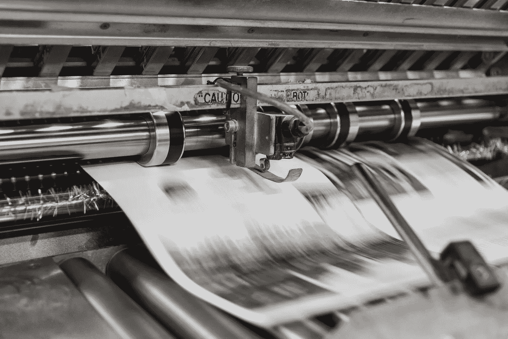

# 要理解今天的市场，跟着钱走

> 原文：<https://medium.datadriveninvestor.com/to-understand-todays-markets-follow-the-money-c009797d2d39?source=collection_archive---------7----------------------->

解释当今市场的关键是要知道钱从哪里来。理解经济中的货币是如何产生的，将有助于我们解读央行的政策，并使一些非理性的市场行为合理化。

Photo by [Bank Phrom](https://unsplash.com/@bank_phrom?utm_source=unsplash&utm_medium=referral&utm_content=creditCopyText) on [Unsplash](https://unsplash.com/s/photos/printing?utm_source=unsplash&utm_medium=referral&utm_content=creditCopyText)

## 货币——经济的血液

我们可以把钱想象成钱包里的现金、银行账户上的余额或信用卡的额度。所有个人持有的货币总量构成了经济中的货币供应总量。对于经济来说，金钱就像是活的有机体中的血液。它将所有重要的补充物输送到身体的各个部位，同时也输送重要的信息。类似于血压，如果货币流量过低，经济就会不景气，有陷入衰退的风险。另一方面，高压力或过多的资金会导致意想不到的后果，如通货膨胀或资产价格泡沫。

## 谁创造并控制经济中的货币数量？

通常，当我们想到钱的时候，我们会想到钱包里的硬币和纸币。然而，在今天的世界里，现金只是我们可支配资金的一小部分。流通中的货币(专业术语)只占经济中货币总量的 2-3%。其余的是数字货币——银行账户中的电子记录(想想你的银行账户或信用卡余额)。

> 我们知道每个国家的中央银行都印钞票。所以我们知道那 3%来自哪里。但是谁创造和控制了剩下的 97%呢？

如今的金融系统非常复杂，但是为了简化事情，我们可以说**大部分的钱是在银行系统**创造的。银行如何运作的常识依赖于银行作为金融中介。根据这个定义，人们把他们的储蓄作为存款存在银行，银行把这些存款变成贷款给其他需要钱的家庭或企业。因此，银行在现金过剩者和现金不足者之间充当中间人。

## 银行不是你想象的那样

事实证明，大多数学校和大学教授的这一理论并不完全正确。对这一理论的主要挑战是，银行不仅仅是这一过程中的中介。**银行可以“凭空”创造货币。你可能会想，无中生有是不可能的。**

 [## 现金为王，比我们想象的更强大|数据驱动的投资者

### 2020 年 3 月 12 日，在川普总统宣布新冠肺炎进入国家紧急状态的前夕，纽约时报报道…

www.datadriveninvestor.com](https://www.datadriveninvestor.com/2020/03/26/cash-is-king-more-potent-than-we-think/) 

为了说明这一点，让我们想象一个例子。如果我给一个朋友一张价值 100 美元的借据，他接受了，我们就创造了信用。我的朋友有一笔价值 100 美元的资产，我有一笔相同数额的负债。没有现金交易。后来，如果我的朋友相信我的信誉，她可以把这张票据卖给他的妹妹。她对我有要求权，我们就创造了货币。如果我偿还债务的声誉足够高，我朋友的姐姐可以进一步出售那张欠条，甚至以它为抵押向别人借款。最初的借据可以多次转手，并被用作创造更多信贷的抵押品。我们创造了货币。

## 法定货币

如果你意识到我们使用的任何钞票几乎没有内在价值，这可能会更容易理解。它只不过是发行它的中央银行创造的借据(也称为法定货币)。它的价值和上面写的一样多，因为我们信任发行它的当局。与我们交易的代理商也必须信任该发行商，否则，他们不会接受付款。当人们对当局失去信心时(无论是因为通货膨胀还是其他原因)，货币的价值会迅速蒸发。

## 贷款意愿是最重要的。

这就是当今银行的运作方式。他们可以通过无中生有地互相借贷来创造货币。只要银行的信心和可信度没有动摇，它们就可以自由地创造信贷。当然，对于通过这种方式可以创造多少资金，存在一些监管限制。然而，银行几乎从未受到这些约束的限制。推动信贷和货币创造的最重要因素是贷款意愿，或者换句话说，风险偏好。必须有家庭、公司或其他机构想要借款，必须有银行愿意提供信贷。

## 资本主义经济是一种金融体系。

事实是，整个现代经济体系都基于这种金融架构。这就是金融部门相对于实体经济增长如此之大的原因。当信用创造因某种原因停止时，整个经济都会受损(就像 2008—2009 年的大金融危机一样)。令人惊讶的是，这种联系在另一方面却没有那么强。金融部门对实体经济实力的依赖没有那么明显。分离过程已经持续了几十年。然而，这一点在新冠肺炎世界从未像今天这样明显。

## 为什么金融部门脱离了实体经济

为什么我们观察到这种分离？如前所述，银行可以随心所欲地创造货币。但是在经济震荡的时候，信心非常低，银行也不愿意互相贷款。这就是中央银行介入的时候。每个独立的央行都可以随心所欲地创造尽可能多的流动性储备(央行用来与其他银行结算的资金)。其运作方式是通过量化宽松(QE)。中央银行在二级市场从银行购买政府(或公司)债券。然后，银行将交易金额存入中央银行的账户。同样，该交易不涉及现金。这是会计操作。央行的资产负债表在资产端因其购买的债券价值而增加，在负债端因银行投放的准备金而增加。准备金只不过是显示央行“拥有”多少银行的电子记录。因此，金融业资产负债表的增长规模几乎没有限制。

> 然而，央行创造储备并不意味着央行在“印钱”。

## 信贷增长与 GDP 增长

当然，希望有一天银行会使用流动储备，并将其转化为贷款。这将反过来刺激经济。然而，我们在过去几年中观察到一个有趣的现象。经济中的信贷增长强劲，但对 GDP 增长的影响有限。原因在于这一信用额度的用途。**大体上有三种方法可以输送额外的积分:**

1.  它可以用于扩大**生产项目**(例如建造新工厂、更换旧设备、投资新技术)的贷款，然后它会增加 GDP 和社会财富。
2.  新增贷款也可以用于**消费**。如果家庭决定从银行贷款来购买商品或服务，也会刺激 GDP 的增长。然而，它不一定会增加经济生产的商品和服务的数量。在这种情况下，新增信贷极有可能导致更高的通胀。随着人们需求的增长，却没有与之相匹配的更大的商品供应。价格需要上涨。结果，GDP 增长了，但通胀也在增长。社会财富不变。
3.  新的信贷也可以用于购买资产(如股票、债券、房地产)，从而导致资产价格上涨。我们在过去几年里看到的。世界各地的经济增长都相当缓慢，但一些金融资产的价格却飙升。有趣的是，观察到的通胀并没有相应上升。标准的通胀指标根本无法反映金融资产价格。

## 资产价格膨胀

最后一点在很大程度上解释了今天正在发生的事情。世界大部分地区正在经历因经济停滞而导致的异常减速。然而，一些金融指数的交易似乎表明经济已经恢复正常。金融资产和实体经济之间的差距从未如此之大。央行干预市场的力度也是如此。

## 挤出效应

这并不意味着银行正在创造用于股票的资金。然而，部分由于央行资产购买计划(如政府债券)，许多资产类别的估值受到挤压。防御性资产类别的预期回报越低，越多的投资者被迫进行风险更高的投资，以寻求有吸引力的回报。这就是推动股市创新高的原因，尽管人们担心会出现衰退。

这不一定是不利的结果。我们知道中央银行影响市场的渠道之一是通过信心。股票涨得越高，投资者和消费者回归正常行为的可能性就越大。然而，如果没有资金最终流向生产性项目，政府就会制造巨大的风险。

## 负面后果

最大的一个是**破坏了资本主义** **在促进生产力增长和创新方面的健康利益。在每一次危机中，糟糕的公司破产，为更好的公司腾出空间。现在，这个机制被打破了。依赖廉价资金来源(或政府补贴)的“僵尸”公司正在损害长期增长前景。**

中央银行的政策也给市场带来了巨大的道德风险。投资者了解到，如果市场下跌太多，中央银行将会介入支持市场。因此，人们倾向于进行风险太大的投资。

最后，过度杠杆和金融部门的规模导致**资产价格泡沫和高估**。它不支持为大多数人积累财富。相反，它制造了不平衡和不平等。一旦下一轮泡沫破裂，实体经济将遭受巨大损失的风险越来越大。

*你可以在*[*www.fintaste.com*](http://www.fintaste.com)上找到这个故事和我发表的其他故事