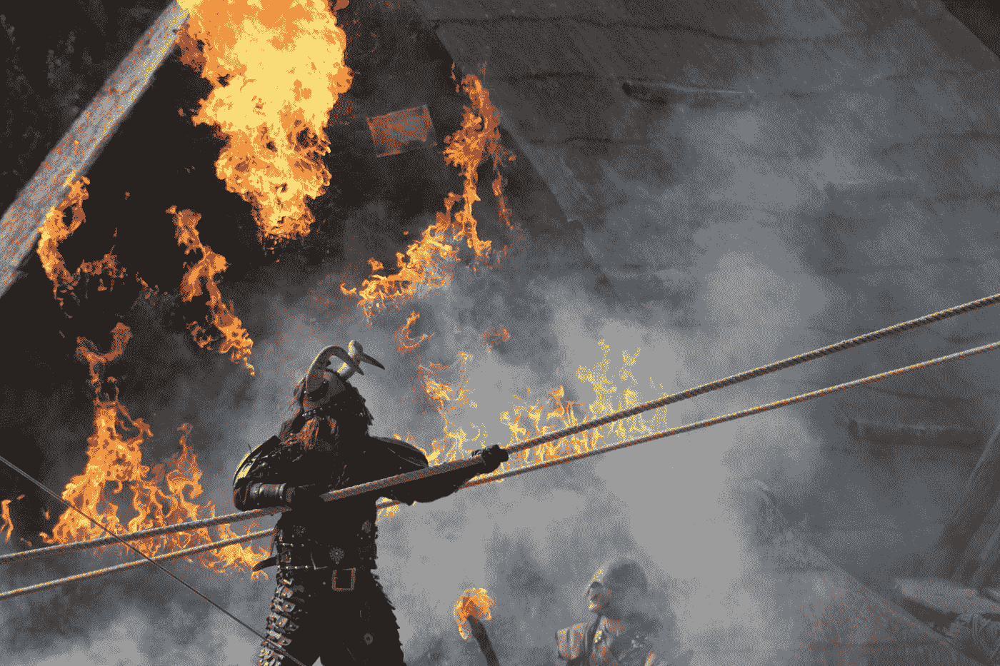

# 致瓦尔哈拉:GameStop 传奇能告诉我们什么？

> 原文：<https://medium.datadriveninvestor.com/to-valhalla-what-could-the-gamestop-saga-be-telling-us-e44ca03f837d?source=collection_archive---------22----------------------->

## 民主和愤怒的结合会非常有效

Photo by [Maxim Hopman](https://unsplash.com/@nampoh?utm_source=medium&utm_medium=referral) on [Unsplash](https://unsplash.com?utm_source=medium&utm_medium=referral)

像大多数人一样，我对过去一周金融界发生的关于视频游戏零售商 GameStop 股票的不可思议的故事感到震惊。

在一个和几个朋友的聊天群里，我开始意识到一群积极性很高、组织效率很高的散户投资者正在通过社交媒体平台 Reddit 发起一场战争。在名为 Wallstreetbets 的 subreddit 上发帖(一个致力于在主要是日内交易者中分享市场技巧和策略的社区论坛)。这些个人股票市场投资者决定瞄准全球金融体系中的一些巨头，尤其是那些从事卖空交易的对冲基金经理。

在很短的时间内，这些普通投资者穿着运动裤坐在家里，除了笔记本电脑和交易账户之外什么都没有，他们对主要金融公司的利润造成了严重破坏，并在这个过程中使自己变得富有。

一些人看到他们的投资增长到数百万。GameStop 的最大股东几乎在一夜之间变成了亿万富翁。这是一场名副其实的疯狂进食。

在我的聊天群中，我们分享了华尔街赌注上正在进行的一些对话的截图——**即使对于一群男人来说，我们也对阿尔法男性的侵略性和更衣室幽默的混合感到震惊**，这符合金融市场的敏锐。

**“HODL 直到这(咒骂语)到达瓦尔哈拉”** — HODL =亲爱的生命坚持住，瓦尔哈拉是北欧神话中阵亡士兵的天堂目的地。

**“我们喜欢这只股票”** —模仿华尔街分析师的建议，当一只股票是首选股票，应该包含在或保留在投资组合中。

**“我有# diamond hands”**——这种想法认为，尽管面临抛售股票的巨大压力，但所有者应该继续持有股票，因为他们可以像钻石一样承受热量。

**“不要当(脏话)。持有。”** —应该是不言自明的。

所有这些繁荣和高调的同行压力都是为了恳求 GameStop 股票的散户投资者维持他们的股票持有量，面对来自更大的市场参与者和股票交易平台(他们中的许多人最初用来购买股票)的巨大压力。

> 阅读这些截图就像在乔丹·贝尔福特的《华尔街之狼》时代——大脑中度过时光。只是，它被完全展示出来了。

我鼓励你看看 subreddit，只是为了搞笑，并感受一下主导聊天的疯狂和紧迫感。

## 到底发生了什么？

在继续之前，假设您还没有机会完全理解这里到底发生了什么，我将给出一个快速的总结:

唯一的散户投资者基思·吉尔(Keith Gill)在 2019 年开始购买 GameStop 公司的股票。当时，该公司正在走向失败，但吉尔努力争取股票，并开发了一个小型社交媒体追随者。最终，这群狂热分子注意到，这只股票是大型对冲基金卖空的对象，这引发了我们今天看到的连锁事件。

卖空是指投资者认为股票价格会下跌，因此通过金融市场，他们从当前的持有者那里借入股票，以当前的价格卖出，然后等待价格下跌。一旦股价下跌，投资者将回购股票，并将其返还给原始持有人，从而获得差价。这是一个众所周知的策略，但在这种情况下，华尔街赌注的散户投资者决定直接攻击这一策略。

他们是怎么做到的？通过购买大量的股票。这样做的结果是价格呈指数上升(对一种资产的需求越高，价格就越高)。因此，实施卖空策略的对冲基金投资者发现，他们的命运发生了逆转，因为股价不但没有下跌，反而大幅上涨，他们不得不以更高的价格完成卖空交易。

所有这些疯狂行为的结果是，那些通过卖空来做空 GameStop 的大型对冲基金最终损失了大约[50 亿美元](https://www.businessinsider.com/gamestop-short-sellers-squeezed-losses-reddit-traders-army-cohen-palihapitiya-2021-1)。除了令人瞠目结舌的损失，散户投资者的这种反抗深深伤害了大型金融机构，震惊了市场，让从投资平台到监管机构的所有人都在争先恐后地理解和应对这种前所未有的活动。

这一切都令人兴奋。庞大的数字，复杂的金融条款和交易，古怪的聊天室社区中神秘的互联网术语。有太多的情节和主题需要解剖和理解。

然而，我忍不住特别关注一个问题——散户投资者孤注一掷的态度。

一般来说，对大多数人来说，股市投资是一件相当保守的事情。是的，公众的看法是，任何在股票市场上玩的人都有赌博的嗜好，但这在很大程度上是一种误解。我当然主张通过指数基金和交易所交易基金进行稳定的长期投资，事实上，大多数人都是通过这种方式参与股市的(通过养老金、401Ks、基金平台等)。)

当然，日内交易者可能是一个不同的群体，对风险有更高的容忍度，从本质上来说，他们是为了短期收益，而不是长期的增量收益。

然而，我们在过去几周看到的感觉已经超出了短线交易者的标准方法，完全变成了其他的东西。

Photo by [Victor B.](https://unsplash.com/@vbchr?utm_source=medium&utm_medium=referral) on [Unsplash](https://unsplash.com?utm_source=medium&utm_medium=referral)

首先，我对近年来我们听到的“吃富人”的战斗口号感到震惊，这是对 2008 年金融危机(“GFC”)以来不断扩大的不平等和经济不公平感的回应。

在阅读一个特别的帖子时，你会感到明显的愤怒。一个人谈到了他在金融危机最严重时期的青少年时代——他讲述了一年来靠豆子、罐装香肠和米饭生存的经历，而他的堂兄弟姐妹们则靠番茄酱当汤维持生计，情况甚至更糟。令人痛心。他和许多像他一样的人似乎已经将他们的创伤后应激障碍和对金融系统的憎恶发泄出来，金融系统救助了大型机构，而普通人却失去了他们的家园。

除了 GFC，过去十年的动荡——包括严重的种族不平等、不断加深的气候危机、特朗普时代和疫情——也助长了对当权派的报复情绪。

这些人认为这是一场战争。虽然战争是在数字战场上进行的，但他们的目的是达到令人眩晕的财务成功的高度(火箭到月球！)，同时对敌人造成致命的身体打击。这封广为流传的信表明了他们的意图:惩罚。

第二，我注意到政治术语的奇怪和有些矛盾的混合，借用了共产主义和共和党的政治历史——例如，subredditers 的同伴是“同志”和“兄弟”(尽管事实上女性也参与其中)；而其他人则援引法国大革命。最有趣的是，对天文学(带着这支股票去月球)和北欧神话(我们在去瓦尔哈拉的路上)的引用展示了这场运动中的幽默，如果它可以被称为幽默的话。

> **但它也揭示了这样一个想法，这些人认为自己肩负着一个比自己更大的使命，一个可能以彻底毁灭或荣耀而告终的使命。**

如果可以相信的话，这是近代历史上发生的一切以及人们如何将这些事件内在化的惊人结果。

这个故事最引人注目的地方在于，金融市场的民主化(通过 Robinhood 等低成本在线交易应用)暴露了复杂而庞大的全球金融网络的真正力量所在。在线应用程序开始限制更多购买 GameStop 股票(以及其他股票)，最终最大限度地减少了对冲基金正在经历的失血，这一事实似乎支持了一个假设，即 subredditers 认为:民主化只有在不扰乱事物秩序的情况下才是好的。如果你听听 WSB 成员对最近(最终是短暂的购买限制)的愤怒反应，世界上的权力掮客仍然是资本主义模式的最大受益者。这种想法似乎促使他们下定决心，拿着钻石牌加倍下注。这难道不是人们意识到民主化机构的力量的又一个例子吗？

在这一集里，大众已经将他们直接进入金融系统的途径武器化，产生了令人震惊的效果。随着对他们力量的进一步认识，他们下一步会做什么？更广泛的社会将如何回应？