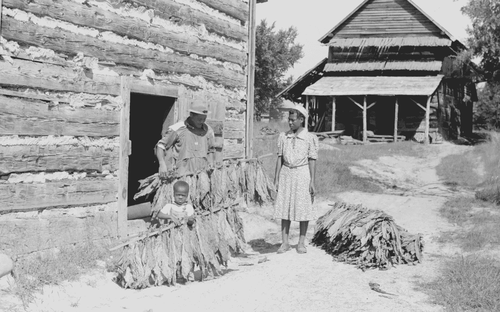
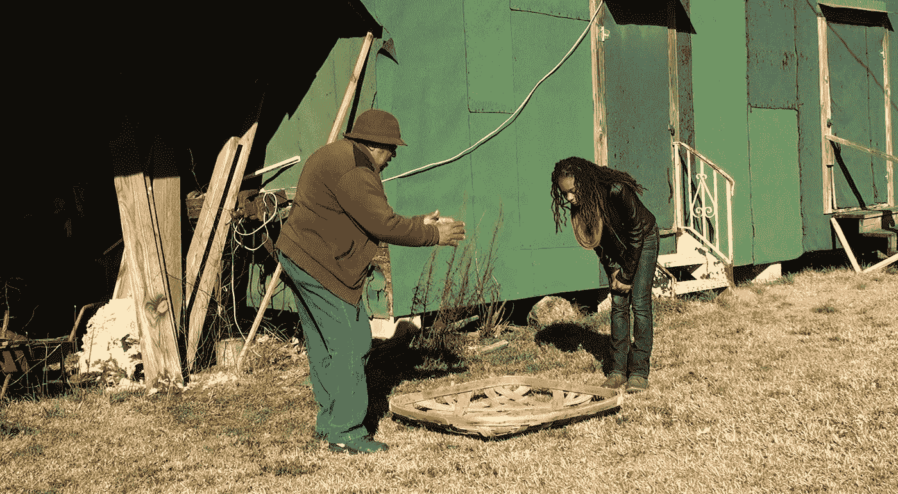
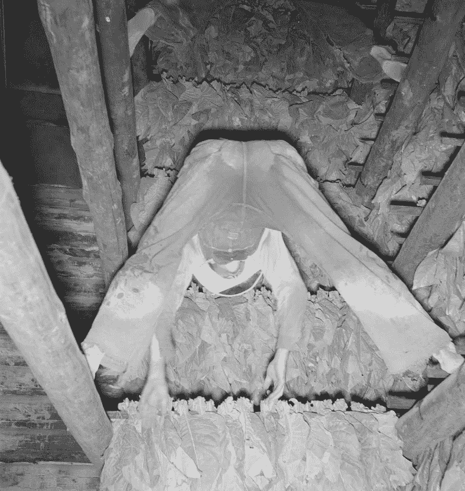
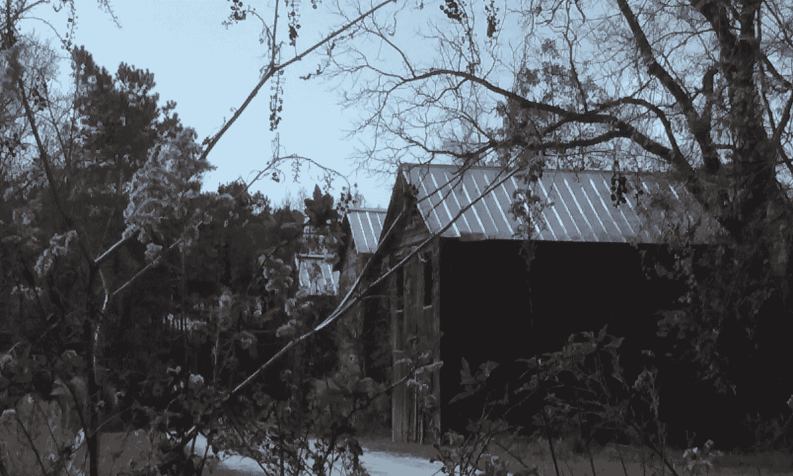
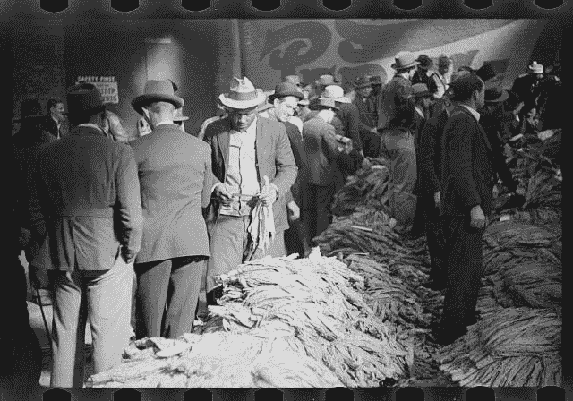

# 北卡罗来纳州东南部的烟草种植

> 原文：<https://medium.datadriveninvestor.com/tobacco-farming-in-southeastern-nc-b4f70cd2191d?source=collection_archive---------3----------------------->

*非裔美国人的创新带来了北卡罗来纳州著名的亮叶烟草*

African American taking cured tobacco out of barn picture from FSA collection

冒险走在北卡罗来纳州威尔明顿周围的乡村道路上，你可能会看到在风景中徘徊的高大谷仓，这是一个时代的偶然纪念碑，当时烟草是北卡罗来纳州东南部数千个小农场的主要经济作物。不管是维护得好还是掉进去，烟草仓库都在讲述一个故事。它们唤起了地主、佃农和佃农的经历，对他们来说，从内战时期到 20 世纪 60 年代，手工种植和烘烤烟草是一种生活方式。

Dr. Richard T. Newkirk explains the use of a tobacco basket to Trinity Washington in the opening scenes of the documentary [Sharecrop](http://stackstories.com/sharecrop/) picture by Claudia Stack

理查德·t·纽柯克博士带着讽刺的幽默回忆了他 20 世纪 50 年代和 60 年代在彭德县农场工作的时光。“你什么时候在农场工作？一直都是。什么时候没有时间在农场工作？绝不。”作为一名长期的教育家和英国文学教授，纽柯克博士的教学技巧是显而易见的，因为他描述了烟草季节的一个典型的一天。收割日通常始于他凌晨三点半起床，从谷仓里拿出烤好的烟草，在一天余下的时间里，他在地里干活之前匆匆吃了一顿早餐。

 [## 作佃农耕种

### 最近放映的分享作物和分享作物:三角洲棉花:全国黑人研究理事会，非洲世界节…

stackstories.com](http://stackstories.com/sharecrop/) 

站在他的家人在北卡罗来纳州艾芬豪共同种植的一个旧烟草仓库前，纽柯克博士解释说，当男人们正在种植(采摘)烟叶并将它们装载到由骡子拉的“拖车”上时，妇女和女孩们在仓库悬垂物下工作，将烟叶绑在棍子上。敏捷的男孩和年轻男子会把树枝挂在柱子上，烟叶朝下。他们开始挂在谷仓顶上，然后一路向下。一旦烟草被烤熟，这需要 5 到 7 天，他们将逆转这个过程，把烟草从谷仓里拿出来。在燃气加热被广泛使用之前，把木头整夜放在火上来保持谷仓的适当温度通常是由年轻人来做的。

Hanging tobacco in the barn picture from FSA collection

谷仓的材料显示了一些年代:用整根原木建造的谷仓很少见，可能有 150 年的历史，可以追溯到刨平木材稀缺的时代。大多数圆木棚让人想起北卡罗来纳州烟草经济的早期。1860 年至 1880 年间，美国人对烟草的口味发生了变化。从殖民时代到 1860 年，弗吉尼亚流行的深色烟草被用作鼻烟或烟斗。然而，在南北战争期间和之后，人们开始更喜欢吸“亮”(金色)烟叶的香烟，这种烟叶使北卡罗来纳州出名。

Three tobacco barns in Bladen County, NC picture by Claudia Stack

传说亮叶烟草是 1839 年由一个名叫斯蒂芬的奴隶在北卡罗来纳州卡斯韦尔县首次生产的。被阿比莎·斯莱德奴役的斯蒂芬在烘烤烟草时，在照看炉火时睡着了。苏醒发现火快灭了，他赶紧从铁匠铺上拿了木炭重新把火生了起来。这使得烟叶中的水分迅速流失，产生了令人愉悦的金黄色。斯莱德完善了新的固化技术的创新和传播知识。

 [## 美国儿科学会

### 1839 年，命运的转折导致了北卡罗来纳州农业史上最重要的突破之一。烟草…

www.ncpedia.org](https://www.ncpedia.org/anchor/bright-leaf-tobacco) 

学者芭芭拉·哈恩博士在她 2011 年的书《让烟草变得明亮，创造一种美国商品 1617–1937》(2011 年，马里兰州巴尔的摩约翰·霍普金斯大学出版社)中对这个起源故事提出了一些疑问。然而，她确实指出，明亮的烟草来自北卡罗来纳州与弗吉尼亚州接壤的皮埃蒙特地区(第 14 页)。因此，我们可以有把握地得出结论，非裔美国人的劳动和创新为北卡罗来纳州的烟草业做出了巨大贡献，不管关于斯蒂芬的具体传说的真实性如何。正如 [NCpedia 指出的](https://www.ncpedia.org/slavery)，那个地区的人口主要是非裔美国人:

> 奴隶制在与弗吉尼亚接壤的集中种植烟草的一些县也很繁荣。到 1860 年，[沿海平原](https://www.ncpedia.org/geography/region/coastal-plain)和[山前](https://www.ncpedia.org/geography/region/piedmont)的 19 个县统计出黑人占多数……”
> 
> *烟草仓库是简单的结构，成为北卡罗来纳州烟草价值增长的重要渠道。然而，农民仍然不得不以经济的方式使用材料。继圆木谷仓之后，下一个最古老的谷仓可能有垂直木板的外部，称为“木板和板条”壁板。垂直放置的木板会排水，这样可以防止木材腐烂。相比之下，用焦油纸或锡覆盖的谷仓很可能是在 60 到 70 年前建造的。不管用什么材料，大多数烟草仓库的基本形状都是一样的。它们是高大的方形建筑，大约 20 英尺乘 20 英尺，通常有挑檐。*

Tobacco growers depended on selling their crop at markets like this one in Durham, NC picture from FSA collection

恐怖角地区的几代人按照烟草的苛刻节奏生活。也许烟草比其他作物更需要整个家庭的劳动。甚至很小的孩子也会被强迫服役，从有价值的植物上采摘角虫。烟草有时被称为“全年”作物，因为烟农可能在 11 月份完成烘烤，只有足够的时间来维修设备、订购种子，并在 1 月份开始准备苗床的土地。

Family stripping (removing the stems) and grading (sorting by quality) tobacco leaves picture from FSA collection

纽柯克博士的祖父母拥有一个农场，但也为其他土地所有者分享收成。几年来，他们小心翼翼地不让人们知道他们已经买下了他们的农场。他们让人们相信他们只是佃农，因为害怕有人会把他们烧掉。那是 20 世纪 40 年代，他们的儿子，理查德的父亲，正在二战中服役。

 [## 迈向经济正义的一步:纠正二战中非裔美国退伍军人的错误

### 我们可以迈出的一步

medium.com](https://medium.com/age-of-awareness/justice-for-african-american-veterans-of-ww-ii-f1c1e153358) 

尽管所有的农民家庭都在努力“种庄稼”，但纽柯克夫妇的恐惧表明，在种族隔离时代，非裔美国人承受着更大的负担。社区中受人尊敬的成员，他们的儿子在战争期间为我们的国家服务，然而他们有理由担心他们可能成为恶意和纵火的目标。

非裔美国家庭的麻烦也没有随着战争的结束而消失。许多非裔美国军人被剥夺了《退伍军人权利法案》的权利，而那些能够参与的人大多被禁止购买郊区房屋，原因是划了红线，这种歧视仍然导致了今天的贫富差距。

 [## 新的！！！凯莉·梅:亚马逊黄金视频上的美国生活

### Carrie Mae:《美国生活》现已推出，点击此处观看亚马逊 Prime 视频！凯莉·梅:美国生活…

stackstories.com](http://stackstories.com/new-carrie-mae-an-american-life-on-amazon-prime-video/) 

纽柯克博士像许多农家子弟一样，在家人的指导下努力工作，尽职尽责。(我的电影[Carrie Mae:a American Life](http://stackstories.com/new-carrie-mae-an-american-life-on-amazon-prime-video/)讲述了他母亲从一个佃农成长为教师的故事，见上面的链接。)他还展望了自己的未来，以及一条远离农场、在加州从事教学工作的道路。现在处于半退休状态，他已经回到了自己的家园。他回忆起自己家族三代人辛苦种植烟草的经历，说道:“你如何来到这里是一回事。你从这里去哪里是另一回事。”

_______________________________

引用和一些图片摘自克劳迪娅·斯塔克 2017 年的纪录片 [SHARECROP](http://stackstories.com/sharecrop/) ，该纪录片是在中间道路基金会的慷慨支持下制作的。欲了解更多信息，并查看电影预告片，请见 stackstories.com