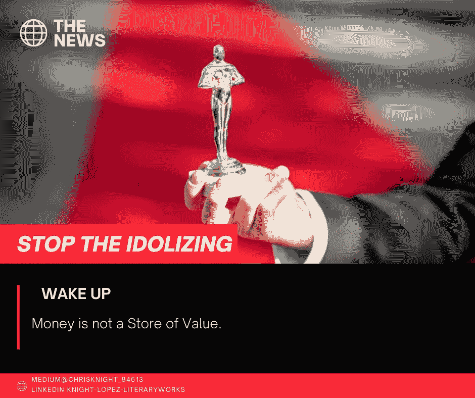
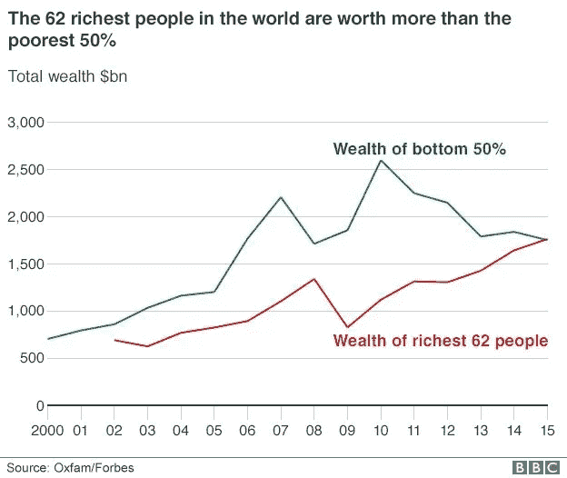

# 今天的资本主义助长了旧的殖民主义意识形态，让你变得贫穷

> 原文：<https://medium.datadriveninvestor.com/todays-capitalism-fuels-old-colonialism-ideology-to-make-you-poor-f0c460cf4c16?source=collection_archive---------8----------------------->

## 追求征服，就是通过让你变穷来增加财富。曾经因财富而被侵占的土地现在成了为资本而成立的企业。我们的班级将永远拥有你认为珍贵的一切。

Source: Self Created Image with Canva

许多人谈论美国的财富标准。很少有人将自己与世界其他地方相比。自我和自满导致回避我们的亲人。事实是，我们应该仔细分析我们的位置，与其他人相比。

根据瑞士瑞信银行汇编的数据，要进入前 10%的人需要 68，800 美元(48，300 英镑)的现金和资产，要进入 1%的人需要 760，000 美元(533，000 英镑)。

经济事务研究所总干事马克·利特伍德不同意这一评估。确切的用词是“*假的*”。

瑞士瑞信银行发现*真的是伪造的*？利特伍德有可能是一个老牌资本家吗？利特伍德是否被迫质疑诚实的研究？黑暗中有小人吗？

**62%的财富与底层 50%相比**

一张图胜过千言万语。

“我们没有创造一个为所有人的繁荣、子孙后代和地球服务的经济，而是为 1%的人创造了一个经济，”[乐施会的报告说](https://policy-practice.oxfam.org.uk/publications/an-economy-for-the-1-how-privilege-and-power-in-the-economy-drive-extreme-inequ-592643)。

在 15 年的时间里，最富有的 62 个人占据了人类财富的一半。与此同时，贫富差距达到了惊人的程度。[历史上最大的财富转移将在未来 25 年发生](https://www.cnbc.com/2019/02/22/how-to-prepare-your-heirs-for-the-68-trillion-great-wealth-transfer.html)。

我不能不同意牛津饥荒救济委员会的声明。62 个人拥有超过一半的人类是不道德的。

我们制度的核心是“资本主义”。资本主义现在并没有提供一顿美餐。

我在我们媒体称之为美餐的东西里尝到了腐肉的味道。资本主义的口头禅“好牛排”对我来说没那么好吃。我没看到牛排锅里的嘶嘶声。

**资本主义**

什么是资本主义？说资本是什么意思？

十八世纪和十九世纪的贵族将资本定义为以资产、货币和人的形式储存的财富。奴隶制是一种东西。在此期间，贵族的唯一目的是保持其地位。

法国大革命推翻了许多政权。少数富人可能会加剧贫富差距、社会服务不平等，并向人们征税以维持颓废的生活方式，这种想法引发了流血事件。

 [## 人工智能帮助你聪明理财|数据驱动的投资者

### 自动化和人工智能为创新平台提供动力，简化双方的财务流程…

www.datadriveninvestor.com](https://www.datadriveninvestor.com/2020/09/02/artificial-intelligence-helps-you-be-smart-with-money/) 

通过欺骗，残存的贵族抓住了他们在自由之骨中的机会。

平等、政治稳定、人类福利和人权并不是专制统治工业崩溃的产物。从穷人中挑选出几个人来说明虚假的希望感，从而压制了普通人的呼声。

> 每年显示一个“例外”是一种常见的欺骗形式；而不是说明每年“压倒性”的失败。

我们倾向于说“但是它发生在他身上，所以它也可能发生在我身上。”

> 不是所有人都获得政府赋予的权利，而是享有特权的欧洲盎格鲁人前往美国、新西兰、印度和澳大利亚，为了“资本主义”的利益奴役他人。新政府是旧政府。面孔刚刚变了。

贵族们建立了一个新的“社团统治”阶层。领主们以“首席执行官”的身份统治，贵族们在“董事会”中占有一席之地。附庸变成了股东。军人变员工。新农奴是独立承包人。

因为独立承包人提供了雇员的所有价值，但没有从其赞助人那里得到任何特权。

**从群众中窃取的隐蔽方式**

事实是我们的社会重复着它的周期。每一个被侵蚀的机构的核心都是其支配人民财富的欲望。机构开始是纯洁的，但是人类罪恶的污染侵蚀了机构的道德。这种侵蚀的中心是“贪婪”。

这不是理想主义。我没有夸夸其谈。

我们已经看到无数新闻报道[政府挪用](https://www.osc.state.ny.us/sites/default/files/local-government/documents/pdf/2019-01/preventingfraud.pdf)、[缺乏对联邦资金的监督](https://www.brookings.edu/blog/fixgov/2020/04/15/congressional-oversight-of-the-cares-act-could-prove-troublesome/)、[中央银行自 1995 年](https://famguardian.org/Subjects/MoneyBanking/FederalReserve/FRconspire/audit.htm#:~:text=We%20have%20audited%20the%20accompanying,responsibility%20of%20the%20Board's%20management.)以来就没有进行过审计，还有[等等。](https://www.grants.gov/learn-grants/grant-fraud.html)

对社会财富的控制是通过欺骗你，让你相信你拥有一些有价值的东西，而你却没有。企业制度会迫使你支付隐性税收。你可以因为心甘情愿地放弃一切有价值的东西来换取傻瓜的黄金而变得贫穷。

贵族阶层已经努力了 200 多年来恢复其财富。正如我们从上面的图表中看到的那样，它起作用了。62 人现在比世界人口的一半还有钱。那不是意外。

**从奸商那里获利**

**这个骗局的核心是钱。在我看来，钱是交易的媒介。**

> 你们中的许多人被骗了，以为自己很富有，因为你有很多钱。价值储存必须包含内在价值。我们现在的货币没有内在价值。

当我说“我不为金钱所动”时，人们永远不会理解。也许现在你明白了。我不在乎钱，因为钱本身毫无价值。我为什么要关心一个几乎没有内在价值的东西？

我的一个朋友吹嘘自己年初在银行有超过 10 万美元的存款。我向他展示了美联储是如何在当前的货币政策下，在今年将人民币贬值到不到 84000 美元。

为什么我会有很多钱？让别人偷我的东西是愚蠢的。*不用了谢谢*。

尽管如此，我们还是需要钱。货币的功能是“交易媒介”。毕竟你的房东还是希望以这种毫无价值的交换形式获得报酬。所以我们都被迫使用一种毫无价值的媒介。我们将使用货币，直到人们不再接受任何东西。

**如何通过理解价值与金钱的关系来获利**。一个适当的价值储存持有或升值，但可以很容易地转换成金钱来交换你需要的东西。想要个例子吗？它们是:黄金、白银、加密货币、期权、看涨期权、看跌期权和股票。

**将你的大部分物品存放在合适的储值商店**。*顺财*。有人在利用你。那些推销金钱的人旨在让你变穷。你必须停止让你的家庭贫困。掌控你的财富。不要让企业制度通过告诉你持有资金而获得成功。持有价值储存。

祝你知识成功！

***

关于 Christopher:Christopher Knight Lopez 是一名职业骗子，在他的职业生涯中，他与职业企业家进行了广泛的合作。在他 14 年的职业生涯中，Christopher 已经开了超过 7 家公司。克里斯托弗的目的是利用各种市场驱动的机会。Christopher 是注册项目经理(MPM)和认证财务分析师(AFA)。Christopher 之前通过了 65 系列证券执照考试。克里斯托弗也有他的总路线——人寿、意外、健康和健康维护组织。Christopher 已经管理了总计 2 . 86 亿美元的报告管理资产和建议资产。Christopher 在 29 个国家有工作经验，为各种业务筹集了超过 5000 万美元，在他的个人职业生涯中总收入超过 1300 万美元。Christopher 曾在高科技行业工作:生物技术、金融、证券、制造、房地产和住房抵押贷款。克里斯托弗是一名美国空军老兵。克里斯托弗热爱家庭、竞技体育、钓鱼、武术，并倡导企业家精神。克里斯托弗为崭露头角的企业家提供自助课程。克里斯托弗对导师的热情来自于企业家和骗子需要指导的信念。这个世界充满了关于企业家身份的相互矛盾的信息。在[www.christopherklopez.com 看更多。](http://www.christopherklopez.com.)

免责声明:这些信息并不意味着是一种投资建议或财务建议。不要把这种情况应用到你自己的个人环境中。各种风险包括:商业风险、投资风险、政治风险和其他风险。此信息仅用于信息和教育目的。请不要向作者寻求任何投资策略或哲学。针对自己的情况，请咨询自己的理财顾问或法律顾问。不是任何形式的推荐或认可。

**访问专家视图—** [**订阅 DDI 英特尔**](https://datadriveninvestor.com/ddi-intel)