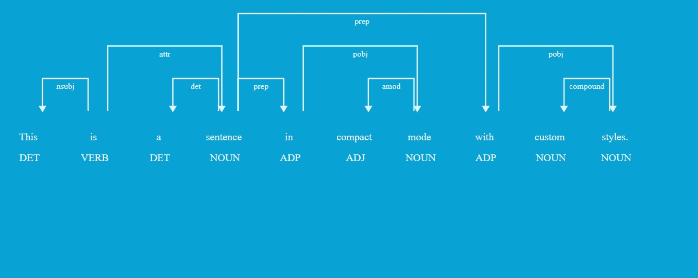
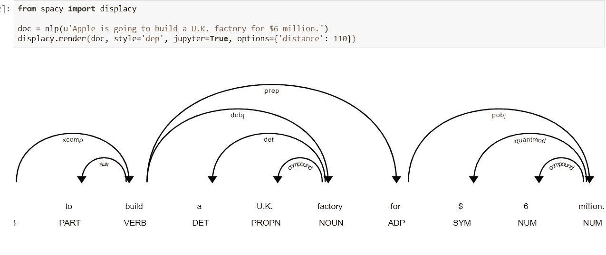
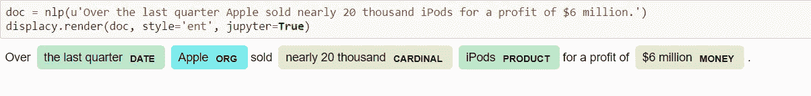

# 符号化逐个符号地解释

> 原文：<https://medium.datadriveninvestor.com/tokenization-explained-token-by-token-b76df5d61112?source=collection_archive---------12----------------------->

分成更小的部分



标记化是将大量文本分成称为**标记**的较小部分的过程。令牌是 Doc 对象的基本构造块。一切有助于我们理解文本意义的东西都来自于记号以及它们之间的关系。

它本质上是将一个短语、句子、段落或整个文本文档分割成更小的单元，如单个单词或术语。这些更小的单元中的每一个都被称为令牌。

# 令牌的类型-

> 前缀:开头的字符
> 
> 后缀:结尾字符
> 
> 中缀:中间的字符
> 
> 例外:特殊情况规则，用于在应用标点符号规则时将字符串拆分成几个记号或防止记号被拆分

# 标记化

创建 Doc 对象的第一步是将输入的文本分解成组成部分或“标记”。

```
*# Import spaCy and load the language library*
**import** **spacy**
nlp = spacy.load('en_core_web_sm')*# Create a Doc object and explore tokens*
doc = nlp(mystring)

**for** token **in** doc:
    print(token.text, end=' | ')OUTPUT-
" | We | 're | moving | to | L.A. | ! | " |
```

请注意，标记是原始文本的一部分。也就是说，我们没有看到任何词干或词条(单词的基本形式)的转换，我们也没有看到任何关于组织/地点/金钱等的内容。标记是 Doc 对象的基本构建块——帮助我们理解文本含义的一切都是从标记及其相互关系中派生出来的。

# 前缀和后缀

spaCy 将隔离那些不*不*构成单词整体部分的标点符号。句末的引号、逗号和标点符号将被赋予各自的符号。但是，作为电子邮件地址、网站或数值的一部分存在的标点符号将作为令牌的一部分保留。

```
doc2 = nlp(u"We're here to help! Send snail-mail, email support@oursite.com or visit us at http://www.oursite.com!")

**for** t **in** doc2:
    print(t) OUTPUT-
We
're
here
to
help
!
Send
snail
-
mail
,
email
support@oursite.com
or
visit
us
at
http://www.oursite.com
!
```

有趣的是,“蜗牛邮件”中的感叹号、逗号和连字符都被赋予了自己的符号，但电子邮件地址和网站都被保留了下来。

# 例外

作为已知缩写的一部分存在的标点符号将作为标记的一部分保留

```
doc4 = nlp(u"Let's visit St. Louis in the U.S. next year.")

**for** t **in** doc4:
    print(t) Output-Let
's
visit
St.
Louis
in
the
U.S.
next
year
.
```

在这里,“圣”和“美国”的缩写都保留了下来。

# 令牌可以通过索引位置和切片来检索

停驻对象可以被认为是对象令牌列表。因此，可以通过索引位置来检索各个标记，并且可以通过切片来检索标记的范围:

```
doc5 = nlp(u'It is better to give than to receive.')

*# Retrieve the third token:*
doc5[2]Output-better
```

# 命名实体

*超越了令牌，命名实体*增加了另一层上下文。语言模型认为某些单词是组织名称，而其他单词是位置，还有一些组合与金钱、日期等有关。通过 doc 对象的 ents 属性可以访问命名实体。

```
doc8 = nlp(u'Apple to build a Hong Kong factory for $6 million')**for** token **in** doc8:
    print(token.text, end=' | ')print('**\n**----')**for** ent **in** doc8.ents:
    print(ent.text+' - '+ent.label_+' - '+str(spacy.explain(ent.label_)))OUTPUT-Apple | to | build | a | Hong | Kong | factory | for | $ | 6 | million | 
----
Apple - ORG - Companies, agencies, institutions, etc.
Hong Kong - GPE - Countries, cities, states
$6 million - MONEY - Monetary values, including unit
```

请注意两个令牌如何组合形成实体“香港”，三个令牌如何组合形成货币实体:` $ 600 万'

# 名词块

与 Doc.ents 类似，Doc.noun_chunks 是另一个对象属性。名词组块是“基本名词短语”——以一个名词为中心的扁平短语。你可以把名词块想象成一个名词加上描述这个名词的单词——例如一个*“独眼、独角、飞翔、紫色的食人族”*就是一个很长的名词块

```
doc9 = nlp(u"Autonomous cars shift insurance liability toward manufacturers.")

**for** chunk **in** doc9.noun_chunks:
    print(chunk.text)Output-
Autonomous cars
insurance liability
manufacturers
```

# 内置可视化工具

spaCy 包括一个名为 **displaCy** 的内置可视化工具。displaCy 能够检测你是否在一个 Jupyter 笔记本中工作，并将返回可以立即在单元格中呈现的标记。导出笔记本时，可视化效果将以 HTML 格式包含在内。

# 可视化依赖解析

```
**from** **spacy** **import** displacy

doc = nlp(u'Apple is going to build a U.K. factory for $6 million.')
displacy.render(doc, style='dep', jupyter=**True**, options={'distance': 110})
```



# 可视化实体识别器

```
doc = nlp(u'Over the last quarter Apple sold nearly 20 thousand iPods for a profit of $6 million.')
displacy.render(doc, style='ent', jupyter=**True**)
```



# 结论

自然语言处理用于构建诸如文本分类、智能聊天机器人、情感分析、语言翻译等应用。为了达到上述目的，理解文本中的模式变得至关重要。这些记号对于寻找这种模式非常有用，并且被认为是词干化和词汇化的基本步骤。