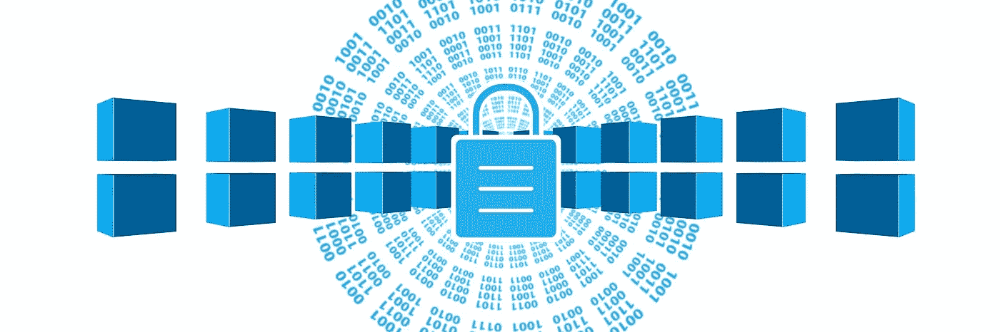

# 资产的令牌化

> 原文：<https://medium.datadriveninvestor.com/tokenization-of-assets-b2d72fb79bb1?source=collection_archive---------12----------------------->

(Picture by geralt on pixabay.com)

许多行业已经认识到区块链技术的巨大潜力，并开始寻找自己的应用。金融界尤其面临着一种发展趋势，这种趋势很可能会像 17 世纪引入股份公司一样具有革命性:资产的令牌化。

世界经济论坛(WEF)的大量分析和研究认为，2029 年全球国内生产总值(GDP)的 10%左右将被令牌化，价值超过 10 万亿美元。

在德国，区块链的话题也引发了轩然大波。2019 年 11 月 14 日，联邦议院(德国政府)决议修改法律，使德国的加密值成为官方金融工具，并有相应的监管。该决定在德国法律中执行了欧盟关于洗钱的第四项修正指令，并改变了现有的《洗钱法》和影响金融部门的其他法律。已经树立了一个里程碑。

 [## 人工智能、区块链和智能合约:为什么我们都需要拥抱创新|数据驱动的投资者

### 区块链是一个抓住了我的想象力的行业，有助于为更大的利益改造社会。我开始…

www.datadriveninvestor.com](https://www.datadriveninvestor.com/2020/08/03/ai-blockchain-and-smart-contracts-why-we-all-need-to-embrace-innovation/) 

# 什么是标记化？

最终，它是对某些商品、实物或权利的所有权的数字化证券化过程。想象一下在分散的数据库中以数字形式拥有你的房子。从理论上讲，你可以将任何东西令牌化——无论是政府债券、运动鞋、建筑综合体，甚至是音乐作品的许可权。代替“物理”文档，数字令牌“证明”各自的所有权。

首先，令牌化将极大地提高现有的市场效率。起初听起来像是工商管理讲座中的一句话，却有着巨大的影响力。迄今为止可以在证券交易所交易的一切，将来都将扩大到包括额外的资产。不仅如此:当前的基础设施本身变得更加高效。许多证券交易所目前正致力于在其内部系统中实施区块链技术。

# 欧洲的焦点是企业融资

区块链在欧洲正经历一波巨大的流行，特别是在 SME(中小企业)融资领域。欧洲大多数公司都是中型企业，美国可能也是如此。

中小企业今天面临的一个主要挑战是缺乏进入资本市场的机会。来自国外的日益增长的竞争压力增加了对技术创新的需求，这反过来需要增加支出。然而，如果没有外部资金，这些资本需求是无法满足的。

由于规模有限，大多数公司取消了首次公开募股(IPO)。本票或债券的配售也经常失败，因为银行和公司金融公司尤其看不到这种票额的适当成本/收入比。与中小企业做生意，你根本赚不到足够的钱。这种情况可能很快会改变。

# 金融市场的符号化

随着“数字”(令牌化)证券的引入，中型公司受益于金融市场的发展，这使它们能够更加灵活地实施融资项目。

即使在今天，中小型企业(SME)也可以发行基于数字证券的债券，发行额高达 800 万欧元，并有有限的招股说明书要求。发行人需要做的只是发布一份证券信息表。成本只是传统债券发行的一小部分。

公司股票的令牌化也将塑造未来的风险资本市场，并使更多的投资成为可能。

# 令牌化:优点令人信服

根据领先的经济学家和大量研究，资产的象征化背后隐藏着一个数十亿美元的市场。这种新的数字所有权模式将使金融系统变得更加高效、便捷和全球化。今天的金融世界可能很快就会天翻地覆，因为:

*   数字资产使得通过银行、证券交易所、经纪人和中介的复杂路线变得多余，并免除了纸质交易。因此，交易的处理将变得更加便宜和快速。
*   由于数字可追溯性，该技术保证了您自己资金的透明转移，并允许简单快速的投资形式。由于几秒钟内的交易，由银行转账引起的多天延迟已成为过去。
*   投资是用你自己的资金直接投资于一项投资资产，例如，一家公司的参与，而这在以前只能通过封闭式基金获得。这为发行者(更大的流动性池)和投资者(投资范围的扩大)带来了更大的回旋余地。
*   令牌化具有显著减少市场操纵的潜力，因为每一笔交易都被透明地、实时地、冗余地、不可变地、可追踪地记录下来，并且在任何时候都可供所有相关方(包括监管机构)访问。

# 市场会如何发展？

在短期内，令牌化将特别影响标准化排放产品。这基本上包括股票形式的传统股权以及期票贷款、债券，但也包括利润参与权。这些资产类别将受益于较低的发行和交易成本。与此同时，目前缺乏流动性和不可交易的资产(如中小企业投资或房地产)的令牌化将加速。这一发展将受到区块链技术的使用使更快的所有权转移成为可能的前景的推动。

从中长期来看，令牌化将有广泛的使用案例。这可以是目前只能大规模进行的项目融资，也可以是老爷车和艺术品等奢侈品融资。例如，总部位于新加坡的 Bitcar 公司让投资者能够购买一个异国情调汽车投资组合的一部分。乍看上去像是投机性投资的东西，有着理性的经济背景:近年来，稀有收藏品尤其被证明是一种非常抗危机的资产类别。此外，实物资产的虚拟化开辟了一个全新的投资者细分市场，这是一个以前由于高进入壁垒而无法实现的资产类别——在低利率和传统金融市场缺乏替代品的时代，这是对自己投资组合的成功改变和补充。

不仅是投资者，所有者也从记号化中受益。想象一下，一件艺术品的所有者需要短期流动性:在一个没有符号化的世界里，这是一个漫长的过程，包括通过通常复杂的拍卖过程进行销售。由于资产的令牌化，他现在可以进行公开认购，这在以前是非常昂贵的。如果你愿意，你只能卖掉你画的 10%的所有权。

# 对于老牌金融机构来说，令牌化意味着什么？

以及已建立的金融机构？你现在应该分析你在未来的符号化价值链中将扮演什么角色。他们将作为发行人的顾问、新投资产品的发行人还是数字资产的保管人。市场还年轻，还有足够的时间来定义自己的功能。

重要的是，银行和资产管理公司尤其应该仔细观察这一发展，并明确自己在新生态系统中的角色。特别是年轻的、精通数字技术的客户对符号化表现出极大的兴趣。如果一开始不想自己开发产品，就要考虑连接第三方提供商。这促进了自身的竞争力、客户满意度和数字资产健康生态系统的发展。

接下来的步骤首先是进一步发展法律框架。安全易用的数字资产托管解决方案将是技术采用的关键因素。

英俊的约翰尼

**进入专家视图—** [**订阅 DDI 英特尔**](https://datadriveninvestor.com/ddi-intel)