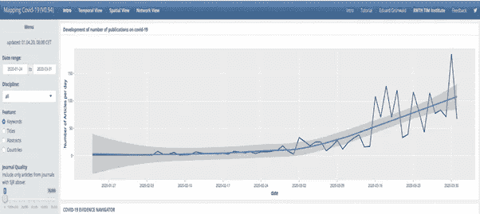

# 太多和太少，数据

> 原文：<https://medium.datadriveninvestor.com/too-much-and-too-little-data-763910a833d8?source=collection_archive---------6----------------------->

人工智能有可能成为对抗新冠肺炎·疫情的重要工具。然而，正如布鲁格尔的圣乔治·彼得罗保罗斯得出的结论:“*人工智能系统仍处于初级阶段，这种人工智能措施的结果可见还需要一段时间。”有研究表明，目前人工智能的使用实际上一方面受到缺乏数据的限制，另一方面又受到太多数据的限制。缺乏训练人工智能模型的历史数据，但也存在大数据自大、算法不可调和大量离群数据的潜在问题，这些数据需要在最终进行临床试验之前进行评估。*

首先，新冠肺炎需要更多新的训练数据；需要更多的信息开放和共享，需要更多的合作和多学科研究来提高人工智能的能力。

到目前为止，已经取得了令人鼓舞的进展，开展了一些引人注目的活动，认识到建立和分享关于这一流行病的现有数据集和信息的重要性。第一个是世界卫生组织(T4)的(世卫组织)冠状病毒疾病全球研究数据库(T5 ),并链接到其他类似的倡议。

 [## 将定义 2020 年就业前景的五大数据科学和机器学习趋势|数据驱动…

### 数据科学和 ML 是 2019 年最受关注的趋势之一，毫无疑问，它们将继续发展…

www.datadriveninvestor.com](https://www.datadriveninvestor.com/2020/02/19/five-data-science-and-machine-learning-trends-that-will-define-job-prospects-in-2020/) 

数据科学竞赛平台 Kaggle 基于这些数据发布了一项数据竞赛，名为“[新冠肺炎公开研究数据集挑战赛](https://www.kaggle.com/allen-institute-for-ai/CORD-19-research-challenge)”。非洲最大的数据竞赛平台 Zindi 也发起了一项竞赛，旨在“准确预测未来几个月新冠肺炎在全球的传播”。

[*谷歌*](https://console.cloud.google.com/marketplace/details/bigquery-public-datasets/covid19-dataset-list?pli=1) 已经在其云上提供了(直到 2020 年 9 月 15 日)新冠肺炎公共数据集，*亚马逊*已经推出了一个公共的 [AWS 新冠肺炎数据湖](https://go.aws/covid-19-data-lake)，它将其描述为“一个关于或涉及新型冠状病毒(新型冠状病毒)及其相关疾病新冠肺炎的传播和特征的最新和精选数据集的集中存储库”。

不仅是大型科技公司、出版商和大学(加州大学伯克利分校)在推动新冠肺炎数据和科学文献的开放获取，小型初创企业和非政府组织也在这么做。例如， [Newspeak House](https://newspeak.house/) **—** 一所总部位于英国的独立住宿学院——已经启动了一项众包计划，这是一本[冠状病毒技术手册](https://coronavirustechhandbook.com/home)，它已经邀请公众为之做出贡献。

随着疫情的进步和主导新闻和社交媒体，太多的大数据噪音和离群数据被创造出来，算法将不堪重负。科学家将不得不处理大量的科学论文和新产生的数据。现在每天都有超过 100 篇关于疫情的科学文章发表。这种潜在的信息过载正是数据分析工具可以发挥重要作用的地方。这种举措的一个例子是[新冠肺炎证据导航器](https://gruenwald.shinyapps.io/covid19-evi/)，它提供计算机生成的疫情科学出版物的证据地图，每天从[PubMed](https://www.ncbi.nlm.nih.gov/pubmed/) 更新。

Gruenwald et al.’s COVID-19 Evidence Navigator, 1st April 2020

**结论**

至少从流行病学、诊断学和药学的角度来看，禽流感还没有在对抗新冠肺炎的战斗中发挥重要作用。它的用途是有限的。为人工智能训练创建无偏的时间序列数据是非常必要的。这方面越来越多的国际倡议令人鼓舞；然而，有必要进行更多的诊断测试。不仅是为了提供训练数据集以使人工智能模型运行，而且是为了更有效地管理这种情况并降低其在人类生命和经济损失方面的成本。

更多的诊断测试将有助于最终停止疫情，限制封锁带来的经济损失，并避免限制放松后的反弹。目前，我们只是不知道有多少人被感染。本质上，正如《T2 科学》杂志的一项研究表明的那样，86%的感染病例可能没有记录在案。如果是这样的话，那么疫情反弹的危险是非常可能的。因此，克服关于谁具有传染性的有限数据是至关重要的。

最后，数据对于人工智能是否将成为对抗未来流行病和大流行的有效工具至关重要。如前所述，人们担心公共健康问题会盖过数据隐私问题。在疫情战争结束后，各国政府可能希望继续对其公民进行非同寻常的监控。因此，对数据隐私受到侵蚀的担忧是有道理的。

对数据管理的法律和伦理方面的进一步讨论超出了本文的范围。

**重要链接及参考:**

 [## 人工智能与新冠肺炎的斗争| Bruegel

### 人工智能可以通过包括人群筛查在内的应用来帮助对抗冠状病毒…

www.bruegel.org](https://www.bruegel.org/2020/03/artificial-intelligence-in-the-fight-against-covid-19/)  [## 冠状病毒疾病全球研究(新冠肺炎)

### 世卫组织正在收集关于新冠肺炎的最新国际多语种科学发现和知识。全球…

www.who.int](https://www.who.int/emergencies/diseases/novel-coronavirus-2019/global-research-on-novel-coronavirus-2019-ncov)  [## 新话屋

### Newspeak House 邀请您就区块链是什么和不是什么，以及真正有影响力的

新话.豪斯](https://newspeak.house/)  [## 大量未记录的感染促进了新型冠状病毒的快速传播…

### 估计未记录的新型冠状病毒(SARS-CoV2)感染的流行性和传染性是至关重要的…

science.sciencemag.org](https://science.sciencemag.org/content/early/2020/04/24/science.abb3221)