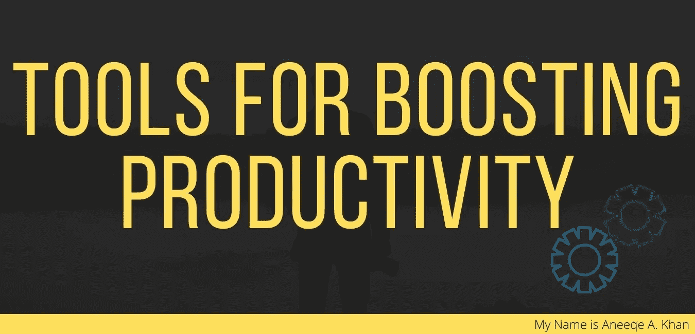

# 提高生产力的工具

> 原文：<https://medium.datadriveninvestor.com/tools-for-boosting-productivity-caa15a83f911?source=collection_archive---------18----------------------->

Photo by [ian dooley](https://unsplash.com/@sadswim?utm_source=medium&utm_medium=referral) on [Unsplash](https://unsplash.com?utm_source=medium&utm_medium=referral)

**Tools for Boosting Productivity — By Aneeqe A. Khan**

这些年来我在这上面花了很多时间，我总是对让我的“生活管理”尽可能简单感兴趣，主要是因为我很懒。这个优化我生活管理的小旅程始于一次商务会议上的一个想法。有人提到了实施减少管理时间的工具的重要性，如营销自动化、CRM 和自动回复，这让我思考起来。等一下。在经营企业时，我们实施宏大的计划、营销计划、商业计划、现金流计划、负负债计划，更不用说我们实施的各种系统，CRM、CMS、RMS。我们甚至有一个管理所有系统的系统。啊哈！！**原宿时刻。**

如果我们实施系统来管理一个人的生活 PMS(个人管理系统)是，我知道！

在澳大利亚，企业拥有一个会计系统几乎是强制性的。对于那些想知道我的选择是 [Xero](https://www.xero.com/au/) 为小企业， [Myob](https://www.myob.com/au) 为那些想做更多的人， [SAP](https://www.sap.com/index.html) 为更广泛的企业，以及 [Rounded](https://rounded.com.au/) 为自由职业者。据我所知，没有多少人有个人理财系统，但我们的支出和收入与企业一样多。稍后将详细介绍这一主题。

 [## 在家工作如何提高我的工作效率|数据驱动型投资者

### 在家工作确实激发了我最大的潜能，让我更有效率。因为在家工作给了我…

www.datadriveninvestor.com](https://www.datadriveninvestor.com/2020/07/29/how-working-from-home-increased-my-productivity/) 

考虑到上面的论点，我正式承担起寻找最佳工具的责任，这将帮助我优化我的生活。在这篇特别的文章中，我只包括了在线工具、软件和免费使用的工具。然而，我正致力于一个人可以在生活中实施的不同计划。以下是任何人都可以使用的程序、软件、在线工具和系统的列表。

> ***请注意*** *:下面列出的这些工具大部分都是免费使用的，有些只需很少的投资即可获得。如果你有一个工具，这个列表中没有一个会打破你的预算。；)*

**:日历帮你安排会议，不用来回发邮件。Calendly 是免费的，所以你可以玩玩它，但对于那些想做更多事情的人来说，有一个付费版本。如果你不需要预约会议，Calendly 可以用来预约时间和你的朋友和家人叙叙旧，或者和那个朋友喝一杯早该喝的咖啡。我喜欢 Calendly，它为我节省了很多很多时间，当我给我的朋友发送链接时，他们总是印象深刻，这让他们可以根据我的可用性选择他们喜欢的时间。**

**[**Evernote**](https://evernote.com/)**:**Evernote 是迄今为止，我遇到的最不可思议的工具之一。一个单一的地方为您的笔记，想法，列表截图，文件扫描和之间的一切。Evernote 可以读取你的笔迹，这意味着你可以扫描你的手写笔记并进行搜索。Evernote 是你自己都不知道的问题的解决方案。Evernote 基本计划是免费的。**

**[**dash lane**](https://www.dashlane.com/)**:**dash lane 是一个密码管理员。这意味着你永远不会忘记另一个密码，你可以停止使用密码 1 做任何事情。Dashlane 可在您的所有设备上同步，并保存您的所有密码。当您的某个密码被泄露时，Dashlane 会通知您。再次，可以使用免费版；但是，它不会在您的设备之间同步。付费版本每年收费 56.00 美元。它物有所值。**

**[**Google Keep**](https://keep.google.com/)**:**我已经讲过 Evernote，它也是一个笔记管理系统。但我用 Google Keep 来删除这些快速笔记，这是我在电影或购物清单中听到的随机引用，任何低于 100 个单词的内容。它重量轻，速度快，无论您在何时何地，都可以轻松捕捉您想要记住的事物。谷歌保持你所有设备的同步，并且你的谷歌账户是完全免费的。**

**[**IFTTT**](https://ifttt.com/)**:**IFTTT 是所有自动化工具之母；您可以使用它来自动化简单的事情或构建更复杂的触发器和动作。IFTTT 集成了智能家居设备、电话、电子邮件等等。这是我使用的自动化的一个例子；"回家后自动取消你的安卓静音."IFTTT 是免费使用的，除非你想建立超复杂的自动化。*注意:这个列表中几乎所有的工具都集成了 IFTTT* 。**

**[**Todoist**](https://todoist.com/)**:**Todoist 是一款优秀的任务，也是一款项目管理 app。Todoist 可在所有设备上使用，并可与 IFTTT、GMAIL、谷歌日历等集成。它可以让你轻松地组织和安排你的任务和项目的优先次序，这样你就能准确地知道下一步要做什么。**

**[**谷歌日历**](https://calendar.google.com/) **:** 谷歌日历，在这一点上，我想每个人都在因为这样或那样的原因使用谷歌日历，但没有多少人知道谷歌日历的真正强大之处。谷歌日历有很多集成，可以在所有设备上使用。将 google calendar 与 Calendly、Todoist、IFTTT 整合，你会看到 google calendar 的真正威力。查看由 [Hubspot](https://blog.hubspot.com/marketing/google-calendar-tips) 撰写的这篇文章，了解更多关于谷歌日历的功能。**

**我想再提两个我用过但可能并不适合所有人的程序， [**观念**](https://www.notion.so/)&[**coda . io**](https://coda.io/)**，这两个**程序都可以让你建立先进的个人管理系统但可能有点复杂。我怎么能忘记 [google Sheets](https://www.google.com.au/sheets/) 但是稍后会有更多关于它的内容？**

**这里还有一个我使用的其他工具的列表:**

*   **[**Google 相册**](https://www.google.com/photos/about/) **:** 用于备份我所有的照片并在我所有的设备上同步。**
*   ****:静心。****
*   ****[**Fitnotes**](http://www.fitnotesapp.com/) :用于跟踪我所有的锻炼。****
*   ****[**Shurfshark**](https://surfshark.com/) : VPN。****
*   ****[**Google Drive**](https://www.google.com/intl/en_in/drive/) :在所有设备上同步我的所有文件。****
*   ****[**Drivvo**](https://www.drivvo.com/en\) :用于汽车日志。****
*   ****[**money brilliant**](https://moneybrilliant.com.au/):用于跟踪账单和付款。****

****这是一本由[蔻驰·托尼](https://medium.com/u/adeddd83f452?source=post_page-----caa15a83f911--------------------------------)写的好书:[如何配置你的 iPhone 为你工作，而不是与你作对](https://medium.com/better-humans/how-to-set-up-your-iphone-for-productivity-focus-and-your-own-longevity-bb27a68cc3d8)****

****把这些工具想象成大脑的训练轮。所有这些计划都可以帮助你从生活中获得更多，并使生活管理变得非常容易管理，但关键是做得更少而不是更多，所以要仔细选择，如果你有兴趣阅读格雷格·麦克欧文的《本质主义:对更少的自律追求》这本书。****

****如果你已经做到了这一步，永远感谢你的阅读！我祝你在生产力之旅中一切顺利。请花一点时间让我知道你的想法，如果你想让我涵盖一个特定的主题。****

******insta gram**:[aneeqe](https://www.instagram.com/aneeqe/)|**推特:** [Aneeqekhan](https://twitter.com/aneeqekhan) | **网站**:[aneeqekhan.com](http://aneeqekhan.com/)****

## ****访问专家视图— [订阅 DDI 英特尔](https://datadriveninvestor.com/ddi-intel)****