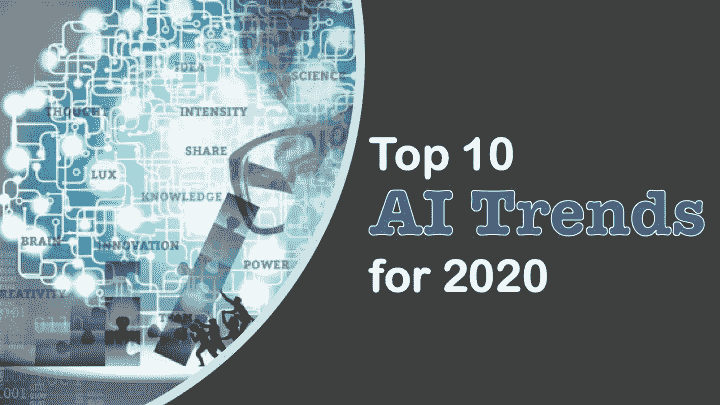

# 2020 年值得关注的 10 大人工智能趋势

> 原文：<https://medium.datadriveninvestor.com/top-10-ai-trends-to-watch-in-2020-bfaf6f600190?source=collection_archive---------15----------------------->

未来一年，人工智能领域会发生什么？在关键的人工智能趋势中，寻找边缘建模、对数据治理的新关注以及持续的人才战争

## 人工智能:每个人都在做。

然而，很少有人做得很好。根据 2019 年麻省理工学院 SMR-波士顿咨询公司人工智能全球高管研究报告，事实上，十分之九的公司已经在人工智能方面进行了一些投资，但 70%的公司表示，迄今为止，他们看到人工智能的影响很小或没有影响。

 [## 今年值得关注的 5 大人工智能趋势|数据驱动的投资者

### 预计 2019 年人工智能将取得广泛的重大进展。从谷歌搜索到处理复杂的工作，如…

www.datadriveninvestor.com](https://www.datadriveninvestor.com/2019/02/19/artificial-intelligence-trends-to-watch-this-year/) 

首席信息官将需要更好地评估人工智能赌注的价值，并证明商业投资回报率。

TetraVX 产品管理总监 Kara Longo Korte 表示，展望 2020 年，首席信息官们将需要更好地评估他们人工智能赌注的价值，并向企业证明这一投资回报率。这也是 Forrester 人工智能预测的标题:“我们相信，2020 年将是公司专注于人工智能价值、跳出实验模式、立足于现实以加速采用的一年，”Forrester 分析师写道。

> 在 [**获取人工智能实用讲解人工智能在线培训**](https://onlineitguru.com/artificial-intelligence-course.html)

# 2020 年人工智能(AI)趋势

在人工智能领域，这看起来是活跃的一年，It 领导者应该遵循一些相关的趋势:

# 1.IT 领导者将真正开始衡量人工智能的影响

这里有一个令人清醒的统计数据:根据麻省理工学院人工智能调查，过去三年里，不到五分之二的公司报告称，人工智能带来了业务增长。鉴于各组织继续在人工智能能力方面进行重大投资，这种情况在新的一年需要改变。

实现这一目标的方法之一是改变我们衡量结果的方式。考虑针对易用性、改进的流程和客户满意度等方面进行报告。软件提供商 Element AI 的首席执行官兼联合创始人让-弗朗索瓦·加涅(Jean-Fran ois gagné)表示:“首席信息官还需要继续将更多预算用于理解人工智能如何让他们的组织受益，并实施能够提供真正投资回报的解决方案，否则就有可能落后于竞争对手。”

# 2.操作化将是游戏的名称

人工智能有潜力成为企业的新操作系统。“在过去的十年里，各种组织一直在学习人工智能知识，并开始使用这项技术，但成功地将模型投入生产仍然是一个挑战，”加涅说。“今年将是支持有效部署所需的基础设施的转折点，提供支持人工智能自适应决策的集成学习环境和数据生态系统。”

# 3.数据治理将变得性感

SPR 企业架构执行副总裁 Pat Ryan 表示，2020 年将是人工智能投入生产的时代。但这需要它与首席数据官的组织合作。Forrester 在其 2020 年人工智能预测报告中表示，问题是“从复杂的应用程序组合中获取数据，并说服各种数据看门人合作。”

Ryan 说，明年，人工智能和人工智能的光彩将会消退，因为公司意识到这不是魔法，而是数学。“组织现在也知道需要高质量的数据作为人工智能/人工智能的基础，所以到 2020 年，我们将会看到对数据治理、数据分析师、数据工程师和机器学习工程师的重视和需求。”

目标是:创建一个能够持续监管的数据管道，以推动更多成功的人工智能项目。这就是为什么“拥有首席数据官(CDO)的公司在他们的洞察计划中使用人工智能、人工智能和/或深度学习的可能性是没有首席数据官的公司的 1.5 倍，”Forrester 说。

# 4.AI pros 会发光

在 LinkedIn 2020 年美国 15 大新兴工作中，排在最前面的是人工智能专家。根据 LinkedIn 的数据，过去四年来，各种头衔的人工智能专业人士(包括人工智能和人工智能工程师)的招聘量每年增长 74%。“人工智能和机器学习都已经成为创新的代名词，我们的数据显示，这不仅仅是嗡嗡声，”LinkedIn 表示，旧金山湾区、纽约、波士顿、西雅图和洛杉矶的市场尤其火爆。

> 在 [**人工智能在线课程**](https://onlineitguru.com/artificial-intelligence-course.html) 获得人工智能实践经验

# 5.数据建模将走向边缘

预计明年将从纯云战略转向云边缘混合战略，以实现机器学习(ML)。 [FogHorn](https://foghorn.io/) 软件工程副总裁 Senthil Kumar 表示:“能够在云端分析高保真、高分辨率的原始机器数据通常成本高昂，而且出于运输和生态系统的考虑，这种分析无法实时进行。迄今为止，许多组织满足于较小的样本量或延时数据，这可能提供不完整或不准确的情况。

Forrester 预测，边缘云服务市场(分布式边缘计算基础设施上的基础设施即服务和高级云原生编程服务)将在 2020 年增长至少 50%。“通过实施边缘优先的解决方案，组织可以在本地合成数据，识别核心原始数据集上的机器学习推理，并提供增强的预测能力，”Kumar 说。“通过实时运行 ML 模型的“简化”版本，组织能够更快地响应实时事件，并能够在源头对感兴趣的事件采取行动、反应和预防措施。”

# 6.人工智能将为 B2B 而来

B2B 销售和服务的复杂性从人工智能中受益更多，而不是消费者的必然结果。Globality 首席收入官 Keith Hausmann 表示:“机器和深度学习使复杂 B2B 服务的用户能够通过直观的需求识别流程和对潜在贸易伙伴优势和能力的广泛了解，定义复杂的需求并将其与理想的贸易伙伴相匹配。“随着人工智能在每次互动中更好地了解个人偏好和公司要求，特别是组织文化和价值观等无形领域，用户体验不断改善。”

# 7.人和机器汇聚在联络中心

TetraVX 的 Korte 表示:“消费者希望通过越来越多的数字渠道获得更快的服务，这给联络中心团队带来了挑战，导致团队领导不得不解决长时间等待、笨拙的客户旅程和不堪重负的代理等问题。”。人工智能可以补充代理，使他们能够跨渠道更好地提供及时或知情的响应。

“正如任何新技术的实施一样，联络中心的人工智能也带来了自己的挑战，”科特说。“重要的是，组织要保持他们的客户服务体验人性化，确保客户的旅程不会从外面看起来‘太自动化了’。”但要小心:独立的对话式人工智能明年可能会受到冲击。

> 获取 AI 在 [**的现场解说 AI 在线培训海得拉巴**](https://onlineitguru.com/artificial-intelligence-course.html)

# 8.自动化可能会超速发展

为你的 2020 年词汇增加一个新词:超自动化，这意味着应用人工智能和人工智能等先进技术来自动化流程，并在一系列工具和更高的复杂程度上增强人类。Gartner 将超自动化列为其 2020 年十大战略技术趋势之一。

Gartner 表示，目标是更加人工智能驱动的决策，许多组织创建了自己的数字双胞胎，这使他们能够“可视化功能，流程和关键绩效指标如何相互作用以驱动价值。”

# 9.异构架构将会出现

今天，支持人工智能的应用和网络依赖于不同的处理器架构。根据 ABI 研究公司的 54 个值得关注的技术趋势，这种情况可能会在 2020 年改变。“下一代人工智能和人工智能框架本质上将是多模态的，可能需要异构计算资源来进行操作，”ABI 研究分析师预测，并指出领先的芯片制造商将摆脱专有软件栈，开始采用开放软件开发工具包(SDK)和应用编程接口(API)方法来开发工具。

# 10.人工智能会犯错误

正如弗雷斯特指出的，人工智能并不完美；它会延续歧视和偏见。这家分析公司预计，这会导致一些高调的公关灾难，可能会伤害一些公司，但最终不会破坏对人工智能的信任。

人工智能可以延续歧视，“深度假货的传播、面部识别的滥用和个性化的过度使用可能会伤害、冒犯或吓跑客户和员工，”弗雷斯特分析师写道。最终，这些失误将服务于一个更大的目的:凸显负责任的人工智能开发和部署的重要性。

> 在 [**获取更多 AI 实时动态 AI 在线培训印度**](https://onlineitguru.com/artificial-intelligence-course.html)