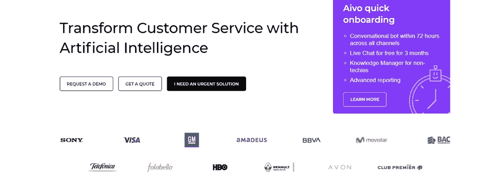

# 十大最佳人工智能聊天机器人

> 原文：<https://medium.datadriveninvestor.com/top-10-best-ai-chatbots-f68705a8f559?source=collection_archive---------1----------------------->

聊天机器人几乎是在线商务的未来。你的项目清单上有一号楼吗？不知道该如何着手？首先要清楚地了解什么是聊天机器人，它是如何工作的，并浏览可用的选项。

聊天机器人开发是一个很好的解决方案，可以让企业在眨眼之间提升水平，并为客户获得大量的价值。聊天机器人确保智能、个性化的参与，其中消息、操作和人工支持可以结合在一次体验中。

 [## 基于人工智能的聊天机器人如何帮助你形成更好的长期习惯

### 当我们思考我们的日常行为时，我们经常没有意识到，我们所做的行为占了多大的比例…

www.datadriveninvestor.com](https://www.datadriveninvestor.com/2020/02/03/how-an-ai-based-chatbot-can-help-you-form-better-long-term-habits/) 

更好的体验—以后会有更多的收入。这里再加上人力资源成本优化的大幅下降，必然隐含着成本优化。

正确设置的交互式聊天机器人可以快速有效地处理基本任务。他们可以:

*   在网站、应用程序或社交媒体平台上顺利执行前线支持任务。
*   如果需要，请将请求升级到您的人工支持团队。
*   传播您的产品或营销信息，以达到更高的指标。
*   识别潜在客户，激发他们对产品的兴趣。

在过去的几年里，帽子机器人已经成为非常老练的谈判者。这些不仅仅是断言。随着我们的移动，这里有一些雄心勃勃的聊天机器人使用统计数据需要记住:

*   聊天机器人可以削减高达 30%的运营成本。
*   到 2021 年，85%的客户交互将在没有人类代理的情况下处理。
*   50%的企业计划在聊天机器人上的支出超过在移动应用上的支出。

这些数据证明聊天机器人的使用正在上升。想知道更多关于聊天机器人开发的信息，并在最好的人工智能聊天机器人中为你的企业挑选一个吗？让我们开始吧！

# 什么是人工智能聊天机器人？

聊天机器人是一款通过音频或文本输入真实模拟现实生活中人类对话的软件。

随着[人工智能在商业](https://www.zfort.com/blog/ai-in-business)中被广泛采用，今天大多数聊天机器人的核心也是人工智能。

人工智能聊天机器人与普通聊天机器人的区别是什么？他们可以通过跟踪数据中的模式来“了解”用户的情况。

然后，这些聊天机器人可以将该模式应用于类似的问题。这种能力赋予它们“智能”来完成任务、解决问题、管理信息，甚至理解人类的意图。

这就是为什么聊天机器人在许多行业都越来越受欢迎，如零售、电子商务、金融、银行、IT，甚至医疗保健。
聊天机器人是如何工作的？

他们怎么知道该回答什么？聊天机器人有几种运作方式。

模式匹配机器人对文本进行分类，并根据它们识别的关键词做出响应。这样的聊天机器人只知道他们模型中存在的问题的答案，无法超越它们。

另一种聊天机器人使用算法。为了回答一个问题，聊天机器人在其数据库中搜索一个独特的模式，其中模式的组合创建了一个层次结构。

最聪明的聊天机器人使用神经网络。他们使用数据中的加权连接和上下文来计算他们的响应。随着时间的推移，神经网络变得越来越强大，越来越先进，帮助机器人创建一组准确的响应。这个逻辑被应用在最好的人工智能聊天机器人中。

人工智能聊天机器人在复杂性方面不断发展。他们开发和简化业务流程的潜力是无限的。

# 10 款最佳人工智能聊天机器人

要构建你的机器人，首先要做的是明确评估你的企业现在缺少什么，你要用你的机器人解决什么问题。除了设置需求，你还需要选择你的机器人在哪个平台上运行(比如脸书、Telegram、What's up、Slack 等等)。)并设置服务器运行你的人工智能聊天机器人。

当然，选择一个符合你需求的机器人构建器是至关重要的。为了减轻任务，让我们仔细看看 10 个最好的人工智能聊天机器人。

# #1 [手机按键](https://mobilemonkey.com/)

Mobile monkey 是印度人工智能聊天机器人平台之一。它有助于建立聊天机器人脸书信使。

## 特点:

*   多人聊天机器人的使用
*   通过客户已经使用的消息应用程序直接与客户沟通
*   为每位客户的聊天对话提供统一的收件箱存储

## 定价:

卓越计划每月 149 美元。还有一个 49 美元/月的计划(没有卓越支持)。

# #2 [Aivo](https://www.aivo.co/en/)

人工智能聊天机器人 Aivo 就是最著名的一个。许多客户认为它是有史以来最佳人工智能聊天机器人的第一名。Aivo 将客户关系提升到另一个层次，并有助于更深入的对话和有限的资源。

## 特点:

*   流程/工作流自动化
*   第三方集成(包括 Salesforce 和 Zendesk)。
*   个性化和视频内容

## 定价:

起价为每月 240 美元，每月 1000 次。额外的会议每 100 次收费 26 美元。

# #3 [Hellotars](https://hellotars.com/)

它是最好的人工智能聊天机器人之一。

## 特点:

*   简单设置
*   各种模板
*   易于使用的拖放聊天工具生成器

## 定价:

专业计划费用 99 美元/月(5 个聊天机器人，100 次聊天/月；

商务:499 美元/月(10 个聊天机器人，5000 次聊天/月)；客户:联系报价(20+聊天机器人，50，000+聊天/月)。

# # 4[it alive](https://itsalive.io/)

在最好的人工智能聊天机器人中，它在创建、发布和管理脸书信使聊天机器人方面远远没有落后。

## 特点:

*   量身定制的开发
*   优化和创新设计
*   对于非技术人员来说易于使用

## 定价:

每月 1，000 条消息—免费。专业计划是每月 99 美元

# #5 [Bold360](https://www.bold360.com/)

Bold360 是最好的人工智能聊天机器人之一，用户友好，易于使用。

## 特点:

*   对话式人工智能，解释复杂的语言并记住对话的上下文
*   真正自然的反应
*   通过聊天机器人购买产品的功能

## 定价:

各种计划需要获取报价联系获取报价

# #6 [Botsify](https://botsify.com/)

这是一个人工智能聊天机器人，帮助在流行的信息网站上组织智能聊天机器人。

## 特点:

*   客户数据存储
*   CTA 媒体块
*   个性化问候页面消息
*   聊天故事树

## 定价:

专业计划每月花费 50 美元。

# #7 [潘多拉机器人](https://home.pandorabots.com/)

如果你只想使用最好的 AI 聊天机器人，Pandorabots 是最古老的交钥匙聊天机器人开发平台之一。

## 特点:

*   它可以在 web、移动设备、家庭集线器和流行的消息平台(如 Twitter、Telegram、Line 和 Slack)上构建和部署。
*   人工智能标记语言引发了复杂的对话

## 定价:

允许每月 1，000 条消息和两个机器人，开发者计划成本为 0.0025 美元/条消息。

# #8 [Respond.io](https://respond.io/)

该平台通常用于跟进入站销售线索和出站需求挖掘活动。

## 特点:

*   全渠道聊天记录。
*   联系人和细分市场经理。
*   标记和自定义字段。
*   实时分析仪表板。

## 定价:

首发:免费(100 个联系人)；专业:29 美元/月，商务:79 美元/月，更高的计划应该指定

# #9 [Imperson](https://imperson.com/)

这个人工智能聊天机器人平台自动化个人电子邮件外联，通话和任务。

## 特点:

*   所有主要消息平台上的文本、音频、视频、AR 和 VR
*   包括实时洞察的高级分析仪表板
*   为每个品牌的真实声音量身定制的自然语言

## 定价:

未说明。

# #10 [蒂迪奥](https://www.tidio.com/)

它是企业与访客实时互动的沟通工具。

## 特点:

*   兼容许多第三方应用
*   一个面板中的电子邮件和信使通信
*   能够在客户开始打字之前跟踪他们如何浏览你的网站并进行互动

## 定价:

所有三个计划(甚至是免费的)都允许三个用户，Communicator 计划(每月花费 15 美元)将允许您花费 10 美元添加额外的用户。

# 你如何能制造一个人工智能聊天机器人？

这些平台提供了许多模板、工具、对话流构建器等。然而，使用这些平台提供的聊天机器人开发工具，上下文对话仍然是一个挑战。你只能用一些简单的逻辑来创建聊天机器人。

即使是最好的人工智能聊天机器人平台也经常需要大量的时间和精力来构建一个聊天机器人。尽管如此，也不能保证它会有好的表现。显然，这种现成的聊天机器人解决方案缺乏定制和灵活性。

而构建一个定制的聊天机器人是提高业务效率的一种行之有效的方法。一家人工智能开发公司将作为你的聊天机器人开发伙伴，在项目的每个阶段提供技术支持。

您的专门开发团队将为您的机器人提供丰富的用户体验，并帮助您找到适合您业务需求的解决方案。

*最初发表于*[T5【https://www.zfort.com】](https://www.zfort.com/blog/top-10-best-ai-chatbots)*。*