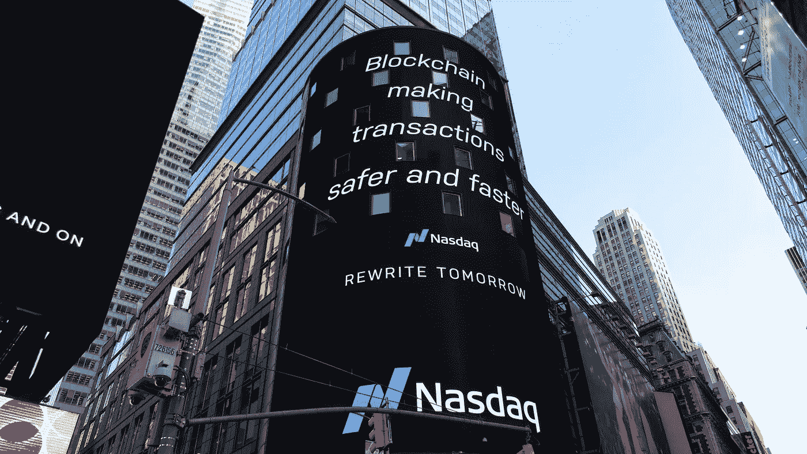

# 2021 年要学习的十大区块链课程

> 原文：<https://medium.datadriveninvestor.com/top-10-blockchain-courses-to-learn-in-2021-f16f4f35a8e2?source=collection_archive---------1----------------------->

## 区块链技术越来越受欢迎，为什么不参加这些课程之一，提升自己！

Photo by [Pascal Bernardon](https://unsplash.com/@pbernardon?utm_source=unsplash&utm_medium=referral&utm_content=creditCopyText) on [Unsplash](https://unsplash.com/?utm_source=unsplash&utm_medium=referral&utm_content=creditCopyText)

区块链，旗舰加密货币比特币背后的技术现在已经 10 岁了。这项技术日益普及。区块链最初是为了记录比特币等数字货币而创建的，多年来已经发展成为一个分散的企业系统。

由于区块链等革命性技术的出现，当今世界已经成功超越了金融领域。如今，广告、制造、公用事业、医疗保健，包括其他政府和商业部门，都在利用基于区块链的应用来处理他们的交易和流程。

在这篇文章中，我将分享从 Udemy，Coursera 和 Pluralsight 以及其他网站学习区块链编程的最佳区块链认证和在线课程。

 [## 区块链和加密货币，2021 年期待什么

### 在比特币重返地球之前，它会升到多高？

medium.com](https://medium.com/datadriveninvestor/blockchain-and-cryptocurrencies-what-to-expect-in-2021-346a529bdefb) 

在此之前，让我们快速了解一下什么是区块链以及它为什么受欢迎，以及为什么你应该在 2021 年学习区块链。

## 区块链技术简化

简而言之，区块链是一系列带有时间戳的不可变数据记录，由不属于任何单一实体的计算机集群管理。

这些数据块(即块)中的每一个都是安全的，并使用密码原理(即链)相互绑定。许多在线评论首先解释说，区块链类似于谷歌文档电子表格，由于锁定机制，多个作者可以贡献内容。

然而，区块链比这个例子稍微复杂一些，并且具有独特的特征，使得它成为标记、存储和跟踪任何有价值的东西的有吸引力的技术。

分布式账本技术(DLT)是旗舰加密货币比特币和当今流通的许多其他各种替代加密货币(替代货币)背后的技术，每天都在继续革新市场，每天都有新的应用程序推出。

简单地说，分布式分类账技术系统是一种分散式系统，用于记录交易，并具有处理、验证和授权交易的机制，然后将这些交易记录在不可变的分类账中。

区块链是分布式账本技术的一种实现方式。它也被称为“价值互联网”，意思是从一个实体到另一个实体存储和交易价值(从货币、股票、合同甚至选票等任何东西)的安全方式。它也是比特币和以太坊等加密货币的底层技术。

 [## 农业区块链

### 区块链如何改革从农场到餐桌的食物供应

medium.com](https://medium.com/swlh/blockchain-for-agriculture-5b0a0baa0aa3) 

区块链由块组成，每个块包含数据(任何有价值的东西)、其散列值(包含通过复杂计算算法生成的字符和数字的唯一加密值)以及指向前一个块的散列的指针。

## 区块链的目的是什么？

什么是区块链来着？

它是加密货币网络中每个人存储网络当前状态的一种方式。加密货币旨在成为人们交换和储存货币的一种方式，而无需依赖中央银行系统。

然而，如果没有中央银行，就需要某种方法来跟踪每个人账户中的金额和发生的交易。如果没有这种方式，就不可能用加密货币购买任何东西，因为卖家不会相信买家有钱，而且他们也没有办法把钱寄给卖家。

加密货币中的区块链旨在成为一个分散的分类账，记录加密货币历史上发生的每一笔交易。这取代了银行的集中分类账，该分类账记录您帐户中的金额，并在您通过存款和取款/购物将资金转入和转出帐户时更新该信息。

对于被卖方认可为有效的交易，它必须被发布到区块链。因此，必须将交易快速添加到区块链中，以避免购买过程中的大量延迟。

有了区块链技术，人们不必像传统银行系统那样等待*1-3 天*来处理和反映他们的付款。区块链旨在快速、定期地更新其分类账，以包含最新的交易。

作为一种安全措施，加密货币的设计方式是，区块链以分散的方式存储，并受到保护，这样任何人都不能在交易添加到区块链后修改交易。

由于区块链使用的安全措施对单笔交易或一千笔交易同样有效，加密货币将交易分组为定期创建的包含许多交易的块。这在加密货币对速度、效率和安全性的需求之间提供了合理的权衡。

你想更多地了解区块链吗？

你想获得区块链的技能和知识吗？

 [## 我在高通胀国家学到的 10 件事

### 当你的国家通货膨胀率达到 60%时，如何生存！

medium.com](https://medium.com/swlh/10-things-i-learnt-while-living-in-a-hyper-inflationary-country-1a4d5a8c3219) 

幸运的是，有几门区块链课程与这个主题相关。这篇文章包括最受欢迎的细节，高度评价区块链培训计划的理想个人期待在这一领域追求职业生涯。

# 2021 年 10 个最佳区块链课程

1.  [**区块链基础知识&比特币基础课程**](https://www.udemy.com/course/blockchain-and-bitcoin-fundamentals/?ranMID=39197&ranEAID=jU79Zysihs4&ranSiteID=jU79Zysihs4-JYjglFlFLicas_js9Qg6PQ&utm_source=aff-campaign&LSNPUBID=jU79Zysihs4&utm_medium=udemyads)

 [## 区块链基础和比特币基础课程

### 我的使命是帮助人们和组织学习如何使用和应用区块链技术，使世界成为一个…

www.udemy.com](https://www.udemy.com/course/blockchain-and-bitcoin-fundamentals/?ranMID=39197&ranEAID=jU79Zysihs4&ranSiteID=jU79Zysihs4-JYjglFlFLicas_js9Qg6PQ&utm_source=aff-campaign&LSNPUBID=jU79Zysihs4&utm_medium=udemyads) 

Udemy 的另一个畅销课程是由屡获殊荣的讲师 George Levy 编写的区块链和比特币基础认证课程，该课程让学生能够熟练掌握比特币和区块链的不同元素。

本教程将向您详细介绍数字代币、区块链、智能合约、比特币、加密货币和网络方面的知识。此外，您还将了解比特币挖矿，以及围绕比特币和区块链的误解。

注册参加该计划后，您将了解以下主要方面:

*   区块链基础知识
*   比特币
*   加密货币
*   数字代币
*   比特币和区块链的关系
*   区块链的未来及更多

除上述内容外，您还可以对区块链技术有一个扎实的了解。该课程附带测验、可下载资源、文章和点播视频。作为免费奖励，你还将获得由 100 多个与比特币和区块链相关的基本术语组成的词汇表。还有一个循序渐进的信息图指南，将为未来与概念相关的可能性进行培训。

**先决条件:**不需要之前的区块链技术知识。

**等级:**初学者

**评级:** 4.5

**费用:**约 80 美元

**持续时间:** 3 小时(大约)

你可以在这里注册。

**2。** [**区块链基础**](https://www.pluralsight.com/courses/blockchain-fundamentals)

 [## 区块链基础知识

### 初学者 2018 年 11 月 27 日 2h 19m 描述大家好，欢迎来到 Pluralsight！我叫简-埃里克·桑德伯格，我想…

www.pluralsight.com](https://www.pluralsight.com/courses/blockchain-fundamentals) 

该培训计划可在 Pluralsight 上获得，将帮助您更深入地挖掘区块链的基础知识。通过这个课程，Jan-Erik(作者)试图解释区块链和比特币之间的关系。此外，学生还可以了解如何建立一个私人区块链网络。

以下是本课程中阐述的核心主题:

*   区块链基础知识
*   DAPPS 和以太坊简介
*   安装和配置
*   智能合同开发等

它还使学生能够获得利用区块链技术创建值得信赖的安全应用程序的专业知识。这门课程结构严谨，有助于学习者快速掌握概念。本培训课程精心设计，旨在帮助学员提高工作效率，并学习区块链技术的端到端实际应用。

先决条件:不需要区块链技术方面的经验。但是，对计算机科学、IT 和信息安全的基本理解使学习过程变得更加容易。

**等级:**初学者

**评分:** 4.0

**费用:**大约每月 19 美元

**持续时间:** 2 小时 20 分钟(大约)

你可以在这里注册。

3. [**区块链基础专业证书**](https://www.edx.org/professional-certificate/uc-berkeleyx-blockchain-fundamentals)

[https://www . EDX . org/professional-certificate/UC-berkeleyx-区块链-基本面](https://www.edx.org/professional-certificate/uc-berkeleyx-blockchain-fundamentals)

从探索生态系统到关于区块链的核心思想和技术，该认证将帮助您了解该主题的非技术和技术方面。它将让你深入了解区块链系统和分布式账本技术。此外，你还将了解区块链技术运作的机制，这将有助于你制定不同的假设和知情的模型。

该计划涵盖的主要主题:

*   比特币
*   加密货币
*   区块链技术
*   区块链架构
*   分散应用
*   比特币替代品

这些主题是以互动方式阐述的。此外，本课程中还有一些实践练习，可以让学习者提升自己在该领域的潜力和知识。通过本课程，您还将了解加密货币的法规、未来范围以及在区块链领域的影响。

**先决条件:**报名这个项目不需要有任何技术背景。

**等级:**初级-高级

**评级:** 4.6

**费用:**大约 178 美元。

持续时间:3 个月(大约)

你可以在这里注册。

4. [**区块链:基础与用例**](https://www.coursera.org/learn/blockchain-foundations-and-use-cases?ranMID=40328&ranEAID=jU79Zysihs4&ranSiteID=jU79Zysihs4-OmZcKBY8QruX8koN2Ywnbw&siteID=jU79Zysihs4-OmZcKBY8QruX8koN2Ywnbw&utm_content=10&utm_medium=partners&utm_source=linkshare&utm_campaign=jU79Zysihs4)

 [## 区块链:基础和用例

### 由康赛斯学院提供。本课程是对区块链的权威介绍，面向开发者和…

www.coursera.org](https://www.coursera.org/learn/blockchain-foundations-and-use-cases?ranMID=40328&ranEAID=jU79Zysihs4&ranSiteID=jU79Zysihs4-OmZcKBY8QruX8koN2Ywnbw&siteID=jU79Zysihs4-OmZcKBY8QruX8koN2Ywnbw&utm_content=10&utm_medium=partners&utm_source=linkshare&utm_campaign=jU79Zysihs4) 

这个 Coursera 项目非常适合非开发人员和希望彻底了解区块链基础知识的开发人员。该计划不仅限于技术教学。它还将介绍去中心化的哲学概念及其与区块链的联系。

该计划的初始模块向学生介绍了区块链的基本原理及其使用的技术。模块四深入探讨以太坊和比特币，同时向学员介绍下一代区块链的重要性。

该学习计划包含几个重要主题，例如:

*   区块链基础
*   哈希函数和密码学
*   区块链和区块
*   公钥签名和加密
*   链、网络和节点
*   共识和信任框架
*   加密货币代币，
*   智能合约，
*   资产跟踪、供应链等

最好的部分是，借助真实的例子来解释这些概念。这意味着你会很好地了解与区块链相关的商业问题。本课程独特地展示了公司工作空间的幕后，使学生对各种商业垂直领域有了很好的理解。

**前提:**课程假设学习者对区块链技术零知识。

**等级:**初学者

**评级:** 4.7

**费用:**免费报名

**持续时间:** 16 小时(大约)

你可以在这里注册。

5. [**区块链基础知识:以太坊、比特币、&更多**](https://www.udemy.com/course/the-basics-of-blockchain/?ranMID=39197&ranEAID=jU79Zysihs4&ranSiteID=jU79Zysihs4-L0uy5reeI5lAS_0m2WroxA&LSNPUBID=jU79Zysihs4&utm_source=aff-campaign&utm_medium=udemyads)

 [## 区块链的基础:以太坊、比特币等等

### Tom Serres 是一位经验丰富的企业家、演说家和技术主管。他是动物风险投资公司的创始人之一。

www.udemy.com](https://www.udemy.com/course/the-basics-of-blockchain/?ranMID=39197&ranEAID=jU79Zysihs4&ranSiteID=jU79Zysihs4-L0uy5reeI5lAS_0m2WroxA&LSNPUBID=jU79Zysihs4&utm_source=aff-campaign&utm_medium=udemyads) 

由 Bill 博士、Tom Serres 和 Bettina Warburg 编写，这是 Udemy 上另一个最受欢迎的培训课程。通过这门课程，你将了解区块链的技术、商业和经济是如何联系在一起的。这是一个组织良好的课程，将带你深入了解区块链和相关主题的基础。

在该计划中，讲师特别关注:

*   区块链简介
*   区块链特质
*   智能合同
*   比特币和以太坊的区别
*   与经济、技术和商业相关的区块链原则
*   技术进步—详细概述

此外，该课程还详细概述了区块链影响不同行业和业务的方式。借助商业世界的例子来解释这些概念。该计划附带专业制作的点播视频、讲座和其他可下载资源，使学生更容易理解复杂的主题。

**前提:**学习者要清楚互联网的基础知识。

**等级:**初级-高级

**评级:** 4.1

**费用:**约 46 美元。(终身访问)

**持续时间:** 3.5 小时(大约)

你可以在这里注册。

6. [**区块链 A-Z:了解如何构建自己的第一条区块链**](https://www.udemy.com/course/build-your-blockchain-az/?ranMID=39197&ranEAID=jU79Zysihs4&ranSiteID=jU79Zysihs4-G4hDG5Uxf_9CapqYN8Ngrw&LSNPUBID=jU79Zysihs4&utm_source=aff-campaign&utm_medium=udemyads)

 [## 区块链 A-Z:了解如何构建您的第一个区块链

### 学习关键的区块链概念、直觉和实践培训，让你快速掌握所有加密技术…

www.udemy.com](https://www.udemy.com/course/build-your-blockchain-az/?ranMID=39197&ranEAID=jU79Zysihs4&ranSiteID=jU79Zysihs4-G4hDG5Uxf_9CapqYN8Ngrw&LSNPUBID=jU79Zysihs4&utm_source=aff-campaign&utm_medium=udemyads) 

你想成为一名王牌区块链程序员吗？如果是，现在就报名参加这个培训计划。从区块链的理论知识到创建智能合约或加密货币，本课程涵盖了从基础到高级的所有主题。此外，您将学习使用区块链技术创建高级应用程序，以及利用当前解决方案的方法。

该计划涵盖的主要主题:

*   区块链反应
*   加密货币交易
*   智能合同创建

本教程最适合学习建立直觉的技巧和技术，同时获得使用区块链和加密加速事情的实践经验。如果你主要关心的是获得实践技能，那么这个 Udemy 学习计划是达到这个目的的最佳选择之一。

导师基里尔·叶列缅科、海林·德·庞特维斯和 SuperDataScience 团队在编码的每一步和货币创造过程中指导学员。对于新手、密码、区块链和比特币爱好者来说，这是一门非常棒的课程。

**先决条件:**要求精通 Python 和基础数学。

**等级:**初学者

**评分:** 4.5

**费用:**约 169 美元。(终身访问)

**持续时间:** 14.5 小时(大约)

你可以在这里注册。

7. [**区块链**](https://www.coursera.org/specializations/blockchain?ranMID=40328&ranEAID=jU79Zysihs4&ranSiteID=jU79Zysihs4-_Ol.0RN_LIxLATmaNpzE7g&siteID=jU79Zysihs4-_Ol.0RN_LIxLATmaNpzE7g&utm_content=10&utm_medium=partners&utm_source=linkshare&utm_campaign=jU79Zysihs4) 专业化

 [## 区块链

### 由布法罗大学提供。这一专业化引进了区块链，一项革命性的技术，使…

www.coursera.org](https://www.coursera.org/specializations/blockchain?ranMID=40328&ranEAID=jU79Zysihs4&ranSiteID=jU79Zysihs4-_Ol.0RN_LIxLATmaNpzE7g&siteID=jU79Zysihs4-_Ol.0RN_LIxLATmaNpzE7g&utm_content=10&utm_medium=partners&utm_source=linkshare&utm_campaign=jU79Zysihs4) 

这种专业化最好的一点是，它几乎涵盖了成为该学科专家所需的每一个重要的区块链概念。该课程内容丰富，结构良好，非常适合希望学习设计、部署、编码和执行智能合同的程序员。

你可以很容易地建立一个强大的基础，混音 IDE，和 Solidity。作者通过本课程提供了这两个主题的详细概述。你将有大量的实践练习和作业来测试你在学习过程中获得的能力。

该计划的亮点:

*   区块链基础知识
*   智能合同
*   可靠性、密码学、比特币和以太坊
*   混合 IDE
*   元掩码客户端
*   块菌 IDE
*   分散应用

你将受益于 Dapp 设计和行为的清晰说明，以及块菌命令和开发过程。该计划还详细概述了区块链生态系统，涵盖了各种挑战和更广阔前景的区块链平台。此外，您还将深入了解其他去中心化模型，如 Hashgraph 和 IPFS。

**先决条件:**编程语言之一的先验知识是必须的。另外，在注册这门课程之前，学习者应该对面向对象设计、命令行界面、 [HTML](https://hackr.io/tutorials/learn-html-5?ref=blog-post) 、 [javascript](https://hackr.io/tutorials/learn-javascript?ref=blog-post) 和 web 应用程序有一个基本的了解。

**等级:**中级

**评分:** 4.6

**费用:**免费报名

**持续时间:** 4 个月(大约)

你可以在这里注册。

8. [**Python —实用指南**](https://www.udemy.com/course/learn-python-by-building-a-blockchain-cryptocurrency/?ranMID=39197&ranEAID=jU79Zysihs4&ranSiteID=jU79Zysihs4-AC7BTGZQv7e0lOYj597r_g&LSNPUBID=jU79Zysihs4&utm_source=aff-campaign&utm_medium=udemyads)

 [## Python -实用指南

### 这是一门非常注重实践的 Python 课程，从头开始教你 Python——之前没有编程经验…

www.udemy.com](https://www.udemy.com/course/learn-python-by-building-a-blockchain-cryptocurrency/?ranMID=39197&ranEAID=jU79Zysihs4&ranSiteID=jU79Zysihs4-AC7BTGZQv7e0lOYj597r_g&LSNPUBID=jU79Zysihs4&utm_source=aff-campaign&utm_medium=udemyads) 

以 Python 和区块链的结合为特色，通过这个实践课程，你将深入探究与这两个主题相关的概念。您将了解使用 Python 构建加密货币和区块链的成熟方法。专业化包括一系列课程，涵盖从基础开始的每个主题。此外，你还将受益于现实世界的作业，以丰富你的投资组合。

该计划涵盖以下概念:

*   区块链简介
*   Python 简介
*   数据类型和 REPL
*   变量、字符串和列表
*   循环和条件句
*   复杂的数据结构
*   [哎呀](https://hackr.io/blog/oops-concepts-in-java-with-examples)
*   处理错误和 HTTP 请求
*   调试等等。

该课程将巩固你在专题方面的基础知识，使你有足够的能力处理相关的复杂问题。此外，您将获得执行所有配置和设置的指导。注册后获得最佳实践作业、讲座、文章和大量可下载的资源。

**先决条件:**本教程是在假设学习者不懂编程语言的情况下设计的。

**等级:**初学者

**评分:** 4.6

费用:大约 152 美元。(终生访问)

持续时间: 17.5 小时(大约)

你可以在这里注册。

9. [**代码与以太坊&坚固性:完整开发者指南**](https://www.udemy.com/course/ethereum-and-solidity-the-complete-developers-guide/?ranMID=39197&ranEAID=jU79Zysihs4&ranSiteID=jU79Zysihs4-73dEFWBmBcfgiIVb_Mkc1g&LSNPUBID=jU79Zysihs4&utm_source=aff-campaign&utm_medium=udemyads)

 [## 以太坊和坚固性代码:完整的开发人员指南

### 智能合约？他们来了。以太坊区块链？已覆盖。坚固性？没错。不可能理解它…

www.udemy.com](https://www.udemy.com/course/ethereum-and-solidity-the-complete-developers-guide/?ranMID=39197&ranEAID=jU79Zysihs4&ranSiteID=jU79Zysihs4-73dEFWBmBcfgiIVb_Mkc1g&LSNPUBID=jU79Zysihs4&utm_source=aff-campaign&utm_medium=udemyads) 

Stephen Grider 介绍了这个培训项目，以使程序员在创建高级应用程序方面足够熟练。学生将学习后端和前端编程，同时更好地理解智能合同。最初的主题将向您介绍元掩码、语义 UI 和 React。

虽然这是一个令人惊叹的课程，但你可以更深入地挖掘以太坊，同时了解用以太坊和区块链构建专业级应用程序的最佳技术。你将学会处理不同商业问题的行之有效的方法。这是最畅销的 Udemy 课程之一，提供了详细的解释和大量与以下内容相关的实际问题:

*   以太坊
*   可靠的智能合同
*   封锁时间
*   数组、映射和结构
*   以太坊应用架构
*   活动合同设计
*   以太坊项目基础设施
*   高级多页前端及更多

想要提高区块链应用程序开发技能的专业人士应该参加这个课程。他们将通过讲座、文章和点播视频了解这项新技术的先进概念。

**前提:**学习者要清楚 NPM 和 Javascript 的基础知识。另外，还需要一台个人电脑或 Linux/Mac 电脑。

**等级:**中级-高级

**评级:** 4.5

**费用:** $80 左右。(终身访问)

**持续时间:** 24 小时(大约)

你可以在这里注册。

10. [**成为一名以太坊、扎实的区块链开发者**](https://www.udemy.com/course/getting-started-with-ethereum-solidity-development/?ranMID=39197&ranEAID=jU79Zysihs4&ranSiteID=jU79Zysihs4-kAsewIpHp4ZGRSM4PPHb1Q&utm_source=aff-campaign&LSNPUBID=jU79Zysihs4&utm_medium=udemyads)

 [## 成为一个以太坊，扎实的区块链开发者

### 我们在 2017 年 9 月发布了这个课程的第一个版本。当时，松露的最新版本是第 3 版…

www.udemy.com](https://www.udemy.com/course/getting-started-with-ethereum-solidity-development/?ranMID=39197&ranEAID=jU79Zysihs4&ranSiteID=jU79Zysihs4-kAsewIpHp4ZGRSM4PPHb1Q&utm_source=aff-campaign&LSNPUBID=jU79Zysihs4&utm_medium=udemyads) 

如果你想学习如何用以太坊和 Solidity 创建智能合约，那么这个课程就是为你准备的。该计划通过全面和结构良好的课程材料，帮助学生在区块链和相关概念方面建立坚实的基础，然后通过真实世界的例子提高他们在该学科中的实践技能和知识。

下面列出了该培训计划的主要组成部分:

*   区块链概述
*   区块链实施
*   三层模型
*   不对称密码术
*   Linux 环境设置
*   智能合同部署
*   链表分散应用等等

您还将了解分散式应用程序开发以及不同以太坊实例的部署，包括 main net、private chain、testrpc、test chain 等。此外，本课程还将帮助您学习使用不同工具在多个平台上开发、测试和发布应用程序的正确技术。

**必备条件:**学习者应具备软件开发的基本知识和经验。

**等级:**中级-高级

**评分:** 4.4

**费用:**大约每月 165 美元。

**持续时间:** 17 小时(大约)

你可以在这里注册。

上面列出的区块链课程旨在使学习者在处理区块链技术的不同垂直领域时足够高效。你将变得足够熟练，能够与企业高管打交道，并为他们的特定需求提供有效的解决方案。此外，这些培训计划将帮助您获得成为区块链专家所需的正确技能。

# 如果你喜欢这篇文章，加入我的[私人邮件列表](https://mailchi.mp/28841fdac390/tendai-tomu)来获得我新书的免费电子书样本[区块链农业的兴起](https://www.amazon.com/dp/B08KHC3WCF)。