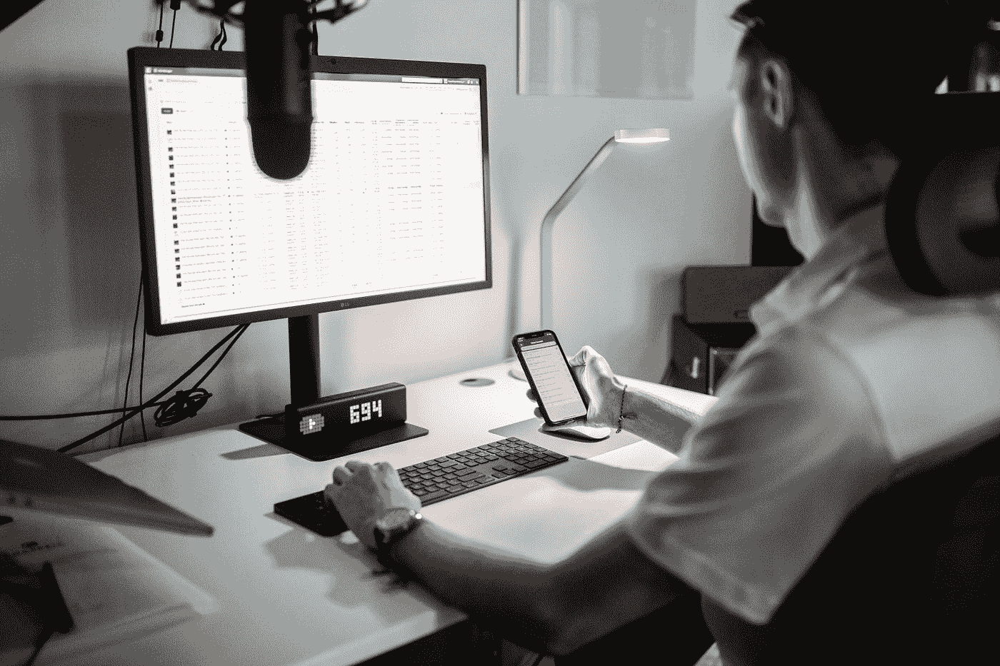

# 2021 年 Youtube 广告收入前 10 名

> 原文：<https://medium.datadriveninvestor.com/top-10-lucrative-youtube-niches-for-ad-revenue-in-2021-7e9ac80b6c54?source=collection_archive---------1----------------------->

## 选择合适的平台，最大化您的平台收入。

Photo by [Chase Chappell](https://unsplash.com/@chappelldigitalmarketing?utm_source=medium&utm_medium=referral) on [Unsplash](https://unsplash.com?utm_source=medium&utm_medium=referral)

在过去的几年里，Youtube 一直是广告客户的一个增长平台，并且在未来只会继续增长。

事实上，Youtube 的净广告收入预计今年将增长到 52.1 亿美元，并在 2022 年达到 60 亿美元！仅在美国， [90%](https://www.oberlo.co.uk/blog/youtube-statistics#:~:text=All%20signs%20are%20pointing%20to,to%206.06%20billion%20in%202022.) 的 18 至 44 岁的成年人都会使用该平台。

这是一个很大的馅饼，抓住其中的一小部分对你有好处。如果你有一个品牌、产品或服务要推广，Youtube 可以成为创收的金矿。

在个人理财网站优步 Nate O'Brian 最近的一个[视频](https://www.youtube.com/watch?v=yKYXDz1d5U0)中，Nate 正在分解他 2021 年收入达到 100 万美元的财务目标。Youtube 广告收入是这一目标的最大一块。

对于 Youtube 来说，你所处的利基市场是决定你收入潜力的关键。

这是为什么呢？因为 Youtube 的收入是基于 CPM(每千次展示的成本)，这是一个营销指标，代表顾问在 Youtube 上展示他们的广告所花的钱。

诀窍在于，广告客户会希望将广告预算的更大份额分配给某些类型的内容，在这些内容中展示他们的广告是有意义的。

所以，如果你的频道都是关于极简主义的，而你在宣传你的余生不买任何东西的理念，那么你很可能不会吸引广告商在你的视频中投放广告。你的广告收入将接近于零。

然而，如果你选择了与你所关心和熟悉的领域相一致的利基市场，那些可以吸引大量广告支出的市场，你就处于一个更好的位置。

例如，一个受欢迎的个人金融频道可能会吸引大量预算，因为该行业的广告商(如银行和信用卡提供商)有大量的广告预算可供分配。

这也是一个竞争的利基，这意味着广告商必须出价并支付最高的价格才能在最受欢迎的频道上显示他们的广告。

让我们深入到你能在 Youtube 上获得最高收入潜力的顶级利基市场。

下面是一些你可能想考虑的高 CPM 的利基市场，以及在这些领域表现良好的频道的例子。

这些利基市场也很有竞争力，这意味着虽然你需要一个强大的品牌和内容来脱颖而出，但每个视频的平均广告支出也会更高。

*   **联盟营销** : [ODi 制作](https://www.youtube.com/channel/UCnaA5TqsiuTki7a-6kW3WAQ)
*   **电子商务和直运** : [批发 Ted](https://www.youtube.com/channel/UCC8wczy7734jKPhiR2UkS9A)
*   **房地产** : [凯文·帕夫拉特](https://www.youtube.com/user/KevinPaffrath)
*   **个人理财** : [内特·奥布莱恩](https://www.youtube.com/channel/UCO3tlaeZ6Z0ZN5frMZI3-uQ)
*   **交易和投资** : [安德烈·吉克](https://www.youtube.com/c/AndreiJikh)
*   **游戏** : [Vanoss 游戏](https://www.youtube.com/user/VanossGaming)
*   **内容创作** : [凯瑟琳·曼宁](https://www.youtube.com/c/CathrinManning/videos)
*   **产品评论** : [瑞恩的世界](https://www.youtube.com/channel/UChGJGhZ9SOOHvBB0Y4DOO_w)
*   **时尚与美丽** : [Jeffree Star](https://www.youtube.com/user/jeffreestar)
*   **食物和烹饪** : [美味](https://www.youtube.com/channel/UCJFp8uSYCjXOMnkUyb3CQ3Q)

CPM 因利基而异。

对于[的例子](https://smbillion.com/youtube-niches-with-the-highest-cpm/)，附属利基往往有 12-22 美元之间的 CPM。电子商务和直运，7-14 美元，而交易和投资平均在 8-18 美元之间。个人理财略低于 4-12 美元。

广告商愿意在你的视频中投放广告的成本将取决于你的渠道指标。选择最佳利基只是难题的一部分。

从以上渠道可以看出，有针对性的、高质量的内容才是平台制胜的法宝。向观众传递价值的更高的内容质量会带来更多的流量，这意味着广告商可以吸引更多的眼球来推广他们的品牌。

然而，从 Youtube 上创收并不意味着仅仅依靠广告收入。

您可以通过其他方式实现渠道盈利，例如:

*   **根据你的品牌，在你的视频和描述中使用附属链接**。
*   **通过您的内容推广您自己的(数字或实体)产品**。

CPM 价格往往会波动。2016 年的“ [*”广告启示*](https://youtube.fandom.com/wiki/YouTube_Adpocalypse) ”就是一个很好的例子:随着 Youtube 广告战略的改变，广告商突然退出该平台，收入直线下降。

结果，一家优步的月收入从 275，000 美元下降到不到 2，000 美元。这是一个相当大的跌幅——尽管每月有 2 亿的浏览量。

当时，Youtube 决定优先考虑适合家庭的内容，而不是其他类型的内容。这不再符合广告商的提议，所以他们把广告费花在了其他地方。

使你的 Youtube 频道的收入来源多样化，以保护你自己免受上述影响，是有意义的。

这就像古老的投资建议，不要把所有的鸡蛋放在一个篮子里。