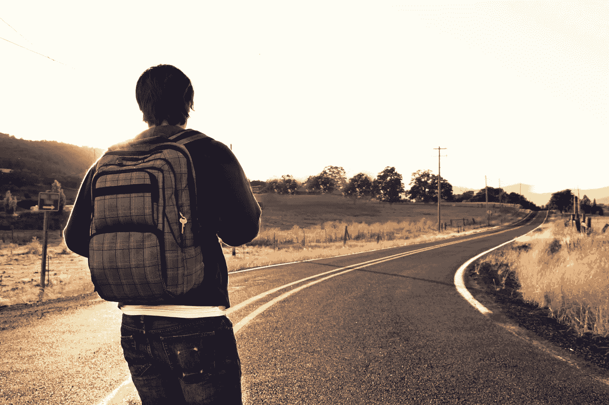

# 数字游民的十大必备小工具

> 原文：<https://medium.datadriveninvestor.com/top-10-must-have-gadgets-for-digital-nomads-b4db13429db6?source=collection_archive---------0----------------------->

数字流浪者是一个在世界各地旅行时远程工作的人。这不仅仅是一种职业。这是一种生活方式，其前提是成为世界公民，并准备好将所有财产装进舒适的背包，前往一个新的令人兴奋的目的地。

游牧生活方式不接受人们通常在旅行中与工作相关的任何不适。作为一名数字游牧者，你应该做好准备，无论身在何处，都能高效工作。以下 **10 款数字游牧民的必备小工具**将让你完美应对。

 [## 使用谷歌搜索趋势预测首次申请失业救济人数|数据驱动的投资者

### 几年来，我的重点一直是使用多种替代数据来预测宏观经济统计数据…

www.datadriveninvestor.com](https://www.datadriveninvestor.com/2020/03/25/using-google-search-trends-to-predict-initial-jobless-claims/) 

# 1.强大的轻型笔记本电脑

组织数字工作场所所需的核心工具是笔记本电脑。不用说，它应该是强大的，易于带到附近的咖啡馆或海滩，并为您的旅行行李增加一点重量。

虽然我们现在更喜欢带着平板电脑和智能手机旅行，以便在旅途中处理多项任务，但如果你打算过上数字游牧生活，并作为远程员工谋生，这些还不够。因此，笔记本电脑是必须的投资。

# 2.便携式互联网设备

可靠安全的互联网连接是数字游民的主要烦恼。连接问题威胁着重要的截止日期和在线会议，而公共 WiFi 的使用对专业人员可能有权访问的重要企业数据构成了安全隐患。

因此，数字流浪者的另一个必备工具是便携式调制解调器或 WiFi 热点。一些解决方案，如新推出的 [nect 调制解调器](https://nectmodem.com/)，不仅可以在世界任何地方实现完美的连接，还能确保接近国内的价格和 VPN 服务。

# 3.外置硬盘

数据非常珍贵，提前保管好数据非常重要。一些数字游牧民在没有任何外部硬盘的情况下工作。不过，将文件备份到在线磁盘空间也是有益的，以防硬盘损坏或丢失。iCloud、Google Drive、Google Photos 都是很好的解决方案。

# 4.充电宝

对于那些需要在长途旅行中或在电力供应可能中断的地区保持连接的人来说，电源银行是真正的救命稻草。这就是为什么它是游牧者背包中另一个不可或缺的小玩意。

便携式充电器在功率、尺寸和重量方面差异很大。数字游牧者更喜欢那些不会增加太多重量但足以为笔记本电脑和相机充电以备不时之需的型号。

# 5.世界旅行电源适配器

电源银行是“以防万一”的解决方案，因为大多数时候你会给你的设备充电。不过，这也可能存在一些问题:你可能会惊讶地发现，不同国家的插座数量可能会有所不同。谢天谢地，一个为世界旅行设计的电源适配器会让你万无一失。

# 6.降噪耳机

由于不可避免的噪音干扰，在家里、咖啡馆或公共场所工作可能很有挑战性。即使在你最喜欢的安静的工作中心，也可能有人在网上开会，你不愿意参加。因此，降噪耳机绝对是每个自由职业者都应该拥有的好东西。

# 7.可调笔记本电脑支架

每天在电脑前工作对你的身体健康有很大的损害。不幸的是，合适的桌子或矫形椅通常不是数字游民的选择，这让事情变得更糟。谢天谢地，有另一个小工具可能会有所帮助。

可调节的笔记本电脑支架可以帮助您在酒店房间或吊床中找到最佳位置。在选择具体型号时，重量也是要考虑的主要因素。

# 8.驱动器和电缆管理器

手边有这么多小工具，你可能会被电缆埋住，把你的工作空间弄得一团糟。电子管理器将帮助您携带和舒适地放置便携式调制解调器和充电器、外部驱动器、电缆和 USB 记忆棒。

# 9.旅行背包

高效打包是每个经常旅行的人迟早都会掌握的最高技能之一。这就是为什么旅行背包是数字游牧民最需要购买的必需品之一。

找一个，考虑一下机场对[行李箱尺寸和重量](https://www.skyscanner.com/tips-and-inspiration/airline-baggage-sizes-fees-carry-checked-luggage)的要求，材料的防盗功能和防水质量。多个隔间和背包组织者也将是一个巨大的优势。更不用说嵌入的太阳能电池把你的背包变成另一个便携式充电器使用。

# 10.净水设备

在许多国家，自来水是完全可以饮用的。在其他情况下，它会导致严重的健康问题。因此，有经验的世界旅行者的另一个诀窍是拥有一个便携式水净化系统。只需一个小小的装置，无论生活带你到哪里，你都可以保证喝到优质的水。

# 最后的想法

想想那些让数字游牧生活方式变得更加舒适的伟大设备，这是一件令人兴奋的事情。如果你已经开始了这一旅程，考虑收集所有 10 大必备小工具。如果没有，让我们的列表激励你克服恐惧，并尝试一下。