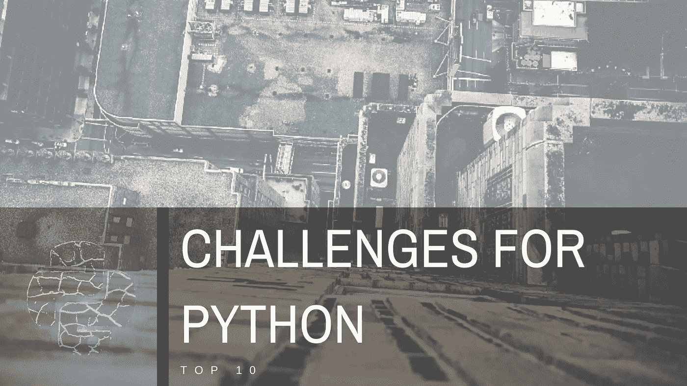
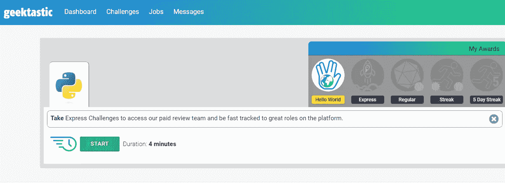
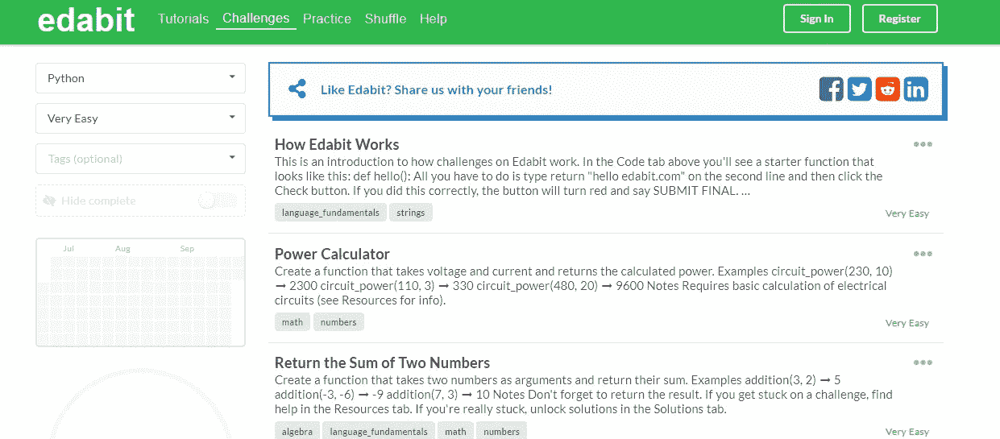
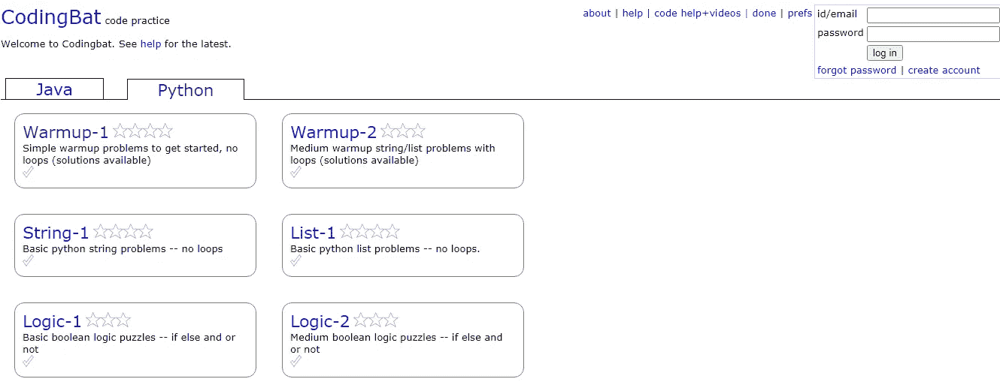

# Python 中的 10 大在线挑战网站

> 原文：<https://medium.datadriveninvestor.com/top-10-online-challenge-websites-on-python-3afe98ade09d?source=collection_archive---------3----------------------->

## 学习 Python 的最好方法之一是参与挑战

在互联网上可以找到很多关于 Python 的教育资料。即使有免费教程，你也能取得显著进步。就像完全掌握所有编码技能一样，要在 Python 中取得成功需要更多的练习。

有免费挑战机会的网站做了一项重要的工作。范围很广，从初学者到高级示例。

在本文中，我们将研究 Python 面临的挑战，您将找到更多的简短教程来帮助您快速决定您需要什么。当然，我会分享这些链接，你必须更深入地探索才能在挑战中取得进步。

# Python 挑战—十大挑战

## 1.极客

 [## 改变软件工程师的雇佣方式

### Geektastic 简化了技术采购、招聘和雇用。我们的同行评审代码挑战确定了大多数…

app.geektastic.com](https://app.geektastic.com/dashboard) 

在 Geektastic 上，你会发现编码挑战超越了其他地方常见的人工算法测试。更准确地说，它有教你如何编写生产级代码来解决现实世界问题的内容。

## 2.埃达比特

 [## 在 10，000 多个交互式挑战中学习编码

### 通过有趣的小挑战学习编码。赚取经验值，解锁成就并升级。这就像多林哥的…

edabit.com](https://edabit.com/challenges/python3) 

Edabit 是一个在线集合，包含 8 种语言的编码挑战，包括 C ++、JavaScript 和 Python。它为许多热衷于软件的专业团体提供了改善自己的小挑战。通过其他参与者的评论继续学习会很有趣。

## 3.商务化人际关系网

 [## Python 代码挑战| LinkedIn Learning，原名 Lynda.com

### 想测试你的 Python 技能吗？这些简明的挑战让你伸展你的大脑，测试你的才能。讲师…

www.linkedin.com](https://www.linkedin.com/learning/python-code-challenges) 

你可以用 Linkedin 做一个月的免费试用挑战。现场简短的挑战让你可以拓展你的大脑，测试你的能力。使用 Python 标准库中的工具，可以解决任何问题或者选择想要的库。因为每个困难都是独立的，所以你可以按照任何顺序和自己的进度完成课程。

 [## 用 Python |数据驱动投资者进行股票价格时间序列预测简介

### 在这个简单的教程中，我们将看看如何将时间序列模型应用于股票价格。更具体地说，一个…

www.datadriveninvestor.com](https://www.datadriveninvestor.com/2020/07/07/introduction-to-time-series-forecasting-of-stock-prices-with-python/) 

## 4.黑客银行

 [## 解决 Python 代码挑战

### Python 的一步一步指南，这是一种容易掌握的语言，也是最强大的语言之一。

www.hackerrank.com](https://www.hackerrank.com/domains/python) 

HackerRank 提供了超越基本和高级编码困难的特性。它还允许用户通过解决公司赞助的编码挑战来提交申请和申请工作。Hackerrank 最大的优势在于它提供了应对任何挑战的解释性解决方案。

## 5.Coderbyte

 [## Coderbyte |首屈一指的编码评估平台

### 利用我们的 300 多项挑战库提高您的编码技能，并准备参加编码面试，内容来自…

coderbyte.com](https://coderbyte.com/challenges?newAccount=true) 

Coderbyte 让你有机会在面试前做更好的准备。每个人都可以找到许多挑战的解决方案。还可以看到用户提供的解决方案。

## 6.皮切克奥

 [## py。CheckiO——Python 编码挑战和练习，为初学者和高级用户提供解决方案

### py。在线 Python 实践。通过解决编码挑战和在线练习来提高您的编码技能…

py.checkio.org](https://py.checkio.org/) 

PyCeckio 的设计真的很有意思。与其他人相比，你在虚拟环境中解决一个真实的问题会让你感觉更好。当你通过解决初学者的挑战来提高自己的水平时，另一方面要准备好在游戏中发现自己。

[https://py.checkio.org/](https://py.checkio.org/)

## 7.代码战争

 [## 代码战争:通过挑战达到精通

### Codewars 是开发人员通过挑战掌握代码的地方。在道场训练形，达到你的最高境界…

www.codewars.com](https://www.codewars.com/) 

当您开始学习 Python 教程时，您将看到一个模块化的进展。Codewars 让解决这些挑战变得更加有趣。它为比赛提供分数和排名系统。它们提出了由不同语言的限定问题所带来的挑战。

## 8.Python 原则

 [## 在线 Python 挑战— Python 原则

### 通过这些编程挑战来练习您的 Python 技能。这些任务对初学者来说意味着挑战。如果…

pythonprinciples.com](https://pythonprinciples.com/challenges/) 

您可以使用 python 原则来提高您的 Python 技能。对于初学者来说，这些任务可能很难，但网站上有一些课程可供刚刚开始学习的人使用。所有挑战都有提示和精选的示例解决方案。它们也可以在你的手机上运行，这样你就可以在旅途中练习 Python 了。

## 9.编码蝙蝠

 [## CodingBat Python

### 编辑描述

codingbat.com](https://codingbat.com/python) 

你会非常喜欢在 Codingbat 上练习。它让编码变得有趣，你可以按照自己的节奏进行。毫无疑问，它带来了宝贵的经验和知识！

## 10.w3 资源

 [## Python 练习:设置所有日期/时间函数使用的默认时区- w3resource

### 编写一个 Python 程序来设置所有日期/时间函数使用的默认时区。示例解决方案:Python 代码…

www.w3resource.com](https://www.w3resource.com/python-exercises/date-time-exercise/python-date-time-exercise-54.php) 

基本上页面结构简单不做作。但是，最好将问题集中在一个标题下，以便找到合适的内容。除了满满一页谷歌广告，不会有什么负面意见可说。

## 访问专家视图— [订阅 DDI 英特尔](https://datadriveninvestor.com/ddi-intel)