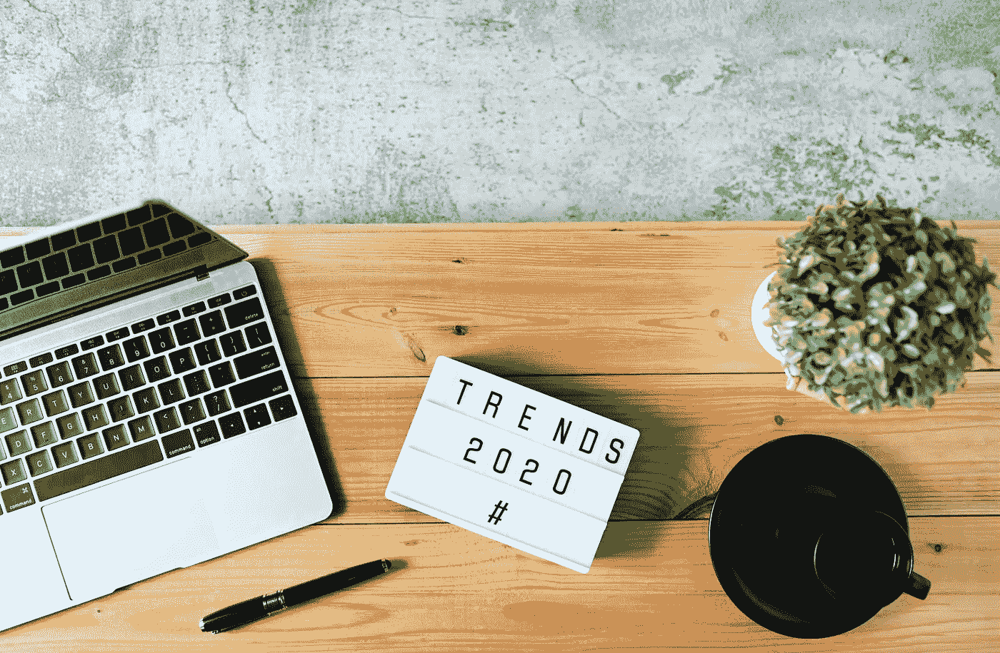
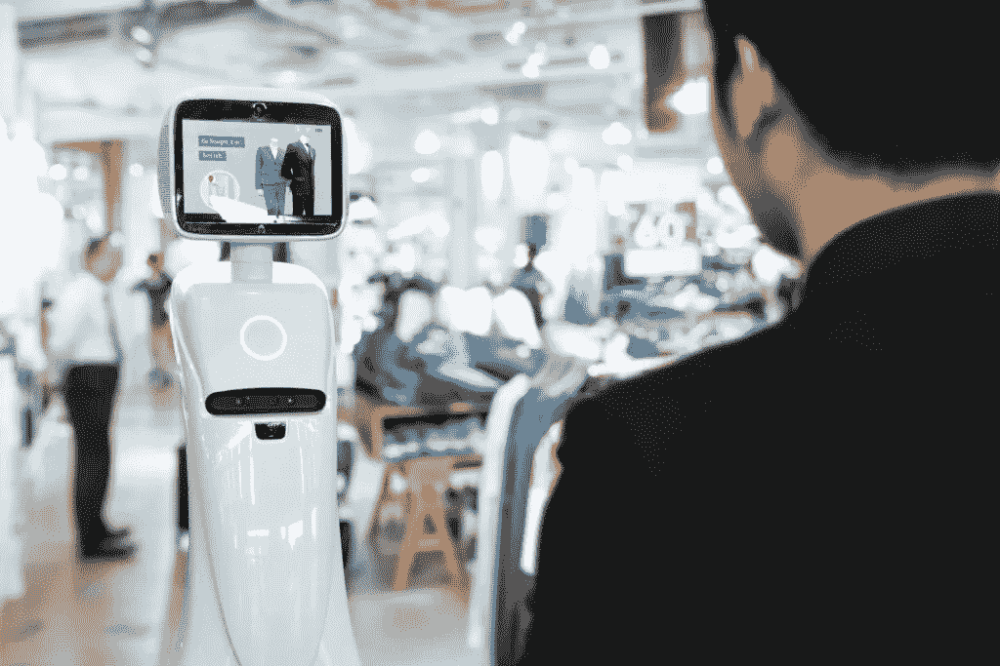

# 2020 年十大零售趋势和预测

> 原文：<https://medium.datadriveninvestor.com/top-10-retail-trends-and-forecasts-for-2020-1ba7d75a9389?source=collection_archive---------6----------------------->

随着 2020 年的到来，是时候展望未来，找出我们明年可以看到的零售趋势了。由于 IT 行业非常活跃，市场上出现了一些新技术，现有技术正在不断完善，以使零售商能够扩大客户群。让我们来看看 2020 年零售业的一些趋势。

 [## 幸福的算法？数据驱动的投资者

### 从一开始，我们就认为技术正在使我们的生活变得更好、更快、更容易和更实用。社交媒体…

www.datadriveninvestor.com](https://www.datadriveninvestor.com/2019/03/08/an-algorithm-for-happiness/) 

# 1.AR 购物

增强现实是最具创新性的零售技术之一，因为它允许公司在实体店和电子商务之间架起桥梁。例如，像 Ikea 和 Target 这样的行业领导者已经在使用 AR 来销售家具。如果有人正在购买沙发，很难想象它放在家里会是什么样子。AR 技术可以帮助他们建立这种联系，并通过消除客户的犹豫让零售商增加销售额。因此，预计会有更多的品牌开始将[增强现实解决方案](https://skywell.software/augmented-reality-development/)整合到他们的服务产品中。

# 2.项目定制

最有趣和最有创意的零售业趋势之一是定制你所购买的产品。每个人都喜欢拥有独一无二的东西，因为在某种意义上，这是奢侈的标志。然而，要实现这个和其他新零售概念，你需要有一个网站和一个移动应用程序，就定制而言，它将为用户提供几乎无限的选择。你的顾客可能非常有创造力，你需要有必要的技术来实现他们的愿景。

# 3.视觉搜索

人工智能正在做许多可能的新零售购物趋势，视觉搜索也不例外。购物者喜欢这个新功能，因为它可以让他们找到他们正在寻找的确切产品。Pinterest 等一些行业领导者已经在使用这项技术来增加用户参与度，并通过将[计算机视觉技术](https://skywell.software/computer-vision-services/)整合到他们移动应用程序的摄像头中来帮助人们找到他们想要的东西。由于这一实施，用户搜索增加了 140%。结果不言自明。

# 4.社交购物

结合零售和社交媒体似乎是 2020 年零售业的未来。这种流行的原因是因为人们受到他们在社交媒体上看到的东西的严重影响，并受到诱惑立即购买。如果他们可以在没有现有脸书或任何平台的情况下这样做，这将进一步刺激他们购买产品。

# 5.数字广告将发挥更大的作用

尽管数字广告的成本在过去一年中有所增加，但其价值也在上升。例如，让我们看看亚马逊上的广告。许多竞争关键词的每次点击成本超过 2 美元，但在 2019 年第一和第二季度，亚马逊广告占那些为 CPC 关键词付费的品牌总销售额的 25%左右。

# 6.谷歌购物达到新的高度

如果你不熟悉谷歌购物，这是互联网巨头提供的一项新服务，允许客户比较许多零售商的实体产品，并购买他们喜欢的产品。这非常方便，因为人们甚至不用离开谷歌就可以完成所有的购物。对于广告商来说，谷歌提供可购物广告、智能购物活动和许多其他功能。

# 7.电子商务品牌的新渠道

如今，品牌有很多不同的选择来吸引新顾客。人们正在使用的一个新平台是抖音，它声称仅在美国每月就有超过 3000 万活跃用户，在世界各地有 1.5 亿。事实上，它是 Google Play 和 App Store 下载量第二高的应用。

# 8.自主交付

在交付过程的最后一部分，将产品送到顾客家门口是这个过程中最昂贵的部分。像亚马逊这样的公司正试图通过开始自动送货来降低成本。你可以预计自动送货将会在披萨和杂货等常见订单中流行起来。

# 9.扩大数据收集

零售商不断寻找获取数据的新方法，以便更多地了解他们的客户，并为他们提供更定制的体验。目前，许多公司依靠互联网浏览器中的 cookies 来收集数据。2020 年，预计这将扩展到物联网设备。除了数据收集，他们还需要 PowerBI、Splunk 和 Tableau 等工具来理解这一切。

# 10.商店将拥抱物联网

物联网是一个日益增长的趋势，零售商不能忽视。事实上，据估计，明年将有超过 3090 亿台物联网设备在运行。公司可以利用这项技术，当顾客在商店附近旅行时，向他们发送相关产品的警报，提供自动结账和智能货架。

即使在 2020 年初，你也会注意到上面提到的趋势预测。零售商一直在寻找为客户提供独特体验和建立关系的方法。这些技术无疑使这项工作变得容易得多，这就是为什么明年品牌会越来越依赖它们。

*最初发布于*[*https://sky well . software*](https://skywell.software/blog/top-10-retail-trends-and-forecasts-for-2020/)*。*