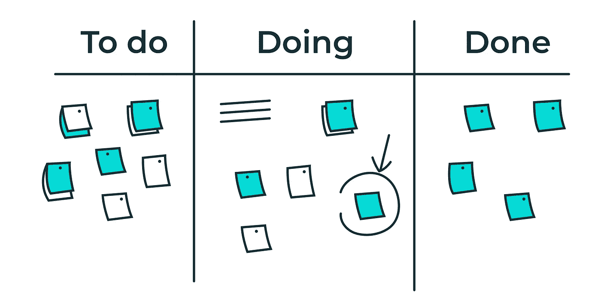

# 数据科学家应该知道的关于 Scrum 的 10 件事

> 原文：<https://medium.datadriveninvestor.com/top-10-things-data-scientist-should-know-about-scrum-d10f824adf3c?source=collection_archive---------10----------------------->

## 软件工程

## 3 个角色、4 个仪式和 3 个工件

Scrum 为什么这么受欢迎，是因为它非常简单。你只需要考虑 10 个主要术语:3 个角色，4 个仪式，和 3 个工件。

Image by Author

# 三个角色

Scrum 中不存在职称。有三个角色:产品负责人(PO)、Scrum Master (SM)和开发团队。

## 产品所有者

产品负责人负责把握产品的远景。

*   代表企业
*   代表客户
*   拥有产品积压
*   排列故事的优先级
*   为故事创建验收标准
*   能够回答团队成员的问题

## Scrum 大师

Scrum Master 负责整个过程，他不仅是 Scrum 专家和顾问教练，还是障碍推土机的推动者。

## 开发团队

开发团队负责

*   交付用户故事
*   做所有的开发工作
*   自我组织以交付用户故事
*   拥有评估流程
*   拥有“如何工作”的决策权
*   避免“不是我的工作”

# 4 个仪式

定期召集团队参加关键的仪式是至关重要的，包括冲刺计划、迭代计划、冲刺评审和冲刺回顾会议。下面的每个仪式都有时间限制。也就是说，它们必须在时间盒定义的时间内完成，或者尽可能短。

## 冲刺规划

这个会议发生在每个 sprint 的开始，包括两个部分来回答下面的问题。

*   我们要做什么？
*   我们会怎么做？

对于两周冲刺的团队来说，这个仪式的时间限制为不超过四个小时，对于一个月冲刺的团队来说，不超过八个小时。

## 每日会晤时间

(又叫“*单口会议”*)。这些是**快速的 15 分钟**会议，回答三个问题，以便向 scrum 板更新 PO 需要解决的进展和障碍，如下所示:

*   我昨天完成了什么？
*   我今天计划完成什么？
*   我预见到了哪些障碍？

## 冲刺回顾

(也叫“*冲刺演示”*)。在 sprint 结束时，团队有机会在 sprint 评审上展示他们的工作。

我建议你每周花**一个小时进行**开发。

## 冲刺回顾

回顾会在每个 sprint 结束时举行，是团队专注于在 sprint 中学到了什么，以及如何应用这些知识来做出一些改进的时间。

> Scrum 旨在帮助团队不断检查和适应，从而不断提高绩效和幸福感。

开发的每一周都需要**一到两个小时的回顾时间。**

# 3 件文物

Scrum 中有三个关键的工件。

*   *(1)产品 backlog* ，所有用户故事的列表，代表最终产品所需的需求
*   *(2)Sprint backlog*，这是一组已经优先化的产品 backlog 项目，将在下一个 Sprint 中实现
*   *(3)增量*，代表一个 Sprint 中实现的所有产品待办事项。

很简单，对吧？