# 开发电子商务移动应用的 10 大技巧

> 原文：<https://medium.datadriveninvestor.com/top-10-tips-for-developing-a-successful-ecommerce-mobile-app-zesium-56f474b519e7?source=collection_archive---------14----------------------->

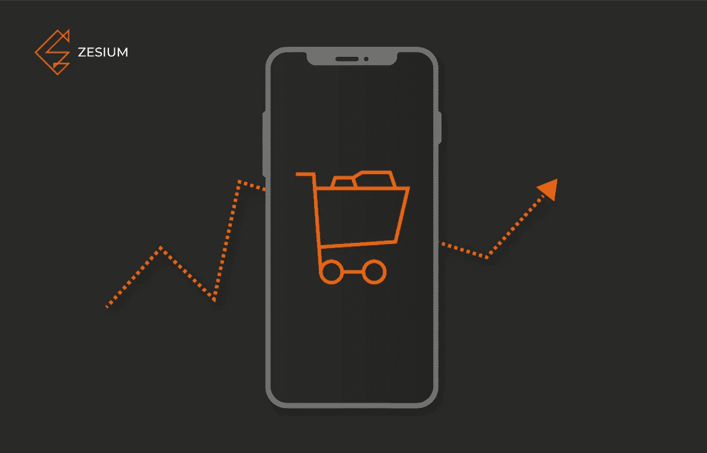

Source: zesium.com

你知道吗，如今 85%的智能手机用户宁愿使用手机应用程序而不是手机网站？

考虑到如此广阔的市场领域，任何希望增加销售额的电子商务企业都应该认真考虑建立一个移动应用程序。

当你是一个电子商务，你必须为你的买家创造一个[伟大的客户体验](https://acquire.io/blog/customer-experience-strategy/)，因为这是你成功的关键。

 [## 金融中的机器学习|数据驱动的投资者

### 在我们讲述一些机器学习金融应用之前，我们先来了解一下什么是机器学习。机器…

www.datadriveninvestor.com](https://www.datadriveninvestor.com/2019/02/08/machine-learning-in-finance/) 

在开发一个移动应用之前，有一些移动用户强加的关键元素，所以你需要了解它们。

# 简单明了的设计

用户界面 [(UI)](https://www.interaction-design.org/literature/topics/ui-design) 是用户启动电子商务应用时体验到的第一件事——它允许用户进入应用程序，导航和探索类别，并进行搜索。

请始终记住，移动设备的屏幕尺寸要小得多，因此空间有限——主屏幕应该注重清晰的布局，具有简单的导航系统和搜索功能，每个按钮、菜单或内容都必须组织有序，设置整洁。

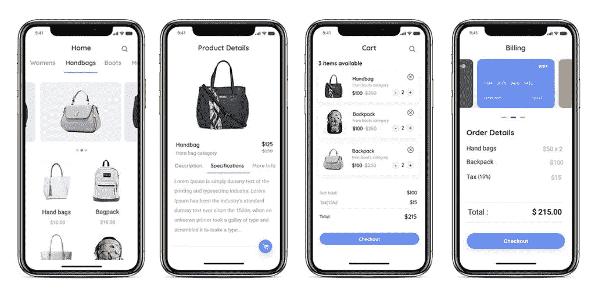

你的设计应该是直观的，便于用户在应用中导航——你的用户界面不应该让他们认为:

*   避免包含大量文本或动画的复杂设计；
*   避免用户界面垃圾，因为你的用户希望尽可能简单地找到他们想要的产品；
*   使用简单的配色方案，如[单色](https://en.wikipedia.org/wiki/Monochromatic_color)或[类似](https://en.wikipedia.org/wiki/Analogous_colors)的方案；
*   注意间距——线条和分隔线是强调屏幕不同部分的好工具，但是你也可以通过使用阴影和颜色来达到同样的效果。
*   只使用单一字体，或者你可以安全地使用平台的默认字体，如 iOS 的 ***旧金山*** 或 Android 的 ***Roboto/Noto*** 。有时候，试验所选字体的大小、风格或粗细比使用另一种字体更好。

只要记住，直奔主题——点击次数越少越好。

此外，考虑到每个移动操作系统都有自己的风格指南，比如 Android 的[材料设计](https://developer.android.com/guide/topics/ui/look-and-feel)或者 iOS 的[人机界面指南](https://developer.apple.com/design/human-interface-guidelines/)。

> 移动应用的用户界面是一个真正的注意力抓手，所以尽可能做到最好。

# 快速登录和结账

没有什么比一遍又一遍地输入相同的细节更让人恼火的了，比如电子邮件地址、姓名、地址、安全问题等等。

不要让用户在登录或结账时感到烦恼。考虑到触摸屏更容易分散写作的注意力，因为它们没有物理键盘。如果你让你的登录/结账流程变长，你肯定会流失客户。

正如之前多次说过的，一个好主意是通过 Gmail、脸书或任何其他受欢迎的社交网络登录社交媒体，这样客户就可以轻松登录，而无需麻烦的大量输入。

如果你创建一个**【分享】**按钮，使用社交媒体还有额外的好处——这样，你的客户可以在社交网络上分享他们购买的东西，同时为你的企业做广告。

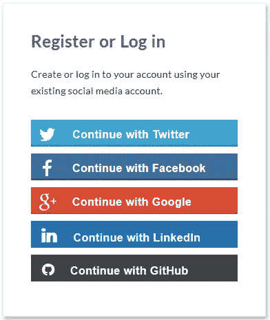

Source: profilepress.com

你应该提供存储用户信息，并使用自动完成来避免那些重复的任务。

结账也是一样——除非真的有必要，否则不要询问用户的个人信息。请记住，它必须适合智能手机屏幕，没有任何滚动。

您如何确保简化服务的一些示例可以是:

*   按钮**‘支付’**或**‘结账’**必须在拇指友好的区域
*   允许用户修改他们的订单
*   使用自动填充字段
*   实施错误消息，以防止由于输入错误或字段不完整而导致订单不成功

> 如果不为用户做的短而甜，结果就是弃车保利。

# 一致性和简单导航

设计的一个关键原则是保持你的移动应用程序的一致性——这意味着让相似的元素以相同的方式表现和外观。

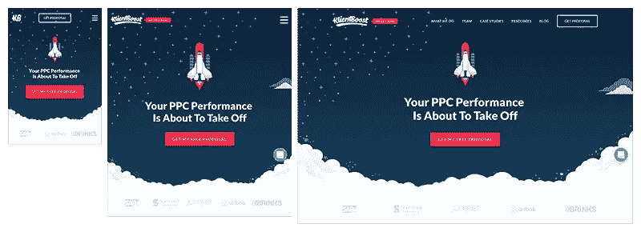

Source: pixelworm.io

一致性可以是:

*   ***视觉一致性***——按钮、字体和配色方案看起来应该一样
*   ***功能一致性*** —交互元素(如导航元素)在不同的屏幕上应该以相同的方式操作
*   ***外部一致性*** —你所有的产品(比如一个网站和 Android 和 iOS 应用)都应该共享相似的设计模式。

例如，如果你的“**立即支付**”按钮在一个页面上是绿色的，那么它在所有其他页面上也应该是绿色的。

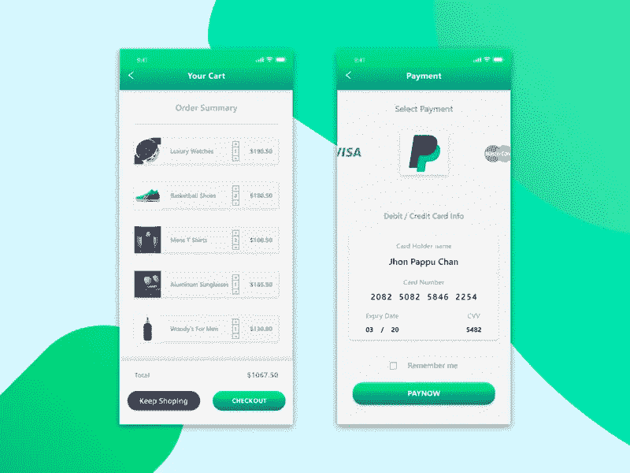

Source: dribble.com

一致性带来了无限的好处，比如让你的应用程序更可预测，这样用户就不必学习新的方法来导航你的应用程序；它消除了困惑，有助于对内容进行优先排序，并唤起用户积极的情感反应。

你必须确保你的菜单在整个应用程序中的位置清晰，只列出最重要的部分，并且每个菜单项用一个单词就能很容易理解。

最好是使用标准元素，比如 iOS 的 ***标签栏*** 或者安卓的 的 ***导航抽屉。考虑基于手势的导航，想想所有用户都直观理解的众所周知的模式，如双击放大照片或向下滚动，如果你想探索更多的产品。***

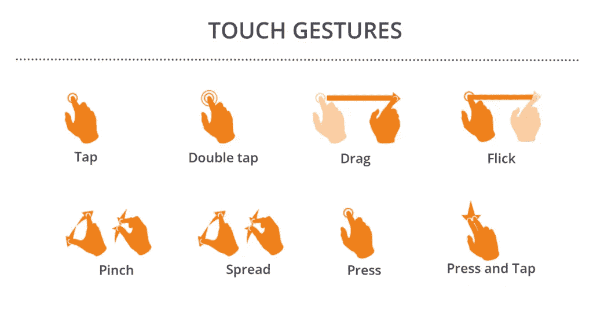

Source: creativemarket.com

让导航可见——如果你有侧边菜单，用户应该清楚地看到如何到达它。

> 您还可以通过使用不同的颜色来增加一些导航元素的可见性或优先级。

# 突出的购物车按钮

购物车应该总是可见的，因为它是每个顾客从你这里购买产品的工具。

它应该清楚地显示，并能够添加一个产品，而无需带用户到购物车页面，这样他们就可以继续购物。

尽一切可能减少步骤，提供更好的购物体验。

Source: pngitem.com

产品屏幕应始终有一个可见的突出按钮“**添加到购物车**或“**立即购买**”——这将有助于简化客户的购买体验，并提高您的销售额。

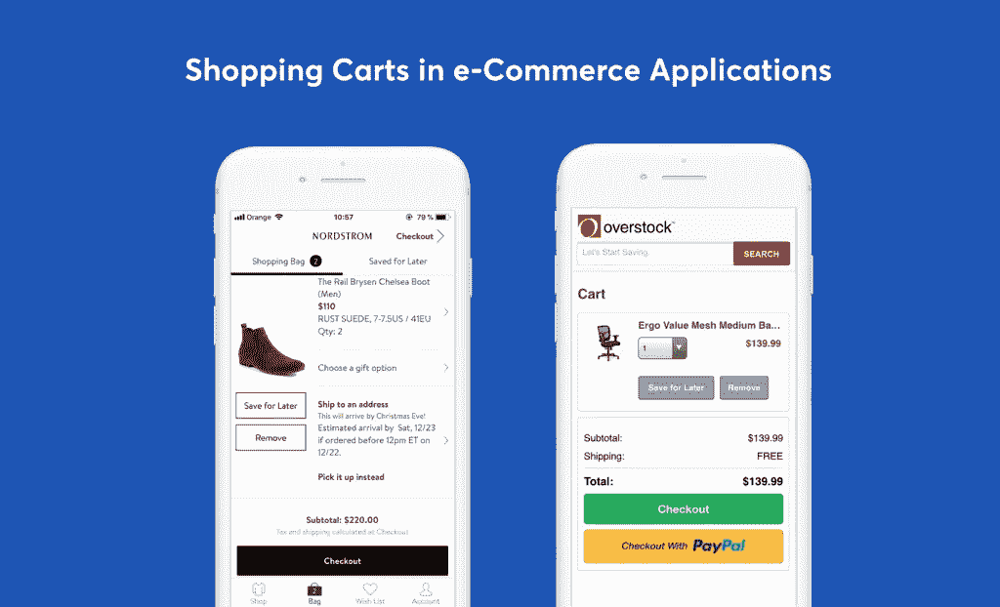

Source: toptal.com

> 确保用户可以轻松地在购物车中添加或删除商品。

# 单手输入

在智能手机和触摸屏的世界里，你必须放置鼓励用户采取特定行动的元素。

[拇指友好区](https://www.smashingmagazine.com/2016/09/the-thumb-zone-designing-for-mobile-users/)是屏幕上的一个空间，当用户用同一只手拿着手机时，他可以很容易地用拇指够到。

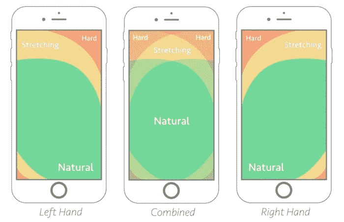

Source: storemotion.io

检查你的所有元素是否都在拇指友好区，因为如果人们不能轻易够到东西，他们就不会花力气。

哪些按钮应该放在拇指友好区？

-添加到购物车

-从购物车到结账的继续按钮

-支付屏幕上的支付按钮

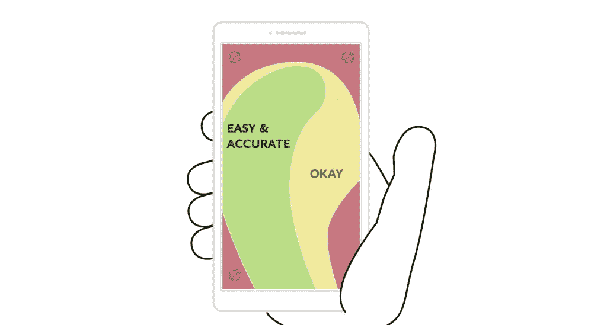

Source: toptal.com

另一种保持简单的方法是“ ***”三次点击法则“***——它建议用户不要超过三次点击就能获得他们想要购买的任何产品。

按类别排列和组织你的产品将满足这一要求。您可以按如下方式安排您的产品:

-类别

-子类别

-产品

您还可以使用标签将产品安排到特定的活动中，如“圣诞节销售”或“情人节礼物”等。

Source: digitalcommerce360.com

无论你决定如何进行，搜索栏是必不可少的，因为它可以帮助用户直接找到他们感兴趣的产品。

如果你想更进一步，你可以实现“*智能搜索”*——当用户输入第一个字母时，会显示一些可能的建议供选择。你不仅可以节省用户的时间，还可以有机会展示一些热门产品。

> **三次点击规则**只不过是一个最小化所有流程步骤的规则，比如浏览产品、加入购物车、支付等等。

# 快速装载

随着技术的进步，用户变得比以前更不耐烦了——他们不希望加载延迟或图像不能及时加载。加载 circle 超过 4-5 秒会导致用户放弃应用程序。

页面加载延迟一秒钟就会导致浏览量[下降 11%，或者客户满意度下降 16%](https://www.crazyegg.com/blog/speed-up-your-website/) ，所以一定要加快速度。

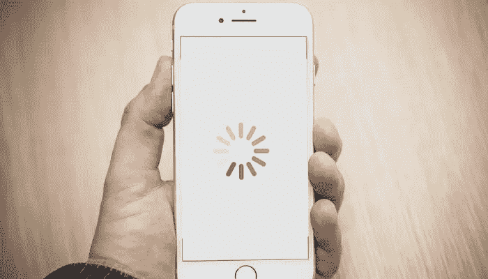

Source: freecodecamp.org

如果你想在电子商务领域保持领先，你需要确保你的应用程序尽可能快地加载。每个元素、图片或页面都应该在 4-5 秒内加载，这是在线用户的注意力持续时间。

> 你可以使用进度条来缓解不耐烦——这样你可以让你的客户确切地知道他们需要等待多长时间，直到流程最终完成。

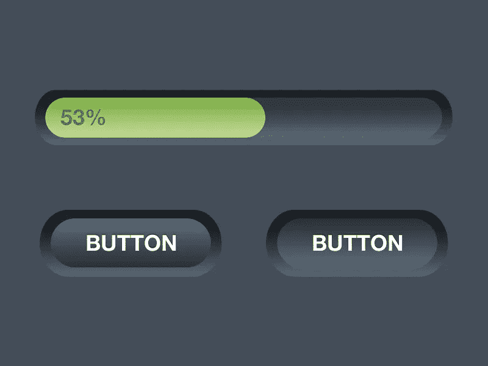

Source: dribble.com

# 收藏夹或愿望列表功能

顾客喜欢在购买特定产品之前浏览或挑选最好的商品。

解决方案是一个功能“ ***添加到收藏夹*** ”或“ ***添加到愿望清单*** ”，因为它让用户在决定购买之前将所有选择集中在一个地方——这非常类似于实体店，客户在最终购买之前首先浏览。

Source: originboardshop.com

> 一旦他们决定了他们将购买的物品，顾客可以重新访问他们收集的清单，并根据他们的口味决定哪一个是他们想要的。

# 安全第一

当你有一个电子商务应用程序时，你会向你的客户询问很多细节，比如银行账户细节、信用卡信息、地址等等。

随着移动电话的使用越来越普及，它们也成为黑客和攻击的目标。安全性差的应用程序很容易被攻破，导致个人和财务数据得不到保护。

这就是为什么你应该始终在应用程序中提供高水平的安全性，并使用最好的安全功能对每笔交易进行加密。

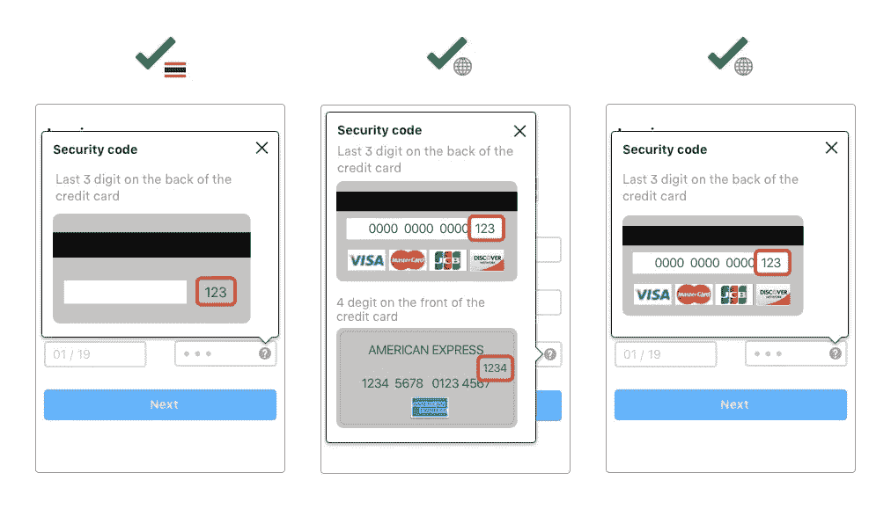

对用户来说，最重要的是他们的信息，无论是个人信息还是财务信息，都是安全的。

即使这听起来太昂贵，没有高级别的安全性的后果不仅仅是昂贵到不可能，因为你的声誉和业务取决于你的安全应用。

一旦用户对你的应用失去信心，他们将永远不会回来。

时刻关注你的 app 的安全级别，确保没有漏洞。

另一件重要的事情是提供最流行的支付方式。例如，一位客户主要在网上购物，但在查看了他的**【购物车】**后，他意识到您没有他喜欢的支付选项。结果=客户流失。

如果你想玩得更聪明，你需要确保你的支付方式包括信用卡、借记卡、网上银行和电子钱包。

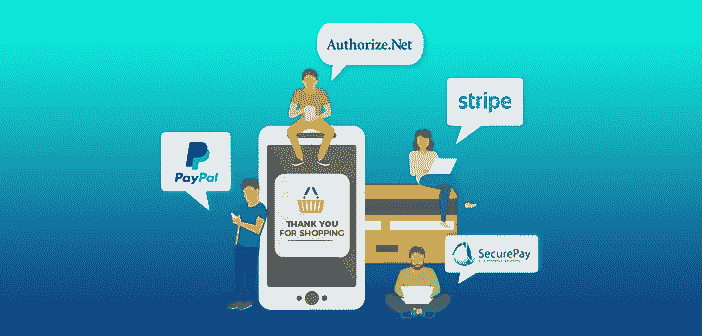

Source: magneticians.com

在这个过程中，始终要记住新的[移动应用 GDPR](https://en.yeeply.com/blog/gdpr-mobile-apps/)，因为每个应用都有义务传达收集用户的哪些数据，为什么收集以及将用于什么目的。如果你的应用程序不符合规定，你可能会面临罚款。

> 最好的方法是在用户下载应用程序后，立即请求批准其隐私和安全政策。

# 自动建议

这项功能对用户来说总是很方便——当他们浏览应用程序并从一个页面转到另一个页面时，该活动可以创建数据日志，这些日志可以在以后用于了解单个用户的行为。

这就是应用程序使用自动推荐的地方——让用户更容易、更快地填写表格。自动建议预测常见的搜索查询，帮助客户更容易地找到产品。

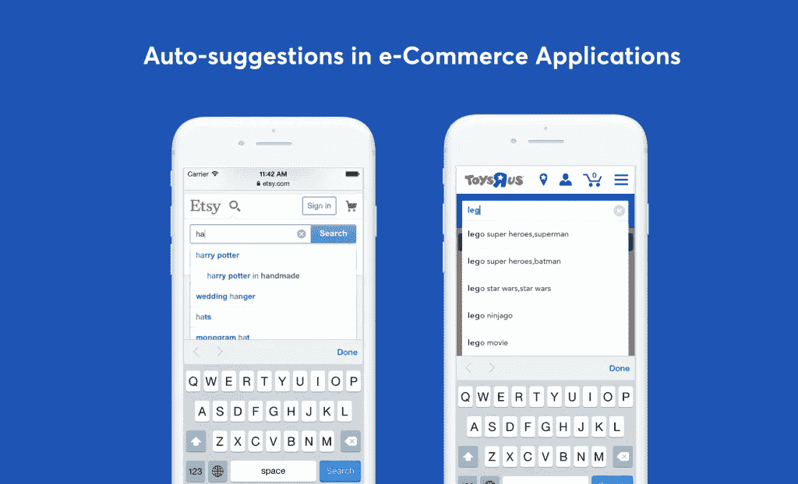

Source: toptal.com

此外，地址查找和验证使得结账过程更快——各种 API，如 [Google Places](https://cloud.google.com/maps-platform/places/?utm_source=google&utm_medium=cpc&utm_campaign=FY18-Q2-global-demandgen-paidsearchonnetworkhouseads-cs-maps_contactsal_saf&utm_content=text-ad-none-none-DEV_c-CRE_397052992295-ADGP_Hybrid+%7C+AW+SEM+%7C+BKWS+~+Places+%7C+BMM+%7C+Google+Maps+Places+API-KWID_43700049595992091-kwd-18857163995-userloc_21213&utm_term=KW_%2Bgoogle%20%2Bplaces-ST_%2Bgoogle+%2Bplaces&gclid=Cj0KCQiA7OnxBRCNARIsAIW53B-ez8S7l13uLi1PWYJa345f58bTPuQXTFBvSyngJQjHUR7PLhJbKysaAiF9EALw_wcB) 可以轻松实现这一功能。

由于电子商务应用应该为您带来收入，因此提供卓越的用户体验非常重要。如果您实施应用分析，它将为您提供对用户行为和类似模式的洞察，如会话时间、点击率、访问自定义字段等。

> 收集的信息将帮助您了解用户的购买模式，并让您根据他们的兴趣提供更好的建议，从而带来更高的收入流。

# 及时的客户服务

虽然你可以让应用程序尽可能简单，但是客户经常会有一些他们想要答案的问题。促进客户和代表之间的互动是任何电子商务移动应用程序的必备功能。

Source: smartsupp.com

为在线客户提供实时聊天支持，或者您可以尝试不同的选项，如消息服务、电话或电子邮件支持，看看哪些是您的客户最喜欢的。

这样，顾客可以很容易地与商店取得联系，以防他们对产品、运输、付款等有任何疑问。

> 告诉你的开发者在你的电子商务应用中实现这样的功能，因为它会更受客户欢迎，并确保更多的下载，这意味着更多的收入。

# 概括起来

电子商务应用程序有许多关键功能，我总结了构建电子商务应用程序时需要记住的最佳功能。

让我们回顾一下有助于您增加*【移动】*销售额的主要技巧:

*   在设计你的电子商务应用时，坚持使用*【最小化】*的方法——简单的颜色、默认的字体和适当的间距
*   提供快速简单的注册和结账流程
*   遵循一致性(*视觉、外部和功能*)，确保用户可以在没有任何预先指示的情况下执行主要动作
*   确保购物车按钮和所有其他按钮容易看到和突出
*   在拇指友好区域提供舒适的交互，以及用于产品图像缩放的手势
*   提供应用程序页面的快速加载
*   通过可编辑的意愿列表，为用户提供按照自己的节奏选择和执行购买的选项
*   通过展示徽章和奖状来提供安全感和信任感
*   通过自动建议栏实现产品的快速搜索和轻松过滤
*   确保及时的客户支持，为您的用户提供最佳服务

**这些是一些基本的关键功能，它们将帮助你获得一款真正在零售业务中发挥作用的应用，并让你在电子商务之旅中取得成功。**

*原载于 2020 年 2 月 5 日 http://zesium.com**的* [*。*](http://zesium.com/10-top-tips-for-developing-an-ecommerce-mobile-app/)

通过以下链接安排与 [**Maja Dakic**](https://app.ddichat.com/experts/maja-dakic) 的 DDIChat 会议。

 [## 马贾达基奇-迪迪恰特

### 技术行业(软件、移动应用、物联网、人工智能等)的资深作家。)以及在…

app.ddichat.com](https://app.ddichat.com/experts/maja-dakic)