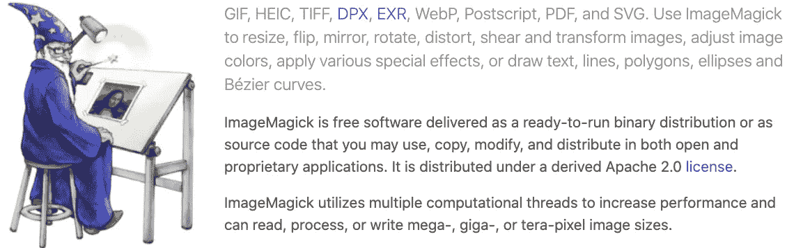
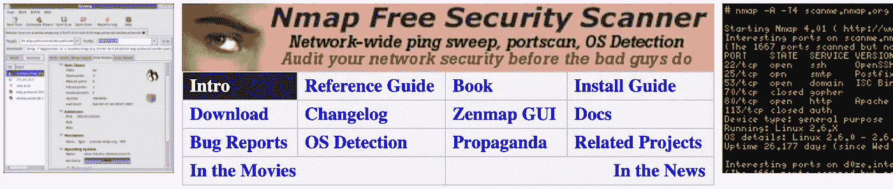
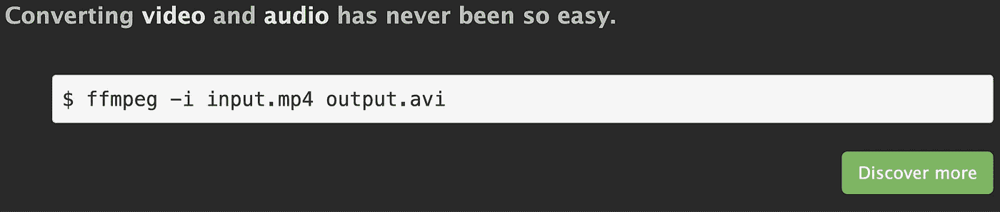
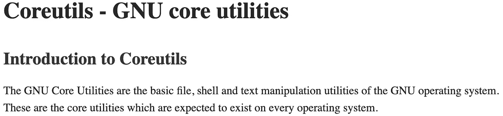
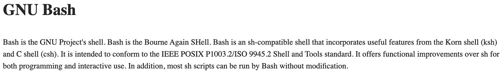

# 您不知道自己需要的十大 MacPorts 工具

> 原文：<https://medium.datadriveninvestor.com/top-10-trending-plugins-you-didnt-know-it-comes-with-macports-3a25558a4a9a?source=collection_archive---------1----------------------->


对于大多数在用麦金塔操作系统的用户来说，他们了解自制程序。但是，作为软件工程师或开发人员，有一个非常方便的工具叫 MacPorts。

使用`Port`命令，您可以通过在终端中输入命令`sudo port install packagename`来安装大多数有用的软件包。通过使用`port`命令，它分析包，如果它存在于您的系统，这是非常快。对于 MacPorts 来说，最好的一点是，它简化了 macOS 和 Darwin 操作系统上的软件安装。可以用命令`sudo port ugrade outdated`更新已安装的软件包。如果有人想了解的话，还有一个名为**托盘**的官方 GUI 应用程序。既然 MacPorts 得到了苹果的信任，那么它在[**MAC OS 上的列表**](https://www.macosforge.org/) 也是如此。

# 1.Wget

GNU Wget 是一个使用 HTTP、HTTPS 和 FTP(最广泛使用的互联网协议)检索文件的免费软件包。它是一个非交互式命令行工具，所以可以很容易地从脚本、cron 作业、没有 Xsupport 的终端等中调用。

[](https://www.gnu.org/software/wget/) [## Wget - GNU 自由软件基金会

### GNU Wget 是一个使用 HTTP，HTTPS，FTP 和 FTPS 这种最广泛使用的互联网来检索文件的免费软件包…

www.gnu.org](https://www.gnu.org/software/wget/) 

```
sudo port install wget
```


# 2.饭桶

Git 是一个快速、可伸缩的分布式开源版本控制系统，专注于速度和效率。

[](https://git-scm.com/) [## 饭桶

### Git 是一个免费的开源分布式版本控制系统，旨在处理从小到大的所有事情…

git-scm.com](https://git-scm.com/) 

```
sudo port install git
```


# 3.Cmake

一个可扩展的开源系统，以独立于操作系统和编译器的方式管理构建过程。与许多跨平台系统不同，CMake 旨在与本机构建环境结合使用。cmake 发布端口大约每几个月更新一次。

[](https://cmake.org/) [## cMake

### CMake 是一个开源、跨平台的工具系列，旨在构建、测试和打包软件。CMake 用于…

cmake.org](https://cmake.org/) 

```
sudo port install cmake
```


# 4.图像魔术

ImageMagick 是一个强大的工具和库集合，用于创建、编辑和合成各种格式的位图图像。您可以对图像或图像序列进行裁剪、调整大小、旋转、锐化、减色或添加效果或文本或直线或曲线，并以相同或不同的图像格式保存您完成的工作。您甚至可以从头开始创建图像。图像处理操作可以从命令行进行，也可以通过 C、Ch、C++、Java、Perl、PHP、Python、Ruby 和 Tcl/Tk 编程接口进行。支持超过 90 种图像格式，包括 GIF、JPEG、JPEG 2000、PNG、PDF、PhotoCD 和 TIFF。

[](https://imagemagick.org/script/develop.php) [## 图像魔术

### ImageMagick 的功能通常在命令行中使用，或者您也可以使用程序中的功能…

imagemagick.org](https://imagemagick.org/script/develop.php) 

```
sudo port install imagemagick
```



# 5.Nmap

Nmap 是一个用于端口扫描大型网络的实用程序，尽管它对单个主机也能很好地工作。创建 nmap 的指导思想是 TMTOWTDI(有多种方法可以实现)。这是 Perl 的口号，但它同样适用于扫描仪。有时你需要速度，有时你可能需要秘密行动。在某些情况下，可能需要绕过防火墙。更不用说你可能想扫描不同的协议(UDP，TCP，ICMP 等。).你不能用一种扫描模式完成所有这些。你不希望周围有 10 种不同的扫描仪，它们都有不同的接口和功能。

[](https://nmap.org/) [## Nmap:无网络映射器的安全扫描程序

### Nmap 7.80 是为 DEFCON 27 发布的！[发行说明|下载] Nmap 7.70 现已推出！[发行说明|下载]…

nmap.org](https://nmap.org/) 

```
sudo port install nmap
```



# 6.Ffmpeg

FFmpeg 是一个完整的解决方案，记录，转换和流式音频和视频。它包括领先的音频/视频编解码器库 libavcodec。该项目由几个部分组成:ffmpeg 是一个命令行工具，用于将一种视频文件格式转换为另一种格式。它还支持从电视卡中实时抓取和编码。ffserver 是一个用于直播的 HTTP (RTSP 正在开发中)多媒体流服务器。还支持直播的时移。ffplay 是一个基于 SDL 和 ffmpeg 库的简单媒体播放器。ffprobe 从多媒体流中收集信息，并以人类和机器可读的方式打印出来。libavcodec 是一个包含所有 ffmpeg 音频/视频编码器和解码器的库。大多数编解码器都是从头开始开发的，以确保最佳性能和高代码可重用性。libavformat 是一个包含所有常见音频/视频格式的解析器和生成器的库。

 [## FFmpeg

### FFmpeg-I input.mp4 输出. avi FFmpeg 为 libavfilter 添加了一个实时明亮闪光去除滤镜。请注意，这…

ffmpeg.org](https://ffmpeg.org/) 

```
sudo port install ffmpeg
```



# 7.科里蒂尔斯

GNU 核心实用程序是 GNU 操作系统的基本文件、外壳和文本操作实用程序。这些是每个操作系统中都应该存在的核心实用程序。以前，这些实用程序是作为三组独立的 GNU 实用程序提供的，分别是 fileutils、shellutils 和 textutils。这三个工具已经被合并成一组名为 coreutils 的工具。

 [## Coreutils - GNU 核心实用程序

### GNU 核心工具是 GNU 操作系统的基本文件、外壳和文本操作工具。这些是…

www.gnu.org](https://www.gnu.org/software/coreutils/) 

```
sudo port install coreutils
```



# 8.自动确认

Autoconf 是一个可扩展的 m4 宏包，它生成 shell 脚本来自动配置软件源代码包。这些脚本可以使软件包适应多种类 UNIX 系统，而无需用户手动干预。Autoconf 通过模板文件为程序包创建配置脚本，该模板文件以 m4 宏调用的形式列出了程序包可以使用的操作系统功能。

 [## Autoconf - GNU 项目自由软件基金会

### Autoconf 是一个可扩展的 M4 宏包，它产生外壳脚本来自动配置软件源…

www.gnu.org](https://www.gnu.org/software/autoconf/) 

```
sudo port install autoconf
```


# 9.尝试

Bash 是一个 sh 兼容的 shell，它结合了 Korn shell (ksh)和 C shell (csh)的有用特性。它符合 IEEE POSIX P1003.2/ISO 9945.2 外壳和工具标准。它在编程和交互使用方面提供了超越 sh 的功能改进。此外，大多数 sh 脚本无需修改就可以由 Bash 运行。

 [## Bash - GNU 项目自由软件基金会

### Bash 是 GNU 项目的外壳。巴什再次成为伯恩的外壳。Bash 是一个与 sh 兼容的 shell，它集成了…

www.gnu.org](https://www.gnu.org/software/bash/bash.html) 

```
sudo port install bash
```



# 10.自动制造

Automake 是一个从名为 Makefile.am 的文件中自动生成 Makefile.in 文件的工具，每个 Makefile.am 基本上都是一系列 make 变量定义，偶尔会有规则被扔进去。生成的 Makefile.in 文件符合 GNU Makefile 标准。

 [## Automake - GNU 项目自由软件基金会

### 目录 Automake 是一个自动生成 Makefile 的工具

www.gnu.org](https://www.gnu.org/software/automake) 

```
sudo port install automake
```


所有这些软件包可能对我们大多数人来说都不熟悉，但其中一些非常有用，它由 MacPorts 运行。因为它们提供了试图跟踪每个软件标题的最新版本的单个软件树。我们的树中目前有 23311 个端口，分布在 89 个不同的类别中，并且还会定期添加更多端口。

[](https://www.datadriveninvestor.com/2019/01/23/which-is-more-promising-data-science-or-software-engineering/) [## 数据科学和软件工程哪个更有前途？数据驱动的投资者

### 大约一个月前，当我坐在咖啡馆里为一个客户开发网站时，我发现了这个女人…

www.datadriveninvestor.com](https://www.datadriveninvestor.com/2019/01/23/which-is-more-promising-data-science-or-software-engineering/)