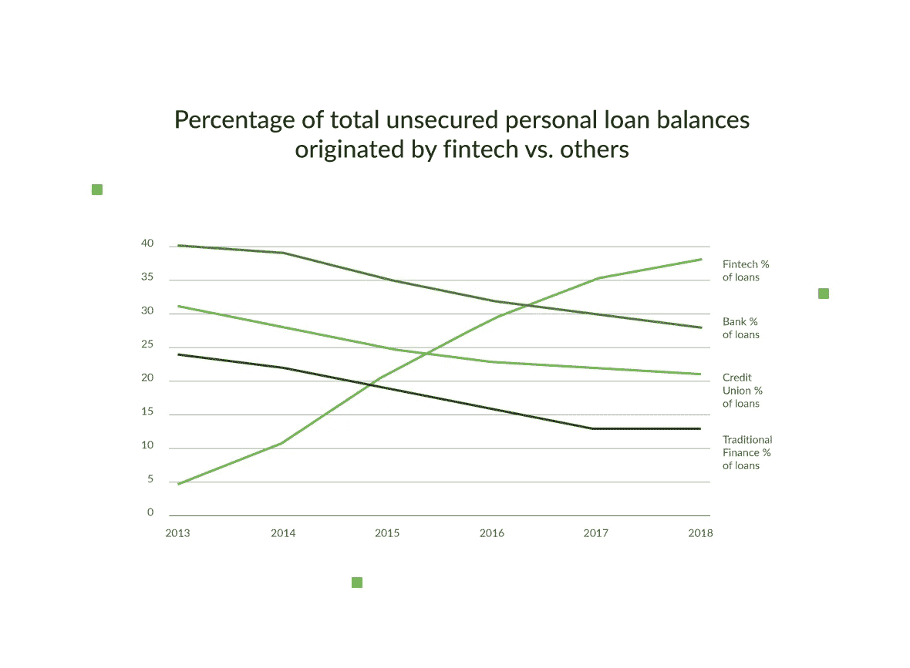
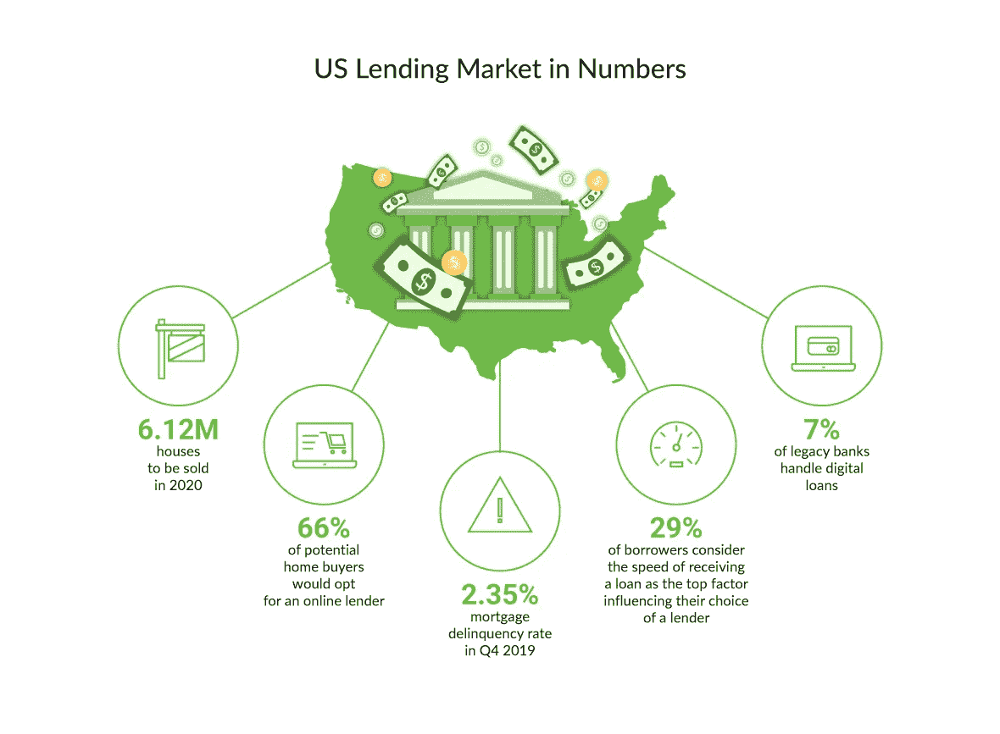

# 扰乱房地产行业的 11 大美国贷款创业公司

> 原文：<https://medium.datadriveninvestor.com/top-11-us-lending-startups-that-are-disrupting-the-real-estate-industry-8718d22ff2ce?source=collection_archive---------0----------------------->

所有千禧一代的共同痛苦是背负多重债务——以学生贷款开始，以汽车贷款、房子贷款等结束。这是借贷市场不断增长的主要原因:

*   直接学生贷款相当于 1.24 万亿美元，借款人超过 3510 万人
*   2019 年第三季度，消费信贷达到 4.15 万亿美元的峰值
*   最后，抵押贷款构成了美国贷款市场的最大部分，总债务高达 9.2 万亿美元。

因此，许多贷款金融科技初创公司涌现出来，想分一杯羹。让我们看看为什么它们的数量在增长，研究它们增长的其他原因，小型在线贷款机构可能面临的趋势和挑战，并研究美国贷款初创公司最成功的例子。

> 这篇关于[颠覆房地产行业的 11 大美国贷款初创公司](https://djangostars.com/blog/lending-fintech-startups/)的文章最初发表在 Django Stars 博客上。由 [Django Stars](https://djangostars.com/) 的编辑团队撰写

# 网上银行:传统银行的可行替代方案

大约 63%拥有住房的美国人有抵押贷款。与此同时，在不到 5 年的时间里，传统银行贷款的数量从市场的 40%萎缩到 28%，而网络贷款者持有的份额从 5%上升到 38%。

是什么导致金融科技贷款如此激增？不要再看了。与传统金融机构提供的贷款相比，消费者更喜欢在线抵押贷款和其他贷款的主要原因如下:

1.  **可达性**。在线贷方(或非银行)总是在手边。你不需要根据银行的营业时间来调整他/你的时间表——要申请贷款，你只需浏览一个网站或打开一个应用程序。
2.  **方便**。同样，与传统银行相比，在线抵押贷款为客户提供了一个简单的表格来填写，而不是要求他们带上所有的文件，包括他们宠物的身份证。
3.  **没有人为因素**。Lending fintech 初创公司分析用户提交的数据，而看不到数据背后的人。这有助于他们根据用户的信用评分和其他重要信息做出公正的决定，而不是基于某人的判断态度。
4.  **速度**。在线申请贷款的消费者可以更快地看到他们的申请状态，因为非银行可以在几分钟内而不是几天内验证他们收到的信息。当然，最终的决定可能需要更多的时间。尽管如此，[在线贷款申请流程比传统银行快 20%](https://www.mba.org/publications/insights/archive/mba-insights-archive/2019/fintech-advantages-not-limited-to-fintech-lenders-x250356) 。
5.  **降低利率**。由于另类贷款机构不需要像传统银行那样遵守那么多法规，它们可以为客户提供更灵活的利率。

 [## 银行和金融科技初创公司的未来|数据驱动的投资者

### 银行的概念没有太大变化，但随着技术的发展，旧的概念也在更新。不相信我？拿一个…

www.datadriveninvestor.com](https://www.datadriveninvestor.com/2019/10/22/the-future-of-banks-and-fintech-startups/) 

这些数字证明，在线抵押贷款在借贷游戏中大获全胜:

*   预计 2020 年 T2 将售出超过 612 万套房屋。
*   66%计划买房的人更愿意与网上银行的[合作。](https://www.fanniemae.com/resources/file/research/housingsurvey/pdf/nhs-special-topic-digital-mortgage-process.pdf)
*   [2019 年第四季度，抵押贷款拖欠率仅为 2.35%](https://www.federalreserve.gov/releases/chargeoff/delallsa.htm#fn1) ，并继续下降。
*   29%的借款人认为获得贷款的速度是影响他们选择贷款人的首要因素之一。
*   大约 7%的传统银行能够处理数字贷款的整个流程。

# 美国贷款市场的挑战和趋势

尽管贷款需求正在增长，但如果你决定创办一家贷款科技创业公司，有许多因素会让你止步不前。你可能会遇到挑战，你需要跟上潮流。尽管如此，也没有什么特别的，所以让我们把消极的想法放在一边，进入正题。

## 2020 年贷款趋势值得关注

所以你不会把这些趋势想成简单的流行语，我们只会讨论最本质的。

**1。更加数字化和自动化**。除了为客户提供全天候服务外，网上银行还为其他贷款机构带来了好处:

*   降低运营成本。拥有一家以科技为基础的抵押贷款公司最明显的优势之一是有可能优化你的预算。在线贷款初创公司的所有者不需要浪费钱在办公室租金或设施上，或者雇佣一大批内部员工。
*   更快的决策和请求处理。数字抵押贷款成功的主要原因是处理申请的速度。用户友好界面背后的强大技术分析借款人提交的数据，确定他们获得贷款的资格，并根据潜在客户的风险因素为您提供决策。
*   没有人为错误。即使你的员工中有几个人，自动化日常任务也会减少他们犯错的机会。它还会让你的员工专注于与客户和/或投资者建立长期关系。

**2。全渠道用户体验**。只在一个平台上意味着在你可能接触到他们的其他地方失去客户。覆盖多个沟通渠道是一个更好的选择，但最佳选择是协调你与借款人的每一个接触点。这不仅意味着增强桌面和移动用户的客户体验，还意味着让您的客户端在从一个平台切换到另一个平台时更加顺畅。

如果你不确定是否应该使用更多的沟通渠道，请记住 [67%的寻求](https://www.fiserv.com/en/about-fiserv/the-point/2019-trends-whats-new-and-whats-next-in-the-mortgage-market.html)抵押贷款经纪人的初创公司更愿意通过笔记本电脑申请贷款，而 29%的人更愿意使用智能手机或平板电脑。

**3。将数据转化为可操作的见解**。如上所述，数字解决方案允许您根据借款人在您的网站或移动应用程序上填写表格时指定的数据，加快对其信息的验证。你处理贷款申请的速度越快，你就能完成越多的交易。此外，更快的处理时间增强了用户体验并培养了客户忠诚度。

但是拥有所有的数据是不够的。如果你分析得当，你会比其他非银行机构获得竞争优势。当然，没有合适的工具是很难做到的，而这正是人工智能(AI)可以派上用场的地方。因为它是一个高端的自我学习系统，随着时间的推移，人工智能可以为你提供更准确和面向客户的决策。

## 你可能面临的最常见的贷款挑战

尽管在线抵押贷款增加，但即使是最好的美国贷款初创公司也仍然遇到类似的困难。让我们来看看其中的一些，以便您有所准备:

**1。抵押贷款利率低。2020 年， [APR 预计将保持与 2019 年最后一个季度相同的低水平](https://www.nerdwallet.com/blog/mortgages/housing-mortgage-trends-2020/)。这对消费者来说显然是个好消息，尽管非银行机构似乎对此并不高兴。**

**2。待售房屋减少。正在建造的房屋数量无法满足想要购买首套住房的年轻人日益增长的需求。以下是住房短缺的几个原因:**

*   房主拒绝出售他们的房子。他们更愿意[把它租给别人](https://www.nerdwallet.com/blog/mortgages/6-reasons-there-arent-enough-homes-for-sale/)，从中赚取被动收入。
*   *人们在同一栋房子里呆的时间更长*。根据全国房地产经纪人协会的数据，在 2019 年，一个典型的卖家已经在他们的房子里住了 10 年，而之前是 6 年或 7 年。
*   房屋建筑商面临更大的监管压力。监管支出占总房价的 32.1%，这对一些开发商来说太贵了。

**3。由于 FHA 贷款**，竞争更加激烈。由于严格的监管和对违规行为的处罚，传统银行在几年内停止了对 FHA 的放贷。然而，司法部和住房与城市发展部于 2019 年 10 月 28 日发布了一份谅解备忘录，旨在澄清金融机构对 FHA 计划的期望。此外，谅解备忘录旨在鼓励银行承销 FHA 贷款。因此，借款人在选择贷款人时可能会有更多的选择，这对于其他抵押贷款提供商来说可能会很麻烦。

你可能认为这些挑战很关键，但是我们确信没有什么障碍是不能克服的。希望在大选年后，至少抵押贷款利率会有所上升。

# 11 大贷款创业公司

既然我们已经触及了在 2020 年推出你的在线抵押贷款公司之前你需要知道的一切，让我们继续我们对最佳贷款初创公司的概述。

# 1.辛德奥

**国家**:美国
**成立年份** : 2013
**筹集资金**:650 万美元
提供的服务:房屋贷款、抵押贷款再融资和咨询
**使用的技术** : Python、Django、Node.js、Django REST framework、NGINX、Gulp、Loggly、PostgreSQL、Redis、AngularJS、Ionic、Ansible、Gunicorn、PhoneGap
**案例分析**:[https://djangostars.com/case-studies/sindeo/](https://djangostars.com/case-studies/sindeo/)

[Sindeo](https://www.sindeo.com/mortgage-payment-calculator/) 是一个方便的在线抵押贷款计算器和复杂的内部顾问门户，为客户获得首次贷款或再融资提供端到端的解决方案。它提供:

1.  *一个易于使用的利率报价计算器*，它可以帮助客户预先注册一个程序，并根据房屋价格、首付、税收、保险和利率等抵押贷款的详细信息计算出他们的每月付款额。
2.  *一个先进的客户门户网站*，消费者可以在这里完成注册，提供申请贷款的所有必要数据，进行验证，并接收房地产经纪人的报价。

# 2.可靠的

**国家**:美国
**成立年份** : 2012
**筹集资金**:2530 万美元
**提供服务**:抵押贷款、学生贷款、个人贷款、信用卡

[可信](https://www.credible.com/)充当借贷双方的中介。它适用于不同的贷款，包括个人和学生贷款，以及抵押贷款和再融资。可信使客户能够:

1.  *搜索最优报价*。可信根据客户的申请细节选择最好的贷款人。除非客户选择一个合适的供应商，后者看不到他或她的信用评分。
2.  *比较不同的贷方*。客户可以对照一家提供商和另一家提供商，选择最有吸引力的利率。

# 3.索菲

**国家**:美国
**成立年份** : 2013
**筹集资金**:25 亿美元
**提供服务**:房屋贷款、个人贷款、学生贷款

SoFi 因发行公正的抵押贷款而脱颖而出，即使是对信用评分低的借款人。他们还提供灵活的首付比例，从 10%到 50%不等。SoFi 提供:

1.  *各类贷款*。他们提供个人贷款，学生贷款及其再融资，以及抵押贷款。
2.  *快速资格预审*。该功能分析客户的基本信息，如信用评分和最基本的个人信息，以确定他或她是否有机会获得贷款人的预先批准。预先批准需要一个标准的文件包，以帮助确定向客户发放贷款的最终决定。

# 4.Reali

**国家**:美国
**成立年份** : 2015
**筹集资金**:3900 万美元
**提供服务**:抵押贷款和再融资

[Reali](https://reali.com/) 为买卖双方提供全方位的服务，包括:

1.  *专属特工*。Reali 表示，他们有专业的房地产经纪人，负责房屋买卖的每一步。
2.  *快速房屋贷款审批*。如果客户找到了喜欢的房子，但缺钱，他们几乎可以立即获得抵押贷款。该公司在几个小时内批准贷款，而不是像大多数银行那样三天或一个月。

# 5.贷款树

**国家**:美国
**成立年份** : 1998
**募集资金**:未具体说明，公司主要投资或收购其他公司
**提供的服务**:抵押和再融资、个人贷款、信用卡、商业贷款、学生贷款、汽车贷款

[Lending Tree](https://www.lendingtree.com/) 是一种把各种贷款人统一起来，让客户选择最合适的一个的市场。它为客户提供:

1.  *比较不同的贷款人*。用户可以提交他或她的个人资料，并从潜在的贷款人那里获得报价。
2.  *从多种贷款产品中选择*。作为贷款金融科技初创公司的先驱，该公司为借款人提供了广泛的选择，包括信用卡、抵押贷款等。

# 6.火箭抵押贷款由加速贷款

**国家**:美国
**成立年份** : 2015
**筹集资金**:未指定
**提供服务**:抵押贷款、房屋贷款、大额贷款

由 Quicken Loans 提供的火箭抵押贷款旨在使贷款申请过程更加简单快捷。它提供:

1.  *网络版和手机版*。客户可以选择更方便的界面，从他们的 PC/笔记本电脑或平板电脑/智能手机无缝输入所需信息。
2.  *贷款种类多样*。各种各样的服务不仅包括房屋贷款和抵押贷款，还包括珍宝和 FHA 贷款。

# 7.Better.com

**国家**:美国
**成立年份** : 2016
**筹集资金**:2.05 亿美元
**提供服务**:房屋贷款和抵押再融资

Better.com 专门从事抵押贷款和再融资，并为潜在借款人提供任何类型的房地产贷款。它的特点是:

1.  *简单的申请流程*。最好的事情是，贷款预先批准不会影响客户的信用评分。
2.  *无额外费用的最优价格*。该公司表示，它没有隐性支付。相反，它们根据贷款期限显示利率(固定或可调)。

# 8.部分

**国家**:美国
**年份成立** : 2017
**筹集资本**:1.8 亿美元
**提供服务**:抵押贷款、股权贷款

Divvy 允许其客户通过建立股权信用来购买房屋，同时进行租赁。

1.  *租房期间的节省*。该选项帮助客户从每月租金中分配一笔固定金额作为首期付款。因此，客户可以开始储蓄来购买他们居住的房子。

# 9.苍蝇之家

**国家**:美国
**年份成立** : 2015
**募集资金**:1.6 亿美元
**提供服务**:房地产经纪

Flyhomes 专注于提供与房地产经纪相关的全套服务。它提供:

1.  *出售房屋的专家协助*。该公司帮助房主在平台上方便地交易他们的房子。如果房子在 90 天内卖不出去，Flyhomes 就会买下来。
2.  *现金优惠*。对于找房子的人来说，这是一个很好的选择。这一功能允许潜在买家选择一个家，对它出价，击败其他报价，并赢得建设。之后，该公司购买它，买方可以使用任何其他贷款人的服务获得抵押贷款。

# 10.向家的

**国家**:美国
**成立年份** : 2018
**筹集资金**:2500 万美元
**提供服务**:抵押贷款、股权信贷

Homeward 让它的客户在卖掉现有的房子之前先买一套新房子，就像 Flyhomes 一样。该公司提供:

1.  一份简单的申请表。客户可以在几分钟内获得批准，并几乎立即开始寻找新家。
2.  *卖房前入住的可能性*。一旦客户选择了合适的建筑，该公司就会购买并提供 6 个月的租赁期。在大多数情况下，这给客户足够的时间来出售他们以前的房子，获得抵押贷款，并关闭租赁。

# 11.带状物

**国家**:美国
**年份成立** : 2017
**募集资金**:5.55 亿美元
**提供服务**:抵押、股权贷款

[Ribbon](https://www.ribbonhome.com/) 帮助房主、购房者和他们的房地产经纪人出售或购买房屋。他们提供:

1.  *先买后卖期权和现金担保*。与前面提到的公司类似，Ribbon 使房主能够在出售现有房屋之前挑选新房子。此外，它还为他们提供有保证的现金，无论他们的抵押贷款处于哪个阶段。
2.  *更快完成交易*。对于代理商，Ribbon 提供了加速的协议签署(长达 14 天)，从而在相同的时间内获得更多的客户。

# 最后

我们可以假设，随着越来越多的人想要购买或出售房屋，对金融科技初创公司的贷款需求只会继续增长。尽管当前在线抵押贷款市场存在挑战，但机会仍然很多——现有替代贷款机构正在处理的大量贷款和传统银行存在的问题就证明了这一点。

要找到更多关于前沿金融科技解决方案的相关信息，并跟上最新的行业趋势，请查看我们博客上的其他[专家文章。](https://djangostars.com/blog/tag/fintech/)