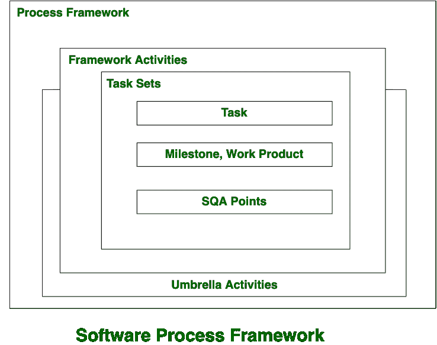
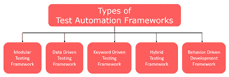
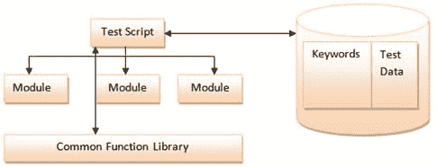
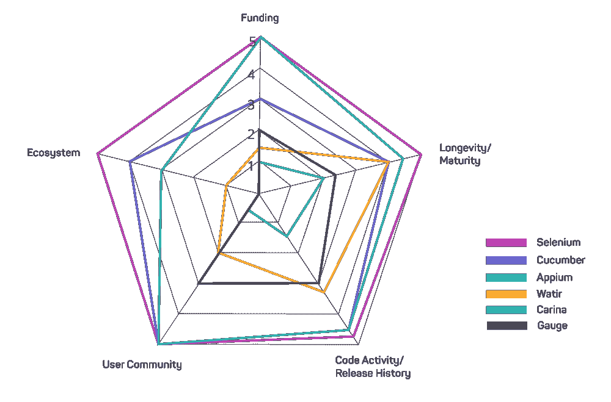

# 2020 年前 12 大测试自动化工具

> 原文：<https://medium.datadriveninvestor.com/top-12-testing-automation-tools-for-2020-9c1162051e94?source=collection_archive---------3----------------------->

***文章摘要:软件市场上有数百种测试自动化工具，缩小可行的测试自动化工具的范围是 web 应用成功的关键。在这篇文章中，我们谈论了关于测试软件框架的一切，同时强调了 2020 年前 12 个测试自动化工具。阅读了解更多。***

测试自动化工具和框架都是软件开发中的噱头，但是如果你正在考虑构建你的测试自动化框架，最好考虑放弃它。**我们为什么建议**？如果你能通过这个指南，你会自己发现的。

但是在我们谈论影响现代软件测试的测试自动化工具和激进的人工智能技术之前，从基本术语开始是明智的。

话虽如此，我们还是先来了解一下**‘框架’**。

# 什么是软件框架？

根据 [TechTerms](https://techterms.com/definition/framework) ，*软件框架是开发软件应用的平台。它提供了一个基础，软件开发人员可以在此基础上为特定平台构建程序。*'

## 简而言之，一个框架包括一组最佳实践、假设、公共工具和库，它们在不同团队的软件开发人员之间被使用和共享。

说到这里，让我们继续描述软件测试框架。

# 什么是测试框架？

> 通俗地说，测试框架是为创建和设计软件测试用例而建立的一套规则和指导方针。

测试框架不仅缩短了测试时间，而且有助于敏捷和 DevOps 的成功采用。

## 怎么会？

简单来说，就是通过辅助 QA 测试人员和软件开发人员有效且高效地测试软件。

# 在正确的时间选择正确的测试自动化工具对于加速过程，及时交付高质量的软件产品是至关重要的。

然而，选择最好的自动化测试工具在后面。首先，您必须了解可用的测试框架，并仔细检查它们以缩小项目自动化工具的范围。

 [## 自动化已准备好带领我们走出危机，并赋予人们权力-以下是|数据驱动…

### 随着我们准备进入 2020 年下半年，并试图在全球预防性关闭后重新开启经济…

www.datadriveninvestor.com](https://www.datadriveninvestor.com/2020/06/23/automation-is-poised-to-lead-us-out-of-the-crisis-and-empower-people-here-is-how/) 

# 自动化测试框架的类型

多年来，多个团体已经开发和部署了几个测试自动化框架，但是只有少数几个获得了应有的关注。

我们的 QA 测试人员在仔细评估了测试自动化行业后，为您的软件企业精心挑选了 6 大自动化框架，包括:

1.  **线性自动化框架**
2.  **模块化驱动框架**
3.  **图书馆架构测试框架**
4.  **数据驱动框架**
5.  **关键字(表格)驱动框架**
6.  **混合测试框架**

让我们简要概述一下这些测试自动化框架。

# **1。线性自动化框架**

> 毫无疑问，线性自动化框架是市场上最简单的软件自动化测试工具。

通常也被称为“记录和回放框架”，它不需要 QA 测试人员**编写哪怕一行代码**。

建立在一个简单的架构上，QA 测试人员可以手动记录每一步，包括导航、检查点和用户输入。测试人员会自动向后运行脚本来进行测试。

# **2。模块化驱动框架**

模块化驱动的测试框架非常适合测试整个应用程序。

## 知道为什么吗？

让我们给你指出来。在这个特定的框架中，测试人员将应用程序分割成小模块，并单独运行测试脚本。

**有什么好处**？即使在你的[移动应用程序开发](https://www.signitysolutions.com/mobile-app-development)中引入了任何变化，测试模块也不会受到影响。

在测试中使用这个自动化工具可以提高成本效率和生产率。然而，这是以额外的时间、精力和资源为机会成本的。

# **3。库架构测试框架**

从最简单的意义上来说，库架构测试框架是模块化驱动框架的扩展。让我们打破这种差异，很快。

## 在模块化框架中，应用程序被分成更小的脚本，在库架构中，这些脚本首先被识别，按功能分组，并最终基于共同的目标被分解。

因为这些脚本是按功能分组的，并且保存在单独的库中——测试人员可以在任何需要的时候调用它们。

# **4。数据驱动框架**

QA 测试人员和软件开发人员经常发现他们自己处于这样的情况，在他们能够获得成功的结果之前，需要他们测试相同的特性‘n’次。

然而，使用数据驱动自动化工具的好处是，它使测试人员能够将数据从测试逻辑中分离出来，并将其存储在外部驱动器上。

> 外部存储数据为测试人员提供了额外的好处，包括使用外部数据源，比如电子表格、文本文件、SQL 表和 CSV 文件，来获取输入并将输出参数传递给测试脚本。

# **5。关键字(表格)驱动框架**

关键字驱动框架的工作方式与数据驱动框架非常相似，唯一的区别是这个特定的测试框架不仅从外部来源提取数据**，而且安全地划分和维护代码集**。

在这个测试自动化框架中，每个功能都被安排在一个有一组指令的表格中(因此得名)。将关键字存储在一个永恒的文件中为它们提供了各自的特征，将它们与用来在应用程序上运行各种测试的测试自动化工具分开。

# **6。混合测试框架**

混合测试框架可能是世界范围内测试人员可获得的和首选的最理想的测试自动化框架。顾名思义，它结合并提供了关键字和数据驱动测试框架的最佳特性，同时减轻了其他框架的缺点。

这 6 个是市场上最常见、最广泛可用的测试框架。您可以选择一个或多个框架来有效地系统处理您的代码。

但是，不是这样。软件测试正变得日益复杂，不断变化的时代要求测试自动化工具能够帮助软件和 QA 测试人员进行有效的测试。

## ***接下来就是这样！***

下面，我们为软件开发人员、创业公司和企业等列出了 12 个顶级的测试自动化工具。根据你的要求仔细检查，选择最适合你的。

# 2020 年前 12 大测试自动化工具

# **1。卡琳娜**

Carina 背后的开发人员说得很好:' ***高效自动化测试的 Java 解决方案***

Carina 构建在最流行的开源框架(Selenium、Appium 和 TestNG)之上，是目前最受软件开发人员和 QA 测试人员欢迎的基于 Java 的自动化测试工具。

## 龙骨的主要特征:

*   80%可重用的测试自动化代码 b/w iOS 和 Android
*   将所有层统一到一个应用程序中——可以是 web 应用程序、REST 服务，甚至是数据库。
*   完全优化到[free maker 的 Java 模板引擎](https://freemarker.apache.org/)。

# **2。宁静号**

Serenity 是一个基于 Java 的开源测试框架，它从根本上是为了使编写自动化测试(包括验收和回归)更加容易而构建的。

Serenity 以前被称为 Thucydides，它非常适合需要与行为驱动开发(BDD)很好集成的测试自动化平台的软件开发人员。

## Serenity 的主要特点:

*   内置的 web 驱动程序管理、屏幕截图、并行测试等功能。
*   轻松提取用于编写 BDD 和 Selenium 自动化测试的样板代码。
*   具有额外的注释**@步骤。@step 提供了一个额外的抽象层次，如果使用得当，可以使您的测试可重用。**

# **3。Appium**

基于 WebDriver 协议，Appium 专门用于移动应用的自动化测试。这种特殊的测试框架使测试人员能够在不修改代码或不受限于特定语言的情况下运行测试。

## Appium 的主要特点:

*   统一测试，无需重新编译应用程序。
*   使用相同的 API 跨多个平台(iOS、Android 和 Windows)运行测试。
*   轻松创建和管理元素存储库。

# **4。盖伦框架**

Galen 是另一个基于 [Selenium 框架](https://www.selenium.dev/documentation/en/)的开源测试自动化工具。这一次的目标是测试(Java 和 JavaScript 测试)用户体验和浏览器中 web 应用程序的设计。

谈到 web 应用程序，您知道 web 应用程序是分多个阶段开发的吗？没有吗？别担心。看看这篇题为“Web 开发生命周期:Web 开发的新方法学”的博客。

由于 Galen 是为在响应性网站上进行自动化测试而设计的，所以您可能需要使用特殊的语法来测试和验证您的移动/web 应用程序在特定浏览器中的布局。

## Galen 的主要特点:

*   使用 Galen 语法、Java 或 JavaScript 在简单的文本文件中编写测试。
*   利用热图分析创建 web 应用程序的详细 HTML 报告。
*   通过调整浏览器窗口的大小来检查和验证您的 web 应用程序的布局响应。

# **5。卡塔隆**

**Katalon 是免费的，但在技术上不是一个开源的测试自动化工具**。由 [KMS 科技](https://www.kms-technology.com/)开发的这个自动化测试工具最适合需要自动化前端、移动和网络应用的组织。

## 卡塔隆的主要特点:

*   预装了所有主要的工具和库。
*   易于与关键字测试自动化框架集成(如上所述)。
*   对多种编码语言的扩展支持，包括 Groovy 和 Java。

# **6。黄瓜**

Cucumber 是一个开源的测试自动化工具，它将测试规范、功能和文档整合到一个单一的资源中。自动化代码集成和采用[行为驱动开发(BDD)](https://www.agilealliance.org/glossary/bdd/#q=~(infinite~false~filters~(postType~(~'page~'post~'aa_book~'aa_event_session~'aa_experience_report~'aa_glossary~'aa_research_paper~'aa_video)~tags~(~'bdd))~searchTerm~'~sort~false~sortDirection~'asc~page~1)) ，Cucumber 将你的工程师的团队绩效提高了十倍。

## 黄瓜的主要特点:

*   通过真实文档获得实时见解。
*   通过与 Git 的无缝集成连接源代码控制系统。
*   BDD 规范是自动化测试的两倍。

# **7。等待**

watir——另一个由 Selenium 支持的开源测试自动化工具，使用 Ruby 库来自动化测试。**水最好的一点是什么？**

> 在所有的自动化测试工具中，Watir 与浏览器的交互方式与任何人都是一样的——点击和跳转链接、填写表格和验证文本。

## Watir 的主要特点:

*   易于集成和支持像 Cucumber 这样的 BDD 工具。
*   Ruby 是自动化脚本的理想选择，因为它是动态的，易于阅读和编写语法。
*   支持数据驱动和跨浏览器测试。

# **8。机器人框架**

尽管是一个通用的测试自动化框架，Robot Framework 在自动化[验收测试和验收测试驱动的开发(ATDD)](https://www.agilealliance.org/glossary/atdd/#q=~(infinite~false~filters~(postType~(~'page~'post~'aa_book~'aa_event_session~'aa_experience_report~'aa_glossary~'aa_research_paper~'aa_video)~tags~(~'acceptance*20test~'atdd))~searchTerm~'~sort~false~sortDirection~'asc~page~1)) 方面表现得非常好。

由于其核心是用 Python 编写的，Robot Framework 最适合使用 Python 进行自动化测试的企业。使用关键字驱动的测试框架(如上所述)，它使得自动化测试可读，并且更容易创建。

# 机器人框架的主要特征:

*   与 Selenium WebDriver 库、API、MongoDB、Appium 等的丰富集成。
*   增加了对 [Jython](https://www.jython.org/) 和 [IronPython](https://ironpython.net/) 的支持。网)。
*   支持和管理表格数据语法中的数据(**承蒙**:关键字驱动框架方法)。

# **9。硒**

毫无疑问，Selenium 是最流行的开源测试自动化框架，可用于 web 应用程序的自动化测试。

然而，其广泛流行的主要原因可以归因于广泛的预集成工具和库，这些工具和库支持 web 浏览器的自动化测试。

## 硒的主要特性:

*   根据您的要求高度定制。
*   实现 W3C WebDriver 规范的完整基础设施。
*   支持所有主要的编码语言，包括 Java、Python、C++、Ruby、.NET 等等。

# 10。测试项目

Testproject.io 是一个完全免费的、基于云的开源自动化工具，支持强大的社区。

TestProject 的框架本质上是为了让更多的测试人员和工程师从两个主要的开源测试自动化工具的特性中受益: **Selenium 和 Appium** (上面都讨论过了)。

## 测试项目的主要特点:

*   共享文本存储库，与世界各地使用 TestProject 的测试人员共享软件测试和 API。
*   扩展支持插件更新你的自动化脚本变得更加强大。
*   基于 Selenium 和 Appium，您的测试人员可以毫不费力地测试 web 和移动应用，以及 iOS 和 Android 应用。

# **11。柏树**

在迄今为止讨论的所有开源测试自动化工具中，Cypress 可能是唯一一个专门为开发人员和 QA 工程师开发的自动化工具。

通过提供端到端的测试体验，Cypress 已经相对成功地让软件开发人员实现了[测试驱动开发(TDD)](https://www.guru99.com/test-driven-development.html) 。

## Cypress 的主要特征:

*   基于一个全新的框架——为测试自动化领域带来新技术。
*   提供对每个对象的本机访问，无需详细说明对象序列化。
*   将调试器拖放到您的 web 应用程序中。

# **12。TestCafe 工作室**

TestCafe Studio，建立在 Node 上。Js，是一个面向企业的端到端测试自动化 IDE。这种特殊的测试自动化工具最适合与仍然在旧的 web 浏览器上运行的客户打交道的组织。

> TestCafe Studio 的不同之处在于，与其他开源测试自动化工具不同，它不需要 WebDrivers、插件或任何其他工具。只需安装并开始测试！

## TestCafe Studio 的主要特性

*   易于安装。
*   创建没有手动超时的测试报告。
*   跨所有主要平台的自动化测试，包括浏览器、桌面、移动甚至云。

# 结束语

测试自动化领域充斥着软件自动化工具和框架，每隔一天就会有新的工具和框架出现。

不过，这并不是说新的就不好。他们不止在一个方面，在几个方面更好。但是我们在这里提到的那些，是由业界领先的专家、强大的社区和广泛的使用所支持的。

如果你是一个个人，或者一个企业，正在寻找关于当前热门话题、移动网络开发和新时代自动化解决方案的新信息和更新，如 [AI & ML](https://www.signitysolutions.com/ai-machine-learning) 和[机器人过程自动化](https://www.signitysolutions.com/blog/rpa-robotic-process-automation/)，请确保查看我们的博客[这里](https://www.signitysolutions.com/blog/)。

通过我们的博客，我们试图给你带来数字产业的最佳选择。

**访问专家视图—** [**订阅 DDI 英特尔**](https://datadriveninvestor.com/ddi-intel)

***申请成为 DDIChat 专家*** [***这里***](https://app.ddichat.com/expertsignup) ***。
使用 DDI 的方法:***[***https://datadriveninvestor.com/collaborate***](https://datadriveninvestor.com/collaborate) ***访问我们的***[***https://www.datadriveninvestor.com/***](https://www.datadriveninvestor.com/)