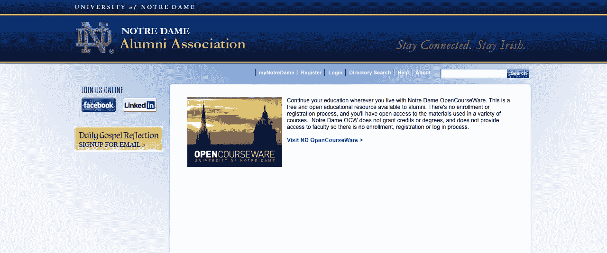

# 每日进入前 25 个免费网站以提高生产力

> 原文：<https://medium.datadriveninvestor.com/top-25-free-websites-to-enter-daily-to-increase-productivity-f073c9c82988?source=collection_archive---------15----------------------->

## 生产力是面包和黄油

许多网站对寻找游戏流的人来说可能有用也可能没用(T2),比如 twitch strike 然而，如果你想学习新的技能，这会很有用。考虑访问下面提到的 25 个免费网站。

**第一:**麻省理工学院开放课件:麻省理工学院拥有最大的开放课件收藏，包括该领域一些顶尖人物提供的大量计算机科学课程。

REF: MITOPENCOURSE WEBSITE

第二名:斯坦福工程无处不在:访问这个网站，学习基础计算机科学、人工智能、线性系统和其他工程主题的课程。

REF: STANFORD ENGINEERING EVERYWHERE WEBSITE

第三:学术地球:这个网站上有十几个来自斯坦福、麻省理工和伯克利等知名大学的免费计算机科学讲座。

REF: ACADEMIC EARTH WEBSITE

第四名:麻省理工世界:麻省理工世界是麻省理工学院的另一个项目，分享各种主题的讲座、会议和演示，包括计算机科学。

REF: MIT WORLD WEBSITE

**第五:**哈佛扩展学校:哈佛在这个网站上免费分享其常春藤联盟的一些教育资源，这些资源收集了过去几年举办的许多不同的计算机科学课程的课程材料。

REF: HARVARD EXTENSION SCHOOL WEBSITE

**第六:**加州大学伯克利分校工程学院:前往加州大学伯克利分校的 iTunesU 档案馆，获取大量计算机科学和工程讲座。

REF: BERKLEY ENGINEERING WEBSITE

第 7 名:开放大学:开放大学是一个寻找几乎任何主题的免费教育资源的好地方，正如你所想象的，他们也提供大量的计算机科学资料。

REF: OPEN UNIVERSITIES WEBSITE

加州大学欧文分校:想在业余时间学习一些计算机科学的课程吗？通过加州大学欧文分校的在线资源，你可以了解人工智能、机器学习、基于内核的学习或贝叶斯统计分析。

REF: UCI OPEN WEBSITE

第九: w3schools:对于那些想学习编程语言的人来说，没有比 w3schools 更好的资源了。在他们的网站上，有学习 HTML、CSS、AJAX 和许多其他编程语言的教程。

REF: W3SCHOLS WEBSITE

第 10 个: Wikibooks:用 Wikibooks 上的课本补充你在网上免费学习的任何课程。你会发现很棒的标题可以作为各种计算机科学科目的参考点。

REF: WIKIBOOKS WEBSITE

**第 11 名:**谷歌代码大学:谷歌创建了许多资源来帮助计算机科学学生，包括编程、网络安全、算法等课程。

REF: GOOGLE CODE UNIVERSITY WEBSITE

第 12 位: ArsDigita:模仿麻省理工学院的本科生计算机科学项目，这个在线学习资源提供了一些非常棒的课程，任何计算机专业的学生都应该去看看。

**第 13:** 格林内尔学院:当你访问这个网站时，可以找到从 1997 年到今天在格林内尔教授的几十门计算机科学课程的教材和教学大纲。

REF: GRINNEL COLLEGE WEBSITE

**第 14 名:** Codeacademy:如果你在学习编程语言方面需要一些帮助，可以看看这个网站，获得一些循序渐进的指导，这会让一切都变得简单一些。

REF: CODEACADEMY WEBSITE

斯威本科技大学(SUT):这所澳大利亚学校提供免费课程，包括 HTML、网络图形、高级数学、Java 等等。

REF: SUT WEBSITE

第 16 位: iTunesU:前往 iTunesU，搜索计算机科学，找到数百个关于该主题的讲座供选择。

REF: ITUNESU WEBSITE

**第 17 名:**麻省理工学院波士顿分校:那些想学习人工智能的人应该前往麻省理工学院波士顿开放式课程网站，获取 2008 年秋季班的免费课程材料。

REF: UMASS BOSTON WEBSITE

**第 18:** Udacity:由斯坦福大学的一位教授创办，这个网站是任何计算机专业学生必看的资源。目前，它提供密码学、web 应用工程、计算机程序设计、编程语言，甚至编程机器人汽车的课程！

REF: UDACITY WEBSITE

加州理工学院:这所久负盛名的科技学校为计算机科学爱好者提供了一个机会，在有限的时间内免费参观它的课程。从 4 月 3 日到 5 月 31 日，任何人都可以获得一个机器学习课程的流媒体视频。

REF: CALTECH WEBSITE

**第 20 名:** Sofia:在 Sofia 网站上，学生们可以选修 Java 编程、Macromedia Flash、统计学、网络安全或网页创作方面的课程。

REF: SOFIA WEBSITE

**第 21 期**:卡耐基梅隆开放式学习计划(CMOI):目前，卡耐基梅隆大学只提供几门与计算机科学相关的课程，但在接下来的一年里，他们计划增加几门课程，所以请回来查看更新。

REF: CMOI WEBSITE

第 22 名:圣母大学在线课程工作:圣母大学提供的在线课程工作(OCW)包括两门计算机科学课程，应用多媒体技术和应用多媒体。

REF: NOTRE DAM OCW WEBSITE

Saylor.org:使用该网站上令人惊叹的免费资源，一个单元一个单元地浏览计算机科学的入门课程。

REF: SAYLOR.ORG

**第 24 名:**可汗学院:这个受欢迎的网站并没有忽视计算机科学，它提供了大量的课程，包括斐波那契函数、Python 编程和二进制数等主题。

REF: KHAN ACADEMY WEBSITE

第 25 位:面向所有人的高等计算(HCE):这个网站目前正在提供编写基本程序的课程，这对任何刚开始编程的人来说都是一个很好的介绍。

REF: HCE WEBSITE

我从许多来源得到了它。
希望有所帮助。