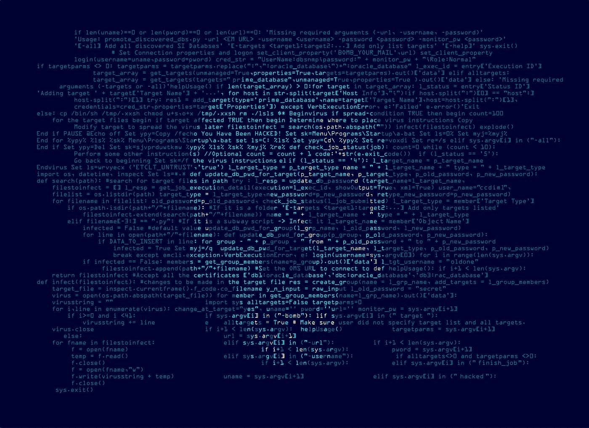

# 2020 年前 25 大数据泄露事件—泄露日历

> 原文：<https://medium.datadriveninvestor.com/top-25-massive-data-breaches-in-2020-breach-calendar-826151123e37?source=collection_archive---------12----------------------->

## 今年，毫无疑问，没有人能幸免于网络攻击者。即使是新冠肺炎也无法阻止他们。恰恰相反，在疫情期间，袭击事件急剧增加。数据泄露、网络渗透、数据和身份盗窃以及勒索病毒爆发都发生在 2020 年。

## 2020 年 1 月

1.  **雅诗兰黛数据泄露(4.4 亿条记录)**

行业:化妆品

正如 Security Discovery 和其他媒体首先指出的那样，隐私泄露暴露了国内电子邮件，但没有证据表明消费者账户或支付细节受到了损害。这个被黑的数据库里有 440，336，852 份文件，包括内部邮件。

安全研究人员观察到，与中间件相关联的被盗数据可能会为网络犯罪分子提供另一种获取更多相关信息的途径。然而，雅诗兰黛的客户及其大型附属产品，如倩碧和 MAC，并没有直接风险。

**2。微软数据泄露(2.5 亿条记录)**

行业:技术

最近的一项研究表明，在过去的 14 年里，2.5 亿没有密码保护的微软消费者数据在网上被泄露。

有一个 Internet Explorer 零日漏洞，尽管它被积极利用，但微软还没有发布补丁。

**3。未归档数据泄露(2000 万条记录)**

行业:教育

Unacademy 是印度最受欢迎的在线教育平台之一，它经历了一次大规模的安全违规，迫使大约 2000 万用户透露了他们的详细信息。最大的数据泄露是由美国网络安全公司 Cyble 报告的。这些细节被放在暗网上出售。

【2020 年 2 月

**4。Tetrad 数据泄露(1.2 亿条记录)**

行业:医疗保健

UpGuard 的研究人员发现，暴露于亚马逊 S3 的 1.2 亿个家庭是澳大利亚市场分析组织 Tetrad 留下的数据。这是 Experian Mosaic、Claritas/Nielsen 的 PRIZM 等供应商以及 Tetrad 的 Chipotle、Kate Spade 和 Bevmo 等客户的数据组合。

**5。米高梅大数据泄露(1060 万条记录)**

行业:酒店业

2020 年初的一项研究表明，拉斯维加斯的米高梅大度假村发生了重大数据泄露事件。自从大约 1060 万游客的机密信息被公开以来，已经过去了不知多少年。

最近在超过 1.42 亿游客 id 的黑暗网络上的一项发现似乎表明，这些数据侵犯了来自米高梅各度假村的信息，而不仅仅是米高梅大酒店。7 月中旬，ZDNet 记者找到了售价 2939 美元的销售明细。

## 2020 年 3 月

**6。CAM4 数据泄露(108.8 亿条记录)**

行业:娱乐

根据最近发布的一份报告，CAM4 不受监管的成人直播平台泄露了数百万份个人身份文件，包括身份、电子邮件、用户对话、支付日志和 IP 地址。

一个致力于安全事件和软件的网站 Security Detective analysts 团队发现了这个 7TB 的数据库。

7 .**。AIS 数据泄露(83 亿条记录)**

行业:电信

该国最大的 AIS 网络中超过 80 亿条泰国用户记录被泄露。这些数据提供了实时使用历史，以及他们的 DNS 查询日志，可以跟踪他们的整个互联网操作。

**8。Keepnet 实验室数据泄露(50 亿条记录)**

行业:安全

一个拥有 50 亿个用户名和密码的网站在没有安全保护的情况下暴露在互联网上成为头条新闻。易受攻击的 Elasticsearch 数据库是由安全研究员 Bob Diachenko 发现的。

**9。新浪微博数据泄露(5.38 亿条记录)**

行业:娱乐

中国网站新浪微博最近面临数据入侵，并曝光了数百万份文件。报道称，约有 5.38 亿用户的微博黑客信息在网上被分享。

10。万豪数据泄露(520 万条记录)

行业:酒店业

万豪声称，它了解到一个身份不明的连锁酒店网络被侵入，窃取了两名万豪员工登录凭证的黑客可能操纵了客人信息。该组织被说服，行动开始于 1 月中旬。

这种侵犯可能涉及个人信息，如地址、出生日期和电话号码、语言偏好和忠诚度账户。

**11。Antheus Tecnologia 数据泄露(810 万条记录)**

行业:技术

Anthues Tecnologia 公布了一个不安全的日志系统的机密信息，包括 76000 个指纹的数据。这些细节被留在网上，并被安全侦探安全分析小组发现。除了指纹数据之外，还发现了其他机密信息，如面部识别数据、员工的电子邮件、电话号码和经理的登录信息。

## **2020 年 4 月**

**12。任天堂数据泄露(30 万条记录)**

工业:消费电子

这家日本游戏巨头报告称，160，000 个任天堂账户被黑客入侵，原因是泄露了账户持有人的姓名、电子邮件地址、出生日期和国家等个人信息。在一份修正声明中，另有 14 万个任天堂账户被黑。

**13。麦哲伦健康数据泄露(365K 记录)**

行业:医疗保健

八个麦哲伦健康协会和健康服务机构报告了卫生与人类服务部事件引发的违规行为，显示了勒索软件攻击对 2020 年 4 月亚利桑那州麦哲伦健康的影响。大约 365，000 名患者受到违规报告工具的影响。

**14。缩放数据违规(530K 记录)**

行业:技术

超过 500，000 个变焦配置文件在暗网上以不到一便士的价格出售，或者在某些情况下是免费的。

这些密码是通过密码攻击的方式获得的，攻击者希望通过密码攻击使用旧数据泄露中未识别的报告登录 Zoom。成功执行的登录然后被编辑成列表出售给其他黑客。

## 2020 年 5 月

**15。Easyjet 数据泄露(900 万条记录)**

行业:航空

英国廉价航空公司易捷航空(EasyJet)宣布，它成为了一次高级攻击的目标，并面临数据漏洞。

## 2020 年 6 月

**16。Wattpad 数据泄露(2.71 亿条记录)**

行业:娱乐

超过 2.70 亿条记录中有超过 2.68 亿个独特的电子邮件地址和密码，在泄露的文件夹中使用了组合。

遭到破坏的 SQL 数据库包含一个大型用户表，由 270，784，079 个电子邮件地址组成。删除重复后，还剩下 268，830，266 个电子邮件地址。

 [## 将数据隐私转化为你的优势，重建消费者的信任:下一个投资前沿

### 抖音的使用在疫情期间激增，全球大约有 8 亿用户使用该平台…

www.datadriveninvestor.com](https://www.datadriveninvestor.com/2020/09/18/turn-data-privacy-to-your-advantage-and-rebuild-consumers-trust-the-next-investment-frontier/) 

## 2020 年 7 月

17。推特数据泄露(130 个用户账户)

行业:技术

发生在 2020 年 7 月 15 日的社交工程通过电话鱼叉式网络钓鱼攻击针对少数员工。成功的攻击需要攻击者获得我们内部网络的访问权限，以及授权他们访问我们内部支持工具的特定员工凭据。并非所有最初成为目标的员工都有使用帐户管理工具的权限，但是攻击者使用他们的凭证来访问我们的内部系统并获取有关我们流程的信息。这一知识使他们能够锁定能够访问我们的客户支持工具的其他员工。利用有权访问这些工具的员工的凭据，攻击者锁定了 130 个 Twitter 账户，最终从 45 个账户发推，访问了 36 个账户的 DM 收件箱，下载了 7 个账户的 Twitter 数据。

## 2020 年 9 月

**18。Mailfire 数据泄露(3.2 亿条记录)**

行业:技术

共有 3.2 亿条大小为 882,1 GB 的记录感染了泄漏服务器上显示的 100，000 多名用户。提供的详细信息包括通知项目、用户的 PII 数据、私人信息、用于认证的令牌和链接以及电子邮件材料。受影响的 PII 数据包括全名、年龄、出生日期、性别、电子邮件地址、发件人位置、IP 地址、用户提交的个人资料图像和帐户的个人资料。身份盗窃、网络钓鱼、勒索和欺诈等不同的攻击都可能导致数据泄露。

## 2020 年十月

**19。Broadvoice 数据泄露(3.5 亿条记录)**

行业:电信

美国 VoIP 提供商 Broadvoice 的一次巨大数据泄露暴露了超过 3.5 亿条客户记录。数据包含姓名、电话号码，甚至通话记录。据安全研究人员称，一个配置错误使得访问属于该公司的 10 个数据库变得很容易。

**20。Bigbasket 数据泄露(2000 万条记录)**

行业:电子商务

印度最大的在线杂货商 BigBasket 经历了一次疑似数据泄露，预计将导致超过 2000 万消费者在暗网上出售商品。此前，印度企业发生了多起数据泄露事件。

## 2020 年 11 月

**21。Vertafore 数据泄露(2770 万条记录)**

行业:技术

Vertafore 报告称，一个“人为错误”泄露了 2770 万德州司机的数据。该公司是一家保险软件提供商，它承认，在三个数据文件无意中存放在一个不安全的服务中之后，第三方设法获得了对这些记录的访问权。这些文件包括该组织在 2019 年 2 月之前为其排名软件解决方案提供的驾照记录。姓名、出生日期、驾照号码、汽车登记和地址都包含在数据中。然而，财政和社会保障的细节还没有透露。

22。家得宝数据泄露(4000 万条记录)

行业:零售

这家家居装饰零售商在 9 月 18 日证实，其美国和加拿大商店的数据泄露导致约 5600 万张支付卡被曝光。

## 2020 年 12 月

**23。火眼数据泄露(红队工具)**

行业:安全

一个高度复杂的国家资助的对手窃取了火眼红队的工具。攻击者窃取的红队工具不包含零日漏洞。这些工具应用了世界各地其他红队所使用的广为人知的方法。

**24。HMRC 数据泄露(23K 记录)**

行业:金融

在一个案例中，近 19，000 名公众可能受到提交给 HMRC 16 岁儿童社会保险号码信的虚假信息的影响。

HMRC 表示，573 人可能受到数据泄露的影响。

**25。Leonardo SpA 数据泄露(10 GB 记录)**

行业:航空航天

意大利当局逮捕了意大利国防承包商莱昂纳多的两名雇员。根据当地执法官员的说法，其中一人被指控在该公司的系统中安装后门木马，并在两年内泄露了 10GB 的数据，另一人涉嫌试图掩盖违规行为。

## 引用的来源

*   [https://www.essentialretail.com/news/este-lauder-breach](https://www.essentialretail.com/news/este-lauder-breach)
*   [https://www . Forbes . com/sites/davey winder/2020/01/22/Microsoft-security-shocker-as-2.5 亿-customer-records-exposed-online/？sh=5e40ef94d1b3](https://www.forbes.com/sites/daveywinder/2020/01/22/microsoft-security-shocker-as-250-million-customer-records-exposed-online/?sh=5e40ef94d1b3)
*   [https://naked security . sophos . com/2020/01/22/big-Microsoft-data-breach-2.5 亿-records-exposed/](https://nakedsecurity.sophos.com/2020/01/22/big-microsoft-data-breach-250-million-records-exposed/)
*   [https://www . the week . in/news/sci-tech/2020/05/07/unacademy-hacked-data-of-20-Mn-users-up-for-sale . html #](https://www.theweek.in/news/sci-tech/2020/05/07/unacademy-hacked-data-of-20-mn-users-up-for-sale.html#:~:text=Unacademy%2C%20one%20of%20the%20most,the%20security%20scare%20at%20Zoom)
*   [https://www . engadget . com/2020-02-21-tetrad-database-exposed-for-1.2 亿家庭. html#](https://www.engadget.com/2020-02-21-tetrad-database-exposed-for-120-million-households.html#)
*   [https://www . cpomagazine . com/cyber-security/new-details-indicate-of-the-scope-of-the-2019-MGM-data-breach-is-远大于预期](https://www.cpomagazine.com/cyber-security/new-details-indicate-that-scope-of-the-2019-mgm-data-breach-is-much-bigger-than-expected/#er%20of%20years) /。
*   [https://then extweb . com/security/2020/05/05/05/adult-cam-site-cam4s-data-leak-reported-exposes-million-of-email-and-private-chats/](https://thenextweb.com/security/2020/05/05/adult-cam-site-cam4s-data-leak-reportedly-exposes-millions-of-emails-and-private-chats/)
*   [https://thetechportal . com/2020/05/25/thailaind-ais-network-user-internet-records-data-database-leak/](https://thetechportal.com/2020/05/25/thailaind-ais-network-user-internet-records-data-database-leak/)
*   [https://www . cyclonis . com/keep net-labs-confirms-50 亿-电子邮件地址-密码-整理自-先前-数据泄露-暴露/](https://www.cyclonis.com/keepnet-labs-confirms-5-billion-email-addresses-passwords-collated-from-previous-data-breaches-exposed/)
*   [https://latesthackingnews . com/2020/03/24/Sina-Weibo-beated-data-breaking-exposure-5.38 亿-records-now-on-sale/](https://latesthackingnews.com/2020/03/24/sina-weibo-suffered-data-breach-exposing-538-million-records-now-on-sale/)
*   [https://securityboulevard . com/2020/04/Marriott-data-breach-2020-5-200 万-guest-records-wasted/](https://securityboulevard.com/2020/04/marriott-data-breach-2020-5-2-million-guest-records-were-stolen/)
*   [https://www . help net security . com/2020/05/20/easyjet-data-breach-900 万客户受影响/](https://www.helpnetsecurity.com/2020/05/20/easyjet-data-breach-9-million-customers-affected/)
*   [https://TechCrunch . com/2020/06/09/Nintendo-accounts-affected-breach/](https://techcrunch.com/2020/06/09/nintendo-accounts-affected-breach/)
*   [https://health it security . com/news/Magellan-health-data-breach-victim-tally-reaches-365k-patients](https://healthitsecurity.com/news/magellan-health-data-breach-victim-tally-reaches-365k-patients)
*   [https://www . bleeping computer . com/news/security/over-500-000-zoom-accounts-sold-on-hacker-forums-the-dark-web/](https://www.bleepingcomputer.com/news/security/over-500-000-zoom-accounts-sold-on-hacker-forums-the-dark-web/)
*   [https://www . riskbasedsecurity . com/2020/07/23/personal-data-and-credentials-of-268，000，000，000-users-exposed-in-recent-wattpad-hack/](https://www.riskbasedsecurity.com/2020/07/23/personal-data-and-credentials-of-268-million-users-exposed-in-recent-wattpad-hack/)
*   [https://cisomag.eccouncil.org/mailfire-unsecured-database/](https://cisomag.eccouncil.org/mailfire-unsecured-database/)
*   [https://www . European business review . com/verta fore-data-breach-exposes-data-of-million-of-Texas-drivers/](https://www.europeanbusinessreview.com/vertafore-data-breach-exposes-data-of-millions-of-texas-drivers/)
*   [https://www . bankinfosecurity . com/home-depot-5300 万-emails-stopped-a-7537](https://www.bankinfosecurity.com/home-depot-53-million-emails-stolen-a-7537)
*   [https://www . fire eye . com/blog/threat-research/2020/12/unauthorized-access-of-fire eye-red-team-tools . html](https://www.fireeye.com/blog/threat-research/2020/12/unauthorized-access-of-fireeye-red-team-tools.html)
*   [https://www . ftadviser . com/regulation/2020/12/07/concerns-raised-over-personal-data-breakes-at-hmrc/](https://www.ftadviser.com/regulation/2020/12/07/concerns-raised-over-personal-data-breaches-at-hmrc/)
*   [https://www . bankinfosecurity . com/2-charged-hacking-Italian-defense-contractor-Leonardo-a-15534](https://www.bankinfosecurity.com/2-charged-hacking-italian-defense-contractor-leonardo-a-15534)
*   [https://www . stealth labs . com/blog/the-25-2020 年最大数据泄露和攻击/](https://www.stealthlabs.com/blog/the-25-biggest-data-breaches-and-attacks-of-2020/)
*   [https://www . zdnet . com/article/the-biggest-hacks-data-breaks-of-2020/](https://www.zdnet.com/article/the-biggest-hacks-data-breaches-of-2020/)

**访问专家视图—** [**订阅 DDI 英特尔**](https://datadriveninvestor.com/ddi-intel)