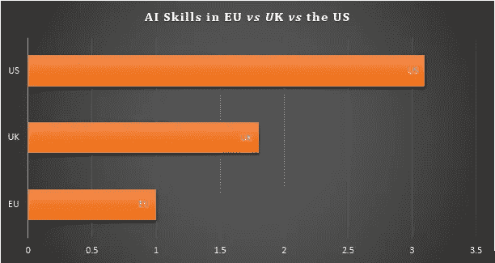
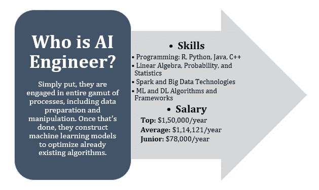
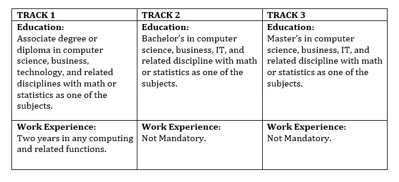

# 2020 年你不应错过的 3 大人工智能工程师认证

> 原文：<https://medium.datadriveninvestor.com/top-3-ai-engineer-certifications-you-should-not-miss-in-2020-4ddfb9616f04?source=collection_archive---------0----------------------->

AI 是当今最热门的蜂群之一，并且还在持续增长。根据[LinkedIn 2020 年新兴工作报告](https://business.linkedin.com/content/dam/me/business/en-us/talent-solutions/emerging-jobs-report/Emerging_Jobs_Report_U.S._FINAL.pdf)，人工智能在未来前景方面继续大步前进。

自动化行业正在为各行业的各种角色招聘人工智能人才。人工智能工程师是机器人、消费电子、金融、IT 甚至数据科学领域的专家。该报告指出，在过去的 4 年里，人工智能工程师的招聘量每年增长 74%。

随着人工智能渗透到人类生活的方方面面，人工智能专家被视为穿着闪亮盔甲的创新骑士，掌握人工智能技能以跟上新出现的角色至关重要。

不久前，Gartner 透露，缺乏具有适当技能的专业人员是人工智能采用面临的最大挑战。在某些地区，这种情况比其他地区更加明显。[欧洲委员会 2020 年 8 月的一份报告提到](https://economicgraph.linkedin.com/content/dam/me/economicgraph/en-us/reference-cards/research/2019/LinkedIn-AI-Talent-in-the-European-Labour-Market.pdf)由于严重缺乏人工智能技能，欧洲的工业前景正在受到破坏。去年，德国公司为一个人工智能职位平均花费 6 个月时间寻找人才。

*LinkedIn Report 2019*

## 今天你有抢人工智能工作的技能吗？

在我们进入一些国际知名的认证项目以建立人工智能专业知识之前，让我们了解一下谁是[人工智能工程师](https://medium.com/@albertchristopherr/a-complete-guide-to-strengthen-your-career-as-an-ai-engineer-33e834d1744)，他们拥有的技能，以及他们的财务价值。

*Glassdoor AI Engineer Salary Estimates in the US*

**以下是一些最佳人工智能工程师认证的列表，这些认证将为一个人的简历增加很多价值，并提供深入的工作知识，以在组织中利用人工智能。**

 [## 一名大学生使用语言生成人工智能工具创建了一个病毒式博客帖子|数据驱动…

### 作为作家，我们喜欢告诉自己，我们处在一个无法自动化的职业中，至少短期内不会。但是…

www.datadriveninvestor.com](https://www.datadriveninvestor.com/2020/09/15/a-college-student-used-a-language-generating-ai-tool-to-create-a-viral-blog-post/) 

# 1.Azure 人工智能工程师助理-微软

该课程由微软提供，评估他们在 Azure 上的人工智能工作能力。该考试衡量一个人在 Azure 上完成技术人工智能任务、分析解决方案、设计解决方案以及在解决方案中集成、部署和管理其人工智能模型的能力。要成为 Azure 人工智能工程师，需要通过 AI-100 认证考试。✏️ **报名:**开

⏲**持续时间:**各不相同

📝**考试方式:**培生 VUE 考试中心。虽然，在线监考在当前疫情的形势下是可行的。

📒**学习和准备:**在线学习和面授学习。后者是有偿的。

## 👉**资格标准:**

Azure AI 工程师助理认证最适合:

-云解决方案架构师，以及从事 Azure 工作的人工智能设计师和开发人员。

-候选人具有认知服务、机器学习、挖掘知识的知识，涉及 NLP、语音和其他。

## 👉**优点:**

这一认证的主要优势之一来自微软 Azure space 的健壮性。Azure 是一个快速发展的人工智能领域，获得相同的认证将有助于专业人员抓住许多跨行业的机会，这些行业正在使用微软 Azure 进行人工智能开发。然而，这也是它最大的局限性。由于认证不是厂商中立的，它限制了工程师对 Azure 的专业知识。

## **新冠肺炎更新:**

为了应对疫情带来的问题，已经做出了很多安排——从考试前 24 小时免费改期到在线监考。

🔗 [**网站链接**](https://docs.microsoft.com/en-us/learn/certifications/azure-ai-engineer)

# 2.人工智能工程师认证-美国人工智能委员会

美国人工智能委员会(ARTIBA)的人工智能工程师(AIE)认证是工程师的高级选择。它很适合数据工程师和其他领域的候选人，他们希望在人工智能领域开拓自己的职业生涯。

该认证是基于国际 AMDEX 人工智能知识标准的强大课程。**AIE**是业内独一无二的厂商中立人工智能工程师认证。它的课程被专家评为顶级，涵盖的主题包括 ML 和 DL 算法、自然语言处理(NLP)、认知计算等。AIETM 专业人员在获得认证后有能力在 AI 领域开展职业生涯。

✏️ **报名:**公开

⏲持续时间:自定进度，但是在注册 45 天后可以参加考试。

📝**考试方式:**网上监考

📒**学习和准备:**免费学习资料——包括由行业专家策划的特殊资源。它旨在帮助候选人发展必要的技能，并提供就业准备能力，以提升领导职位。

## 👉**资格标准:**

满足教育和专业经验相关要求的候选人有资格获得 AIE 认证。总体而言，它们可以分为三类:

ARTIBA AI Engineer Certification Eligibility Criteria

## 👉**优点:**

ARTiBA 是人工智能领域全球公认的认证机构，被各行业雇主视为最佳选择。其人工智能工程师认证的主要优势是:

*   **厂商中立特性**。它使专业人员能够获得广泛的可互换技术、工具和人工智能产品的认证。
*   **提供给所有注册者的学习资料**。这是一个丰富的学习资源的来源，包括印刷和在线，都是根据国际人工智能标准创建的。
*   **数字徽章**，通过 AIE**(人工智能工程师)称号，最大限度地提高个人资料的可见性和知名度。它可以作为姓名后的永久凭证，也是雇主验证的一种简单方式。**

## ****新冠肺炎更新:****

**ARTIBA 已经完全在线参加了 AI 工程师认证考试。现在，您可以在家中或办公室舒适地使用它。**

**🔗 [**网站链接**](https://www.artiba.org/certification/artificial-intelligence-certification)**

# ****3。人工智能工程师程序-** Simplilearn**

**这是 Simplilearn 与 IBM 合作提供的一个 AI 工程师硕士项目。它提供混合学习，并介绍在人工智能职业生涯中取得成功所需的 ML、DL 概念和编程语言。这是一个包含六个课程的顶点项目。**

**✏️ **报名:**公开**

**⏲持续时间:因人而异**

**📝**考试方式:**基于项目和在线**

**📒**学习和准备:**课程期间提供的课程和测验。**

## **👉**资格标准:****

**该计划适合开发人员，计算机科学家，经理，建筑师，分析专业人员，以及其他希望建立人工智能和人工智能基础的毕业生。高级管理人员可以参加该课程，以利用他们的洞察力和深化他们的知识。**

## **👉**优点:****

**基于项目的评估是该认证计划的独特之处之一。**

## ****新冠肺炎更新:****

**它是在线的，并不强制要求任何形式的实体存在。**

**🔗 [**网站链接**](https://www.simplilearn.com/artificial-intelligence-masters-program-training-course)**

**对于一名人工智能工程师来说，这是激动人心的时刻。人工智能能力正以闪电般的速度增长，要求熟练专业人员的崛起。凭借 ***人工智能工程认证*** *站在最新人工智能发展的最前沿，引领未来的科技事业。***

****访问专家视图—** [**订阅 DDI 英特尔**](https://datadriveninvestor.com/ddi-intel)**