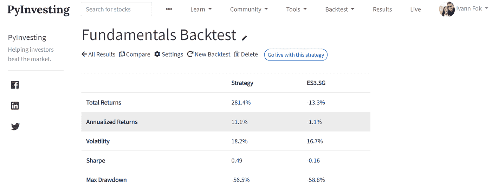

# 决定哪种投资策略适合你的三大因素

> 原文：<https://medium.datadriveninvestor.com/top-3-factors-that-determine-which-investment-strategy-is-right-for-you-f59d4d42c69e?source=collection_archive---------20----------------------->

unsplash.com

谈到投资，每个投资者都有自己的个人品味和偏好。接近退休年龄的投资者往往更保守，更喜欢风险较低的策略，而年轻的在职成年人通常有更高的风险偏好，愿意承受一定的波动以换取更高的回报。无论你选择哪种策略，重要的是你要对它带来的风险感到满意，这样你才能坚持你的策略，避免做出情绪化的决定。

决定哪种投资策略适合你的关键因素有三个。

1.  风险容忍
2.  预期收益
3.  实施战略所需的努力

 [## 将数据隐私转化为你的优势，重建消费者的信任:下一个投资前沿

### 疫情期间，抖音的使用量激增，全球约有 8 亿用户使用该平台…

www.datadriveninvestor.com](https://www.datadriveninvestor.com/2020/09/18/turn-data-privacy-to-your-advantage-and-rebuild-consumers-trust-the-next-investment-frontier/) 

# 风险容忍

第一个因素是你的风险承受能力，也就是你愿意承担多少风险来换取投资回报。一般来说，风险较高的投资策略应该获得较高的回报。你应该选择一个目标风险让你舒服，不会让你夜不能寐的投资策略。

unsplash.com

许多投资者经常被投资策略的高回报所吸引。然而，当市场变得不稳定时，他们开始看到投资组合价值的巨大波动，他们就无法坚持计划，并被抛出头寸。他们以恐慌性抛售结束，并在投资组合中积累了巨额亏损。

衡量策略风险的一种方法是[回溯测试你的投资策略](https://pyinvesting.com/blog/12/heres-why-every-investor-should-backtest-their-investment-strategy/)，找出你策略的最大亏空。

最大提款告诉我们在危机中你的投资组合可能损失的最大金额是多少。例如，在 2008 年危机期间，标准普尔 500 从 2007 年 10 月至 2009 年 3 月的峰值下跌了 55%。

你需要问自己，如果市场崩盘，你准备损失多少，你是否愿意坚持到底。需要逐渐提取资金用于日常开支的退休人员，应该只投资他们能够承受损失的一小部分财富。另一方面，年轻的工作成年人应该承担更多的风险，因为他们有时间安然度过任何市场崩溃。

对于 30 岁的我个人来说，如果像 2008 年全球金融危机这样的黑天鹅事件再次发生，我可以接受投资组合缩水 50%。当我 50 岁的时候，我会对我的投资组合减少 30%感到舒服。

# 预期收益

决定你投资策略的第二个因素是预期回报。为了实现你的财务目标，你需要你的钱增长多快？

unsplash.com

数学表明，如果你每天存 50 美元，以 10%的回报率存 20 年，你最终会有 100 多万美元。然而，如果你的投资策略是预期年收益率为 5%，那么在同样的储蓄率下，你达到 100 万美元是极不可能的。这可能意味着能够提前几年将自己从公司的激烈竞争中解放出来，并能够为你所爱的人提供显著更高的生活水平。

您可以通过使用历史价格对策略进行回溯测试并计算年化回报来衡量策略的预期回报。看看下面的视频教程，了解如何分析你的投资策略的表现。

【https://www.youtube.com/watch?v=fP3_sW0E9Zg】T2&feature = emb _ logo

一旦你从如下所示的回溯测试投资策略中获得年化回报，你可以将该值输入[中央公积金退休计算器](https://www.cpf.gov.sg/eSvc/Web/Schemes/RetirementCalculator/CoverPage)，看看你是否能够实现你的财务目标。

pyinvesting.com

# 需要的努力

第三个因素是你愿意花多少精力来管理你的投资。一些策略比其他策略需要更少的维护工作，会吸引更多放手的投资者。重要的是选择一个策略，这个策略要适合你愿意为实现这个策略付出的努力。这是因为如果你选择了一个需要比你愿意承诺的更多时间来实施的策略，你可能最终会发现管理你的投资组合是一件苦差事，并最终放弃遵循你的策略。

unsplash.com

对于不愿意花大量时间管理投资组合的投资者来说，像[雷伊·达里奥全天候策略](http://www.lazyportfolioetf.com/allocation/ray-dalio-all-weather/)这样的长期策略会非常适合。这种策略包括在特定资产类别(如股票、债券、房地产投资信托基金和大宗商品)中分配固定比例的投资组合，以及每年一次将投资组合重新平衡至投资组合的目标配置。

能够花更多时间管理其投资组合的投资者能够采取更积极的策略，如[移动平均策略](https://pyinvesting.com/backtest/moving-average/)，他们每周监控自己的头寸。注意，积极监控你的头寸并不意味着你每周都在交易。投资者可能只是更频繁地检查每个头寸，但如果他们改变了买入或卖出的信念，他们只会投机性地交易投资组合中的少量股票。

# 回溯测试你的投资策略

在选择我们的投资策略时，重要的是要考虑我们的风险承受能力、我们的预期回报以及我们愿意在管理我们的投资组合上花费的精力。拥有正确的投资策略将使我们即使在市场波动时也能保持投资，并帮助我们实现财务目标。

回溯测试你的投资策略将允许你估计策略的预期风险和回报，并了解管理你的投资组合需要付出的努力。虽然大多数投资组合回溯测试方法涉及编程和统计方面的专业知识，但我们可以使用 PyInvesting.com 等平台来简单地填写表格并创建回溯测试。该网站将使用实时价格运行您的投资策略，并向您发送一封电子邮件，其中包含您需要在个人账户上交易的订单。

坚持到底，希望机会对你有利。

## 获得专家视图— [订阅 DDI 英特尔](https://datadriveninvestor.com/ddi-intel)