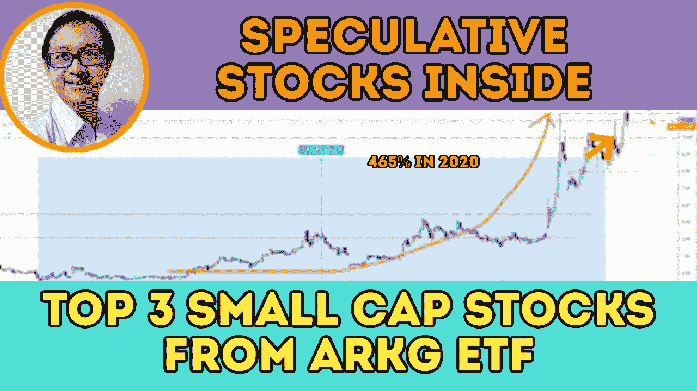

# ARKG ETF 中摇摆交易的三大小盘股——AQB、CLLS 和冲浪

> 原文：<https://medium.datadriveninvestor.com/top-3-small-cap-stocks-in-arkg-etf-for-swing-trading-aqb-clls-surf-8963bc4d5ef2?source=collection_archive---------23----------------------->

从 ARK Invest 的 ARKG ETF 中找出前 3 只小盘股——AQB、CLLS 和 SURF，它们可能在摆动交易中具有巨大的价格结构。

这些小盘股是根据价格结构、交易量和动量从价格行为交易方面选择的。看看下面的视频，了解为什么他们是伟大的摇摆交易，潜在的目标价格和我对这 3 只股票的交易计划。

## 时间戳

*   AQB (AquaBounty 科技公司)
*   [7:15](https://www.youtube.com/watch?v=tUlBsQEI90o&t=435s)AQB 与 H1 的交易计划时间表
*   [9:37](https://www.youtube.com/watch?v=tUlBsQEI90o&t=577s) CLLS (Cellectis)
*   [11:05](https://www.youtube.com/watch?v=tUlBsQEI90o&t=665s)CLLS 交易计划
*   [12:45](https://www.youtube.com/watch?v=tUlBsQEI90o&t=765s) 表面肿瘤公司
*   [15:46](https://www.youtube.com/watch?v=tUlBsQEI90o&t=946s)H1 时段的 SURF 交易计划

# 资源

**每周市场展望&最佳交易建议**直达您的收件箱:[https://www.tradeprecise.com/](https://www.tradeprecise.com/)

**专业免费**制图平台:创建账户→[www.TradingView.com](https://bit.ly/2U2Femd)

**非美国居民？** ( **马来西亚、新加坡**、澳洲、纽西兰、欧洲等……):[点击此处，当您存入 2000 新加坡元](https://ji.hn/sgtiger)时，即可获得**免费股票(价值 100++ &美元)老虎经纪**的欢迎礼物

美国居民？[点击此处，当您存入 1500 美元](https://ji.hn/ustradeup)时，就有机会在 TradeUP 上获得一份**免费的 AMZN 股票(价值 3000++美元** ) & **欢迎礼物**

**从媒体获取无限文章** —加入以下:[https://priceactiontrading.medium.com/membership](https://priceactiontrading.medium.com/membership)

# 进一步阅读

 [## ARK Invest 的 Cathie Wood 预测基因组股表现优于特斯拉？

### 方舟投资公司的首席执行官凯西·伍德预测，最大的上涨惊喜可能来自基因组股票，尤其是…

medium.com](https://medium.com/datadriveninvestor/ark-invests-cathie-wood-predicts-genomic-stocks-outperform-tesla-b67f3c4bbc68)  [## 被低估的高成长股——EVO、EMBRAC、FTCH、MWK、OPEN、SKLZ、UPST

### 2021 年第 2 周市场回顾

medium.com](https://medium.com/datadriveninvestor/underhyped-high-growth-stocks-evo-embrac-ftch-mwk-open-sklz-upst-5105abd20143)  [## 火眼公司和太阳风公司被黑-网络安全股票牛市的开始？

### 2021 年第 1 周市场回顾

medium.com](https://medium.com/datadriveninvestor/fireeye-solarwinds-hacked-start-of-the-bull-run-for-cyber-security-stocks-31e99fd2b8c1) 

Photo by Author — Ming Jong Tey

披露:如果您点击本文中的链接进行购买或开立账户，并将所需金额存入推荐的经纪人账户，我们将免费为您赚取佣金。

免责声明:本演示中的信息仅用于教育目的，不应作为投资建议。