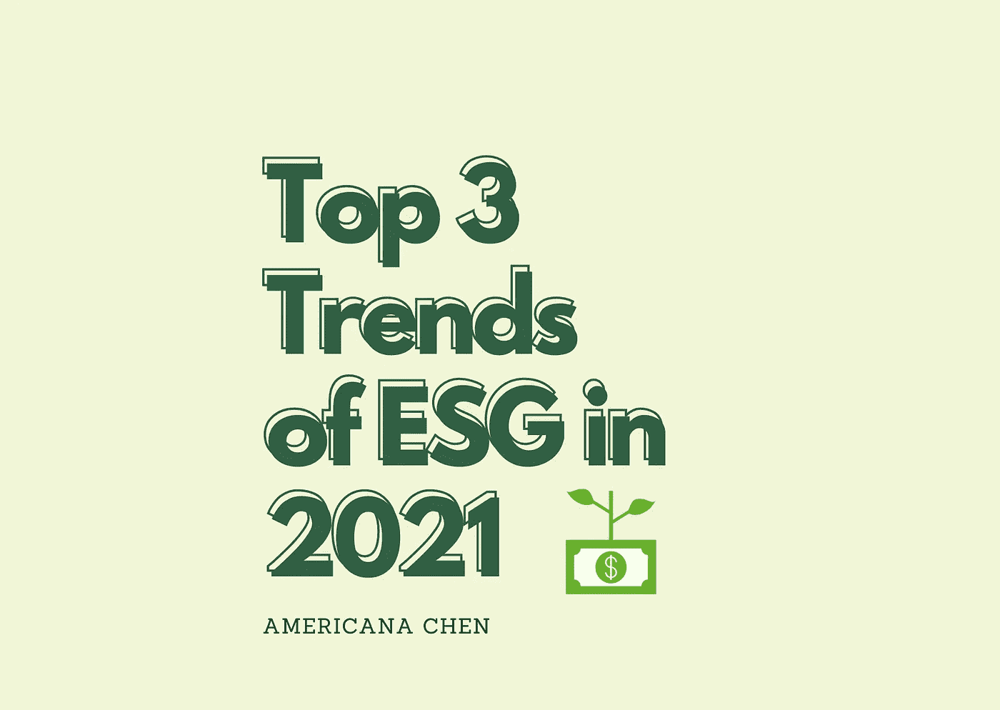
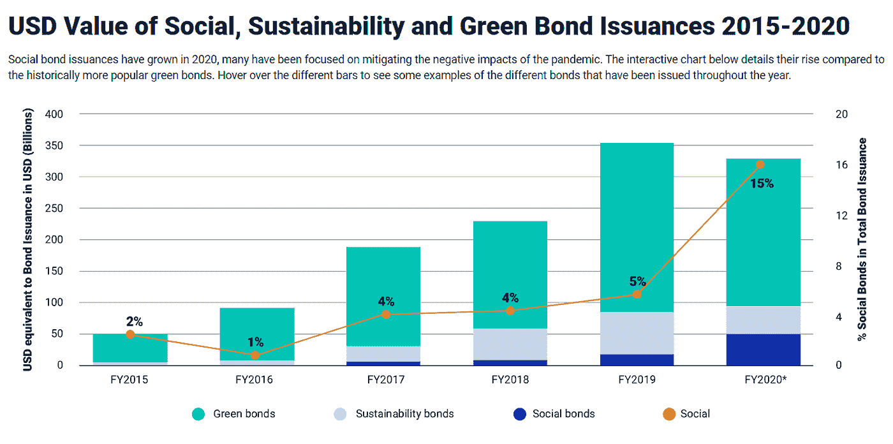
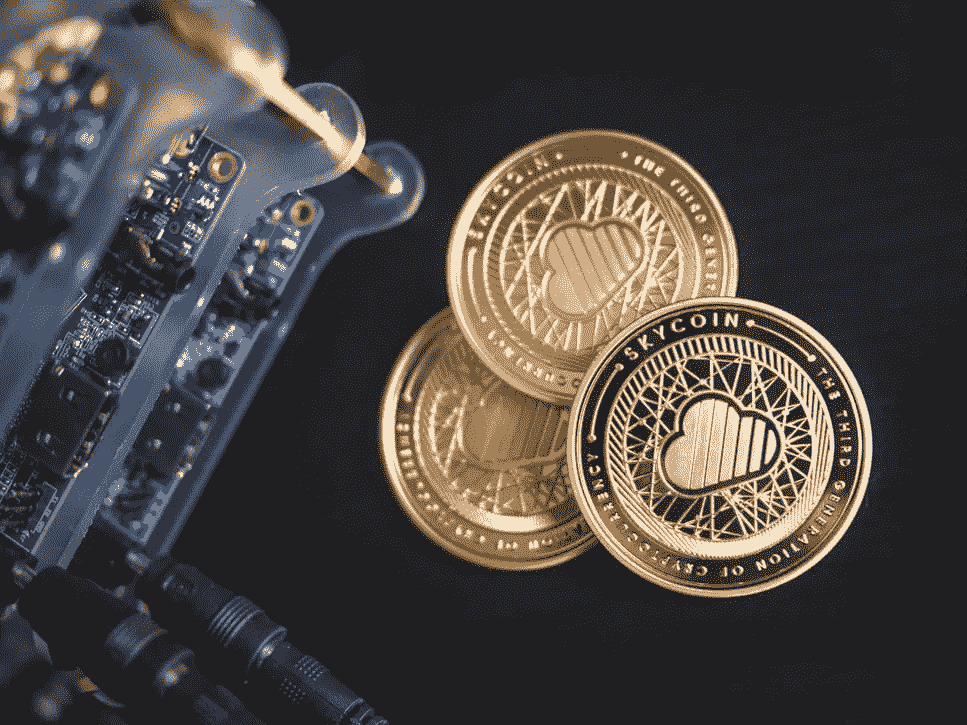

# 2021 年环境、社会和治理的三大趋势:促进可持续投资

> 原文：<https://medium.datadriveninvestor.com/top-3-trends-of-esg-in-2021-fostering-sustainable-investments-e853507c8e44?source=collection_archive---------1----------------------->

# 1.超越碳排放——扩大 ESG 的范围

在过去的几年里，我们一直在尽最大努力与巴黎协定保持一致，并广泛关注气候变化和减少碳排放。然而，我们必须意识到，ESG 代表**【环境、社会和治理】**。这是一个**综合框架**，不仅仅是通过减少碳足迹“走向绿色”的口号。

image source: Unsplash, under [Unsplash License](https://unsplash.com/license).

在环境方面，生物多样性、水污染都越来越受到学术界、政府以及最重要的投资者的关注。生物多样性丧失的经济代价比我们以前想象的要大得多。根据生物多样性和生态系统服务政府间科学政策平台(IPBES)，44 万亿美元的经济价值高度依赖于我们宝贵的大自然。给你一个影响程度的概念，440 亿美元超过了世界 GDP 总量的一半。忽视生物多样性重要性的企业已经越来越意识到其供应链对自然的**“隐性依赖”**。建筑、农业、食品和饮料等行业加起来的价值是德国经济规模的两倍，是受到生物多样性丧失严重损害的前三大行业，栖息地丧失和生态系统破坏的经济成本是巨大的。

> “鉴于自然损失的规模和严重性，企业需要敲响警钟，我们看到的一连串物理、监管和法律、市场和声誉风险意味着自然风险现在需要成为公司企业风险管理的主流问题。
> 
> **— Celine Herweijer，**普华永道英国合伙人兼全球创新和可持续发展负责人

但是，我们仍然必须考虑 ESG 的**‘社交’成分。“社会”位于“环境”和“治理”的中间，它是真正将一切联系在一起的东西。如果没有一个高效而稳定的社会体系，激励政策的实施、环境、社会和公司治理目标的监测和评估将会极其困难。2020 年，新冠肺炎危机给社会不平等带来了重大挑战:学校关闭，小企业无法承受需求紧缩，美国的种族不平等危机。为了维持一个稳定的社会体系，需要更多地关注环境、社会和公司治理的社会方面。**投资者在探索减少社会不平等的创新解决方案方面发挥着关键作用。**在 2021 年，我们可能会看到更多来自企业和投资者的贡献，投资于包含这一方面的金融产品，如**社会债券**，债券的**收益将用于资助促进社会平等的项目**，支持弱势群体。**

[*Source: Climate Bonds Initiative and MSCI ESG Research. Data as of Oct. 15, 2020.*](https://www.msci.com/our-solutions/esg-investing/2021-esg-trends-to-watch/social-inequalities-test-investors-creativity)

**社会债券的比例预计将增长至 15%** ，尽管这些债券的监管和评估不如绿色债券完善，但投资者关注点的转移最终将引起对该领域的更多关注，并促使监管机构实施更多规则和监管措施，积极促进对社会债券的投资。

# 2.ESG 投资的繁荣期

在 ESG 投资发展的早期阶段，投资者最常问的问题是**‘ESG 投资真的表现出色吗？’**。事实上，投资背后的最终驱动力是创造回报，在过去几年中，ESG 金融产品已经证明了自己能够满足投资者的期望。根据 MSCI ESG Research: **在过去 5 年中，在标准普尔 500 指数中 ESG 排名较高的美国公司每年都比 ESG 排名较低的同行高出至少 3%。**优异表现的一致性促使更多投资者愿意考虑将 ESG 投资产品加入他们的投资组合。需求正在急剧上升，仅看美国市场，**2019 年前六个月流入可持续基金的资金达到 89 亿美元**，而 2018 年全年为 55 亿美元。

Image Source: Unsplash, under [Unsplash License](https://unsplash.com/license).

随着需求激增，投资者要求其**资产经理在构建投资组合时采用 ESG 投资**元素的压力越来越大。根据 Russell Investments 的第六次年度 ESG 经理调查，**在各种资产类别和地理区域的 400 名资产经理中，有 78%明确将定性和定量 ESG 因素评估纳入投资流程**。监管机构也在努力推动积极的变革。2021 年 3 月，欧盟可持续财务披露法规将**要求资产管理公司报告其投资的可持续性特征。这将是 ESG 投资范围扩大和深化的驱动力，2021 年 ESG 投资的增长肯定非常乐观。**

 [## 另类投资——它们在后疫情时代的角色|数据驱动的投资者

### 全球疫情的经济影响继续波及全球各行各业。的…

www.datadriveninvestor.com](https://www.datadriveninvestor.com/2020/10/27/alternative-investments-their-role-in-the-post-pandemic-landscape/) 

> *“ESG 不再是可选的‘附件’；现在，这是资产经理必须纳入其决策过程的一个基本考虑因素。*
> 
> **—韩吉·迪奥洛萨**，EMEA 负责投资的负责人

我们已经在个人和资产管理公司中看到了这种趋势，但更重要的是，许多大型银行也在带头为 ESG 投资创造条件。越来越多的银行将其薪酬与资产管理挂钩，以满足 ESG 标准。例如，对于法国巴黎银行来说，这是其浮动薪酬的 20 %, 2020 年 12 月 7 日，德意志银行也披露了其将资产管理薪酬与 2021 年实现可持续金融投资目标相关联的计划。

我们经济中的更多参与者正在加入到将目标与 ESG 目标、巴黎协定和可持续融资相结合的行动中来。随着越来越多的资金投入到这一领域的投资中，这提供了更大的流动性、更乐观的市场条件，并将最终推动更大的回报，并将我们引向**正反馈循环。**

Image Source: Unsplash, under [Unsplash License](https://unsplash.com/license).

促成这一快速增长阶段的另一个因素是，ESG 投资的**类别和资产类型已经扩大，并将在 2021 年继续扩大。**除了我们熟悉的 ESG 债券、ESG ETFs、ESG 股票，很多另类投资也决定融入 ESG 成分。一个活跃的参与者是 **ESG 对冲基金**，随着资产所有者寻求将 ESG 考量融入其整个投资组合，越来越多的对冲基金正在采用 ESG 原则。对冲基金也越来越认识到 ESG 投资是改善风险回报状况的一种手段。ESG 对冲基金主要由多策略对冲基金和股票长/短策略采用，正在快速增长，很可能会看到竞争驱动的 ESG 对冲基金在其他策略中的采用。**房地产业的 ESG**也在大幅增长，“绿色房地产”和“绿色建筑”正在积聚动力，吸引更多投资者。根据世界经济论坛的数据，2016 年已经有 40-48%的新商业建筑是“绿色”的，而 2005 年只有 2%,他们预计这一比例将在 2020 年上升到 55%。其他具有 ESG 政策的资产类别包括**私募股权、风险资本、基础设施和商品市场**。

这些增长因素的组合显然向我们发出信号，ESG 投资肯定会在 2021 年经历繁荣期。

# 3.数据和技术——弥合数据鸿沟

关于 ESG 投资的最大担忧之一是报告 ESG 数据的**标准化和完整性**。我们如何才能更加确信一家公司确实在做有益于环境的事情，而不是仅仅用“绿色清洗”来愚弄受环境、社会和公司治理驱动的投资者？我们如何衡量企业的环境影响，以及它们是如何改进的？什么才算是真正的 ESG 投资？这些问题都可以通过将**准确、高度相关、一致和透明的数据**输入**高效的数据分析工具来回答。**技术将帮助我们做出更明智的决策，我们已经发现了更多创新方法来自动化和改进 ESG 领域的数据收集和分析。

Image Source: Unsplash, under [Unsplash License](https://unsplash.com/license).

人工智能提供了许多可能的解决方案来弥合现有的 ESG 数据差距。一个可以成为解决方案的关键技术是**分散式账本技术(DLT)。** DLT 最出名的是区块链，以及它是支持比特币等加密货币的基础架构。然而，从本质上讲，DLT 是一个不可变的、实时可验证的虚拟化资产共享数据库。这听起来可能令人困惑，但这意味着数据可以被记录和跟踪，而不用担心有人秘密试图改变它。一旦‘块’被附加到链上，**就被验证并且不可更改**(除非有 51%的攻击，这是非常不可能的)。这项技术**保证了 ESG 数据的准确性和可靠性。**

但是数据的收集呢？一个可能的答案是**物联网(IOT)** 。IOT 为我们提供了一种高效、自动化的 ESG 数据收集方法。事实上它是一项已经存在多年的**成熟技术**提高了它对于企业和投资者的**可及性**。绿色供应链 2017 奖的获得者——货物跟踪和监控服务 Arviem 因其使用物联网实时碳足迹监控技术而获奖。当时，物联网在 ESG 数据收集中的使用是开创性的，但现在，更多的物联网解决方案提供商正在转向提供 ESG 数据收集服务。他们的能力，他们可以收集的数据类型已经大大扩展。例如，Microshare 的物联网数据解决方案包括收集与**能效、用水、供应链管理甚至员工健康和安全相关的数据。**物联网数据收集解决方案的进一步民主化将是未来几年 ESG 发展的关键因素。

此外，使用人工智能也可以更好地回答“ESG 投资是否表现优异”这个问题。TruValue Labs 使用人工智能来监控基于 SASB 框架的 100 多万个数据点，以跟踪与 ESG 相关的绩效。这种**基于人工智能的绩效评估方法允许投资经理更好地跟踪和测试将 ESG 投资纳入其投资组合的效果**，这不仅有助于提高未来的绩效，还让投资者和投资组合经理对 ESG 投资的潜力更有信心。

在即将到来的 2021 年，**技术进步，加上在 ESG 数据报告标准化方面将建立的更多法规和规则**，将使**投资者的信任**成为我们致力于寻找更好解决方案的一个重点领域。

# 参考资料:

1.  " ESG 投资能提供更好的股票回报吗？"*美银美林*，[www . BofA ml . com/en-us/content/ESG-investing-research-report . html .](http://www.bofaml.com/en-us/content/esg-investing-research-report.html.)
2.  "房地产业的环境可持续性原则."*世界经济论坛*，[www . we Forum . org/whites/environmental-sustain ability-principles-for-the-real-estate-industry。](http://www.weforum.org/whitepapers/environmental-sustainability-principles-for-the-real-estate-industry.)
3.  "罗素投资研究发现，ESG 不再是资产管理公司的可选“附加产品”. "*机构资产经理*，2020 年 10 月 6 日，[www . institutionalassetmanager . co . uk/2020/10/06/290515/ESG-no-long-optional-add-Asset-managers-founds-Russell-investments-study。](http://www.institutionalassetmanager.co.uk/2020/10/06/290515/esg-no-longer-optional-add-asset-managers-finds-russell-investments-study.)
4.  "生物多样性和生态系统服务全球评估报告."*政府间科学政策平台*，ipbes.net/global-assessment.
5.  琼基尔哈肯伯格。“重新定义‘正常’:2021 年五大 ESG 趋势。”*福布斯*，福布斯杂志，2020 年 12 月 10 日，[www . Forbes . com/sites/jonquilhackenberg/2020/12/10/redefining-normal-the-top-5-ESG-trends-for-2021/？sh=14cf05d314e2。](http://www.forbes.com/sites/jonquilhackenberg/2020/12/10/redefining-normal-the-top-5-esg-trends-for-2021/?sh=14cf05d314e2.)
6.  帕帕多普洛斯、科斯马斯和鲁道夫·阿劳霍。“新十年的十大 ESG 趋势。”*哈佛法学院公司治理论坛*，2020 年 3 月 2 日，corp gov . Law . Harvard . edu/2020/03/02/top-10-ESG-trends-for-The-new-decade/。
7.  路透社，汤姆森。"德意志银行将管理层薪酬与可持续发展目标挂钩."KFGO，2020 年 12 月 7 日，KFGO . com/2020/12/07/Deutsche-bank-to-link-management-pay-to-sustain ability-targets/。
8.  罗素投资(Russell Investments)的第六次年度 ESG 调查显示:“治理”仍是资产管理公司的主要考虑因素，因为他们越来越重视“环境”和“社会因素。”Russell Investments 的第六次年度 ESG 调查| Russell Investments ，Russell Investments . com/us/about-us/news room/2020/Russell-Investments-Sixth-Annual-ESG-Survey-governance-remains-the dominant-consideration-for-asset。
9.  “社会不平等考验投资者的创造力。" *MSCI* ，[www . MSCI . com/our-solutions/ESG-investing/2021-ESG-trends-to-watch/social-inequalities-test-investors-creativity。](http://www.msci.com/our-solutions/esg-investing/2021-esg-trends-to-watch/social-inequalities-test-investors-creativity.)
10.  “趋势:利用大数据、物联网增强供应链、ESG 性能。”*可持续品牌*，2017 年 12 月 6 日，Sustainable Brands . com/read/product-service-design-innovation/trending-harling-big-data-IOT-for-enhanced-supply-chain-ESG-performance。

## 访问专家视图— [订阅 DDI 英特尔](https://datadriveninvestor.com/ddi-intel)