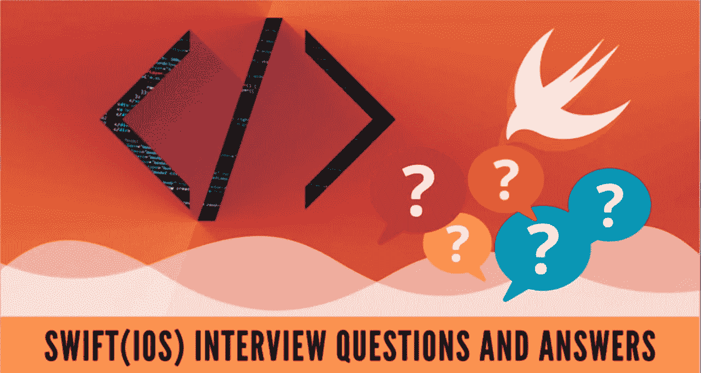
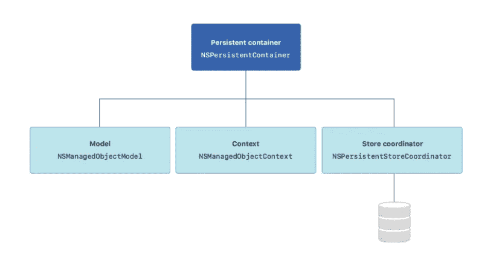

# 40 大 iOS Swift 问题解决方案

> 原文：<https://medium.datadriveninvestor.com/top-40-ios-swift-questions-solutions-d038c7f20a48?source=collection_archive---------5----------------------->

在本文中，我讨论了 40 个问题| Swift 编程



# 1.什么是类型推理？

简而言之，这是一种迅捷的能力。你不需要总是在代码中写变量和常量的类型。例如:

```
// swift know its Int type
var age = 40 // Int 
// You dont need to tell them always like below
var age : Int = 40
```

# 2.什么是泛型？

*通用代码*使您能够编写灵活的、可重用的函数和类型，它们可以根据您定义的需求与任何类型一起工作。

## 用一个例子来理解它:

假设你想换成 Int 类型的值，让我们写一个非泛型函数:

```
func swapTwoInts(_ a: inout Int, _ b: inout Int) {
    let temporaryA = a
    a = b
    b = temporaryA
}var num1 = 4
var num2 = 5
swapTwoInts(&num1 , &num2)
```

> 现在，假设你想交换两个 double 值或两个 string 值，你需要写另一个函数，因为上面的函数只接受 Int 类型。

如果我们有一个函数接受任何类型值并交换它们，这就是泛型所做的。

现在让我们用一个通用函数做同样的事情:

```
func swapTwoValues<T>(_ a: inout T, _ b: inout T) {
    let temporaryA = a
    a = b
    b = temporaryA
}
var num1 = 3
var num2 = 4
swapTwoValues(&num1 , &num2)var str1 = "sdf"
var str2 = "dafdf"
swapTwoValues(&str1 , &str2)
```

现在你可以交换任何类型的值，你不需要写不同的函数来交换不同类型的值。

*   t 是一个占位符，称为类型参数。

**我们在 swift 中使用数组，这也是一种通用类型**

*   数组<element>，字典</element>

# 3.什么是协议？

它是适合特定任务的方法、属性和其他需求的蓝图，可以被类、结构或枚举所采用。

> ***协议不包括任何实现！！！！***
> 
> *T* ***采用该协议的类型应该具有给定协议中存在的所有方法。这个动作叫做整合协议。***

其语法如下所示:

```
protocol Vehicle {
  func accelerate()
  func stop()
}class Unicycle : Vehicle {
  var peddling = false
  func accelerate(){
    peddling = true
  }
  func stop() {
    peddling = false
  }
}
```

# 4.什么是元组？

有时数据是成对或成组的。这方面的一个例子是 2D 网格上的一对(x，y)坐标。类似地，3D 网格上的一组坐标由 x 值、y 值和 z 值组成。在 Swift 中，您可以通过使用元组以非常简单的方式表示这种相关数据。

```
let coordinates: (Int, Int) = (2, 3)
```

# 5.Swift 中的可变性呢？

常量( *let* )在 swift 中是常量，变量( *var* )是变量。

# 6.什么是下标？

使用*下标*可以快速访问集合的成员元素。

下标包括:

*   收藏的名称，如`scores`
*   两个方括号`[`和`]`
*   支架内的*键*或*索引*

> ***默认情况下，可以对数组、字典、集合、列表、序列使用下标。也可以用*** `***subscript***` ***函数实现自己的。***

```
subscript(parameterList) -> ReturnType {
 get {
 // return someValue of ReturnType
 }
 set(newValue) {
 // set someValue of ReturnType to newValue
 }
```

# 7.什么是可选的？

可选方案是 Swift 解决既有价值又无价值问题的方案。可选的允许保存一个值或零。

# 8.你可以用什么方法打开一个可选的？

**我们可以通过以下方式解开任何可选的:**

1.  通过可选绑定
2.  通过强制展开
3.  通过守卫声明
4.  通过零合并

## 可选绑定(如果有)

最简单的方法是打开一个可选的。

```
var authorName : String? = "Mohd Yasir"if let authorName == authorName {
    print("Author name is \(authorName)")
else{
    print("No Author Name")
}
```

## 通过强制展开

为了强制展开，我们使用“！”。

```
var authorName : String? = "Mohd Yasir"
print("Auhor name : \(authorName!)")
```

## 守卫声明

有时你想检查一个条件，只有当条件为真时才继续执行一个函数，比如当你使用 optionals 时。想象一个从网络上获取一些数据的函数。如果网络中断，提取可能会失败。封装这种行为的通常方法是使用可选的，如果获取成功，它将有一个值，否则为零。

在这种情况下，Swift 有一个有用且强大的功能可以提供帮助:T2 守卫声明 T3。

```
func testingGuard( _ name : String?){
    guard let unrappedname = name else {
        print("You dont entered any name")
        return 
    }
    print("Hello , \(unrappedname)")
}
```

## 零合并

```
let name = String? = nil
let unwrappedName = name5 ?? "Unkonwn"
```

# 9.Swift 中会发生什么样的内存分配？

**在短栈和堆里**

当你创建一个引用类型，比如**类**时，系统将实际的实例存储在一个叫做**堆**的内存区域中。值类型的实例，比如一个**结构**驻留在一个叫做**堆栈**的内存区域中。

# 10.堆栈内存和堆内存有什么区别？

*   系统使用堆栈来存储执行的即时线程上的任何内容；它由 CPU 严格管理和优化。当一个函数创建一个变量时，堆栈存储该变量，然后在函数退出时销毁它。因为堆栈是如此严格地组织的，所以它非常有效，因此也非常快。
*   系统使用堆来存储引用类型的实例。堆通常是一个大的内存池，系统可以从中请求和动态分配内存块。寿命是灵活的和动态的。堆不会像栈那样自动销毁它的数据；要做到这一点，还需要做更多的工作。与在堆栈上相比，这使得在堆上创建和移除数据的过程更慢。

# 11.什么是输入输出参数？

函数参数默认为常量，也就是说不能修改。为了说明这一点，请考虑以下代码:

```
func incrementAndPrint(_ value: Int) {  
    value += 1  
    print(value) 
}
```

这会导致一个错误:

```
Left side of mutating operator isn't mutable: 'value' is a 'let' constant
```

这种行为称为复制入复制出或按值结果调用。你这样做:

```
func incrementAndPrint(_ value: inout Int) {  
    value += 1 
    print(value) 
}
```

参数类型前的 inout 指示该参数应该被复制进来，即在函数中使用的本地副本，并在函数返回时被复制回来。

## 与符号(&)

您需要稍微调整一下函数调用来完成这个例子。在参数前添加一个&符号，这可以在调用位置清楚地表明您使用的是复制入复制出:

```
var value = 5 
incrementAndPrint(&value) 
print(value)
```

# 12.同步和异步的区别是什么？

异步意味着，你可以一次执行多件事情，并且你不必为了继续下一件事情而完成当前的事情。同步基本上意味着一次只能执行一件事。

# 13.如何将数据从一个 ViewController 传递到另一个？

您可以通过 6 种方式在 Swift 视图控制器之间传递数据:

1.  通过使用实例属性(A → B)
2.  通过使用片段(对于故事板)
3.  通过使用实例属性和函数(A ← B)
4.  通过使用委托模式
5.  通过使用闭包或完成处理程序
6.  通过使用`NotificationCenter`和*观察器*模式

# 14.Swift 中的完成处理程序是什么？

完成处理程序是一个闭包(“一个自包含的功能块，可以在代码中传递和使用”)。它作为参数传递给一个函数，然后在该函数完成时被调用。

完成处理程序的目的是告诉调用该函数的任何东西它已经完成了，并且可以选择给它一些数据或一个错误。有时它们被称为回调，因为它们回调了调用它们的函数。示例:

```
import UIKitlet firstVC = UIViewController()
let nextVC = UIViewController()firstVC.present(nextVC, animated: true, completion: { () in print("Welcome") })
```

# 15.Swift 使用什么编译器？

Swift 编译器使用 LLVM。

# 16.Swift 中的懒是什么？

在简单的"*中，惰性存储属性是一个直到第一次使用时才计算初始值的属性。*”

# 17.解释核心数据？

~苹果文档

*   这是一个框架💯

苹果公司表示:“*使用核心数据保存应用程序的永久数据以供离线使用，缓存临时数据，并在单个设备上为应用程序添加撤销功能。*”😮

核心数据为您提供了以下功能:持久性、单个或批量更改的撤销和重做、后台数据任务、视图同步、版本控制和迁移等..。

## 创建核心数据模型

> *使用核心数据的第一步是创建数据模型文件。在这里，您可以定义应用程序对象的结构，包括它们的对象类型、属性和关系。*

通过选中“使用核心数据”复选框，您可以在创建项目时创建核心数据模型。

## 核心数据堆栈

创建数据模型文件后，设置协作支持应用程序模型层的类。这些类统称为核心数据堆栈。

有几个核心数据组件:



*   `NSManagedObjectModel`的一个实例代表你的应用程序的模型文件，描述你的应用程序的类型、属性和关系。
*   一个`NSManagedObjectContext`实例跟踪你的应用程序类型的变化。
*   一个`NSPersistentStoreCoordinator`实例从商店中保存和获取你的应用程序类型的实例。
*   `NSPersistentContainer`的一个实例一次设置了模型、上下文和存储协调器。

## 核心数据中的不同数据类型

许多应用程序需要持久化并呈现不同种类的信息。核心数据提供不同的属性，包括所有数据库通用的属性，如`Date`或`Decimal`类型，以及用`Transformable`类型处理的非标准属性。

# 18.什么是哨兵值？

代表特殊情况(如缺少值)的有效值称为标记值。这就是你的空字符串。🙂

# 19.自动参考计数

Swift 使用 ARC 来跟踪和管理应用程序的内存使用情况。当不再需要类实例时，ARC 会自动释放这些实例所使用的内存，您不需要考虑内存管理。

但在少数情况下，ARC 需要更多关于代码各部分之间关系的信息，以便为您管理内存。

> *引用计数仅适用于类的实例。结构和枚举是值类型，而不是引用类型，并且不通过引用来存储和传递。*
> 
> *我会就这个话题发表一整篇文章，提供更多细节！*

# 20.什么是嵌套可选？

考虑下面的嵌套可选——它对应于盒中盒中盒内的一个数字。

[](https://www.datadriveninvestor.com/2020/10/23/how-i-became-an-independent-researcher-of-the-tangled-net-of-economic-development-funding/) [## 我是如何成为经济发展资金纠结网的独立研究员|数据…

### 我很少发现自己处于一种看似独立的自由形式的身体抑郁状态，这种状态使人…

www.datadriveninvestor.com](https://www.datadriveninvestor.com/2020/10/23/how-i-became-an-independent-researcher-of-the-tangled-net-of-economic-development-funding/) 

# 21.什么是房产观察家？

当属性将要改变时调用 willSet 观察器，而在属性改变后调用 didSet 观察器。它们的语法类似于 getters 和 setters:

```
struct S {
    var stored: String {
        willSet {
            print("willSet was called")
            print("stored is now equal to \(self.stored)")
            print("stored will be set to \(newValue)")
        } didSet {
            print("didSet was called")
            print("stored is now equal to \(self.stored)")
            print("stored was previously set to \(oldValue)")
        }
    }
}var s = S(stored: "first")
s.stored = "second"
```

*   威尔塞特被称为
*   存储现在等于第一
*   存储将被设置为秒
*   didSet 被调用
*   存储现在等于秒
*   存储先前被设置为第一

# 22.什么时候你会说一个 app 处于活跃状态？

当一个应用程序接受事件并在前台运行时，它被称为处于活动状态。

# 23.Viewdidload 和 Viewdidappear 有什么区别？

*   Viewdidload 在加载到内存中时被调用。
*   当视图可见并呈现在设备上时，将调用 Viewdidappear。

# 24.你说的并发是什么意思？

并发是程序中的一种情况，在这种情况下，两个或多个任务被独立定义，并且每个任务都可以独立于另一个任务执行，即使另一个任务也在同时执行。

# 25.iOS 中实现并发的方式有哪些？

在 iOS 中实现并发的三种方式是:

*   线
*   调度队列
*   操作队列

# 26.什么是线程？

据苹果公司称:

> 当您需要执行一项冗长的任务，但又不想让它阻塞应用程序其余部分的执行时，线程尤其有用。特别是，您可以使用线程来避免阻塞应用程序的主线程，主线程处理用户界面和事件相关的操作。线程还可以用来将一个大型作业分成几个较小的作业，这可以提高多核计算机的性能。”

# 27.什么是基础中的调度队列？

据苹果公司称:

> *管理应用程序主线程或后台线程上串行或并发任务执行的对象。*

# 28.前景和背景的区别？

前景包含用户正在使用的应用程序，背景包含幕后的应用程序。

# 29.班级

与值类型相反，类是引用类型。您创建一个类，如下所示:

```
class Person {
    var firstName: String
    var lastName: Stringinit(firstName: String, lastName: String) {
        self.firstName = firstName
        self.lastName = lastName
    }

    var fullName: String {
        return "\(firstName) \(lastName)"
    }
}let john = Person(firstName: "Johnny", lastName: "Appleseed")
```

在 Swift 中，结构的实例是不可变的值，而类的实例是可变的对象。类是引用类型，所以类类型的变量不存储实际的实例——它存储对内存中存储实例的位置的引用。

## 堆栈 vs 堆来了！

当创建引用类型(如 class)时，系统将实际的实例存储在称为堆的内存区域中，而值类型(如 struct)的实例驻留在称为堆栈的内存区域中。

*   系统使用堆栈来存储执行的即时线程上的任何内容；它由 CPU 严格管理和优化。当一个函数创建一个变量时，堆栈存储该变量，然后在函数退出时销毁它。因为堆栈是如此严格地组织的，所以它非常有效，因此也非常快。
*   系统使用堆来存储引用类型的实例。堆通常是一个大的内存池，系统可以从中请求和动态分配内存块。寿命是灵活的和动态的。堆不会像栈那样自动销毁它的数据；要做到这一点，还需要做更多的工作。与在堆栈上相比，这使得在堆上创建和移除数据的过程更慢。

## 使用引用

```
var homeOwner = john 
john.firstName = "John" 
john.firstName // "John" 
homeOwner.firstName // "John"
```

> *类实例之间的共享产生了一种新的传递事物的思维方式。例如，如果 john 对象发生变化，那么任何包含对 john 的引用的对象都会自动看到更新。如果你正在使用一个结构，你将不得不单独地更新每个副本，否则它将仍然有旧的值“Johnny”。*

## 标识运算符

因为类是引用类型，所以多个常量和变量在幕后引用同一个类实例是可能的。

在 Swift 中，===运算符允许您检查一个对象的标识是否等于另一个对象的标识:

```
john === homeOwner // truelet newInstance = Person(firstName: "Johnny",  lastName: "Appleseed")newInstance === John // false
```

# 30.什么是 MVC？

MVC 代表模型视图控制器。模型代表应用程序数据；视图在屏幕上画东西；控制器管理模型和视图之间的数据流。模型和视图从不直接相互通信，而是依靠控制器来协调通信。

# 31.@State 是什么？

如果您将@State 分配给一个属性，SwiftUI 将监控该属性，如果它发生变异或更改，将使当前布局无效并重新加载。

不需要调用 refresh 调用(或 reloadData()，正如您以前在 CollectionViews 和 TableViews 中看到的那样)。

# 32.什么是修饰语？

这是一种呈现自定义交互和装饰的方式。`**font()**`、`**background()**`和`**clipShape()**`就是一些例子。

# 33.什么是嵌套语法？

一个简单的例子是在导航视图中嵌套一个列表。

# 34.SwiftUI 中的分组是什么？

假设您编写了以下代码:

```
VStack {
    Text("Line")
    Text("Line")
    Text("Line")
    Text("Line")
    Text("Line")
    Text("Line")
    Text("Line")
    Text("Line")
    Text("Line")
    Text("Line")
}
```

这样做很好，但是如果您尝试添加第 11 段文本，您将得到如下错误:

```
ambiguous reference to member 'buildBlock()'
```

这是因为 SwiftUIs 视图构建系统有各种代码，旨在让我们添加 1 个视图、2 个视图或 4 个、5 个、6 个、7 个、8 个、9 个和 10 个视图，但不能用于 11 个及以上的视图，这不起作用。

但是我们可以这样做:

```
**var** body: some View {
    VStack {
        Group {
            Text("Line")
            Text("Line")
            Text("Line")
            Text("Line")
            Text("Line")
            Text("Line")
        } Group {
            Text("Line")
            Text("Line")
            Text("Line")
            Text("Line")
            Text("Line")
        }
    }
}
```

这产生了完全相同的结果，除了现在我们可以超越 10 个视图的限制，因为`**VStack**`只包含两个视图——**两个**组。

# 35.什么是组合？

Combine 是 Swift 自己的 Reactive Streams 版本，它支持对对象进行监控(观察),并将数据通过流从核心应用程序逻辑传回 UI 层。

# 36.Swifts 字典用什么函数？

Swift 使用 **SipHash** 散列函数来处理许多散列值计算。

# **37。Swift 中的 init()是什么？**

初始化是准备使用枚举、结构或类的实例的过程。

# **38。iOS swift 中使用的控制转移语句有哪些？**

1.  返回
2.  破裂
3.  继续
4.  失败

# **39。swift 中的代表是什么？**

委托是一种设计模式，用于在结构或类之间传递数据或通信。委托允许在特定事件发生时将消息从一个对象发送到另一个对象，并用于处理表视图和集合视图事件。

# **四十。什么是可选链接？**

可选链接是一个有用的过程，我们可以结合可选链接来调用可选链接上的方法、属性和下标，这些值可能为零，也可能不为零。在这个过程中，我们可能会尝试从可选值链中检索一个值。

# 从这里去哪里？

> ***我的领英****:*[*linkedin.com/in/my-pro-file*](https://www.linkedin.com/in/my-pro-file)

**检查这个:**[**https://bit.ly/38k4w7l**](https://bit.ly/38k4w7l)

为了取得联系，阅读那些有用的文章，在这里关注我[。](https://mdcode2021.medium.com/)

**谢谢！** [](http://linkedin.com/in/my-pro-file)

## **访问专家视图— [订阅 DDI 英特尔](https://datadriveninvestor.com/ddi-intel)**