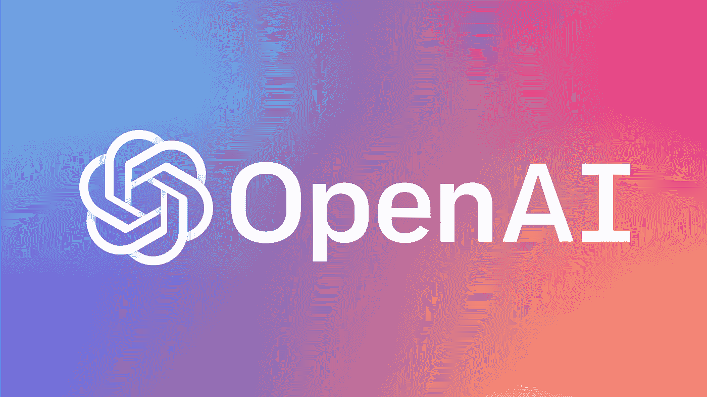

# 2020 年将跟进的 5 大人工智能博客

> 原文：<https://medium.datadriveninvestor.com/top-5-ai-blogs-to-follow-in-2020-7133ba2e7de1?source=collection_archive---------1----------------------->

## 保持对人工智能新闻的关注的最好方法是什么？

Top AI blogs to follow

就我个人而言，我通过这些博客关注人工智能领域的最新进展:

# [麻省理工学院新闻——人工智能](https://news.mit.edu/topic/artificial-intelligence2)

[MIT News — Artificial Intelligence](https://news.mit.edu/topic/artificial-intelligence2)

这是麻省理工学院(MIT)的教育博客，致力于向公众更新关于其学生、员工和组织的新闻和成就。这个博客涵盖了人工智能的最新趋势以及人工智能应用的不同领域。所以，如果你正在寻找一种方法来跟踪人工智能行业的最新消息，那么就关注这个博客，永远不要错过正在发生的事情。

# [谷歌研究博客](https://research.google.com/)

[Google Research blog](https://research.google.com/)

谷歌研究博客解决计算机科学和相关领域最具挑战性的问题。这个博客涵盖了广泛的人工智能研究领域。这个博客是如此独特，因为他们的大部分研究工作没有被任何其他组织进行过。他们在这个博客上也有一个研究事件的列表。

 [## 人工智能帮助你聪明理财|数据驱动的投资者

### 自动化和人工智能为创新平台提供动力，简化双方的财务流程…

www.datadriveninvestor.com](https://www.datadriveninvestor.com/2020/09/02/artificial-intelligence-helps-you-be-smart-with-money/) 

## [人工智能趋势](https://www.aitrends.com/)

《人工智能趋势》专注于人工智能技术和商业。该博客面向商业受众，特别关注那些寻找最新人工智能趋势信息的高管。它提供了关于如何以及何时在他们的业务中实施新技术的建议。

## [分析 Vidya](https://www.analyticsvidhya.com/)

[Analytics Vidya](https://www.analyticsvidhya.com/)

分析 Vidhya 为您带来了由数据从业者、思想领袖和利用数据为其业务创造价值的企业组成的社区的力量。从 AnalyticsVidhya 的专家开发的资源中学习，参加黑客马拉松，掌握最新数据科学问题的技能，并向世界展示您的技能。

## [OpenAI](https://twitter.com/openai)

[OpenAI](https://twitter.com/openai)

OpenAI 是一个非营利性的研究小组，其使命是建立人工通用智能或 AGI。这个人工智能博客收集了关于 AGI 开发和使用的前沿研究和故事。这个博客是有教育意义的，并且提供了一些有用的信息，比如人工智能安全方面的例子。

***感谢阅读本帖。***

# 想看程序员幽默？

 [## 编程幽默第 2 部分

### 继续笑，因为太搞笑了…

medium.com](https://medium.com/datadriveninvestor/programming-humor-part-2-f92cf5a26f2b)  [## 史上最搞笑的代码注释

### 程序员幽默:是的，实际上是程序员写的！

medium.com](https://medium.com/datadriveninvestor/the-most-hilarious-code-comments-ever-bae3cb1030b5)  [## 编码原罪:令人捧腹的开发者自白

### “白板”是如何被嘲笑的

medium.com](https://medium.com/datadriveninvestor/coding-sins-hilarious-developer-confessions-f55eb342454e)  [## 10 个让你着迷的诙谐编程笑话

### 这些太搞笑了…

medium.com](https://medium.com/datadriveninvestor/10-witty-programming-jokes-that-will-make-you-go-rofl-a53fbfb91943) 

# 推荐文章-

 [## Python 迭代器、生成器和装饰器变得简单

### 快速实施指南

medium.com](https://medium.com/python-in-plain-english/python-iterators-generators-and-decorators-made-easy-659cae26054f)  [## 你应该知道的 23 种数据科学技术！

### 使用这些技巧来节省你的宝贵时间

medium.com](https://medium.com/ai-in-plain-english/23-data-science-techniques-you-should-know-61bc2c9d1b3a)  [## 编码原罪:令人捧腹的开发者自白

### “白板”是如何被嘲笑的

medium.com](https://medium.com/datadriveninvestor/coding-sins-hilarious-developer-confessions-f55eb342454e)  [## 面向数据科学家的 5 项酷炫先进熊猫技术

### 使用这些技巧…

medium.com](https://medium.com/datadriveninvestor/5-cool-advanced-pandas-techniques-for-data-scientists-c5a59ae0625d)  [## Stack Overflow 分析了来自 60，000 多名软件开发人员的数据，包括他们的工作时间、语言…

### 以下是他们的发现…

medium.com](https://medium.com/datadriveninvestor/stack-overflow-analyzed-data-from-60-000-software-developers-hours-they-work-languages-they-476ac6ca0197)  [## 高级 Python 变得简单—第 4 部分

### 使用这些技巧和技术…

medium.com](https://medium.com/datadriveninvestor/advanced-python-made-easy-part-4-a4996ba9fe19)  [## 高级 Python 变得简单—第 1 部分

### 使用这些技巧和技术…

medium.com](https://medium.com/datadriveninvestor/advanced-python-made-easy-part-1-ce1e2f17431e)