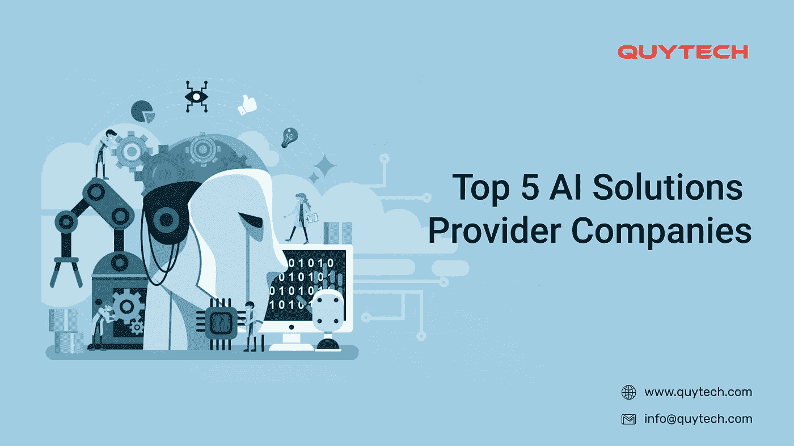
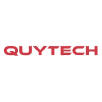

# 您的人工智能应用程序开发项目可以依赖的 5 大人工智能解决方案提供商公司

> 原文：<https://medium.datadriveninvestor.com/top-5-ai-solution-providers-you-can-rely-for-your-ai-app-development-project-5e81ae0291f7?source=collection_archive---------3----------------------->

通过在机器中模拟智能行为和像人类一样思考的能力，人工智能正在改变医疗保健、汽车、IT 和所有其他行业。该技术使机器能够利用 ML 驱动的解决方案来实现 ***自动化重复性任务，降低运营成本，提高工作效率*** 。

从允许车辆无人驾驶，自动回复电子邮件，帮助医疗专业人员进行各种测试和诊断，到帮助银行，IT 和其他公司提供支持服务，人工智能的好处不可胜数。

 [## 人工智能和监督资本主义|数据驱动的投资者

### 大科技，总是现在:人工智能推动的大科技，已经使购物，搜索，在你的…

www.datadriveninvestor.com](https://www.datadriveninvestor.com/2020/03/04/on-artificial-intelligence-and-surveillance-capitalism/) 

为了提升业务并为客户提供无与伦比的体验，初创企业和成熟的组织都在将人工智能集成到他们现有的以及新的网络或移动应用程序中。如果您也想充分利用这项技术来推进您的业务运营，那么这篇文章就是为您准备的。

# 人工智能的趋势

据 [IDC](https://www.idc.com/getdoc.jsp?containerId=prUS47482321) 称，人工智能市场预计到 2024 年将达到令人印象深刻的 5543 亿美元的收入。自从新冠肺炎疫情袭击地球以来，人工智能的潜在好处只是增加了。

随着组织寻求自动化日常流程和分析受 COVID 影响的数据集，AI 变得越来越重要。此外，自从实施封锁和在家工作政策以来，企业之间的技术联系比以往任何时候都更加紧密。

让我们来看看 2021 年的顶级人工智能趋势。

**增强云和人工智能协作**

2021 年，人工智能将在云解决方案的广泛使用中发挥至关重要的作用。通过部署人工智能，监控和管理云资源以及大量可用数据将变得更加容易。

**IT 解决方案中的人工智能**

2021 年，为 IT 创造的人工智能解决方案的数量将会上升。能够独立检测典型 IT 问题并自我纠正任何微小缺陷或故障的人工智能解决方案将在未来几年变得更加流行。这减少了停机时间，并允许团队在专注于其他事情的同时处理高复杂性的项目。

**AIOps 越来越受欢迎**

近年来，IT 系统的复杂性不断增加。据 Forrester 称，供应商将要求平台解决方案集成多个监控领域，如应用程序、基础架构和网络。借助 AIOps 解决方案和增强的数据分析，IT 运营部门可以增强其核心流程、决策和活动。Forrester 敦促 IT 主管寻找 AIOps 提供商，这些提供商通过提供端到端的数字体验、数据关联和 IT 运营管理工具链的集成来实现跨团队合作。

**人工智能将协助数据结构**

未来将使用自然语言处理和机器学习方法来组织更多的非结构化数据。组织将采用这些技术来生成数据，RPA(机器人流程自动化)技术可以利用这些数据来自动化组织内部的事务性活动。它唯一的限制是只能使用结构化数据。然而，在人工智能的帮助下，非结构化数据可以很容易地转化为结构化数据，从而提供特定的输出。

**对道德人工智能的需求正在增加**

对有道德的人工智能的需求越来越大。据 Forrester 称，未来十年将要求首席信息官适应数字化加速，同时通过合乎道德地使用人工智能来主动管理不确定性和业务连续性。随着趋势的快速变化，基于价值观的客户和员工希望公司在道德上部署人工智能。在接下来的几年里，企业将积极寻找致力于数据伦理的合作伙伴。

**网络安全和数据泄露的人工智能**

在接下来的几年里，知识将变得更容易获得，数字数据将更容易受到黑客和欺骗威胁的危害。人工智能和新技术将协助安全部门在所有领域打击敌对行动。随着网络安全措施的增加，人工智能将在未来帮助网络犯罪。人工智能框架将检测符合犯罪倾向的虚假数字活动。

**量子 AI**

成熟的公司将利用量子优势来测量量子位，以用于超级计算机。因为量子比特，量子计算机解决问题的速度比传统计算机更快。此外，它们有助于数据分析和预测各种不同的模式。因此，量子计算机将协助几家公司识别无法解决的困难，并预测适当的补救措施。未来的计算机还将在医疗保健、金融和化学领域实现广泛的用例。

让我们拭目以待人工智能的这些进步如何实现，以及它们在未来会带来什么样的想法。

经过深入的研究和分析，我们为您挑选了前五名*[***人工智能解决方案提供商***](https://www.quytech.com/artificial-intelligence-solutions.php) 您可以指望获得最可靠的人工智能服务:*

1.  ***Quytech: AI 开发公司***

**

*凭借高度先进的人工智能解决方案，该公司正在满足全球范围内对人工智能应用的激增需求。该公司成立于十年前，拥有一支经验丰富、技术娴熟的 ***人工智能开发团队，为教育、游戏、医疗、营销、支持和其他领域提供高端应用。****

*Quytech 为初创企业和企业设计和开发人工智能解决方案。自成立以来，该公司已经向各种垂直业务领域的客户交付了 500 多个项目。他们擅长开发人工智能支持视觉搜索解决方案、欺诈检测解决方案、人工智能支持的视频分析、基于人工智能的推荐引擎、预测引擎、人工智能支持的诊断解决方案、数据注释解决方案、对话式人工智能解决方案等等*

***2。** **全球 Vox: AI 解决方案开发***

**

*Global Vox 是一家著名的人工智能服务公司，提供强大和可扩展的人工智能移动应用程序，以推动业务增长。该公司成立于 2002 年，在世界各地提供高度适应性的人工智能服务。Global Vox 的 AI 开发人员团队了解您的业务需求，然后将先进的 AI 解决方案集成到 it 中，以超越您的竞争对手。作为顶级人工智能应用程序开发公司之一，Global Vox 保证提供能够为您的企业带来敏捷性和效率的人工智能应用程序。*

*3.Webtunix:一家人工智能公司*

**

*Webtunix 是另一家领先的人工智能解决方案提供商公司，为各种商业垂直领域提供人工智能开发解决方案。Webtunix 的开发人员在自然学习过程(NLP)、深度学习、机器学习、数据科学和其他属于人工智能类别的技术方面拥有实践经验。通过利用人工智能的潜力，该公司帮助企业升级他们的流程，并达到另一个成功水平。其人工智能解决方案旨在节省时间、降低成本和提高业务效率。*

***4。** **Intellectyx: AI 开发公司***

**

*Intellectyx 是一家受欢迎的人工智能开发公司，提供由机器学习和该领域其他新兴技术支持的人工智能开发解决方案。凭借先进和定制的人工智能服务，Intellectyx 帮助企业发展并取得成功。从建筑、旅游、零售、电子商务、医疗保健、保险、金融到体育，该公司已经成功地为几乎所有的业务领域提供了人工智能解决方案。*

***5。** **飞马一号:AI 解决方案开发***

**

*通过利用机器学习、计算机视觉、自然学习过程的潜力，Pegasus One 向创业公司和企业提供人工智能解决方案和咨询服务。该公司协助企业将人工智能集成到现有的应用程序中，以匹配最新技术的水平。它还为医疗保健、零售、金融、保险和其他领域开发新的高级人工智能解决方案，以帮助他们精确高效地执行各种任务。*

*现在，当你有了在[人工智能开发](https://www.quytech.com/ai-development-company.php)领域的五个大牌的名单时，联系他们，为你的企业获得一个量身定制的人工智能应用。*

*了解更多:[美国 7 大机器学习公司](/top-7-machine-learning-companies-in-the-usa-705947fc0237)*