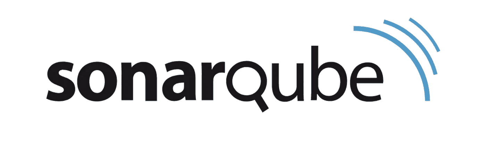

# 工程经理的 5 大代码质量工具

> 原文：<https://medium.datadriveninvestor.com/top-5-code-quality-tools-for-engineering-managers-5ccdfd2f13b3?source=collection_archive---------32----------------------->

## 为了迎合代码质量问题，现在有几个在线工具可用

# 代码质量工具

随着技术的进步，计算和开发行业正在急剧扩张。编程正在成为世界就业市场的主要股东。软件开发、web 开发和软件工程已经成为未来的领域。它们不仅保证了高端工作，还提供了巨大的发展空间。

代码质量一直是这些社区的主要问题。随着该行业的蓬勃发展，越来越多的人倾向于获得这些领域的学位。因此，导致大量低质量的程序员进入计算和开发领域。

为了迎合代码质量问题，现在有几种在线工具可用。讨论市场上的一些最佳选择:

# 1.索纳库贝

SonarQube 是一个在线代码审查工具，它可以确保所有的编码模块都经过质量分析。它有一系列的特性，可以帮助你毫不费力地写出高质量的代码。

SonarQube 主要处理注释、错误、编码规则、重复和复杂性，确保您的代码始终保持最佳质量。它根据一组默认规则运行代码，改进新开发人员编写的代码，使其无错误且更高效。

## 赞成的意见

*   突出问题
*   代码分析是可用的
*   易于与 IDE 集成
*   容易发现 bug
*   可攀登的

## 骗局

*   JIRA 插件没有支持表单
*   并非所有 IDE 都支持 SonarQube
*   无实时代码覆盖率百分比

# 2.上行资源

Upsource 是另一个可以用来检查代码质量的好工具。这是“审查和项目分析”的绝佳选择它帮助您优化整体工作流程并跟踪您的进度。此外，它还可以发现系统中的设计缺陷，并轻松检测项目方面的问题。您还可以将 Upsource 集成到您的环境中。

与市场上的一些替代产品相比，该平台的价格也相对低廉。它还提供免费试用，所以你在做出任何承诺之前对服务完全满意。还有大量的文档和演示可以帮助您解决可能遇到的任何问题。

## 赞成的意见

*   观察 git 仓库
*   跟踪分支中的提交
*   JetBrains IDE 集成
*   添加评论的能力

## 骗局

*   效率不高
*   基于网络的界面不是很有吸引力

# 3.严酷的考验

与上述平台类似，Crucible 也包含了一系列特性，可以进行有效和高效的代码质量分析。它可以让你在 Git、CVS、Mercurial、SVN 和 Perforce 中回顾代码、分享知识、讨论变化和指出错误。您还可以将它与吉拉、Bamboo、Bitbucket 和目前可用的数百种其他开发工具集成在一起。

Crucible 还允许协作评审，并具有直观的仪表板，您可以在其中跟踪团队的进展和评论。它还有一个时间跟踪功能，可以报告每个用户花了多少时间来审查代码——如果你是一个需要关注所有团队成员的团队领导，这是一个完美的工具！

## 赞成的意见

*   提交前预览
*   提交后预览
*   与 JIRA 的融合
*   Linux 版本可用
*   方便用户的

## 骗局

*   没有与开发工作流完全集成

# 4.Duecode.io

Duecode.io 是一款出色的代码审查工具，可以作为所有编码项目的分析仪表板。它在 GitHub 等在线存储库上跟踪团队的进度和代码，并帮助您更好地了解工作的整体动态。

它能够跟踪逐个用户的代码、票据活动、提交，以及团队成员对不同活动的反应。它汇总数据，让你深入了解你的团队及其工作，让你帮助他们做得更好。

Duecode.io 对于负责人来说尤其方便，比如企业主、技术领导、交付经理和软件开发人员。它有助于改善管理，并确保团队工作的效率和效果。

该平台还具有一个被称为[代码质量评级](https://duecode.io/code-quality)的新颖评级系统，该系统通过将代码与超过 25 亿行代码的数据库进行比较来对代码进行评级。这有助于比较开发人员的编码技能，即使他们使用不同的编程语言。

## 赞成的意见

*   轻松跟踪您的团队
*   30 天免费试用
*   实时聊天选项
*   非常适合负责人
*   分析学

## 骗局

*   没有 IDE 集成

# 5.造粒机

Phabricator 在一个平台中提供了多种高质量的功能。它允许您从一个地方审查、测试和讨论代码和项目。

它是为您的开发过程构建的完整工具。它包含可以帮助你完成任务和冲刺的应用程序。此外，它还允许您审查代码并托管 SVN、Mercurial 或 Git 库。

您还可以通过持续集成进行构建，在内部聊天渠道中进行对话，并审查设计，从而实现团队成员之间的有效协作。

Phabricator 也是可伸缩的、开源的，并且在代码审查方面非常高效。仪表板也非常直观，可以帮助您毫不费力地跟踪存储库中的所有内容。该界面用户友好，易于理解，因此您可以毫不费力地浏览该平台。

## 赞成的意见

*   任务跟踪器
*   提交前审查
*   提交后检查
*   聊天频道
*   图形查看工具

## 骗局

*   时间追踪工具一般
*   文件管理没那么好
*   不太灵活
*   可能不太符合预算

# 结论

代码质量评审工具可以帮助管理项目的整体进度，并帮助编写高效和有效的代码。选择最佳平台完全取决于您的需求和预算。总的来说，Duecode.io 是一个常用的工具，有几个正面的评价，使它成为您的代码评审过程的最佳选择。

*最初发布于*[*https://due code . io*](https://duecode.io/blog/code-quality-tools/?utm_source=medium&utm_medium=article&utm_campaign=code-quality-tools)