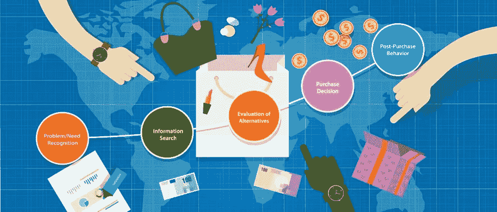

# 五大消费者行为趋势及其改变购物体验的方式

> 原文：<https://medium.datadriveninvestor.com/top-5-consumer-behavior-trends-and-the-way-it-changes-shopping-experience-182892fb7454?source=collection_archive---------20----------------------->

今年的所有活动都从根本上改变了购物体验。各行各业的企业被迫跟上所有不断变化的趋势和新的消费者需求，以在各自的市场中保持竞争力。既然有这么多新的变化，你需要了解最新的零售消费趋势，以吸引更多的客户。请记住，如果你向每位顾客展示你了解并关心他们的需求，你几乎可以保证赢得他们的生意。记住所有这些，让我们来了解一些你需要了解的消费零售趋势。

# 1.网上购物已经成为新常态

在新冠肺炎病毒导致的封锁期间，实体店被迫关闭，并将其活动转移到网上。不幸的是，并不是每个企业都有一个平台可以处理进入他们网站的大量流量。有些甚至连电子商务平台都没有。我们看到的新趋势是，顾客现在更喜欢网上购物。仅在美国，到 2023 年将有 3 亿网购者。如果你想从这种在线收入中获得相当大的份额，你需要有一个专业创建的电子商务平台，该平台易于使用，可扩展，并提供关于你的购物者的许多见解。

 [## 干净的代码在软件开发中至关重要——这就是为什么|数据驱动投资者

### 干净的代码是“容易理解和容易改变的”，它是关于对细节的关注。但是开发人员为什么要担心…

www.datadriveninvestor.com](https://www.datadriveninvestor.com/2020/05/27/clean-code-is-crucial-in-software-development-heres-why/) 

# 2.网上购物者现在被分为 4 类

我们现在看到的是，在网上购物的人主要分为四类:

*   退休人员，他们的生活受到更少的社会接触的影响，但在其他方面仍然没有被所有的变化所影响；
*   现在在家工作的人；
*   不幸失业的人；
*   那些试图像病毒来袭前一样维持正常活动的人。

我们看到的一个令人兴奋的消费者购买趋势是，这是名单上的第二个群体，即在家工作的人，他们现在正涌向电子商务。当我们分析为什么会出现这种情况时，很容易就能明白为什么会这样。他们有收入，他们试图在维持社交和职业生活的同时完成尽可能多的工作。这就是为什么他们更喜欢网上购物的便利，因为这比去实体店要快得多。

# 3.客户更愿意被研究和营销

营销人员总是担心用户忽略他们的电子邮件和其他旨在吸引人们访问他们的商店或网站的信息。然而，最新的消费者购物趋势表明，人们现在对公司在网上跟踪他们的行为和向他们进行营销的态度更加开放。这意味着你需要有一个[创新的电子商务解决方案](https://skywell.software/retail-software-development/)，比如 Magento 和其他平台提供的解决方案，允许你跟踪用户并向他们提供更多相关产品。

# 4.客户要求更高水平的定制

顾客希望商家为他们提供定制的体验，因为这让他们感到被欣赏，这表明某个特定的商店真正满足了他们的需求。对于像化妆品这样高度个性化的物品来说尤其如此。我们已经看到像科斯米娅这样的品牌开始提供 AR 解决方案，允许顾客在购物时在线试妆。他们的应用程序使用购物者的前置摄像头来虚拟应用个别产品或现成的外观，这样人们就可以看到他们化妆后的样子。这不仅提供了高水平的便利和服务，而且帮助购买者克服了购买这种产品时不用手拿着它们的恐惧。

这种 AR/VR 技术也改变了时尚和美容行业的消费者行为，因为人们现在可以虚拟试穿衣服或[化妆品](https://skywell.software/portfolio/cosmia-makeup-ar-app/)，而不必去试衣间。利用这种技术的公司更有可能提高转换率并获得回头客。

# 5.更高的自动化程度

就实体店而言，我们注意到的消费者行为趋势是自动化程度更高。人们不再想与人类员工打交道，而更喜欢在机器的帮助下快速完成所有事情。尤其是像自助结账这样的事情，排队的人更少，你可以更快地付款。他们也有利于商店，因为他们可以工作几乎任何时间，从来不需要休息。随着时间的推移，你可以期待更多像 Amazon Go 这样的商店，它将自动化带到了一个极端的水平，因为没有任何人类员工在那里工作。

# 跟上最新的消费者行为趋势

我们研究了消费者行为如何改变的一些方式，企业需要跟上以保持竞争优势。通过利用 AR/VR、Magento 提供的最新技术和最新的[定制软件开发](https://skywell.software/)，您可以利用消费者行为的所有变化趋势，将您的业务推向新的高度。因为创建一个完全符合您需求的解决方案需要一些时间，所以现在就开始是一个好主意，这样您可以获得所有的好处，并为未来的新趋势做好更充分的准备。

*原载于*[*https://sky well . software*](https://skywell.software/blog/consumer-behavior-trends-and-shopping-experience/)*。*

**访问专家视图—** [**订阅 DDI 英特尔**](https://datadriveninvestor.com/ddi-intel)