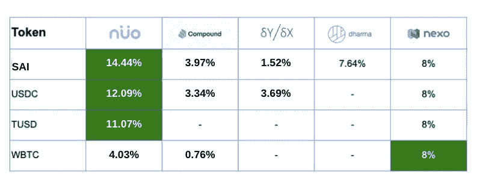

# 2020 年及以后将持有的五大加密货币？

> 原文：<https://medium.datadriveninvestor.com/top-5-cryptocurrencies-to-hold-in-2020-and-beyond-f25398b1e2c6?source=collection_archive---------11----------------------->

2019 年，一些加密货币的价格飙升至新高，而一些数字货币则成为朽木。好消息是，仍有大量价格合理、有望盈利的选择。然而，预测哪种加密货币会繁荣，哪种会破产是很困难的。最好押注于近期有可能大规模采用的加密货币。

让我们来看看 2020 年及以后可以持有的加密货币。

## **以太坊**

以太坊在 2015 年进入加密领域，在很短的时间内，它已经成为仅次于比特币的第二大最有价值的数字货币。与其他加密货币不同，以太坊不仅仅是数字货币，而是被视为一种环境。它有很多优点。开发者可以使用它的平台来构建基于区块链的智能合约和其他去中心化的应用(DApps)。以太坊也成为推出首次硬币发行(ICO)的首选平台。此外，仅在以太坊平台上使用的 ERC-20 代币在创造数十亿美元的 ICO 产业中发挥了重要作用。此外，代币帮助了主流加密货币。

## 【戴】戴

DAI 于 2017 年 12 月发布，是通过 Makers (MKR) Dai Stablecoin 系统创建的 ERC20 代币。建立在以太坊区块链的基础上，这种分散的稳定币是“面对波动时稳定的可靠来源”，因为它与另一种稳定资产美元挂钩。一个戴值一美元，而且永远如此。智能合约内置的自动定价机制确保价值保持在 1 美元。与其他稳定债券不同的是，DAI 是由加密抵押品支持的，而不是美元。戴的倡导者认为，它有可能改变传统的银行体系。

 [## Azbit 旨在连接传统金融和加密货币|数据驱动的投资者

### Azbit 是下一个提供交易平台的加密项目，该平台提供保证金和算法交易。一样多…

www.datadriveninvestor.com](https://www.datadriveninvestor.com/2019/03/20/azbit-aims-to-connect-traditional-finance-and-cryptocurrency/) 

## **ZRX**

ZRX 是 0x 的以太坊令牌，这是一个无许可协议，它促进了以太坊区块链上分散交换的发展。在该协议中，ZRX 的所有者可以使用它向转播商支付交易费用。此外，他们也开始影响区块链的治理。他们可以就如何升级和开发协议提供意见。随着越来越多的投资者对 0x 感兴趣，ZRX 的价值预计将在未来几年飙升。

## **链接**

以太坊令牌链，或称 link，为 Chainlink 分散式 oracle 网络提供动力。这是一种通用硬币，因此可用于多种服务。此外，它的智能合同与数据、事件和支付相关联。也可以访问 API。ETH 令牌观察家声称 LINK“在生产率方面超过了竞争对手”，这凸显了它的受欢迎程度。林克被视为一项不错的长期投资。

## **IOTA**

IOTA 是物联网(IoT)行业的数字货币。它没有使用区块链技术，而是使用了一个名为 Tangle 的新平台。创始人 David Sontesbo 在他的博客上说， [IOTA 打算通过建立一个“事实上的标准化分类账”来创造](https://blog.iota.org/iota-development-roadmap-74741f37ed01)物联网、工业 4.0 和无信任的按需经济的“范式转变”

预计到 2020 年，物联网市场将超过 4000 亿美元。作为这一领域的先行者，IOTA 的价格将大幅上涨。IOTA 可以从币安购买。

## 哪里能买到所有这些加密货币并盈利？

密码交易员可以在多个交易平台上购买所有上述代币，如 Nuo Network、Compound、DyDx 等，根据平台的不同，使用 Apple Pay 或 Google pay。

除了在 2020 年交易和持有这些代币，用户还可以在持有代币的同时获得被动利息。下面是各种加密贷款平台提供的利率对比图。诺还使用户能够赚取无与伦比的加密资产利率。前 4 项资产去年的平均利息分配不言自明。

Source: Nuo Network’s Interest rate distribution chart

*免责声明:本材料不应作为做出投资决策的依据，也不应被理解为从事投资交易的建议。最早见于***。**