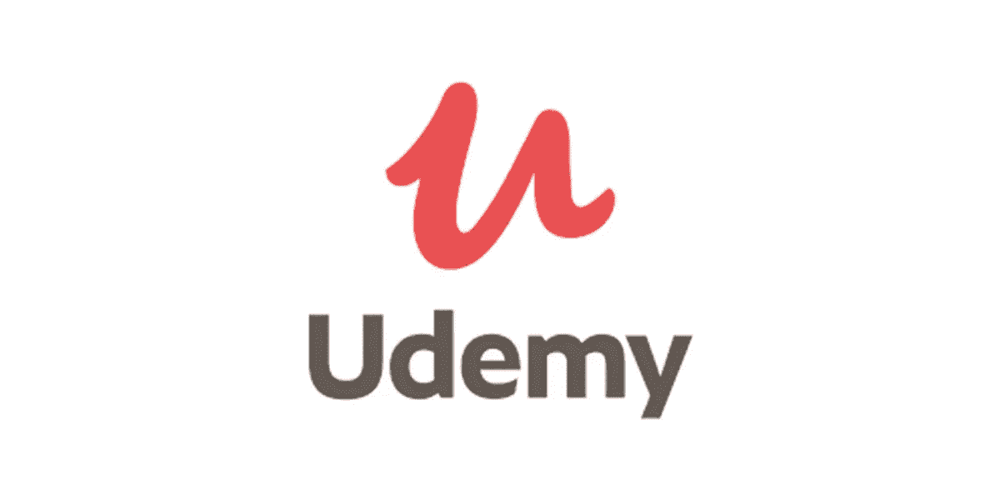
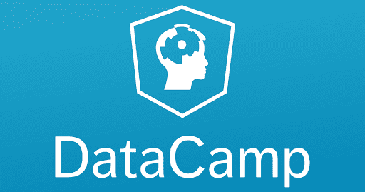
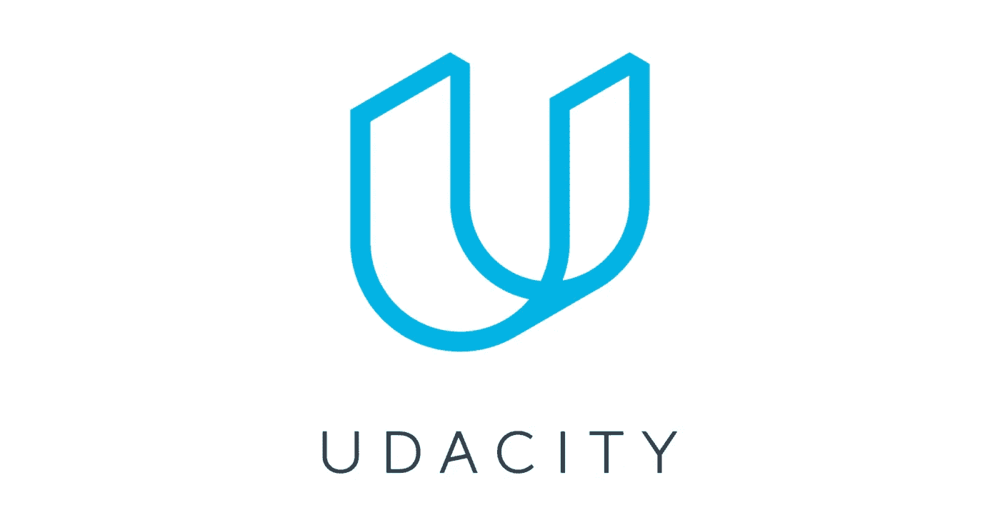
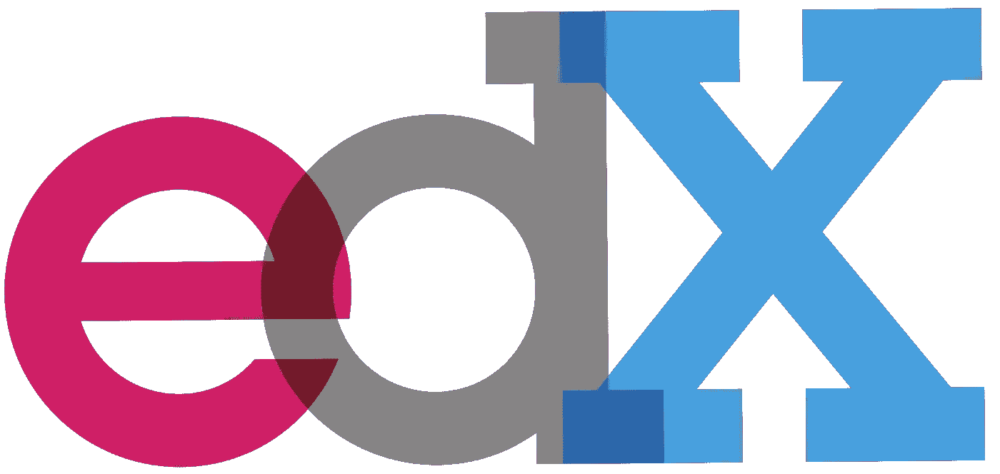
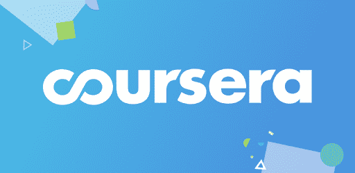

# 五大数据科学在线课程平台

> 原文：<https://medium.datadriveninvestor.com/top-5-data-science-online-courses-platforms-9a5d3e2e6a2a?source=collection_archive---------13----------------------->

## 如果你想从数据科学开始你的旅程，并且你需要一门新的在线课程，那就看看这个领域中最好的课程的综述吧！

# 乌德米

[here](https://s3.amazonaws.com/media.al-fanarmedia.org/wp-content/uploads/2020/04/17090134/udemy.jpg)

Udemy 提供高评级的数据科学课程，帮助您学习如何可视化和响应新数据，以及开发创新的新技术。无论你对机器学习、数据挖掘还是数据分析感兴趣，Udemy 都有适合你的课程。

 [## 一瞬间学会数据科学！？数据驱动的投资者

### 在我之前的职业生涯中，我是一名训练有素的古典钢琴家。还记得那些声称你可以…

www.datadriveninvestor.com](https://www.datadriveninvestor.com/2020/07/23/learn-data-science-in-a-flash/) 

# 数据营

[here](https://lh3.googleusercontent.com/proxy/nwjOe394nkJ3wHLWXL-NguXexvtiD5amShMIuDomkXieGwiztmNA6v4yowsdznFcVx-dU89e0LMb4IMCNsXzA5yvv5J3lgCABWcVlB7MsvEMCXwTqd0VN8fGjivdaQ)

你将了解到你以前不敢问的关于这个快速发展和令人兴奋的领域的一切，而不需要写一行代码。通过动手练习，您将了解不同的数据科学家角色、A/B 测试、时间序列分析和机器学习等基础主题，以及数据科学家如何从真实世界的数据中提取知识和见解。

# 乌达城

建立数据处理、可视化、预测分析、机器学习和数据科学方面的专业知识。

*   数据操作
*   使用统计和机器学习进行数据分析
*   具有信息可视化的数据通信
*   大规模数据—使用大数据

# EdX

您将能够了解:

*   如何加载和清理真实世界的数据
*   如何从嘈杂的数据中做出可靠的统计推断
*   如何使用机器学习来学习数据模型
*   如何可视化复杂数据
*   如何使用 Apache Spark 来分析不适合单台计算机内存的数据

# Coursera

您将了解数据科学家工具箱中的主要工具和思想。本课程概述了数据分析师和数据科学家使用的数据、问题和工具，您将学习如何用 R 编程以及如何使用 R 进行有效的数据分析，涵盖了汇总数据的基本探索技术。

[Github](https://github.com/zahrael97) ， [LinkedIn](https://www.linkedin.com/in/zahraelhamraoui97/) ， [Zahra Elhamraoui](http://zahraelhamraoui1997@gmail.com/) ， [Upwork](https://www.upwork.com/o/profiles/users/~01e52291fa456a8934/)

**访问专家视图—** [**订阅 DDI 英特尔**](https://datadriveninvestor.com/ddi-intel)