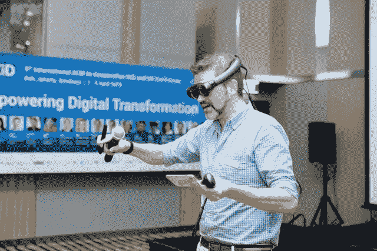

# 2021 年 5 大激动人心的技术趋势 ChatC 集团

> 原文：<https://medium.datadriveninvestor.com/top-5-exciting-tech-trends-for-2021-the-chatc-group-97c91d8a0e76?source=collection_archive---------39----------------------->

Photo by [stephan sorkin](https://unsplash.com/@sorkin?utm_source=unsplash&utm_medium=referral&utm_content=creditCopyText) on [Unsplash](https://unsplash.com/s/photos/virtual-reality?utm_source=unsplash&utm_medium=referral&utm_content=creditCopyText)

对于技术爱好者来说，没有什么比全新技术和新兴趋势更令人兴奋的了。随着 2021 年的到来，技术将在帮助企业应对未来一年的挑战方面发挥重要作用。请继续阅读，了解 2021 年的顶级技术趋势。

# 试试 2021 年的 5 大科技趋势

AR 远程应用将在 2021 年继续增长。事实上，AR 内容和软件预计将在 2021 年至 2025 年间以超过 [100%的消费者增长率](https://go.abiresearch.com/lp-68-tech-trends-that-will-shape-2021?utm_source=media&utm_medium=email)增长，在 2025 年达到 200 亿美元的总收入。以下是 AR 将在 2021 年继续繁荣的一些方式:

*   复杂制造业:由于 AR，制造业出现了大幅增长。工程师和操作员可以在车间使用 AR 眼镜来帮助诊断问题和管理配置。随着复杂的设计计划在瞬间可用，制造业面临着更少的困难维修停工时间。生产率提高=收入增加！
*   教育:教育工作者和学生最近面临非常困难的局面。即使是最有经验的教学老手也不得不重新思考他们的教学方式。在学校使用 AR 取代了对教科书等材料的需求。AR 还可以通过提高可访问性和学生参与度来转变远程学习体验。
*   远程专家协助:AR 允许专家与世界各地的多人联系。服务质量得到了提高，因为技术人员可以立即联系到他们需要的任何专家

Photo by [Andrea Piacquadio](https://www.pexels.com/@olly?utm_content=attributionCopyText&utm_medium=referral&utm_source=pexels) from [Pexels](https://www.pexels.com/photo/man-wearing-white-virtual-reality-goggles-834949/?utm_content=attributionCopyText&utm_medium=referral&utm_source=pexels)

虚拟现实是一个三维的、计算机生成的环境，可以由人来探索和互动。据预测，到 2021 年，美国将有[5710 万虚拟现实用户](https://www.emarketer.com/content/global-ecommerce-2019)。使其成为 2021 年最热门的技术趋势之一。

企业已经准备好为顾客创造数字三维体验，这样做将具有先发优势。以下是虚拟现实可能改变一些企业面貌的一些独特方式:

*   教育:通过将 VR 引入课堂(以及远程课堂)，学生更加投入，学习变得有趣。从虚拟实地考察到在高科技实验室工作，虚拟现实可以增加学生对热门工作的接触，如 STEM(即科学、技术、工程、数学)中的工作。
*   医疗保健:VR 正在改变医疗保健。从医疗培训到疾病意识，医疗专业人员能够改善患者的治疗。
*   家庭娱乐:从兔耳时代开始，家庭娱乐已经走过了漫长的道路。虚拟现实可以为客户带来家庭影院体验，无论他们的环境如何。例如，Oculus Rift 耳机为游戏、模拟和电影观看提供了身临其境的体验。
*   零售:VR 允许顾客试穿服装或眼镜。但是，各种形状和规模的企业都可以发挥创意，思考如何使用这项技术展示他们的产品或服务，以展示前期价值。从选择油漆颜色到决定家具是否合适，虚拟现实可以改变客户做出购买决定的方式。

未来五年，对话式人工智能领域将从 48 亿美元增长到 139 亿美元。运行在[对话式人工智能](https://chatc.ai/conversational-ai-chatbots/)上的聊天机器人有许多不同的好处，这取决于你公司的具体使用情况。这里有两个正在被对话式人工智能改变的例子:

*   **医疗保健:**医疗保健[中的聊天机器人](https://chatc.ai/3-amazing-examples-of-automation-in-healthcare/)可以帮助消除或最大限度地减少花费在管理任务上的时间。这些自动化系统有助于改善疾病预防，减少人为错误，让医护人员有更多的时间来提供最有价值的护理。
*   **金融:**在金融领域使用聊天机器人可以让客户快速得到答案。例如，[聊天机器人](https://chatc.ai/the-best-chatbot-companies-in-2020/)可以帮助回答关于服务、投资或如何申请贷款产品的常见问题。最重要的是，聊天机器人本身是一个倾听渠道，可以更好地了解客户。

到 2021 年，将继续看到越来越多的企业(甚至是政府)将工作负载迁移到云。企业将寻求增加云中的数据存储，从长远来看，这将最大限度地降低成本和物理空间需求。

为了突显这一科技行业的增长，一家特殊的云数据仓库公司雪花在第二个交易日结束时，股价上涨了近 112%。向云的转变也意味着重建和优化堆栈，以便企业可以实现云原生实施。

网络安全越来越重要。安全威胁处于历史最高水平，自 2018 年以来，违规行为增加了 [11%，自 2014 年以来增加了 67](https://www.cyber-observer.com/cyber-news-29-statistics-for-2020-cyber-observer/)。以下是一些处于这种技术尖端的公司的例子，它们正在努力保护企业直到 2021 年:

*   [**Scanta**](http://www.scanta.io) 保护机器学习算法免受安全攻击。该公司还致力于为雇佣虚拟助理的公司提供更安全的对话体验。
*   [**泰拉诺瓦安全**](https://terranovasecurity.com/) 已经成为全球网络安全意识的领导者。他们拥有超过 1000 万用户，并有超过 1000 个成功的网络钓鱼和安全意识程序。
*   [**packet labs Ltd**](https://www.packetlabs.net/)**提供多种服务，包括 web 和移动应用测试、社交工程、基础设施渗透测试和源代码审查。这家加拿大公司的客户来自不同的行业。**

****

**Photo by [ThisIsEngineering](https://www.pexels.com/@thisisengineering?utm_content=attributionCopyText&utm_medium=referral&utm_source=pexels) from [Pexels](https://www.pexels.com/photo/woman-using-laptop-computer-with-vr-headset-3861458/?utm_content=attributionCopyText&utm_medium=referral&utm_source=pexels)**

# **将 2021 年的技术趋势融入到您的业务中**

**对任何企业来说，保持技术领先都是至关重要的。它让你在竞争中脱颖而出，而且随着时间的推移，它通常会提高效率。2021 年的这五大技术趋势中的每一个都将为你的企业带来红利，但风险最低的选择之一是实施对话式人工智能聊天机器人。想知道如何利用对话式人工智能，而不用担心预算超支或技术从安全角度将您的团队置于边缘？今天就联系聊天机器人顾问来讨论你公司的具体使用案例。**

***原载于*[*https://chatc . ai*](https://chatc.ai/top-5-exciting-tech-trends-for-2021/)*。***