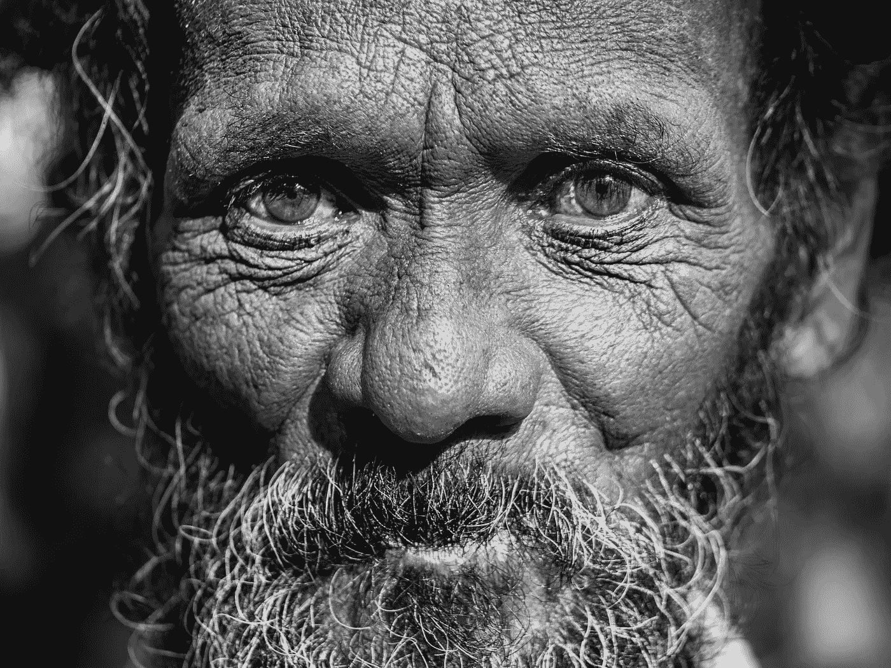
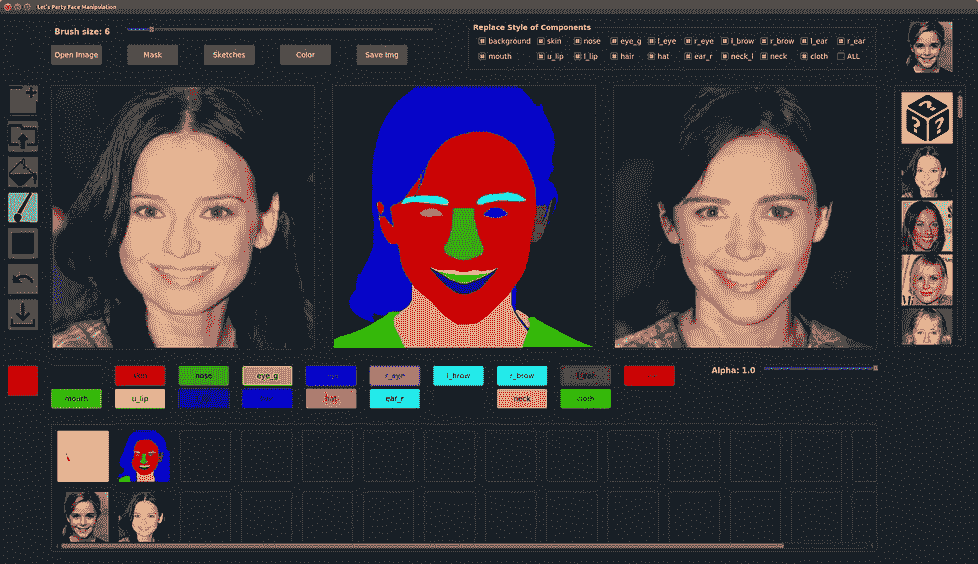
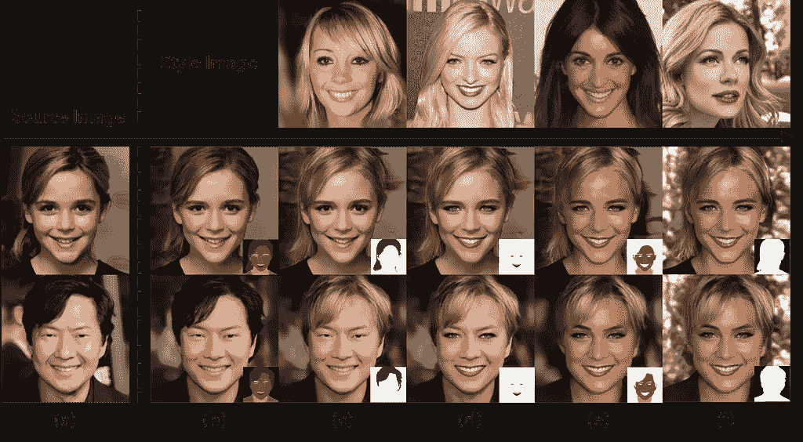
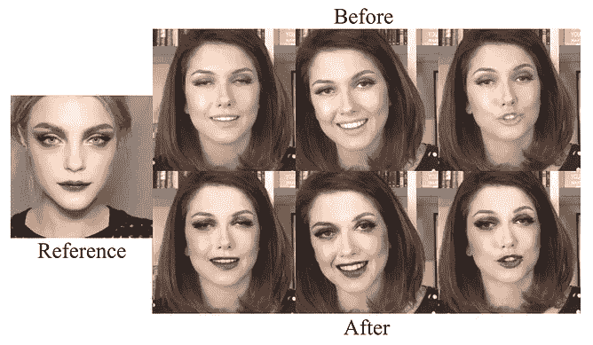
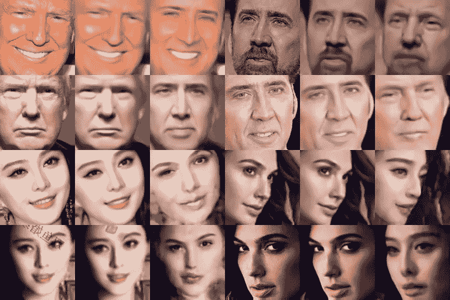
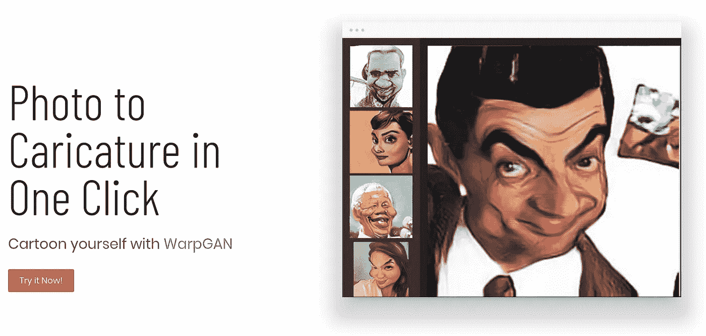
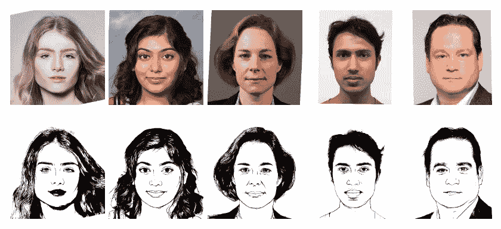

# 五大 GAN(生成性对抗网络)项目与人脸打交道

> 原文：<https://medium.datadriveninvestor.com/top-5-gan-generative-adversarial-networks-projects-to-play-around-with-human-faces-f647040e8a65?source=collection_archive---------2----------------------->

> [*生成对抗网络(GAN)是一类机器学习框架，当给定一个训练集时，该技术学习生成与训练集具有相同统计数据的新数据。例如，经过照片训练的 GAN 可以生成新的照片，这些照片在人类观察者看来至少在表面上是真实的，具有许多逼真的特征。虽然最初是作为无监督学习的生成模型的一种形式提出的，但是 GANs 也被证明对于半监督学习、完全监督学习和强化学习是有用的。*](https://en.wikipedia.org/wiki/Generative_adversarial_network)

> ***在今天的文章中，我们将讨论五个开源的 GAN 项目，您可以将它们包含在您的下一个项目中。***
> 
> ***注:在本文中，我们将讨论一些不太出名但非常好的开源 GAN 项目，您可以在自己的项目中使用它们。要阅读更多关于它们的内容，我推荐你点击项目中给出的链接。***

**Source: Unsplash**

> *学习不仅仅是为了更好地胜任工作，而且远不止于此。*[***【data camp】***](https://datacamp.pxf.io/x9nmvv)*让我学无止境。*
> 
> [***data camp***](https://datacamp.pxf.io/x9nmvv)*为您提供所需的灵活性，让您可以利用自己的时间参加课程，学习向成功职业过渡所需的基本技能。*
> 
> [***【data camp】***](https://datacamp.pxf.io/x9nmvv)*教会了我快速获取新想法，并将其应用于现实世界的问题。当我在学习阶段时，*[***data camp***](https://datacamp.pxf.io/x9nmvv)*让我对课程中的一切都着了迷，从课程内容和 TA 反馈到 meetups 活动和教授的 Twitter feeds。*
> 
> 这里有一些我最喜欢的课程，我强烈推荐你学习，只要它符合你的时间表和心情。你可以将从这些课程中学到的概念和技能直接应用到工作或大学中令人兴奋的新项目中。

1.  [数据科学家与 python](https://datacamp.pxf.io/LPDqQZ)
2.  [数据-科学家-与-r](https://datacamp.pxf.io/MXQxrJ)
3.  [机器学习科学家与机器人](https://datacamp.pxf.io/DVLg4j)
4.  [用 python 研究机器学习的科学家](https://datacamp.pxf.io/9WePXW)
5.  面向所有人的机器学习
6.  [面向所有人的数据科学](https://datacamp.pxf.io/15bLmd)
7.  [使用 python 的数据工程师](https://datacamp.pxf.io/jW13ve)
8.  [使用 python 的数据分析师](https://datacamp.pxf.io/kjR3mz)
9.  [基于 pyspark 的大数据基础](https://datacamp.pxf.io/e4RM6r)

> ***回到正题-***

# 1.肖恩

S[***EAN***](https://zpdesu.github.io/SEAN/)是具有语义区域自适应归一化 项目的 ***图像合成，该项目以描述**期望输出图像**中的**语义区域**的**分割掩码**为条件。***

我们可以使用它来构建一个网络架构，该网络架构可以通过为每个区域指定一个或多个样式参考图像***来单独控制每个语义区域的样式，即*通过改变分段掩码或任何给定部分的样式来交互式编辑照片。****

[***SEAN***](https://zpdesu.github.io/SEAN/)在 ***重建质量、可变性*** 和 ***视觉质量*** 方面，比以前最好的方法更适合于 ***编码、传输和合成*** 。

该模型在*多个数据集上进行评估，*和*报告了比当前技术水平更好的量化指标*(***例如 FID、PSNR*** )。该项目使用 **Pytorch 在 **Python** 中实施。**

> 您可以通过这个 [***GitHub***](https://github.com/ZPdesu/SEAN) 链接获得这个*项目，并在您的系统*上运行。

**Source:** [**https://github.com/ZPdesu/SEAN**](https://github.com/ZPdesu/SEAN)

# 2.PSGAN

P[***SGAN***](https://github.com/wtjiang98/PSGAN)是一种 ***姿态和表情健壮的空间感知 GAN* 用于可定制的化妆转移，**旨在 ***将化妆从参考图像转移到源图像。***

它首先利用**化妆提取网络**将参考图像的化妆分解为两个空间感知化妆矩阵。然后、*引入关注化妆变形模块来指定源图像中的像素的化妆如何从参考图像变形*。利用化妆矩阵和源图像，**化妆应用网络**用于执行 ***化妆转移*** 。

[***PSGAN***](https://github.com/wtjiang98/PSGAN)即使存在较大的姿势和表情差异，也能实现最先进的*效果，并能进行局部和阴影可控的化妆转移。*

该模型在一个数据集上训练，该数据集包含具有各种 ***姿势和表情*** 的 ***面部图像*** 用于评估，该项目使用 ***Python 和 Pytorch*** 实现。

> 点击 [**链接**](https://arxiv.org/abs/1909.06956) 可以阅读 **PSGAN** 上的参考文件，如果你想要克隆和运行这个项目的源代码和步骤，可以点击 [**这里**](https://github.com/wtjiang98/PSGAN) 。

**Source:** [**https://github.com/wtjiang98/PSGAN**](https://github.com/wtjiang98/PSGAN)

# 3.面部交换

F[***ace swap***](https://github.com/jinfagang/faceswap_pytorch)是基于 **deepfake** tech 优化的**人脸应用**，具有更高的 ***分辨率结果(128x128)。Deepfakes*** 仅支持 64x64 输入，而 [**FaceSwap**](https://github.com/jinfagang/faceswap_pytorch) 使其更深入，可以输出 **128x128** **大小的对调图像**。

提出了一种新的网络，称为 ***SwapNet，SwapNet128，*** *，其中*对输入数据的预处理*步骤进行了更改*(如曲面)，使其更加清晰。

数据集由直接从 2 个目录加载配对数据的**组成。一个**新的人脸轮廓替换了提议的技术，以获得与原始图像 更为组合的 ***结果。***

该项目是使用 **Python** 和 **Pytorch** 实现的。

> 你可以从这个链接下载**源代码** [，并按照**的说明**让项目进入你的系统。](https://github.com/jinfagang/faceswap_pytorch)

**Source:** [**https://github.com/jinfagang/faceswap_pytorch**](https://github.com/jinfagang/faceswap_pytorch)

# 4.沃普甘

W 

[***warp gan***](https://github.com/seasonSH/WarpGAN)学会自动预测一组控制点，可以 ***将照片扭曲成漫画*** 而不改变*原来的身份**转移丰富的纹理样式*。

[***warp gan***](https://github.com/seasonSH/WarpGAN)通过控制 ***夸张程度和视觉风格，可以定制生成的漫画。***

该项目是使用 **Python** 和 **Tensorflow 实现的。**

> 点击此链接 可以阅读关于 **WarpGAN** 的参考文件，如果你想要克隆并运行此项目的源代码和步骤，可以点击 [**此处**](https://github.com/seasonSH/WarpGAN) 。

**Source:** [**http://caricaturize.me/**](http://caricaturize.me/)

# 5.APDrawingGAN

一个[***PDrawingGAN***](https://github.com/yiranran/APDrawingGAN)是一个免费的开源项目，用于 ***使用层次化的 GAN，即使用基于 GAN 的模型，从人脸照片生成艺术肖像图。***

模型是用 ***Python*** 和 ***Pytorch*** 实现的。

> 点击 链接[**可以阅读 **APDrawingGAN** 上的参考文件，如果你想要克隆和运行这个项目的源代码和步骤，可以点击**](https://openaccess.thecvf.com/content_CVPR_2019/html/Yi_APDrawingGAN_Generating_Artistic_Portrait_Drawings_From_Face_Photos_With_Hierarchical_CVPR_2019_paper.html) **[**这里**](https://github.com/yiranran/APDrawingGAN) 。**

**Source:** [**https://github.com/yiranran/APDrawingGAN**](https://github.com/yiranran/APDrawingGAN)

> 如果你喜欢读这篇文章，我相信我们有着相似的兴趣，并且现在/将来会从事相似的行业。那么我们就通过[**LinkedIn**](https://www.linkedin.com/in/mrinal-walia-b0981b158/)**和**[**Github**](https://github.com/abhiwalia15)**来连线吧。请不要犹豫发送联系请求！**
> 
> 参考
> 
> [**https://zpdesu.github.io/SEAN/**](https://zpdesu.github.io/SEAN/)
> 
> [**https://github.com/ZPdesu/SEAN**](https://github.com/ZPdesu/SEAN)
> 
> [**https://github.com/wtjiang98/PSGAN**](https://github.com/wtjiang98/PSGAN)
> 
> [**https://github.com/jinfagang/faceswap_pytorch**](https://github.com/jinfagang/faceswap_pytorch)
> 
> **【https://github.com/seasonSH/WarpGAN】T5[T6](https://github.com/seasonSH/WarpGAN)**
> 
> **[**https://github.com/yiranran/APDrawingGAN**](https://github.com/yiranran/APDrawingGAN)**