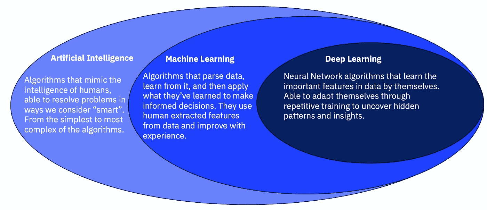
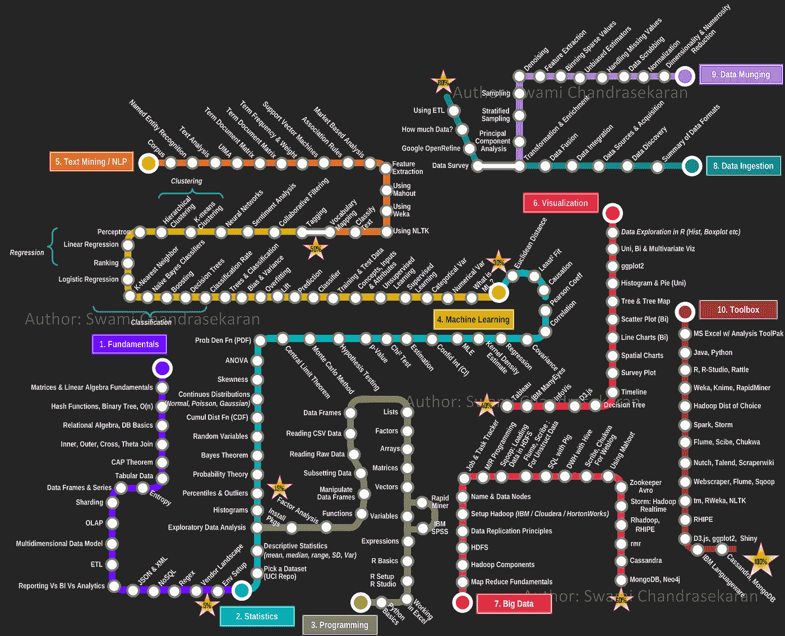
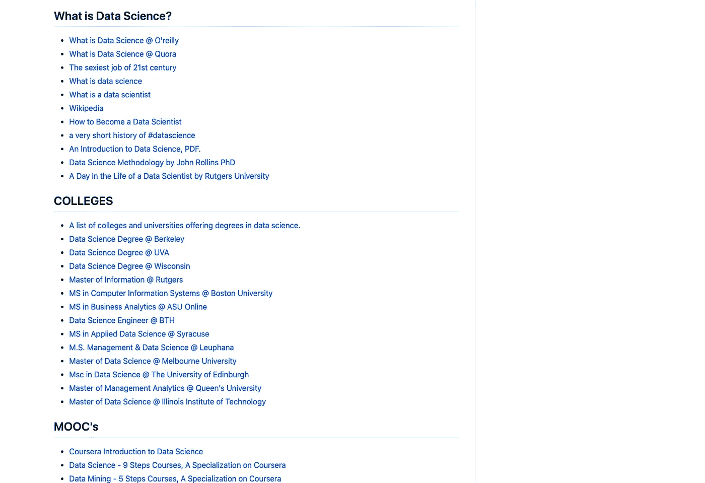
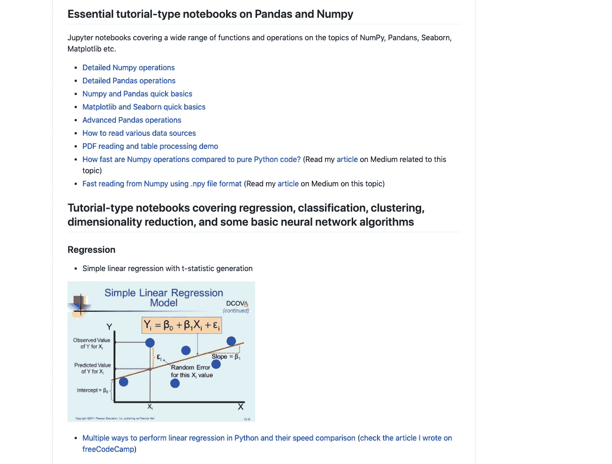
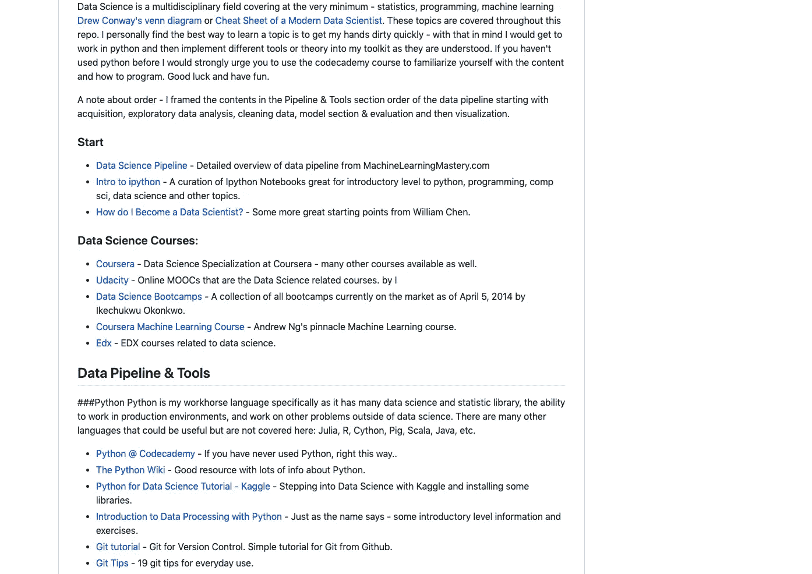
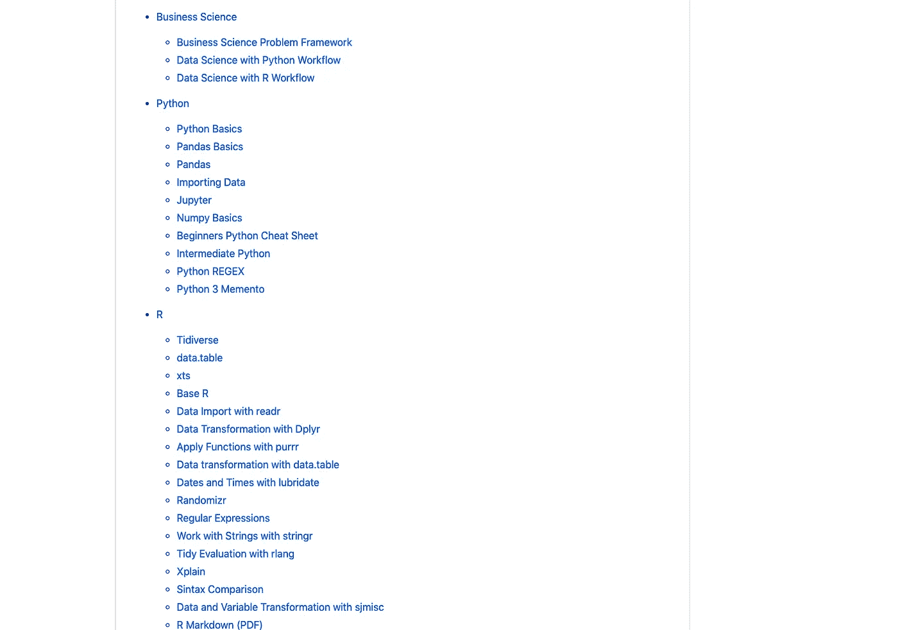

# 数据科学和机器学习资源的五大金矿

> 原文：<https://medium.datadriveninvestor.com/top-5-gold-mines-of-data-science-and-machine-learning-resources-7415b88776e7?source=collection_archive---------6----------------------->

## 关于数据科学和机器学习的流行 Github Repos

Pic credits : Pinterest

# 1.数据科学家路线图

*作者:MrMimic*

Pic source and credits: Data Science roadmap by [Swami Chandrasekaran](http://nirvacana.com/thoughts/2013/07/08/becoming-a-data-scientist/)

你是一个数据科学和机器学习爱好者，想要创建一个具有重要检查点/里程碑的数据科学学习计划吗？如果是，那么这个 GitHub 回购是给你的。这个报告的灵感来自 Swami Chandrasekaran 的数据科学技能路线图

## 封面—

1.  详细介绍数据科学基础
2.  数据科学统计学
3.  Python 和 R 编程
4.  数据可视化和数据管理。
5.  机器学习
6.  数据科学家的工具

## 你可以在这里找到它—

 [## Mr mimic/数据科学家路线图

### 我刚刚发现了这个数据科学技能路线图，是 Swami Chandrasekaran 在他的酷博客上画的。链接到数据的作业…

github.com](https://github.com/MrMimic/data-scientist-roadmap) 

# 2.令人敬畏的数据科学

*作者:法提赫·阿克图尔克，侯赛因·梅尔特&奥斯曼·温古尔，雷杰普·埃罗尔*

Pic source and credits: : Awesome Data Science

这个 Github repo 对崭露头角的数据科学家非常有帮助，被认为是数据科学的**金矿**。

## 封面—

1.  动机—为什么选择数据科学
2.  涵盖数据工程师和数据科学家之间的区别、数据科学行业——谁做什么、思维导图等主题的各种信息图
3.  数据集
4.  互联网上最好的 MOOC
5.  数据科学的书籍和竞赛等。

 [## 一瞬间学会数据科学！？数据驱动的投资者

### 在我之前的职业生涯中，我是一名训练有素的古典钢琴家。还记得那些声称你可以…

www.datadriveninvestor.com](https://www.datadriveninvestor.com/2020/07/23/learn-data-science-in-a-flash/) 

## 你可以在这里找到它—

 [## 学术/令人敬畏的数据科学

### 这部分是为数据科学新手准备的。这是开始学习数据科学的捷径。只是…

github.com](https://github.com/academic/awesome-datascience) 

# 3.数据科学最佳资源

*作者:Tirthajyoti Sarkar*

Pic source and credits: Data Science Best Resources

这是我最喜欢的一篇，因为它通过示例和实践教程涵盖了数据科学和机器学习的一些最复杂的主题。这是一个精心策划的资源和链接的宝库，都在一个地方。

## 封面—

1.  与人工智能相关的资源
2.  书籍、博客、书库交换
3.  与 MOOCs 相关的有趣文章和信息
4.  关于熊猫和熊猫的教学型笔记本
5.  涵盖回归、分类、聚类、降维以及一些基本神经网络算法的教程型笔记本
6.  合成数据生成技术
7.  神经网络，云计算，REST API，时序资源

## 你可以在这里找到它—

 [## tirthajyoti/数据科学最佳资源

### 一个精心策划的资源和链接的宝库(关于软件、平台、语言、技术等主题)。)…

github.com](https://github.com/tirthajyoti/Data-science-best-resources/blob/master/README.md) 

# 4.数据科学资源

乔纳森·鲍尔

**

*Pic source and credits: Data Science Resources*

*创作者做了一件很棒的工作，用高质量的资源为每个人建立了这个回购。这个回购是一个资源宝库，涵盖了如何建立数据科学团队、业务实践、用例、产品指标和数据科学职业道路。*

## *封面—*

1.  *数据管道和工具*
2.  *产品相关资源*
3.  *数据科学职业道路*
4.  *数据科学应用/用例*
5.  *深度学习教程*

## *你可以在这里找到它—*

* [## 乔纳森·鲍尔/数据科学资源

### 数据科学资源大家好，欢迎来到数据科学资源报告。我最初建立这个回购，以便我…

github.com](https://github.com/jonathan-bower/DataScienceResources)* 

# *5.数据科学备忘单*

**作者法维奥·巴斯克斯**

**

*Pic source and credits: Data Science Cheatsheets*

*谁不喜欢小抄？这份报告有一份关于数据科学和机器学习不同主题的详细清单。*

## *封面—*

1.  *商业数据科学*
2.  *Python 和 R 编程语言说明书*
3.  *数学和微积分*
4.  *大数据和机器学习*
5.  *深度学习*
6.  *结构化查询语言*

## *你可以在这里找到它—*

* [## FavioVazquez/ds-cheatsheets

### 统治世界的数据科学清单— FavioVazquez/ds-cheatsheets

github.com](https://github.com/FavioVazquez/ds-cheatsheets)* 

# *感谢阅读。继续学习:)*

# *想看程序员幽默？*

* [## 编程幽默第 2 部分

### 继续笑，因为太搞笑了…

medium.com](https://medium.com/datadriveninvestor/programming-humor-part-2-f92cf5a26f2b)  [## 史上最搞笑的代码注释

### 程序员幽默:是的，实际上是程序员写的！

medium.com](https://medium.com/datadriveninvestor/the-most-hilarious-code-comments-ever-bae3cb1030b5)  [## 编码原罪:令人捧腹的开发者自白

### “白板”是如何被嘲笑的

medium.com](https://medium.com/datadriveninvestor/coding-sins-hilarious-developer-confessions-f55eb342454e)  [## 10 个让你着迷的诙谐编程笑话

### 这些太搞笑了…

medium.com](https://medium.com/datadriveninvestor/10-witty-programming-jokes-that-will-make-you-go-rofl-a53fbfb91943) 

# 推荐文章-

 [## Python 迭代器、生成器和装饰器变得简单

### 快速实施指南

medium.com](https://medium.com/python-in-plain-english/python-iterators-generators-and-decorators-made-easy-659cae26054f)  [## 你应该知道的 23 种数据科学技术！

### 使用这些技巧来节省你的宝贵时间

medium.com](https://medium.com/ai-in-plain-english/23-data-science-techniques-you-should-know-61bc2c9d1b3a)  [## 编码原罪:令人捧腹的开发者自白

### “白板”是如何被嘲笑的

medium.com](https://medium.com/datadriveninvestor/coding-sins-hilarious-developer-confessions-f55eb342454e)  [## 面向数据科学家的 5 项酷炫先进熊猫技术

### 使用这些技巧…

medium.com](https://medium.com/datadriveninvestor/5-cool-advanced-pandas-techniques-for-data-scientists-c5a59ae0625d)  [## Stack Overflow 分析了来自 60，000 多名软件开发人员的数据，包括他们的工作时间、语言…

### 以下是他们的发现…

medium.com](https://medium.com/datadriveninvestor/stack-overflow-analyzed-data-from-60-000-software-developers-hours-they-work-languages-they-476ac6ca0197)  [## 高级 Python 变得简单—第 4 部分

### 使用这些技巧和技术…

medium.com](https://medium.com/datadriveninvestor/advanced-python-made-easy-part-4-a4996ba9fe19)  [## 高级 Python 变得简单—第 1 部分

### 使用这些技巧和技术…

medium.com](https://medium.com/datadriveninvestor/advanced-python-made-easy-part-1-ce1e2f17431e)*