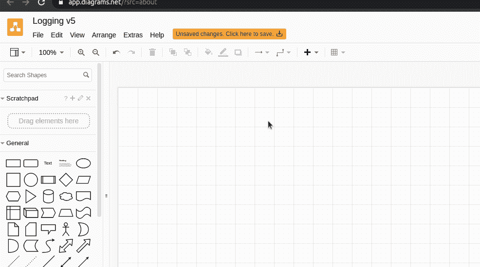
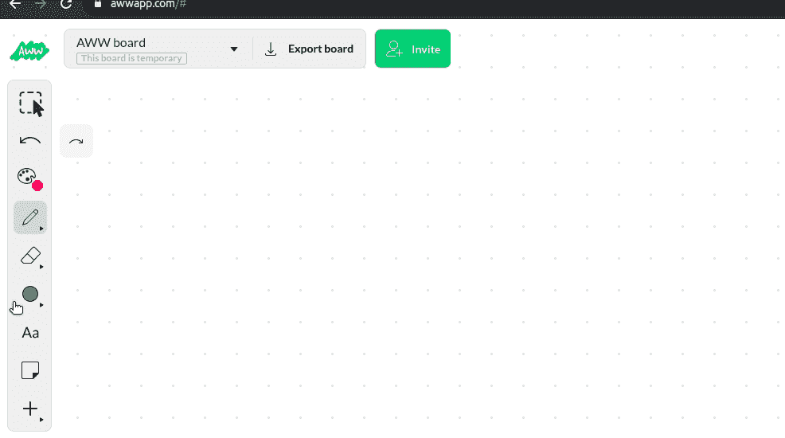
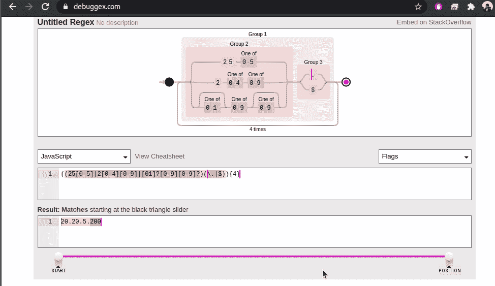
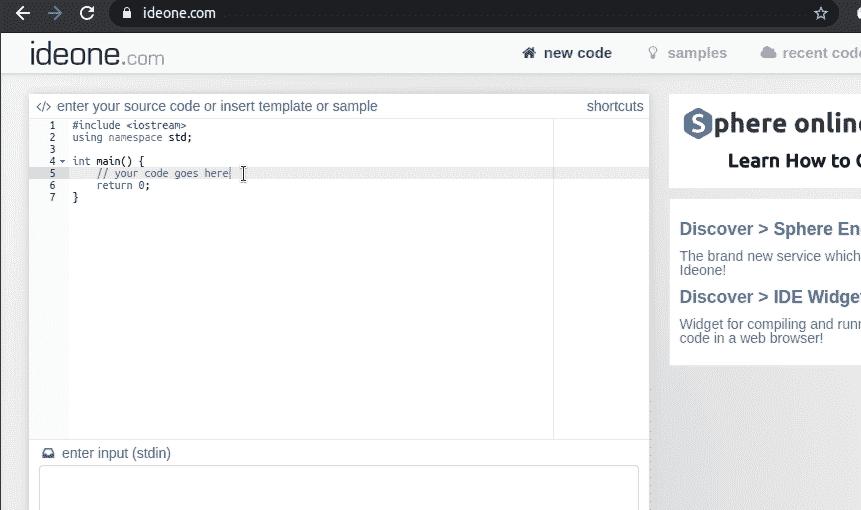
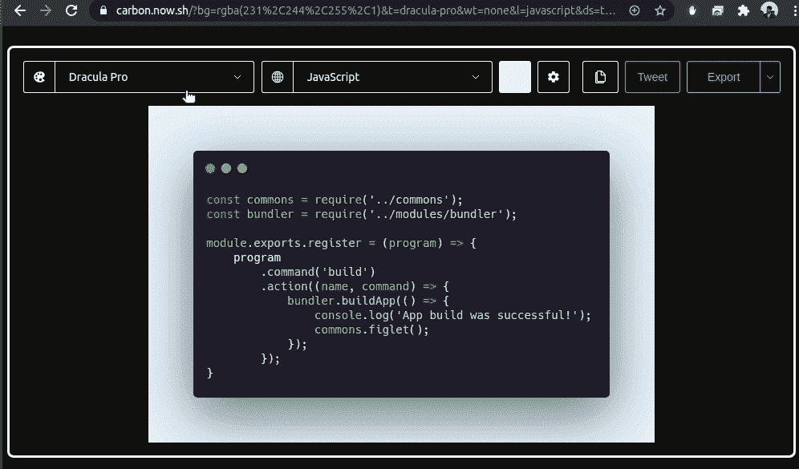

# 对现代开发人员有帮助的五大在线工具

> 原文：<https://medium.datadriveninvestor.com/top-5-helpful-online-tools-for-modern-developers-5bab70e843b1?source=collection_archive---------3----------------------->

Photo by [Alex Kotliarskyi](https://unsplash.com/@frantic?utm_source=unsplash&utm_medium=referral&utm_content=creditCopyText) on [Unsplash](https://unsplash.com/s/photos/programming?utm_source=unsplash&utm_medium=referral&utm_content=creditCopyText)

## #3 Debuggex —正则表达式可视化工具

作为软件开发人员，我们在编写代码时经常要做一些其他与编程相关的任务，比如准备一个架构图，向某人解释一个算法方法等等。然后我们觉得需要工具来完成这些活动。此后，我们要么使用独立软件，要么使用快速在线工具。毫无疑问，使用在线工具会节省我们的时间，而且大多数时候它会提供很棒的功能，而不是像 live collaboration 这样的独立软件。

这是我从网上找到的一系列优秀的在线开发工具。

## Diagrams.net——任何种类的图表

这以前叫做 *draw.io* ，现在改名为【diagrams.net】T2。这个网络应用程序提供了很好的特性来创建你需要的任何类型的图表。我经常使用这个工具来创建流程图和架构图。重要的是，它给了我们许多形状，包括像 AWS (Amazon Web Services)和 Azure 这样的云提供商的标准图标，让我们能够为软件创建专业的架构图。

Creating a simple flow-chart using diagrams.net — Screen recording by Author

网页应用链接:【app.diagrams.net 

## AWW 应用程序—用于快速草图的虚拟白板

需要在通话中解释算法吗？好吧。 *AWW App* 帮你。此外，当您需要考虑在没有物理白板或纸笔的情况下解决问题的方法时，这真的很有帮助。最重要的特性是它允许您访问以前添加的元素(但是您也可以锁定元素)。

这个网络应用程序也是触摸友好的。因此，这种虚拟白板可以很好地与手机和平板电脑配合使用。

Drawing a simple sketch using AWW App’s virtual whiteboard — Screen recording by Author

链接到网络应用:[awwapp.com](https://awwapp.com/)

## Debuggex 正则表达式可视化工具

如果你第一次尝试就能写出没有错误的正则表达式，你就是英雄。然而，有时我们使用复杂的正则表达式。然后我们必须确保我们写的正则表达式几乎是正确的。当然，带有较少条件分支和分组的正则表达式代码可以用我们的思维来可视化，也可以很容易地用几个测试用例来验证。但是，具有许多条件分支和组的正则表达式代码需要更多的努力来验证。

*Debuggex* web 应用程序以一种非常友好的方式可视化正则表达式代码，用于验证/调试。

Debugging a sample regex using *Debuggex* — Screen recording by Author

链接到网络应用:[debuggex.com](https://www.debuggex.com/)

## IDE One——在线尝试任何编程语言

也许，我们需要看看一个虚构的代码片段在现实中是如何工作的，或者我们需要尝试一种不熟悉的编程语言，而不需要在计算机上实际安装它的开发工具。IDE one 是处理这类事情的绝佳工具。事实上，它基本上给了我们在线尝试任何编程语言的能力。此外，这个 web 应用程序可以用于在实际代码库中实际实现最佳算法之前预先实现算法。

几年前，我用同样的工具练习面试问题和编码挑战。这个应用程序是如此简约，因为它只给我们像代码编辑器，标准输入和输出的强制性功能。

Writing/Running a c++ sample code using IDE one — Screen recording by Author

链接到网络应用:[ideone.com](https://ideone.com/)

## carbon——创建漂亮的代码截图

当我们准备一个技术演示或一篇文章时，我们可能需要添加源代码的快照。这可以很容易地通过截图来完成，但也有另一种方法来以一种有吸引力的方式完成同样的事情。 *Carbon* 在线工具接受文本输入，并将生成源代码的漂亮图形视图。

Creating an attractive screenshot of code using Carbon — Screen recording by Author

网页应用链接: [carbon.now.sh](https://carbon.now.sh/)

## 奖励—浏览在线工具商店并查看

Browserling 有数百个小而珍贵的在线工具，专门为网络开发者提供。

 [## Web 开发人员工具

### 我们痴迷于让 web 开发人员的浏览生活变得更容易，所以我们创建了一个最流行的…

www.browserling.com](https://www.browserling.com/tools) 

我还在 Linux 上使用了牛逼的 [*Peek*](https://github.com/phw/peek) 工具来记录这些动画 gif。很可能，你会在下一篇文章中用到它。

你在这个列表中找到你最喜欢的在线开发工具了吗？