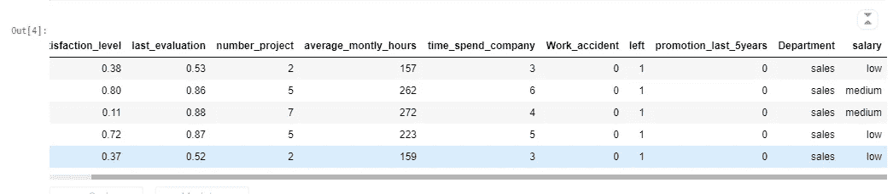
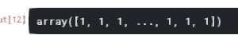

# 数据科学家使用 Python 的 5 大机器学习算法:第 1 部分

> 原文：<https://medium.datadriveninvestor.com/top-5-machine-learning-algorithms-used-by-data-scientists-with-python-part-1-51bae4e1b21e?source=collection_archive---------8----------------------->


Photo by [AltumCode](https://unsplash.com/@altumcode?utm_source=unsplash&utm_medium=referral&utm_content=creditCopyText) on [Unsplash](https://unsplash.com/s/photos/machine-learning?utm_source=unsplash&utm_medium=referral&utm_content=creditCopyText)

机器学习是一种重要的人工智能技术，它可以通过经验学习来有效地执行任务。据 [***福布斯***](https://www.forbes.com/#745b86852254) 报道，未来 10 年内，机器学习将取代 25%的工作岗位。

机器学习在现实世界中最受欢迎的应用之一是分类。它对应于日常生活中常见的任务。例如，一家医院可能希望将患者划分为患某种疾病的高、中、低风险人群，一家民意调查公司可能希望将受访者划分为可能会投票给几个政党中的每一个或尚未决定的人群，或者我们可能希望将学生项目划分为优秀、优秀、通过或失败。其他应用包括聚类、语言翻译、推荐、语音和图像识别等。

> 选择相关的机器学习技术是主要任务之一，因为有各种算法可用于不同的用例，并且它们都有其优点和效用。

在本文中，我们将讨论数据科学家最常用的 5 种机器学习算法。

由于这是博客的第一部分，因此这包括两个常用的机器学习算法，即逻辑回归和聚类。

# 目录:

*   **逻辑回归**
*   **Logit 功能**
*   **实际用例:使用 Python 的逻辑回归**
*   **聚类**
*   **如何衡量集群的性能？**
*   **聚类的类型**
*   **实际用例:用 Python 实现 K-Means 聚类**

# 1.逻辑回归

逻辑回归(也称为 Logit 回归)是一种用于分类(二元和多类分类)的回归技术。它是一个概率统计模型，因变量是一个分类值。(要了解更多关于因变量的信息，请点击这个[链接](https://www.theaisorcery.com/post/linear-regression-for-beginners-a-mathematical-introduction)，我在这里简要解释了因变量和自变量之间的区别)

# 分类问题为什么不直接用线性回归？

你可能会感到奇怪，因为逻辑回归是一种回归算法，但它仍然用于分类，而不是 [***线性回归***](https://en.wikipedia.org/wiki/Linear_regression#:~:text=In%20statistics%2C%20linear%20regression%20is,is%20called%20simple%20linear%20regression) 。为了理解这种困惑，让我们考虑下面的例子:

考虑这样一种情况，我们必须根据一个人当前的体重来预测他/她是“肥胖”还是“不肥胖”。下图是基于数据绘制的特定样本点。y 轴表示分类目标值，其中 1 表示人肥胖，0 表示人不肥胖。

设 **f(x)** 为绘制的数据点的线性回归线(或最佳拟合线)。现在，如果我们使用线性回归，我们需要设置一个阈值，在此基础上我们可以执行分类。如果估计的概率(P)位于内部 **0.5 < P < 1** 中，模型将预测值为 1，表示此人肥胖，如果概率(P)给定为 **0 < P < 0.5** ，则模型将预测此人不肥胖(目标值为 0)。


Figure 1: Graph depicting best fit lines

在上图 1 中，回归线 **f(x)** 由公式 **y= mx+c** 给出，其中 **y** 为 **f(x)** , **m** 为斜率， **x** 为因变量， **c** 为常数。但是这种配方存在某些问题。

假设我们向我们的训练数据集中添加了一些“非常积极”的点。回归线将向这些例子倾斜(由**f’(x)**给出)，将更多边缘情况的正确分类置于危险之中。这可能导致估计的概率(P)大于 1。这是不幸的，因为无论如何，我们已经正确地分类了这些非常积极的点。我们希望在职业之间划一条线，作为一个边界，而不是作为一个计分员穿过这些职业。

考虑分类的正确方式是将特征空间划分为多个区域，使得任何给定区域内的所有点都注定被分配相同的标签。区域是由它们的边界定义的，所以我们希望回归找到分隔线而不是拟合。

# 1.1 Logit 函数

与回归模型类似，逻辑回归模型通过添加偏差项来计算相关特征的加权和，但估计概率由以下等式给出:


这里， **y** 是预定义的类， **Wᵗx** 是预测， **σ** 是 sigmoid 函数。logit 函数或 sigmoid 函数如下所示:


该函数将一个真实值**∞≤x≤∞**作为输入，并产生一个范围在 **[0，1]** 内的值，即一个概率。使用 logit 函数的优势在于，它有助于处理异常值并最大化成本函数。

# 1.2 实际用例:使用 Python 的逻辑回归

对于使用 Python 的实际实现，我们将使用[***HR Analytics***](https://www.kaggle.com/giripujar/hr-analytics)*数据集，该数据集在[***ka ggle***](https://www.kaggle.com/)上可用。在该数据集中，为预测给出了 3 个分类值，即“低”、“中”、“高”。我们将仅使用“低”和“高”类别来演示使用逻辑回归的二元分类。*

```
***import pandas as pd
import numpy as np****#import the dataset
df=pd.read_csv('HR_comma_sep.csv')****#remove the 'medium' target category
df=df.loc[(df['salary'] == 'low') | (df['salary']=='high')]
df=df.drop(columns="Department")***
```

**

*Figure 2: Dataframe*

*如图 2 所示，我们有 8 个自变量和 1 个因变量，由“薪金”列表示。现在，在应用任何 ML 算法之前，我们需要将目标变量转换成数值。为此，我们将使用 [***标签编码*** 。](https://scikit-learn.org/stable/modules/generated/sklearn.preprocessing.LabelEncoder.html)*

```
***from sklearn.preprocessing import LabelEncoder** **le = LabelEncoder() 
df['salary']= le.fit_transform(df['salary']) 
X=df.iloc[: ,0:-1]
y=df.iloc[: ,-1]***
```

**

*Figure 3: Dataframe after label encoding*

*在“薪金”一栏中可以清楚地看到，变量已被转换为数值。我们将使用[***sk learn***](https://scikit-learn.org/)中的“[***train _ test _ split***](https://scikit-learn.org/stable/modules/generated/sklearn.model_selection.train_test_split.html)”模块来拆分我们在训练和测试数据集中的数据，然后使用逻辑回归进行分类。*

```
***from sklearn.model_selection import train_test_split****X_train_Logistic, X_test_Logistic, y_train_Logistic, y_test_Logistic = train_test_split(X,y,train_size=0.25)****#logistic regression model****from sklearn.linear_model import LogisticRegression****model_Logistic = LogisticRegression()
model_Logistic.fit(X_train_Logistic, y_train_Logistic)***
```

*训练与测试数据的比率是 75:25。“model_Logistic”变量由为逻辑回归创建的实例组成。对数据进行训练后，我们将对测试数据进行预测。*

```
***model_Logistic.predict(X_test_Logistic)***
```

*生成以下输出，展示了对输出变量的预测。*

**

*输出是一个带有预测的二进制数组。现在进一步，我们可以在此基础上计算精度和混淆矩阵。*

*此时，分析师可能会做一些模型选择；找出足以解释它们对目标变量的联合效应的变量子集。一种方法是去掉最不重要的系数，重新调整模型。这一过程会重复进行，直到模型中不再有其他项被删除。*

*一个更好但更耗时的策略是移除一个变量，重新调整每个模型，然后进行偏差分析，以决定排除哪个变量。拟合模型的残差偏差是其对数似然的负两倍，两个模型之间的偏差是它们各自残差偏差的差(类似于平方和)。*

# *2.使聚集*

> **机器学习的典型商业应用，如预测建模和聚类，比以往任何时候都更少依赖原始代码的生成——David Amoux**

*聚类是一种基于将相似对象分组在一起的无监督机器学习技术。集群有多种使用案例，下面给出了其中一些:*

*   *在财务应用程序中，查找具有相似财务业绩的公司集群。*
*   *在营销应用程序中，查找具有相似购买行为的客户群。*
*   *在医疗应用程序中，查找具有相似症状的患者群。*
*   *在犯罪分析应用程序中，我们可能会寻找大量犯罪(如盗窃)的群集，或者尝试将非常罕见(但可能相关)的犯罪(如谋杀)聚集在一起。*

# *如何衡量聚类分析模型的性能？*

*由于聚类是一种无监督的机器学习技术，因此没有任何措施可以让我们测量模型的性能，如准确性、精确度等。因此，问题出现了，我们如何测量我们的聚类模型的性能？*

> *主要有两种技术可以帮助我们衡量性能，一种是允许我们比较不同的聚类方法，另一种是检查聚类的特定属性，如紧密性等。*

*对于不同聚类算法之间的比较，使用了[***Rand measure***](https://en.wikipedia.org/wiki/Rand_index#:~:text=The%20Rand%20index%20or%20Rand,is%20the%20adjusted%20Rand%20index)。通过 Rand 度量，我们比较了不同方法得到的不同聚类的一致性。通俗地说，这种方法检查数据聚类结果之间的相似性，另一方面，为了检查具体属性，如紧密性，使用[轮廓分析](https://en.wikipedia.org/wiki/Silhouette_(clustering)#:~:text=The%20silhouette%20value%20is%20a,poorly%20matched%20to%20neighboring%20clusters)。*

*轮廓分析基于轮廓分数，该轮廓分数指示数据点属于特定聚类的程度。例如，如果我们有三个群集 C1、C2、C3，并且我们从群集 C1 中随机选取一个点 x，轮廓分数将告诉我们点 x 属于群集 C1 的程度。第 2.1.1 (b)节讨论了轮廓分析。*

# *2.1 聚类算法的类型*

*有许多类型的聚类算法可用于不同的用例及数据。一些聚类算法包括 k-均值聚类、层次聚类、DBSCAN、模糊 c-均值聚类等。在本文中，我们将讨论用 Python 实现的最常用的聚类算法(k-means 聚类)。*

# *2.1.1 实际用例:使用 Python 代码的 K-Means 聚类*

*[***K-means 算法***](https://en.wikipedia.org/wiki/K-means_clustering) 是一种硬划分算法，目标是将每个数据点分配到单个聚类中。K-means 算法将一组 **n** 个样本分成 **k** 个不相交的簇 **ci，i = 1，…，k** ，每个簇由簇中样本的均值 **i** 来描述。这些平均值通常被称为簇形心。K-means 算法假设所有的 **k** 组具有相等的方差。*

*这是一种快速、易于理解且通常有效的聚类方法。它首先猜测聚类中心可能在哪里，评估这些中心的质量，然后对它们进行优化，以做出更好的中心估计。k 均值聚类算法的算法如下所示:*

> *1.初始化 k 个聚类中心
> 2。使用循环，将所有数据点分配给它们最近的质心(聚类中心)。
> 3。重新计算形成的 k 个簇的质心
> 4。重复以上两步，直到质心不再移动*

*对于实际实现，让我们考虑一下 [***安然邮件数据集***](https://www.cs.cmu.edu/~./enron/) 。*

```
***emails = pd.read_csv('enron.csv')***
```

*加载数据后，将获得以下数据帧:*

**

*Figure 4: Dataframe for the Enron Email Dataset*

*然后我们对数据集进行预处理，得到 Tf-Idf 特征*

> *K indly 参考我的 [***Github 库***](https://github.com/abhishek-924/Cohesion-Analysis-in-Email-Clustering-) 供参考。*

*在应用 k-means 聚类之前，需要找到最佳聚类的数量。这可以通过两种最常见的方法得到: [***肘法***](https://en.wikipedia.org/wiki/Elbow_method_(clustering)#:~:text=In%20cluster%20analysis%2C%20the%20elbow,number%20of%20clusters%20to%20use) 和 [***剪影评分***](https://en.wikipedia.org/wiki/Silhouette_(clustering)#:~:text=The%20silhouette%20value%20is%20a,poorly%20matched%20to%20neighboring%20clusters) 。*

# *a)弯头法*

*为了求出形心的数目，使用了肘形法。在这种方法中，通过对每个 k 值后的数据集进行聚类来计算不同 k 值(即聚类数)的误差平方和(SSE)值。elbow 方法的工作原理是最小化类内平方和(WCSS ),公式如下:*

**

*在这个等式中， **Si** 给出了点的平均值， **x** 包含 d 维向量中的观察值， **k** 是聚类中心的数量。*

```
***from sklearn.cluster import KMeans
import matplotlib.pyplot as plt****wcss = []
for i in range(1, 6):
    kmeans = KMeans(n_clusters = i, init = 'k-means++', random_state = 42)
    kmeans.fit(X.todense())
    wcss.append(kmeans.inertia_)
plt.plot(range(1, 6), wcss)
plt.title('The Elbow Method')
plt.xlabel('Number of clusters')
plt.ylabel('WCSS')
plt.show()***
```

*这里，我们将循环的范围选择在 1 到 6 之间，这代表了潜在的最佳集群的数量。由于 **X** 是一个稀疏矩阵，我们使用了 **dense()** 方法将稀疏矩阵转化为密集矩阵。*

**

*图上出现“铰链”的点被认为是 **k** 的最佳值。从图中我们可以清楚的看到有两个 x 坐标， **2** 和 **3** ，图中给出了铰链。因此，聚类的最佳数量可以是 2 或 3。为了进一步给出精确的聚类数，使用了轮廓分数。*

# *b)轮廓分数*

*轮廓值总是位于-1 和 1 之间，其中-1 表示我们考虑的数据点更靠近其相邻聚类，而远离指定的聚类中心，而+1 表示数据点靠近指定的聚类中心，而远离相邻聚类。轮廓分数由以下公式给出:*

**

*在上式中， **M(x)** 是点 **x** 与指定聚类内所有点的平均距离， **N(x)** 是点 **x** 与相邻聚类内所有点的平均距离。*

```
***from sklearn.metrics import silhouette_score****range_n_clusters = list (range(2,6))
for n_clusters in range_n_clusters:
    clusterer = KMeans (n_clusters=n_clusters)
    preds = clusterer.fit_predict(X)
    centers = clusterer.cluster_centers_
    score = silhouette_score (X, preds, metric='euclidean')***
```

*我们也采用相同的质心范围来计算轮廓分数。度量被选择为“欧几里得”,这意味着为了计算平均距离，我们使用了欧几里得距离。这段代码生成了以下输出:*

**

*Figure 5: Average Silhouette Scores*

*从图 5 中可以清楚地看出，最佳的聚类数是 3，因为它获得了最高的分数。因此，利用这一点，我们将执行我们的 k-均值聚类。*

```
***n_clusters = 3
clf = KMeans(n_clusters=n_clusters, 
            max_iter=100, 
            init='k-means++', 
            n_init=1)
labels = clf.fit_predict(X)***
```

*变量‘n _ clusters’包含最佳数量的簇。该代码产生以下输出:*

**

*Figure 6: Clusters*

*图 6 显示我们已经成功地执行了 k-means 聚类。从图中可以清楚地看到，有三个聚类中心。*

***参考资料和其他资源:***

*   *[https://link . springer . com/chapter/10.1007/978-981-15-3369-3 _ 9](https://link.springer.com/chapter/10.1007/978-981-15-3369-3_9)*
*   *[https://github . com/abhishek-924/Cohesion-Analysis-in-Email-Clustering-](https://github.com/abhishek-924/Cohesion-Analysis-in-Email-Clustering-)*
*   *[https://www . statistics solutions . com/what-is-logistic-regression/](https://www.statisticssolutions.com/what-is-logistic-regression/)*
*   *[https://sites . Google . com/site/dataclusteringalgorithms/k-means-clustering-algorithms](https://sites.google.com/site/dataclusteringalgorithms/k-means-clustering-algorithm)*
*   *[https://www . science direct . com/science/article/pii/s 1319157814000573](https://www.sciencedirect.com/science/article/pii/S1319157814000573)*
*   *[https://www . theaisorcery . com/post/linear-regression-for-初学者-数学入门](https://www.theaisorcery.com/post/linear-regression-for-beginners-a-mathematical-introduction)*

**本人于 2020 年 8 月 26 日在我的网站(*[【https://www.theaisorcery.com/】](https://www.theaisorcery.com/))*发布。**