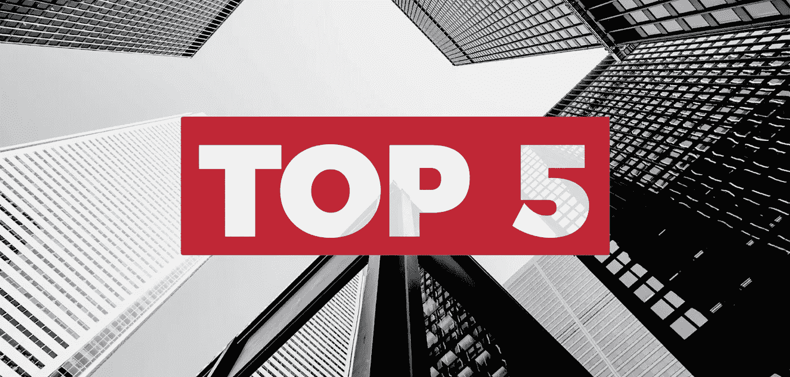
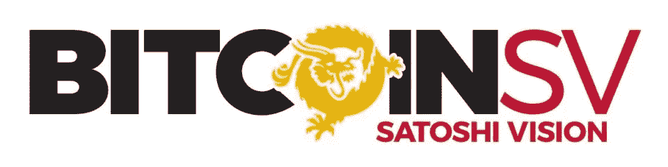
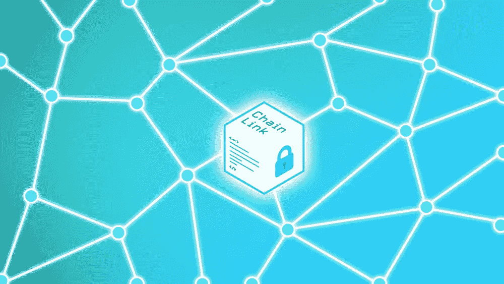
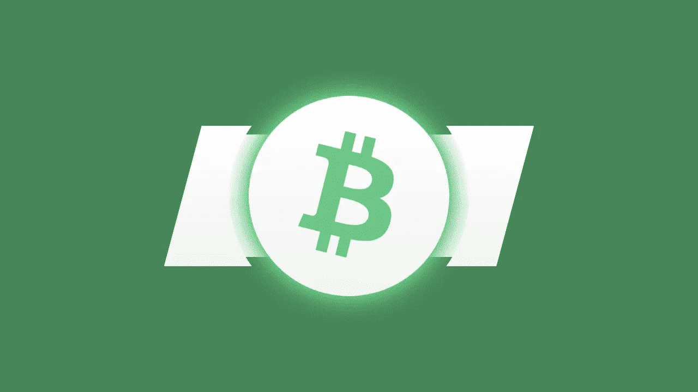

# 上周表现最好的 5 个人

> 原文：<https://medium.datadriveninvestor.com/top-5-performers-last-week-de7ef561a4c?source=collection_archive---------13----------------------->

## 分析，2010 年 1 月 5 日至 2010 年 1 月 12 日

Top 5 Cryptos

在很长一段时间后，大多数主要的加密货币可能每周都是正面的。这表明买盘基础广泛，这是一个积极的迹象。随着市场人气逐渐好转，过去 7 天的表现最佳者能否在此基础上继续上涨？

## 1.比特币 SV (BSV)

**价格**—162.41 美元，**市值**—2934423516 美元

比特币 SV (BSV)在过去七天飙升约 43%，夺得头把交椅。altcoin 连续第二周在主要加密货币中表现最佳。

 [## 5 行业转型区块链应用|数据驱动投资者

### 除非你一直生活在岩石下，否则我相信你现在已经听说过区块链了。而区块链…

www.datadriveninvestor.com](https://www.datadriveninvestor.com/2019/02/13/5-real-world-blockchain-applications/) 

据推测，自称中本聪的克雷格·赖特向法院提交了更多文件，与前商业伙伴戴夫·克雷曼的遗产进行了持续的法律诉讼，其中可能有持有他的比特币的信托公司的详细信息。一些分析师认为，这一消息是比特币 SV 大幅上涨的原因之一。altcoin 能否进一步反弹，或者是时候预定利润了？

## 2.破折号

**价格**——65.03 美元，**市值**——602545090 美元

Dash (DASH)在经历了很长一段时间的差距后，已经在顶级加密公司中找到了一席之地。过去七天，比特币飙升了约 29%。价格的回升始于汉堡王委内瑞拉将开始接受加密货币支付的消息。

最初，只有一家商店接受加密货币，但后来，到今年年底，其他 40 家商店将加入。加密货币是否显示出触底反弹的迹象？

## 3.链环(链环)

**价格—**2.17 美元，**市值—**760，855，328 美元

Chainlink(链接)在过去 7 天中表现第三好，涨幅超过 24%。目前的上涨是否预示着趋势的改变？林克能在接下来的几周内增强实力吗？

## 4.比特币现金(BCH)

**价格**——264.70 美元，**市值**——4822878775 美元

比特币现金(BCH)也受益于围绕克雷格·赖特的新闻。过去七天，比特币上涨了约 18%。这是比特币现金连续第三周名列前茅。在最近的反弹之后，是反转的时候了，还是上升趋势会进一步延续？

## 5.莱特币

**价格**49.86 美元，**市值**3183766059 美元

Litecoin 以约 18%的涨幅位列过去 7 天表现最佳的前五名。Litecoin 的采矿难度在 2019 年下半年大幅下降，现在又开始上升。一些分析师认为，这可能引发比特币的牛市。

其他消息，加密货币借贷公司 BlockFi 增加了对莱特币的支持，这是积极的。虽然基本面显示上涨，但技术面是否也支持上涨？

***如果您想了解更多，请访问 BIDITEX 页面并提出您的问题，关注我们的*** [***推特***](https://twitter.com/biditex_com) ***，*** [***脸书***](https://www.facebook.com/biditex/) ***，*** [***中型***](https://medium.com/@biditex) ***，*** 用[***bidi tex***](http://www.biditex.com/)***投标你的空格。***