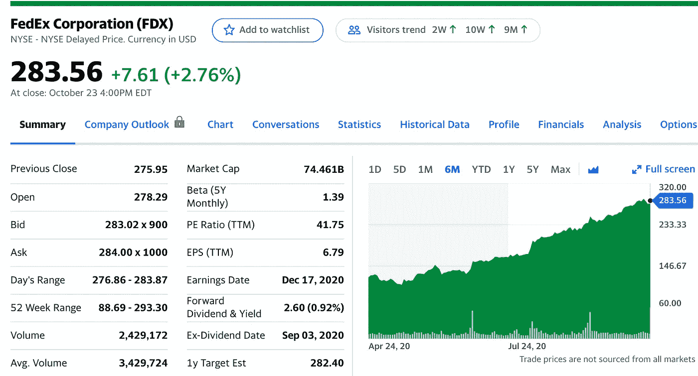

# 2020 年 11 月五大精选股票

> 原文：<https://medium.datadriveninvestor.com/top-5-stock-picks-for-november-2020-e1e9eb539d87?source=collection_archive---------6----------------------->

## 以下是我在 10 月份投资和交易时需要关注的五只股票

Photo by [Maksim Goncharenok](https://www.pexels.com/@maksgelatin?utm_content=attributionCopyText&utm_medium=referral&utm_source=pexels) from [Pexels](https://www.pexels.com/photo/text-5552810/?utm_content=attributionCopyText&utm_medium=referral&utm_source=pexels)

10 月份充分显示了选举、刺激谈判和疫苗谈判对市场的影响！

世界上发生了如此多的事情，以至于有些事情并没有按照我们期望的方式发展。不过没关系。让我们在这个 11 月赚点钱吧！

## 我十月的五大选择

1.  平方——161 美元到 176 美元
2.  波音——166 美元到 167 美元
3.  绘图仪——57 美元到 42 美元
4.  从 488 美元飙升至 511 美元
5.  SPHD 交易所交易基金——33 美元至 34 美元

我从 10 月份开始挑选的股票几乎都增值了。让我们希望 11 月也是如此！

 [## 2020 年 10 月前 5 只股票

### 以下是我在 10 月份投资和交易时需要关注的五只股票

medium.com](https://medium.com/datadriveninvestor/top-5-stocks-for-october-2020-3c489e5b1ae2) 

# 1.方舟创新 ETF (ARKK)

Yahoo Finance

> 根据 Ark-funds.com 的说法，ARKK 是一只积极管理的 **ETF** ，通过在正常情况下主要投资(至少 65%的资产)与该基金的投资主题破坏性创新相关的公司的国内外股票证券来寻求资本的长期增长

是凯西·伍德经营的 ETF 股票。她在这只创新型 ETF 上有着令人难以置信的记录。

今年 4 月，该公司股价为 55 美元，截至本文撰写之时，股价已上涨近一倍。它有 0.07%的低股息。

如果你购买并持有这支股票，随着时间的推移，你可能会赚很多钱，特别是因为它们在创新方面非常多样化，这是必然会出现的。

# 2.苹果公司(APPL)

Yahoo Finance

苹果可以说是市场上最知名的股票。自从 COVID 在 2 月份导致下降以来，它的增长令人难以置信。

新的 iPhone 将于 11 月 13 日发布，这将导致交通拥堵。除了新手机，这将是假日季节，所以销售额将会飙升。

大多数 iPhone 用户忠于他们的品牌，并将继续购买产品，因为每年都有新的产品。

根据下周的收益报告，我们将会看到苹果股票的大幅波动。我非常看好苹果。

# 3.Snapchat

Yahoo Finance

Snapchat 最近发布了荒谬的收益报告，显示这家公司的股票有很大的上涨空间。

他们有大量的日常用户，品牌喜欢与 Snapchat 合作，因为这给了他们大量的曝光率。

我会等一会儿，然后加载更多的 Snapchat，因为它正在杀死它。这是一家绝对受益于新冠肺炎的公司。

# 4.联邦快递(FDX)

Yahoo Finance

随着假日季节的到来，包裹将以极高的速度发送。联邦快递大约一个月前已经有了它的收益报告，他们粉碎了它。

如果你是电子商务的忠实粉丝，并且理解假日季节的重要性，你会在联邦快递或 UPS 开始之前买入它们的股票，因为它们可能是很好的摇摆交易。这就是我正在做的。

联邦快递是一项重要的业务，因为零售商和其他卖家依赖于他们向客户发送包裹、库存和产品。我看好联邦快递进入假日季。

# 5.缩放(ZM)

Yahoo Finance

毫无疑问，变焦是疫情的股票。我记得当这家公司股价飙升至 65 美元时，我没有买入。我最大的遗憾之一。

学校用变焦。企业使用变焦。每个人都说“让我们放大”。

没有任何迹象表明 Zoom 会很快失败甚至衰落。

我仍然看好 Zoom，尽管它们相当不稳定。如果你至少在未来六个月购买并持有 Zoom，我认为他们的目标是每股 700 美元左右。

# 最后的想法

这些是我在 11 月份以及可能持续到 12 月份的五只精选股票。我希望你喜欢读这篇文章，它能帮你赚些钱！

长期，短期，无所谓。我相信所有这些股票都会上涨。

保重，注意安全，祝你在股市好运！

这不是专业的财务建议，你应该对我所有的选股持保留态度。

*如果你喜欢这本书，并想看看我以前的选股，我在下面链接了其他文章！*

 [## 2020 年 10 月前 5 只股票

### 以下是我在 10 月份投资和交易时需要关注的五只股票

medium.com](https://medium.com/datadriveninvestor/top-5-stocks-for-october-2020-3c489e5b1ae2)  [## 2020 年 9 月的热门股票

### 投资者应该密切关注这些股票

medium.com](https://medium.com/datadriveninvestor/top-stocks-for-september-2020-8ed187c864f6)  [## 2020 年 8 月热门股票

### 5 要密切关注

medium.com](https://medium.com/datadriveninvestor/hot-stocks-for-august-2020-c0616292ed36)  [## 2020 年 7 月热门股票

### 值得关注的五大股票。

medium.com](https://medium.com/datadriveninvestor/hot-stocks-for-july-2020-a66c741f6c66)