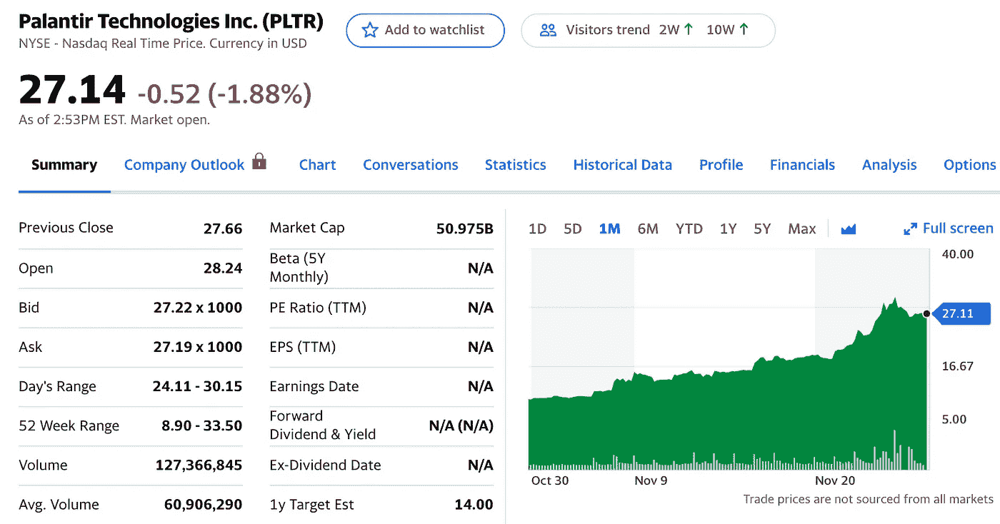
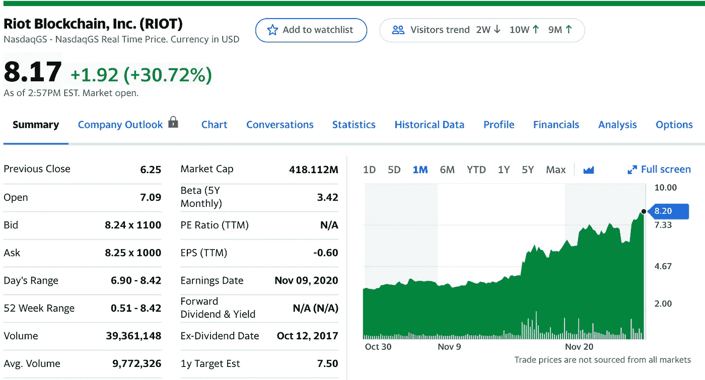
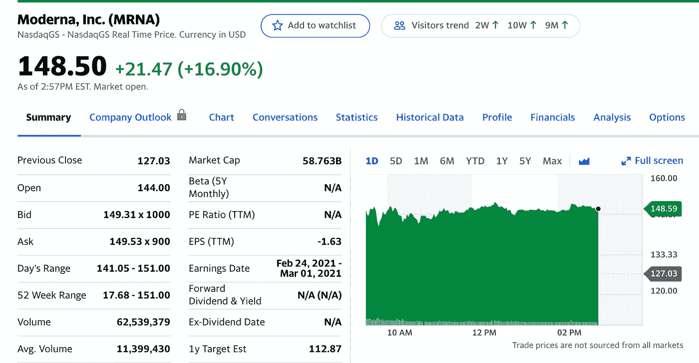
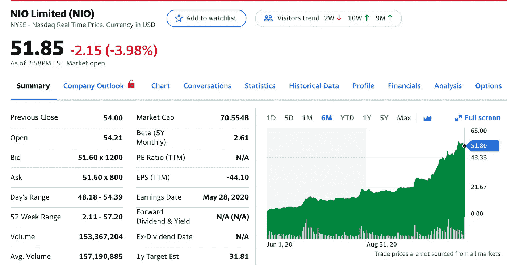

# 2020 年 12 月前五大股票

> 原文：<https://medium.datadriveninvestor.com/top-5-stocks-for-december-2020-991dcb692749?source=collection_archive---------5----------------------->

## 以下是我在 12 月份投资和交易时需要关注的五只股票

Photo by [Giorgio Trovato](https://unsplash.com/@giorgiotrovato?utm_source=unsplash&utm_medium=referral&utm_content=creditCopyText) on [Unsplash](https://unsplash.com/s/photos/money?utm_source=unsplash&utm_medium=referral&utm_content=creditCopyText)

免责声明:这不是专业的财务建议，你应该对我所有的选股持保留态度。

股票市场有很多炒作。我们在选举前经历了巨大的下跌，在选举周及以后经历了令人难以置信的牛市。现在加入一种潜在的现代疫苗？伙计，这是一个有趣的投资时代！

让我们从这五大精选股票中赚些钱，这样我们就可以在这个假期给我们所爱的人送上他们想要的礼物了！

## 我 11 月份的五大选择

1.  方舟创新交易所交易基金——99 美元至 112 美元
2.  苹果——115 美元到 120 美元
3.  snapchat——43 美元到 44 美元
4.  联邦快递——283 美元到 284 美元
5.  从 511 美元飙升至 476 美元

我从 11 月份开始挑选的股票几乎都增值了。希望 12 月也是如此！

 [## 2020 年 11 月五大精选股票

### 以下是我在 10 月份投资和交易时需要关注的五只股票

medium.com](https://medium.com/datadriveninvestor/top-5-stock-picks-for-november-2020-e1e9eb539d87) 

# 1.帕兰蒂尔技术公司(PLTR)

Yahoo Finance

我们现在都知道帕兰提尔的宣传了。近一个月前，它们的价值仅为 10 美元，现在已经大幅飙升！

> **Palantir** 一直在不断获得**政府的大额交易，同时也在建立其私营部门客户的名册。Cash 表示，该公司有一个“良好的合同渠道”，包括使用其数据工具进行 Covid 19 响应的客户业务，无论是在公共卫生领域还是根据美国消费者新闻与商业频道运送医疗用品。**

我喜欢 Palantir 上的牛市，并相信它在未来有很大的增长潜力，特别是因为他们继续获得**大的政府交易，**这是大量资金的所在地！

# 2.特斯拉公司(TSLA)

Yahoo Finance

特斯拉要在 2020 年 12 月 21 日加入 **S & P 500** ！这对任何特斯拉股东来说都是极好的消息。我一直都知道泰斯拉拥有无与伦比的爆发力。

> S & P 500 已经宣布**特斯拉将**加入该指数。**特斯拉**2020 年表现强劲，连续五个季度盈利，今年保持了 50 万辆的销量。然而，该公司的估值已经超越了 rich，进入了科技股很少触及的领域，更不用说根据 [Investopedia](https://www.investopedia.com/tesla-tsla-will-be-part-of-the-s-and-p-500-come-december-5088623) 报道的汽车制造商了。

如果你是这家公司的粉丝，那就随时准备好，因为他们不会去任何地方，也不会减缓他们的增长。加载并观看这只股票**暴涨**。

# 3.Riot Blockchain 公司(Riot)

Yahoo Finance

我们都听到了关于**比特币**创历史新高的消息。刚刚达到 19000 美元。XRP、总督和许多其他加密货币开始了牛市。这可能是在为时已晚之前跳上加密列车的最佳时机。

> **Riot Blockchain** Inc .专注于比特币挖掘，通过工作证明挖掘参与比特币的共识系统，竞相寻找下一个区块并在链上建立，从而支持比特币**区块链**。我们的目标是成为北美最大、成本最低的比特币生产商之一。

Crypto 似乎是一列不打算出轨的火车。如果你知道比特币的价值，或者相信比特币的**价值和类似密码的**价值，那么 RIOT 就是一只完美的股票，你可以选择它，看着它随着时间的推移逐渐成长。

 [## 10 月份投资的最佳股票|数据驱动型投资者

### 根据最近的回报，这些股票在 10 月份及以后会有不错的表现。随着市场看到一点…

www.datadriveninvestor.com](https://www.datadriveninvestor.com/2020/10/19/the-best-stocks-to-invest-in-october/) 

# 4.现代公司

Yahoo Finance

Moderna 非常接近能够给人们接种疫苗并阻止 COVID 的传播。密切关注他们，像过去两周那样大赚一笔。

> 根据该公司周一(11 月 30 日)宣布的最终结果[，Moderna 的冠状病毒疫苗在预防新冠肺炎方面有 94.1%的有效性，在预防严重疾病方面有 100%的有效性。](https://investors.modernatx.com/news-releases/news-release-details/moderna-announces-primary-efficacy-analysis-phase-3-cove-study)
> 
> 据生命科学报道，Moderna 还计划在周一向食品药品监督管理局(FDA)申请紧急使用授权(EUA)。

如果你坚信我们即将拥有打败病毒的优质疫苗，这是一个购买一些看涨期权或股票来获取利润的绝佳公司。

密切关注他们真的推出**疫苗**的新闻，这件事已经准备好要更进一步了。

# 5.NIO 有限公司

Yahoo Finance

我最初不打算把 NIO 加入我的投资组合，但后来我想起来，我不想错过电动汽车股票起飞到月球的潜力。这是电动汽车股票的大好时机，因为这是人们兴奋的事情。

> 总的来说，虽然 Nio 最近更快的增长和独特的创新，如电池即服务(BaaS)——允许客户订购汽车电池，而不是预先支付——无疑是有趣的，但我们认为根据[福布斯](https://www.forbes.com/sites/greatspeculations/2020/10/14/should-you-pick-nio-over-tesla/?sh=71ff9e18767b)的报道，与**特斯拉**相比，这仍然是一项风险更大的投资

他们的财务状况很好，看起来他们将在未来几个月，尤其是几年走向某个地方。

留意这只电动汽车股票。他们是一个沉睡者，如果他们齐心协力，他们有巨大的潜力！

# 最后的想法

如果疫苗一切按计划进行，所有这些股票肯定会上涨！如果你一直在关注我的股票选择，我希望我已经帮你赚了一些钱！

长期，短期，无所谓。我相信所有这些股票都会上涨。

保重，注意安全，祝你在股市好运！

*这不是专业的财务建议，你应该对我所有的选股持保留态度。*

如果你喜欢这篇文章，并且想看看我以前的选股，我在下面链接了其他文章！

 [## 2020 年 11 月五大精选股票

### 以下是我在 10 月份投资和交易时需要关注的五只股票

medium.com](https://medium.com/datadriveninvestor/top-5-stock-picks-for-november-2020-e1e9eb539d87)  [## 2020 年 10 月前 5 只股票

### 以下是我在 10 月份投资和交易时需要关注的五只股票

medium.com](https://medium.com/datadriveninvestor/top-5-stocks-for-october-2020-3c489e5b1ae2)  [## 2020 年 9 月的热门股票

### 投资者应该密切关注这些股票

medium.com](https://medium.com/datadriveninvestor/top-stocks-for-september-2020-8ed187c864f6)  [## 2020 年 8 月热门股票

### 5 要密切关注

medium.com](https://medium.com/datadriveninvestor/hot-stocks-for-august-2020-c0616292ed36)  [## 2020 年 7 月热门股票

### 值得关注的五大股票。

medium.com](https://medium.com/datadriveninvestor/hot-stocks-for-july-2020-a66c741f6c66) 

## 访问专家视图— [订阅 DDI 英特尔](https://datadriveninvestor.com/ddi-intel)