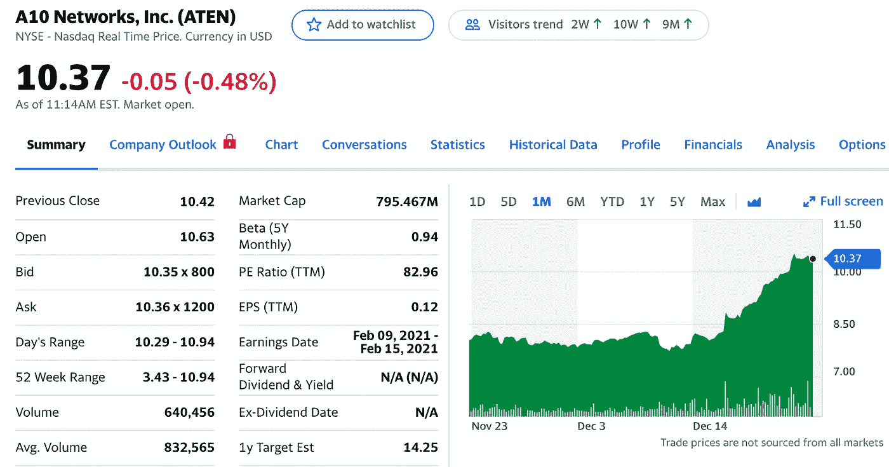
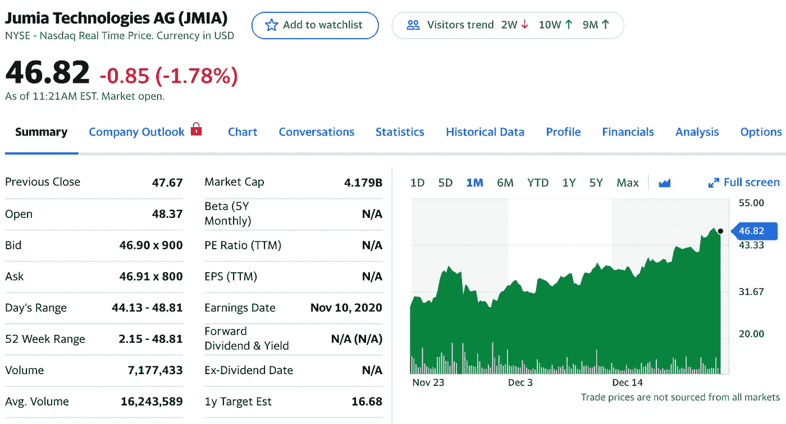
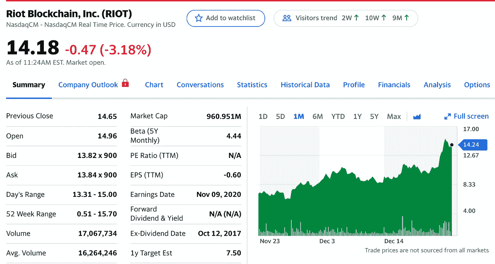
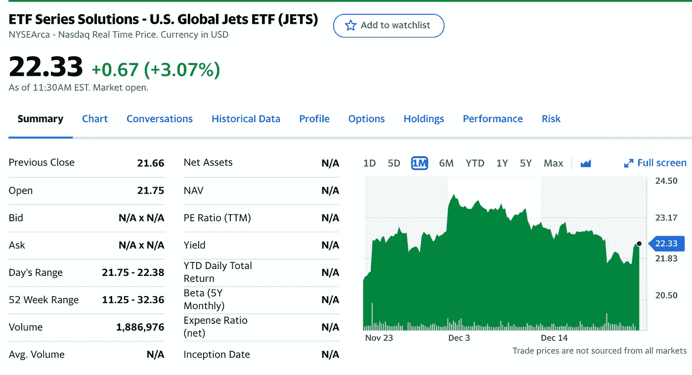
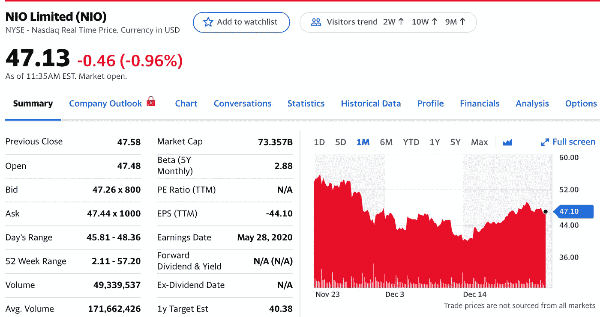

# 2021 年 1 月前 5 只股票

> 原文：<https://medium.datadriveninvestor.com/top-5-stocks-for-january-2021-b75034553865?source=collection_archive---------5----------------------->

## 以下是我在 12 月份投资和交易时需要关注的五只股票

Photo by [Adam Nowakowski](https://unsplash.com/@adamaszczos?utm_source=unsplash&utm_medium=referral&utm_content=creditCopyText) on [Unsplash](https://unsplash.com/s/photos/stock?utm_source=unsplash&utm_medium=referral&utm_content=creditCopyText)

免责声明:这不是专业的财务建议，你应该对我所有的选股持保留态度。

过去几周，市场大起大落。关于刺激计划和英国新 COVID strand 的消息让投资者保持警惕。长期投资和平均成本投资才是正确的方向，这也是这 5 只股票的价值所在。

让我们用这五大精选股票赚点钱吧！

 [## 2020 年 12 月前五大股票

### 以下是我在 12 月份投资和交易时需要关注的五只股票

medium.com](https://medium.com/datadriveninvestor/top-5-stocks-for-december-2020-991dcb692749) 

# 我 12 月份的五大选择

1.  帕兰蒂尔科技公司——27 美元到 28 美元
2.  特斯拉——583 美元至 646 美元
3.  Riot 区块链——8 美元到 13 美元
4.  moderna——148 美元到 124 美元
5.  NIO——51 美元到 47 美元

12 月份的选择有 3/5 是因为 Moderna 失败了，NIO 略有回调。我还在关注 NIO。

 [## 伟大投资者的 7 个聪明习惯

### 你的血汗钱应该被成倍增加，而不是减少

medium.com](https://medium.com/the-innovation/7-smart-habits-of-great-investors-3dd41a8f1a30) 

# 1.A10 网络公司

Yahoo Finance

据[雅虎财经](https://finance.yahoo.com/quote/ATEN/)报道，A10 网络公司在美国、日本、其他亚太地区、EMEA 国家和拉丁美洲提供软件和硬件解决方案。

> 该公司提供迅雷应用交付控制器(ADC)，提供高级服务器负载平衡；Lightning ADC，云原生软件即服务平台，提升应用和微服务的交付和安全性；以及迅雷电信级网络产品，为服务提供商网络提供符合标准的地址和协议转换服务。

我感觉 10.37 美元的价格才刚刚起步，因为基于云的服务和网络安全，他们未来还有很大的发展空间。

# 2.Jumia 技术公司(JMIA)

Yahoo Finance

我一听到这个消息，读到他们就像非洲的亚马逊，就进入了 JUMIA。他们从事电子商务，这是一个现在绝对火爆的行业，我是他们的超级粉丝。

> 据[雅虎财经](http://Jumia Technologies AG operates an e-commerce platform in Africa. The company's platform consists of marketplace, which connects sellers with consumers; logistics service that enables the shipment and delivery of packages from sellers to consumers; and payment service, which facilitates transactions to participants active on the company's platform in selected markets.)报道，Jumia Technologies AG 在非洲运营一个电子商务平台。
> 
> 该公司的平台包括 marketplace，它连接卖家和消费者；将包裹从卖方运送到消费者手中的物流服务；支付服务，为活跃在选定市场的公司平台上的参与者提供交易便利。

他们绝对有很多投资者的关注，如果他们在未来流行起来，成为一个众所周知的名字，我不会感到惊讶。

# 3.Riot Blockchain 公司(Riot)

Yahoo Finance

Riot Blockchain 再次榜上有名。

我们都听到了关于**比特币**达到历史新高的消息。在写这篇文章的时候，它刚刚达到 23，553 美元。

XRP、总督和许多其他加密货币开始了牛市，到处都有小的流行

这可能是在为时已晚之前跳上加密列车的最佳时机。

> ***暴动区块链*** *Inc .专注于比特币挖掘，通过参与比特币的共识系统，通过工作证明挖掘，竞相寻找下一个区块，并在链上建立，来支持比特币* ***【区块链】*** *。*
> 
> *我们的目标是成为北美最大、成本最低的比特币生产商之一。*

Crypto 似乎是一列不打算出轨的火车。如果你知道或相信比特币的价值和类似密码的东西，那么 RIOT 是一只完美的股票，你可以选择它，看着它随着时间的推移逐渐成长。

# 4. **ETF 系列解决方案—美国全球喷气机 ETF (JETS)**

Yahoo Finance

JETS ETF 消除了你应该投资哪家航空公司的所有想法。它的主要持股包括达美航空、联合航空和美国航空。

> 根据 [ETF 数据库](https://etfdb.com/etf/JETS/#etf-ticker-profile)的数据，美国全球 **Jets ETF** ( **JETS** )追踪的是航空业相关公司的指数，包括航空运营商、制造商、机场和终端服务。最大的持股包括美国航空公司、西南航空公司、联合航空公司和达美航空公司。

它们价格合理，一旦生活恢复正常，就有很大的增长空间。

 [## 10 月份投资的最佳股票|数据驱动型投资者

### 根据最近的回报，这些股票在 10 月份及以后会有不错的表现。随着市场看到一点…

www.datadriveninvestor.com](https://www.datadriveninvestor.com/2020/10/19/the-best-stocks-to-invest-in-october/) 

# 5.NIO 有限公司

Yahoo Finance

NIO 仍然在我的关注范围内，因为它买入了大量股票。

我最初不打算把 NIO 加入我的投资组合，但后来我想起来，我不想错过电动汽车股票起飞到月球的潜力。这是电动汽车股票的大好时机，因为这是人们兴奋的事情。

> *总的来说，虽然 Nio 最近更快的增长和独特的创新，如电池即服务(BaaS)——允许客户订购汽车电池，而不是预先支付——无疑是有趣的，但我们认为与* ***【特斯拉*** *相比，这仍然是一项风险更高的投资*

他们的财务状况很好，看起来他们将在未来几个月，尤其是几年走向某个地方。

2021 年 1 月 9 日是 NIO 日，这可能会让这只股票进一步上涨。

# 最后的想法

这是新的一年的开始，我们正处于历史高点。但是一次又一次，我们达到了更高的高度。

持续投资和逢低买入是确保长期持续增长的最佳方式。

长期，短期，无所谓。我相信所有这些股票都会上涨。

保重，注意安全，祝你在股市好运！

这不是专业的财务建议，你应该对我所有的选股持保留态度。

如果你喜欢这篇文章，并想看看我以前的选股，我在下面链接了其他文章！

以下是我之前挑选的股票。你也可以看看下面！

 [## 2020 年 10 月前 5 只股票

### 以下是我在 10 月份投资和交易时需要关注的五只股票

medium.com](https://medium.com/datadriveninvestor/top-5-stocks-for-october-2020-3c489e5b1ae2)  [## 2020 年 11 月五大精选股票

### 以下是我在 10 月份投资和交易时需要关注的五只股票

medium.com](https://medium.com/datadriveninvestor/top-5-stock-picks-for-november-2020-e1e9eb539d87)  [## 2020 年 12 月前五大股票

### 以下是我在 12 月份投资和交易时需要关注的五只股票

medium.com](https://medium.com/datadriveninvestor/top-5-stocks-for-december-2020-991dcb692749) 

## 访问专家视图— [订阅 DDI 英特尔](https://datadriveninvestor.com/ddi-intel)